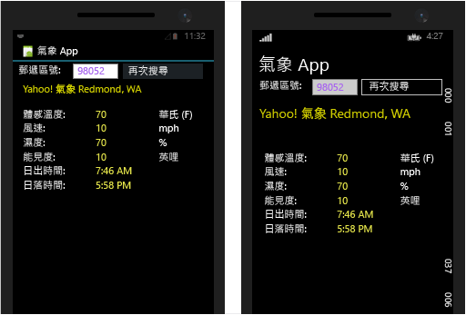
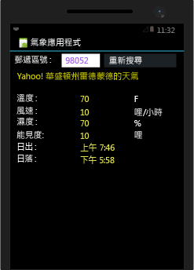

# <a name="build-apps-with-native-ui-using-xamarin-in-visual-studio"></a>使用 Visual Studio 的 Xamarin 建置具有原生 UI 的應用程式
在您完成[設定與安裝](../cross-platform/setup-and-install.md)和[驗證您的 Xamarin 環境](../cross-platform/verify-your-xamarin-environment.md)中的步驟之後，本逐步解說將示範如何建立具有原生 UI 層的基本 Xamarin 應用程式 (如下所示)。 使用原生 UI，共用程式碼會位於可攜式類別庫 (PCL) 中，而個別的平台專案會包含 UI 定義。  
  
   
  
 您將會執行下列步驟來建置應用程式：  
  
-   [設定方案](#solution)  
  
-   [撰寫共用的資料服務程式碼](#dataservice)  
  
-   [設計適用於 Android 的 UI](#Android)  
  
-   [設計適用於 Windows Phone 的 UI](#Windows)  
  
-   [後續步驟](#next)  
  
> [!TIP]
>  您可以在 [GitHub 上的 mobile-samples 儲存機制 (英文)](https://github.com/xamarin/mobile-samples/tree/master/Weather) 中找到本專案的完整原始程式碼。
>
>   如果問題持續存在或您遇到錯誤，請將問題張貼在 [forums.xamarin.com](http://forums.xamarin.com) 上。 有許多問題都可透過更新至 Xamarin 所需的最新 SDK 來解決，相關說明請參閱適用於每個平台的 [Xamarin 版本資訊 (英文)](https://developer.xamarin.com/releases/)。    
  
> [!NOTE]
>  Xamarin 的開發人員文件也提供兼具快速入門與深入探討章節的幾個逐步解說，列出如下。 在所有頁面上，請確定已選取頁面右上方的 [Visual Studio]，以查看 Visual Studio 特定的逐步解說。  
>   
>  -   具有原生 UI 的 Xamarin 應用程式：  
>   
>      -   [Hello, Android](https://developer.xamarin.com/guides/android/getting_started/hello,android/) (單一畫面的簡單應用程式)  
>     -   [Hello, Android 多重畫面](https://developer.xamarin.com/guides/android/getting_started/hello,android_multiscreen/) (可瀏覽不同畫面的應用程式)  
>     -   [Android Fragment 逐步解說](http://developer.xamarin.com/guides/android/platform_features/fragments/fragments_walkthrough/) (用於主要/詳細資料畫面及其他項目)  
>     -   [嗨，iOS (英文)](https://developer.xamarin.com/guides/ios/getting_started/hello,_iOS/)  
>     -   [嗨，iOS 多重畫面 (英文)](https://developer.xamarin.com/guides/ios/getting_started/hello,_iOS_multiscreen/)  
> -   具有 Xamarin.Forms (共用 UI) 的 Xamarin 應用程式  
>   
>      -   [嗨，Xamarin.Forms (英文)](https://developer.xamarin.com/guides/cross-platform/xamarin-forms/getting-started/hello-xamarin-forms/quickstart/)  
>     -   [嗨，Xamarin.Forms 多重畫面 (英文)](https://developer.xamarin.com/guides/cross-platform/xamarin-forms/getting-started/hello-xamarin-forms-multiscreen/)  
  
##  <a name="a-namesolutiona-set-up-your-solution"></a><a name="solution"></a> 設定方案  
 下列步驟會建立具有原生 UI 的 Xamarin 方案，其中包含適用於共用程式碼的 PCL 以及兩個已加入的 NuGet 封裝。  
  
1.  在 Visual Studio 中，建立新的**空的應用程式 (原生可攜式)** 方案，並將其命名為 **WeatherApp**。 您可以在搜尋欄位中輸入**原生可攜式**，就能輕鬆找到這個範本。  
  
     如果找不到，則可能必須安裝 Xamarin，或是啟用 Visual Studio 2015 功能，請參閱[設定與安裝](../cross-platform/setup-and-install.md)。  
  
2.  按一下 [確定] 建立解決方案後，您會擁有數個個別專案：  
  
    -   **WeatherApp (可攜式)**：您會將跨平台共用的程式碼寫入此 PCL，包括搭配 Xamarin.Forms 使用的一般商務邏輯和 UI 程式碼。  
  
    -   **WeatherApp.Droid**：包含原生 Android 程式碼的專案。 這會設為預設啟始專案。  
  
    -   **WeatherApp.iOS**：包含原生 iOS 程式碼的專案。  
  
    -   **WeatherApp.WinPhone (Windows Phone 8.1)**：包含原生 Windows Phone 程式碼的專案。  
  
     您可以在每個原生專案中存取對應平台的原生設計工具，並可實作平台專屬的畫面。  
  
3.  將 **Newtonsoft.Json** 和 NuGet 套件新增至 PCL 專案，您將使用此專案來處理從天氣資料服務擷取而來的資訊：  
  
    -   在 [方案總管] 中以滑鼠右鍵按一下 ['WeatherApp' 方案]，然後選取 [管理方案的 NuGet 封裝...]。  
  
         在 [NuGet] 視窗中，選取 [瀏覽] 索引標籤，然後搜尋 **Newtonsoft**。  
  
    -   選取 **Newtonsoft.Json**。  
  
    -   在視窗右側，核取 **WeatherApp** 專案 (這是唯一一個必須安裝封裝的專案)。  
  
    -   請確認 [版本]  欄位設為 [最新穩定版]  。  
  
    -   按一下 [安裝] 。  
  
    -     
  
4.  重複步驟 3，以尋找並安裝 **Microsoft.Net.Http** 封裝。  
  
5.  建置方案，並確認沒有任何建置錯誤。  
  
##  <a name="a-namedataservicea-write-shared-data-service-code"></a><a name="dataservice"></a> 撰寫共用的資料服務程式碼  
 您可以在 **WeatherApp (可攜式)** 專案中撰寫可攜式類別庫 (PCL) 程式碼，進而跨所有平台共用。 系統會在 iOS、Android 和 Windows Phone 專案所建置的應用程式封裝中自動包含 PCL。  
  
 下列步驟接著會將程式碼新增至 PCL，以存取並儲存該天氣服務的資料：  
  
1.  若要執行此範例，您必須先在 [http://openweathermap.org/appid](http://openweathermap.org/appid)註冊免費 API 金鑰。  
  
2.  以滑鼠右鍵按一下 **WeatherApp** 專案，然後選取 [新增] > [類別...]。 在 [加入新項目]  對話方塊中，將檔案命名為 **Weather.cs**。 您將使用此類別儲存天氣資料服務的資料。  
  
3.  以下列程式碼取代整個 **Weather.cs** 的內容：  
  
    ```c#  
    namespace WeatherApp  
    {  
        public class Weather  
        {  
            public string Title { get; set; }  
            public string Temperature { get; set; }  
            public string Wind { get; set; }  
            public string Humidity { get; set; }  
            public string Visibility { get; set; }  
            public string Sunrise { get; set; }  
            public string Sunset { get; set; }  
  
            public Weather()  
            {  
                //Because labels bind to these values, set them to an empty string to  
                //ensure that the label appears on all platforms by default.  
                this.Title = " ";  
                this.Temperature = " ";  
                this.Wind = " ";  
                this.Humidity = " ";  
                this.Visibility = " ";  
                this.Sunrise = " ";  
                this.Sunset = " ";  
            }  
        }  
    }  
    ```  
  
4.  將另一個類別加入名為 **DataService.cs** 的 PCL 專案中，以使用該專案來處理天氣資料服務的 JSON 資料。  
  
5.  以下列程式碼取代整個 **DataService.cs** 的內容：  
  
    ```c#  
    using System.Threading.Tasks;  
    using Newtonsoft.Json;  
    using System.Net.Http;  
  
    namespace WeatherApp  
    {  
        public class DataService  
        {  
            public static async Task<dynamic> getDataFromService(string queryString)  
            {  
                HttpClient client = new HttpClient();  
                var response = await client.GetAsync(queryString);  
  
                dynamic data = null;  
                if (response != null)  
                {  
                    string json = response.Content.ReadAsStringAsync().Result;  
                    data = JsonConvert.DeserializeObject(json);  
                }  
  
                return data;  
            }  
        }  
    }  
    ```  
  
6.  將第三個類別新增至名為 **Core** 的 PCL 中，您會在其中放置共用商務邏輯，例如使用郵遞區號形成查詢字串，接著呼叫天氣資料服務，然後填入 **Weather** 類別執行個體的邏輯。  
  
7.  以下列項目取代 **Core.cs** 的內容。  
  
    ```c#  
    using System;  
    using System.Threading.Tasks;  
  
    namespace WeatherApp  
    {  
        public class Core  
        {  
            public static async Task<Weather> GetWeather(string zipCode)  
            {  
                //Sign up for a free API key at http://openweathermap.org/appid  
                string key = "YOUR KEY HERE";  
                string queryString = "http://api.openweathermap.org/data/2.5/weather?zip="  
                    + zipCode + ",us&appid=" + key + "&units=imperial";  

                //Make sure developers running this sample replaced the API key
                if (key == "YOUR API KEY HERE")
                {
                    throw new ArgumentException("You must obtain an API key from openweathermap.org/appid and save it in the 'key' variable.");
                }
  
                dynamic results = await DataService.getDataFromService(queryString).ConfigureAwait(false);  
  
                if (results["weather"] != null)  
                {  
                    Weather weather = new Weather();  
                    weather.Title = (string)results["name"];                  
                    weather.Temperature = (string)results["main"]["temp"] + " F";  
                    weather.Wind = (string)results["wind"]["speed"] + " mph";                  
                    weather.Humidity = (string)results["main"]["humidity"] + " %";  
                    weather.Visibility = (string)results["weather"][0]["main"];  
  
                    DateTime time = new System.DateTime(1970, 1, 1, 0, 0, 0, 0);  
                    DateTime sunrise = time.AddSeconds((double)results["sys"]["sunrise"]);  
                    DateTime sunset = time.AddSeconds((double)results["sys"]["sunset"]);  
                    weather.Sunrise = sunrise.ToString() + " UTC";  
                    weather.Sunset = sunset.ToString() + " UTC";  
                    return weather;  
                }  
                else  
                {  
                    return null;  
                }  
            }  
        }  
    }  
    ```  
  
8.  在程式碼中，使用您在步驟 1 中取得的 API 金鑰 (仍需使用雙引號括住) 來取代 *YOUR KEY HERE*。  
  
9. 刪除 PCL 中的 MyClass.cs，因為我們將不會用到它。  
  
10. 建置 **WeatherApp** PCL 專案，以確保程式碼正確。  
  
##  <a name="a-nameandroida-design-ui-for-android"></a><a name="Android"></a> 設計適用於 Android 的 UI  
 我們現在要設計使用者介面，並將其連接到您的共用程式碼，然後執行應用程式。  
  
### <a name="design-the-look-and-feel-of-your-app"></a>設計應用程式的外觀與風格  
  
1.  在 [方案總管]** 中**，依序展開 [WeatherApp.Droid]>[資源]>[配置] 資料夾，然後開啟 [Main.axml]。 這會在視覺化設計工具中開啟檔案 (如果出現 Java 相關錯誤，請參閱此[部落格文章](http://forums.xamarin.com/discussion/32365/connection-to-the-layout-renderer-failed-in-xs-5-7-and-xamarinvs-3-9))。  
  
    > [!TIP]
    >  專案中還有許多其他檔案。 探索這些檔案已超出本主題的範圍。但若您需要深入了解 Android 專案的結構，請參閱 xamarin.com 上「嗨 Android」主題的[第 2 部分深入探討 (英文)](http://developer.xamarin.com/guides/android/getting_started/hello,android/hello,android_deepdive/)。  
  
2.  選取並刪除出現在設計工具中的預設按鈕。  
  
3.  透過 [檢視] > [其他視窗] > [工具箱] 來開啟 [工具箱]。  
  
4.  從 **工具箱**將 **RelativeLayout** 控制項拖曳到設計工具內。 您將使用此控制項做為其他控制項的父容器。  
  
    > [!TIP]
    >  如果在任何時候配置似乎不正確地顯示，請儲存檔案，並在 [設計] 和 [來源] 索引標籤之間切換，以進行重新整理。  
  
5.  在 [屬性] 視窗中，將 [背景] 屬性 (在 [樣式] 群組中) 設為 `#545454`。  
  
6.  從 **工具箱**將 **TextView** 控制項拖曳到 **RelativeLayout** 控制項內。  
  
7.  在 [屬性] 視窗中，設定這些屬性 (注意︰使用 [屬性] 視窗工具列中的排序按鈕，有助於依字母順序排序清單)：  
  
    |屬性|值|  
    |--------------|-----------|  
    |**text**|**Search by Zip Code (依郵遞區號搜尋)**|  
    |**id**|`@+id/ZipCodeSearchLabel`|  
    |**layout_marginLeft**|`10dp`|  
    |**textColor**|`@android:color/white`|  
    |**textStyle**|`bold`|  
  
    > [!TIP]
    >  請注意，有許多屬性不包含可供您選取之值的下拉式清單。  所以可能會很難知道指定的屬性要使用什麼字串值。 如需建議，請嘗試在 [R.attr](http://developer.android.com/reference/android/R.attr.html) 類別頁面中搜尋屬性的名稱。  
    >   
    >  此外，直接在網路上搜尋常被導向 [http://stackoverflow.com/](http://stackoverflow.com/) 上的頁面，在其中，其他人已使用了相同的屬性。  
  
     基於參考的目的，如果您切換到 [原始碼] 檢視，應該會看到下列適用於此項目的程式碼：  
  
    ```xml  
    <TextView  
        android:text="Search by Zip Code"  
        android:layout_width="wrap_content"  
        android:layout_height="wrap_content"  
        android:id="@+id/ZipCodeSearchLabel"  
        android:layout_centerVertical="true"  
        android:layout_marginLeft="10dp"  
        android:textColor="@android:color/white"  
        android:textStyle="bold" />  
  
    ```  
  
8.  從 [工具箱] 中，將 [TextView] 控制項拖曳至 [RelativeLayout] 控制項，並將其放在 [ZipCodeSearchLabel] 控制項下方。 若要執行此動作，您可以在現有控制項的適當邊緣上置放新的控制項；這在某種程度上有助於縮放設計工具。  
  
9. 在 [屬性]  視窗中，設定這些屬性：  
  
    |屬性|值|  
    |--------------|-----------|  
    |**text**|**Zip Code (郵遞區號)**|  
    |**id**|`@+id/ZipCodeLabel`|  
    |**layout_marginLeft**|`10dp`|  
    |**layout_marginTop**|`5dp`|  
  
     [原始碼] 檢視中的程式碼應該看起來如下：  
  
    ```xml  
    <TextView  
        android:text="Zip Code"  
        android:layout_width="wrap_content"  
        android:layout_height="wrap_content"  
        android:layout_below="@id/ZipCodeSearchLabel"  
        android:id="@+id/ZipCodeLabel"  
        android:layout_marginTop="5dp"  
        android:layout_marginLeft="10dp" />  
    ```  
  
10. 從 [工具箱] 中，將 [Number] 控制項拖曳至 [RelativeLayout]，並將它放在 [Zip Code] (郵遞區號) 標籤下方。 接著，設定下列屬性：  
  
    |屬性|值|  
    |--------------|-----------|  
    |**id**|`@+id/zipCodeEntry`|  
    |**layout_marginLeft**|`10dp`|  
    |**layout_marginBottom**|`10dp`|  
    |**width**|`165dp`|  
  
     同樣地，程式碼：  
  
    ```xml  
    <EditText  
        android:inputType="number"  
        android:layout_width="wrap_content"  
        android:layout_height="wrap_content"  
        android:layout_below="@id/ZipCodeLabel"  
        android:id="@+id/zipCodeEntry"  
        android:layout_marginLeft="10dp"  
        android:layout_marginBottom="10dp"  
        android:width="165dp" />  
    ```  
  
11. 從 [工具箱] 中，將 [按鈕] 拖曳至 [RelativeLayout] 控制項，並將它放在 [zipCodeEntry] 控制項右邊。 然後設定這些屬性：  
  
    |屬性|值|  
    |--------------|-----------|  
    |**id**|`@+id/weatherBtn`|  
    |**text**|**Get Weather**|  
    |**layout_marginLeft**|`20dp`|  
    |**layout_alignBottom**|`@id/zipCodeEntry`|  
    |**width**|`165dp`|  
  
    ```xml  
    <Button    android:text="Get Weather"  
        android:layout_width="wrap_content"  
        android:layout_height="wrap_content"  
        android:layout_toRightOf="@id/zipCodeEntry"  
        android:id="@+id/weatherBtn"  
        android:layout_marginLeft="20dp"  
        android:layout_alignBottom="@id/zipCodeEntry"  
        android:width="165dp" />  
    ```  
  
12. 現在您有足夠的經驗可使用 Android 設計工具建置基本的 UI。 您也可以直接將標記加入至頁面的 .asxml 檔案，藉以建置 UI。 若要以這種方式建立其餘的 UI，請切換至設計工具中的 [原始碼] 檢視，然後將下列標記 *beneath* 傳遞到 `</RelativeLayout>` 標記 (沒錯，這是在標記下方...這些項目並未包含於 ReleativeLayout 中)。  
  
    ```xml  
    <TextView  
            android:text="Location"  
            android:textAppearance="?android:attr/textAppearanceSmall"  
            android:layout_width="match_parent"  
            android:layout_height="wrap_content"  
            android:id="@+id/locationLabel"  
            android:layout_marginLeft="10dp"  
            android:layout_marginTop="10dp" />  
        <TextView  
            android:textAppearance="?android:attr/textAppearanceMedium"  
            android:layout_width="match_parent"  
            android:layout_height="wrap_content"  
            android:id="@+id/locationText"  
            android:layout_marginLeft="20dp"  
            android:layout_marginBottom="10dp" />  
        <TextView  
            android:text="Temperature"  
            android:textAppearance="?android:attr/textAppearanceSmall"  
            android:layout_width="match_parent"  
            android:layout_height="wrap_content"  
            android:id="@+id/tempLabel"  
            android:layout_marginLeft="10dp" />  
        <TextView  
            android:textAppearance="?android:attr/textAppearanceMedium"  
            android:layout_width="match_parent"  
            android:layout_height="wrap_content"  
            android:id="@+id/tempText"  
            android:layout_marginBottom="10dp"  
            android:layout_marginLeft="20dp" />  
        <TextView  
            android:text="Wind Speed"  
            android:textAppearance="?android:attr/textAppearanceSmall"  
            android:layout_width="match_parent"  
            android:layout_height="wrap_content"  
            android:id="@+id/windLabel"  
            android:layout_marginLeft="10dp" />  
        <TextView  
            android:textAppearance="?android:attr/textAppearanceMedium"  
            android:layout_width="match_parent"  
            android:layout_height="wrap_content"  
            android:id="@+id/windText"  
            android:layout_marginBottom="10dp"  
            android:layout_marginLeft="20dp" />  
        <TextView  
            android:text="Humidity"  
            android:textAppearance="?android:attr/textAppearanceSmall"  
            android:layout_width="match_parent"  
            android:layout_height="wrap_content"  
            android:id="@+id/humidtyLabel"  
            android:layout_marginLeft="10dp" />  
        <TextView  
            android:textAppearance="?android:attr/textAppearanceMedium"  
            android:layout_width="match_parent"  
            android:layout_height="wrap_content"  
            android:id="@+id/humidityText"  
            android:layout_marginBottom="10dp"  
            android:layout_marginLeft="20dp" />  
        <TextView  
            android:text="Visibility"  
            android:textAppearance="?android:attr/textAppearanceSmall"  
            android:layout_width="match_parent"  
            android:layout_height="wrap_content"  
            android:id="@+id/visibilityLabel"  
            android:layout_marginLeft="10dp" />  
        <TextView  
            android:textAppearance="?android:attr/textAppearanceMedium"  
            android:layout_width="match_parent"  
            android:layout_height="wrap_content"  
            android:id="@+id/visibilityText"  
            android:layout_marginBottom="10dp"  
            android:layout_marginLeft="20dp" />  
        <TextView  
            android:text="Time of Sunrise"  
            android:textAppearance="?android:attr/textAppearanceSmall"  
            android:layout_width="match_parent"  
            android:layout_height="wrap_content"  
            android:id="@+id/sunriseLabel"  
            android:layout_marginLeft="10dp" />  
        <TextView  
            android:textAppearance="?android:attr/textAppearanceMedium"  
            android:layout_width="match_parent"  
            android:layout_height="wrap_content"  
            android:id="@+id/sunriseText"  
            android:layout_marginBottom="10dp"  
            android:layout_marginLeft="20dp" />  
        <TextView  
            android:text="Time of Sunset"  
            android:textAppearance="?android:attr/textAppearanceSmall"  
            android:layout_width="match_parent"  
            android:layout_height="wrap_content"  
            android:id="@+id/sunsetLabel"  
            android:layout_marginLeft="10dp" />  
        <TextView  
            android:textAppearance="?android:attr/textAppearanceMedium"  
            android:layout_width="match_parent"  
            android:layout_height="wrap_content"  
            android:id="@+id/sunsetText"  
            android:layout_marginBottom="10dp"  
            android:layout_marginLeft="20dp" />  
  
    ```  
  
13. 儲存檔案，然後切換至 [設計] 檢視。 您的 UI 會如下所示：  
  
       
  
14. 開啟 [MainActivity.cs]，然後在 OnCreate 方法中刪除參考先前已移除之預設按鈕的程式碼。 當您完成後，程式碼看起來會像這樣：  
  
    ```  
    protected override void OnCreate (Bundle bundle)  
    {  
        base.OnCreate (bundle);  
  
        // Set our view from the "main" layout resource  
        SetContentView (Resource.Layout.Main);  
    }  
    ```  
  
15. 建置 Android 專案以檢查您的工作。 請注意，建置會將控制項 ID 加入 **Resource.Designer.cs** 檔案，因此，您可以在程式碼中依名稱參考控制項。  
  
### <a name="consume-your-shared-code"></a>使用您的共用程式碼  
  
1.  在程式碼編輯器中開啟 **WeatherApp** 專案的 **MainActivity.cs** 檔案，並使用下列程式碼來取代它的內容。 此程式碼會呼叫您在共用程式碼中定義的 `GetWeather` 方法。 然後它會在應用程式的 UI 中，顯示從該方法擷取的資料。  
  
    ```c#  
    using System;  
    using Android.App;  
    using Android.Widget;  
    using Android.OS;  
  
    namespace WeatherApp.Droid  
    {  
        [Activity(Label = "Sample Weather App", MainLauncher = true, Icon = "@drawable/icon")]  
        public class MainActivity : Activity  
        {  
            protected override void OnCreate(Bundle bundle)  
            {  
                base.OnCreate(bundle);  
  
                SetContentView(Resource.Layout.Main);  
  
                Button button = FindViewById<Button>(Resource.Id.weatherBtn);  
  
                button.Click += Button_Click;  
            }  
  
            private async void Button_Click(object sender, EventArgs e)  
            {  
                EditText zipCodeEntry = FindViewById<EditText>(Resource.Id.zipCodeEntry);  
  
                if (!String.IsNullOrEmpty(zipCodeEntry.Text))  
                {  
                    Weather weather = await Core.GetWeather(zipCodeEntry.Text);  
                    FindViewById<TextView>(Resource.Id.locationText).Text = weather.Title;  
                    FindViewById<TextView>(Resource.Id.tempText).Text = weather.Temperature;  
                    FindViewById<TextView>(Resource.Id.windText).Text = weather.Wind;  
                    FindViewById<TextView>(Resource.Id.visibilityText).Text = weather.Visibility;  
                    FindViewById<TextView>(Resource.Id.humidityText).Text = weather.Humidity;  
                    FindViewById<TextView>(Resource.Id.sunriseText).Text = weather.Sunrise;  
                    FindViewById<TextView>(Resource.Id.sunsetText).Text = weather.Sunset;  
                }  
            }  
        }  
    }  
    ```  
  
### <a name="run-the-app-and-see-how-it-looks"></a>執行應用程式並觀察其結果  
  
1.  在 [方案總管] 中，確定已將 **WeatherApp.Droid** 專案設為啟始專案。  
  
2.  選取適當的裝置或模擬器目標，然後按 F5 鍵以啟動應用程式。  
  
3.  在裝置上或模擬器中，於編輯方塊中輸入有效的美國郵遞區號 (例如：60601)，然後按 [Get Weather] (獲知天氣)。 該地區的天氣資料隨即會顯示在控制項中。  
  
       
  
> [!TIP]
>  本專案的完整原始程式碼位於 [GitHub 上的 mobile-samples 存放庫 (英文)](https://github.com/xamarin/mobile-samples/tree/master/Weather) 中。  
  
##  <a name="a-namewindowsa-design-ui-for-windows-phone"></a><a name="Windows"></a> 設計適用於 Windows Phone 的 UI  
 我們現在要設計適用於 Windows Phone 的使用者介面、將其連接到您的共用程式碼，然後執行應用程式。  
  
### <a name="design-the-look-and-feel-of-your-app"></a>設計應用程式的外觀與風格  
 在 Xamarin 應用程式中設計原生的 Windows Phone UI 的流程，與任何其他原生的 Windows Phone 應用程式一樣。 基於這個理由，我們將不會在此處詳述如何使用設計工具。 如需相關資訊，請參閱[使用 XAML 設計工具建立 UI](../designers/creating-a-ui-by-using-xaml-designer-in-visual-studio.md)。  
  
 相反地，只需開啟 MainPage.xaml，然後使用下列程式碼來取代所有的 XAML 程式碼：  
  
```xaml  
<Page  
    x:Class="WeatherApp.WinPhone.MainPage"  
    xmlns="http://schemas.microsoft.com/winfx/2006/xaml/presentation"  
    xmlns:x="http://schemas.microsoft.com/winfx/2006/xaml"  
    xmlns:local="using:WeatherApp.WinPhone"  
    xmlns:d="http://schemas.microsoft.com/expression/blend/2008"  
    xmlns:mc="http://schemas.openxmlformats.org/markup-compatibility/2006"  
    mc:Ignorable="d"  
    Background="{ThemeResource ApplicationPageBackgroundThemeBrush}">  
  
    <Grid>  
        <StackPanel HorizontalAlignment="Left" Height="40" Margin="10,0,0,0" VerticalAlignment="Top" Width="400">  
            <TextBlock x:Name="pageTitle" Text="Weather App" FontSize="30" />  
        </StackPanel>  
        <StackPanel HorizontalAlignment="Left" Height="120" Margin="10,40,0,0" VerticalAlignment="Top" Width="400" Background="#FF545454">  
  
            <TextBlock x:Name="zipCodeSearchLabel" TextWrapping="Wrap" Text="Search by Zip Code" FontSize="18" FontWeight="Bold" HorizontalAlignment="Left" Margin="10,10,0,0"/>  
            <TextBlock x:Name="zipCodeLabel" TextWrapping="Wrap" Text="Zip Code" Margin="10,5,0,0" FontSize="14" Foreground="#FFA8A8A8"/>  
            <StackPanel Orientation="Horizontal">  
                <TextBox x:Name="zipCodeEntry" Margin="10,10,0,0" Text="" VerticalAlignment="Top" InputScope="Number" Width="165" />  
                <Button x:Name="weatherBtn" Content="Get Weather" Width="165" Margin="20,0,0,0" Height="60" Click="GetWeatherButton_Click"/>  
            </StackPanel>  
        </StackPanel>  
        <StackPanel Margin="10,175,0,0">  
            <TextBlock x:Name="locationLabel" HorizontalAlignment="Left" FontSize="14" Foreground="#FFA8A8A8" TextWrapping="Wrap" Text="Location" VerticalAlignment="Top"/>  
            <TextBlock x:Name="locationText" Margin="10,0,0,10" HorizontalAlignment="Left" FontSize="18" TextWrapping="Wrap" VerticalAlignment="Top"/>  
            <TextBlock x:Name="tempLabel" HorizontalAlignment="Left" FontSize="14" Foreground="#FFA8A8A8" TextWrapping="Wrap" Text="Temperature" VerticalAlignment="Top"/>  
            <TextBlock x:Name="tempText" Margin="10,0,0,10" HorizontalAlignment="Left" FontSize="18" TextWrapping="Wrap" VerticalAlignment="Top"/>  
            <TextBlock x:Name="windLabel" HorizontalAlignment="Left" FontSize="14" Foreground="#FFA8A8A8" TextWrapping="Wrap" Text="Wind Speed" VerticalAlignment="Top"/>  
            <TextBlock x:Name="windText" Margin="10,0,0,10" HorizontalAlignment="Left" FontSize="18" TextWrapping="Wrap" VerticalAlignment="Top"/>  
            <TextBlock x:Name="humidityLabel" HorizontalAlignment="Left" FontSize="14" Foreground="#FFA8A8A8" TextWrapping="Wrap" Text="Humidity" VerticalAlignment="Top"/>  
            <TextBlock x:Name="humidityText" Margin="10,0,0,10" HorizontalAlignment="Left" FontSize="18" TextWrapping="Wrap" VerticalAlignment="Top"/>  
            <TextBlock x:Name="visibilityLabel" HorizontalAlignment="Left" FontSize="14" Foreground="#FFA8A8A8" TextWrapping="Wrap" Text="Temperature" VerticalAlignment="Top"/>  
            <TextBlock x:Name="visibilityText" Margin="10,0,0,10" HorizontalAlignment="Left" FontSize="18" TextWrapping="Wrap" VerticalAlignment="Top"/>  
            <TextBlock x:Name="sunriseLabel" HorizontalAlignment="Left" FontSize="14" Foreground="#FFA8A8A8" TextWrapping="Wrap" Text="Time of Sunriweatherse" VerticalAlignment="Top"/>  
            <TextBlock x:Name="sunriseText" Margin="10,0,0,10" HorizontalAlignment="Left" FontSize="18" TextWrapping="Wrap" VerticalAlignment="Top"/>  
            <TextBlock x:Name="sunsetLabel" HorizontalAlignment="Left" FontSize="14" Foreground="#FFA8A8A8" TextWrapping="Wrap" Text="Time of Sunset" VerticalAlignment="Top"/>  
            <TextBlock x:Name="sunsetText" Margin="10,0,0,10" HorizontalAlignment="Left" FontSize="18" TextWrapping="Wrap" VerticalAlignment="Top"/>  
        </StackPanel>  
    </Grid>  
</Page>  
```  
  
 在設計檢視中，您的 UI 應會顯示如下：  
  
   
  
### <a name="consume-your-shared-code"></a>使用您的共用程式碼  
  
1.  在設計工具中選取 [獲知天氣]  按鈕。  
  
2.  在 [屬性] 視窗中，選擇事件處理常式按鈕 ()。  
  
     此圖示會顯示在 [屬性]  視窗的上方角落。  
  
3.  在 **Click** 事件旁輸入 **GetWeatherButton_Click**，然後按 ENTER 鍵。  
  
     這麼做會產生名為 `GetWeatherButton_Click`的事件處理常式。 隨即會開啟程式碼編輯器，並將您的游標放置於事件處理常式程式碼區塊中。  注意︰如果在按下 ENTER 鍵時並未開啟編輯器，請直接按兩下事件名稱。  
  
4.  以下列程式碼取代該事件處理常式。  
  
    ```c#  
    private async void GetWeatherButton_Click(object sender, RoutedEventArgs e)  
    {  
        if (!String.IsNullOrEmpty(zipCodeEntry.Text))  
        {  
            Weather weather = await Core.GetWeather(zipCodeEntry.Text);  
            locationText.Text = weather.Title;  
            tempText.Text = weather.Temperature;  
            windText.Text = weather.Wind;  
            visibilityText.Text = weather.Visibility;  
            humidityText.Text = weather.Humidity;  
            sunriseText.Text = weather.Sunrise;  
            sunsetText.Text = weather.Sunset;  
  
            weatherBtn.Content = "Search Again";  
        }  
    }  
    ```  
  
     此程式碼會呼叫您在共用程式碼中定義的 `GetWeather` 方法。 這與您在 Android 應用程式中呼叫的方法一樣。 此程式碼也會在您應用程式的 UI 控制項中，顯示該方法所擷取的資料。  
  
5.  在開啟的 MainPage.xaml.cs 中，刪除 **OnNavigatedTo** 方法內部的所有程式碼。 這段程式碼只會處理我們在取代 MainPage.xaml 的內容時移除的預設按鈕。  
  
### <a name="run-the-app-and-see-how-it-looks"></a>執行應用程式並觀察其結果  
  
1.  在 [方案總管] 中，將 **WeatherApp.WinPhone** 專案設為啟始專案。  
  
2.  按 F5 鍵以啟動應用程式。  
  
3.  在 Windows Phone 模擬器中，於編輯方塊中輸入有效的美國郵遞區號輸入 (例如：60601)，然後按 [Get Weather] (獲知天氣)。 該地區的天氣資料隨即會顯示在控制項中。  
  
       
  
> [!TIP]
>  本專案的完整原始程式碼位於 [GitHub 上的 mobile-samples 存放庫 (英文)](https://github.com/xamarin/mobile-samples/tree/master/Weather) 中。  
  
##  <a name="a-namenexta-next-steps"></a><a name="next"></a> 後續步驟  
 **將適用於 iOS 的 UI 加入至方案**  
  
 加入適用於 iOS 的原生 UI 來延伸此範例。 基於這個理由，您必須在區域網路上連接到已安裝 Xcode 及 Xamarin 的 Mac。 完成此動作之後，您就能直接在 Visual Studio 中使用 iOS 設計工具。 如需完整的應用程式，請參閱 [GitHub 上的 mobile-samples 儲存機制 (英文)](https://github.com/xamarin/mobile-samples/tree/master/Weather)。  
  
 另請參閱[嗨，iOS (英文)](http://developer.xamarin.com/guides/ios/getting_started/hello,_iOS/hello,iOS_quickstart/) (xamarin.com) 的逐步解說。 請注意，在此頁面上，確定已選取 xamarin.com 頁面右上角的 [Visual Studio]，以顯示一組正確的指示。  
  
 **將平台專屬的程式碼加入共用專案**  
  
 PCL 中的共用程式碼是非平台相關的，因為 PCL 只編譯一次，並隨附於每個平台專屬的應用程式封裝中。 如果您想要撰寫共用程式碼，以使用條件式編譯來隔離平台專屬的程式碼，您可以使用「共用」專案。 如需詳細資訊，請參閱[程式碼共用選項 (英文)](http://developer.xamarin.com/guides/cross-platform/application_fundamentals/building_cross_platform_applications/sharing_code_options/) (xamarin.com)。  
  
## <a name="see-also"></a>另請參閱  
 [Xamarin 開發人員網站 (英文)](http://developer.xamarin.com/)   
 [Windows 開發人員中心](https://dev.windows.com/en-us)   
 [Swift 與 C# 的快速參考海報 (英文)](http://aka.ms/scposter)


<!--HONumber=Feb17_HO4-->


