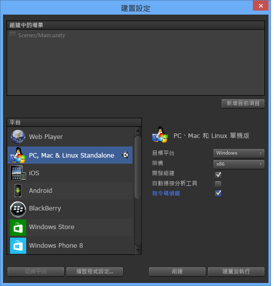

# Visual Studio Tools for Unity 使用者入門
在本節中，您將學習如何安裝 Visual Studio Tools for Unity 和設定您的 Unity 專案以使用 Visual Studio。  

> [!IMPORTANT]
>  Unity 5.2 加入對 Visual Studio Tools for Unity 2.1 的內建支援，可簡化專案安裝。 若要利用這一點，您的 Windows 上必須有 Unity 5.2.0 版或更高版本，和 Visual Studio Tools for Unity 2.1 版或更高版本。  

## 必要條件  
 若要使用 Visual Studio Tools for Unity，您需要：  

-   支援擴充功能的 **Visual Studio** 版本，例如 Visual Studio Community、Professional、Premium 或 Enterprise。 您可以免費下載 Visual Studio Community。  

     [下載 Visual Studio Community](http://www.visualstudio.com/downloads/download-visual-studio-vs)  

-   **Unity** 4.0.0 版或更高版本；若要利用對 Visual Studio Tools for Unity 2.1 版或更高版本的內建支援則必須有 **Unity** 5.2.0 版或更高版本。  

     [下載 Unity (英文)](https://unity3d.com/get-unity/download)  

## 安裝 Visual Studio Tools for Unity  
 從 Visual Studio 組件庫下載並安裝 Visual Studio Tools for Unity。 您必須安裝適用於您 Visual Studio 版本的封裝。 確定安裝 Visual Studio Tools for Unity 2.1 版或更高版本，以利用 Unity 5.2 版或更高版本中的內建 VSTU 支援。  

-   針對 Visual Studio 2015 Community、Visual Studio 2015 Professional 或 Visual Studio 2015 Enterprise：  

     [下載 Visual Studio 2015 Tools for Unity (英文)](https://visualstudiogallery.msdn.microsoft.com/8d26236e-4a64-4d64-8486-7df95156aba9)  

-   針對 Visual Studio 2013 Community、Visual Studio 2013 Professional 或 Visual Studio 2013 Premium：  

     [下載 Visual Studio 2013 Tools for Unity (英文)](https://visualstudiogallery.msdn.microsoft.com/20b80b8c-659b-45ef-96c1-437828fe7cf2)  

-   針對 Visual Studio 2012 Professional 或 Visual Studio 2012 Premium：  

     [下載 Visual Studio 2012 Tools for Unity (英文)](https://visualstudiogallery.msdn.microsoft.com/7ab11d2a-f413-4ed6-b3de-ff1d05157714)  

-   針對 Visual Studio 2010 Professional 或 Visual Studio 2010 Premium：  

     [下載 Visual Studio 2010 Tools for Unity (英文)](https://visualstudiogallery.msdn.microsoft.com/6e536faa-ce73-494a-a746-6a14753015f1)  

> [!NOTE]
>  Visual Studio 的 Express 版不支援 Visual Studio Tools for Unity 等擴充功能。 Visual Studio Community 是支援 Visual Studio Tools for Unity 及其他擴充功能的免費 Visual Studio 版本。 對於大多數使用者而言，Visual Studio Community 是比 Express 更好的選擇。  

> [!NOTE]
>  若是 Visual Studio 2017，VSTU 3 隨附 Unity 工作負載，您可以從安裝程式加以選擇。  

## 您的第一個使用 Visual Studio Tools for Unity 的 Unity 專案  
 在您具備所有必要元件之後，即可開始使用 Visual Studio 處理您的第一個 Unity 專案。 設定您的 Unity 專案會因安裝的 Unity 和 Visual Studio Tools for Unity 的版本而異。 請遵循下面適用於您已安裝的 Unity 和 Visual Studio Tools for Unity 版本的步驟。  

### Unity 5.2 和更高版本 (需要 VSTU 2.1 或更高版本)  
 從 Unity 5.2 開始，您不需要再將 Visual Studio Tools unitypackage 匯入到您的專案。 如果您的專案匯入此 unitypackage，Unity 5.2 會予以忽略並直接從安裝位置載入 Visual Studio Tools for Unity。  

#### 1 - 建立 Unity 專案  
 如果您已經熟悉 Unity，可以建立新的專案或載入您自己的專案。 如果您正在載入已匯入 Visual Studio Tools unitypackage 的專案，以使用 Visual Studio Tools for Unity 搭配舊版的 Unity，我們建議您刪除 UnityVS 目錄來將其移除。  

 如果您是 Unity 新手，請從基本教學課程的小型專案開始。 請瀏覽 Unity Learn 頁面，尋找您可以開始使用的範例專案，以及您可以學習如何使用 Unity 建置自己的遊戲課程。 Unity Learn 頁面提供幾個容易遵循之不同遊戲的教學課程。  

 [教學課程 – Unity Learn 頁面 (英文)](http://unity3d.com/learn/tutorials/modules)  

#### 2 - 設定 Unity Editor 使用 Visual Studio Tools for Unity  
 若要讓您的專案能使用 Visual Studio Tools for Unity，只要將 Visual Studio 設定做為其外部指令碼編輯器。 在 Unity 編輯器中，在主功能表上選擇 **[編輯]、[喜好設定]**；然後在 [Unity 喜好設定]  對話方塊中，選擇 [外部工具] 。 接下來，將 [外部指令碼編輯器]  屬性設為您想要使用的 Visual Studio 版本 (必須安裝這版 Visual Studio 的 Visual Studio Tools for Unity)，並確定已設定 [編輯器附加]  屬性。  

 若要確定現在已啟用對 Visual Studio Tools for Unity 的內建支援，請參閱 [關於 Unity]  對話方塊。 In the Unity editor, on the main menu, choose **[說明]、[關於 Unity]** 。如果 Visual Studio Tools for Unity 已安裝並正確設定，您會看到在 [關於 Unity]  對話方塊。  

 最後，請確定已透過 **[組建設定]** 頁面設定組建目標，並已啟用 [指令碼偵錯]  。  

   

#### 3 - 從 Unity 編輯器啟動 Visual Studio  
 從 Unity 5.2 開始，不再需要 **Visual Studio Tools** 擴充功能功能表即可啟動 Visual Studio 或設定 Visual Studio Tools for Unity。 相反地，一旦 Visual Studio 設定為您的外部指令碼編輯器，只要從 Unity 編輯器選擇指令碼檔案，您的程式碼便會在 Visual Studio 中開啟。  

### 舊版的 Unity (5.2 之前)  
 在 Unity 5.2 之前沒有對 Visual Studio Tools for Unity 的內建支援。 相反地，每個專案都必須匯入 Visual Studio Tools unitypackage 並設定其他專案設定，才能使用 Visual Studio Tools for Unity。  

#### 1 - 建立 Unity 專案  
 如果您已經熟悉 Unity，可以建立新的專案或載入您自己的專案。 如果您要開始新的專案，請在建立時匯入 Visual Studio Tools unitypackage。  

 如果您是 Unity 新手，請從基本教學課程的小型專案開始。 請瀏覽 Unity Learn 頁面，尋找您可以開始使用的範例專案，以及您可以學習如何使用 Unity 建置自己的遊戲課程。 Unity Learn 頁面提供幾個容易遵循之不同遊戲的教學課程。  

 [教學課程 – Unity Learn 頁面 (英文)](http://unity3d.com/learn/tutorials/modules)  

#### 2 - 設定 Unity Editor 使用 Visual Studio Tools for Unity  
 如果您從現有的專案開始，或在建立專案時未匯入 Visual Studio Tools unitypackage，則需要立即匯入 unitypackage。 在 Unity 編輯器主功能表上，選擇 [資產]、[匯入封裝]、[Visual Studio 2015 Tools]  (您應該會看到已安裝之 Visual Studio 版本的選項)。  

 ![將 VSTU 封裝匯入 Unity 專案。] (../cross-platform/media/vstu_configure_unity_import_vstu.png "vstu_configure_unity_import_vstu")  

 最後，請確定已透過 **[組建設定]** 頁面設定組建目標，並已啟用 [指令碼偵錯]  。  

   

#### 3 - 從 Unity 編輯器啟動 Visual Studio  
 最後一個步驟是從 Unity 啟動 Visual Studio。 這會為您的專案建立 Visual Studio 方案，並接著在 Visual Studio 中開啟該方案。  

 在 Unity Editor 主功能表上，選擇 [Visual Studio Tools]、[Open in Visual Studio] 。  

 ![在 Visual Studio 中開啟 Unity 專案。] (../cross-platform/media/vstu_configure_open_in_visual_studio.png "vstu_configure_open_in_visual_studio")  

## 後續步驟  
 如需了解如何在 Visual Studio 中使用及偵錯 Unity 專案，請參閱[使用 Visual Studio Tools for Unity](../cross-platform/using-visual-studio-tools-for-unity.md)。  

## 另請參閱  
 [Unity 首頁 (英文)](http://unity3d.com)

