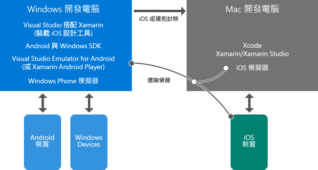

# 了解 Xamarin 的行動應用程式開發
本主題引導您前往概觀資料，以協助您了解如何使用 Xamarin 開發跨平台行動應用程式。 如果您尚未安裝 Visual Studio 和 Xamarin，請先開始進行 [Setup and install](../cross-platform/setup-and-install.md) 程序，然後在安裝程式執行時，返回此處以檢閱這些資源。  
  
> [!NOTE]
>  除非另有註明，否則建議一開始只閱讀此處直接連結的頁面，而不要閱讀附屬頁面。 如果閱讀完這份清單後安裝程序仍在執行，您可以隨時返回並探索其他主題。  
>   
>  您也可以隨時檢閱標示為「基本概念」的主題，並於稍後回顧「深入探討」主題。  
  
## 基本概念：Xamarin 簡介  
 *10-20 分鐘*  
  
1.  [在 Visual Studio 中使用 Xamarin 建置行動應用程式](https://www.visualstudio.com/explore/xamarin-vs) (visualstudio.com) 簡短概述 Xamarin 的主要特性。  
  
2.  Xamarin 推廣人員 James Montemagno 的[使用 C# 和 Visual Studio 建置跨平台行動應用程式](https://channel9.msdn.com/Events/Visual-Studio/Visual-Studio-2015-Final-Release-Event/Building-cross-platform-mobile-apps-using-C-and-Visual-Studio-2015) (Channel9，15 分 16 秒)。 前三分鐘是 Xamarin 概觀，後面接著程式碼示範。  
  
## 基本概念：Visual Studio 和 Xamarin 環境概觀  
 *5-15 分鐘*  
  
-   您將在安裝 Visual Studio 和 Xamarin 的 Windows 電腦上執行大部分工作。 您可以直接在這部電腦上建置 Windows 和 Android 應用程式，然後在裝置或模擬器上執行和偵錯這些應用程式。 您也可以透過 Mac，從遠端建置、執行和偵錯 iOS 應用程式。 Windows 電腦上的 Visual Studio 也可以連線到 iOS 分鏡腳本設計工具與 iOS 模擬器。  
  
-   安裝 Xcode 和 Xamarin 的 Mac 可作為 iOS 應用程式的組建/簽署主機和執行階段環境。 iOS 的組建會從 Windows 電腦上的 Visual Studio 委派給這部 Mac；從 Visual Studio 偵錯 iOS 應用程式時，該應用程式會在 Mac 上的 iOS 模擬器中執行，或直接在連接到 Mac 的行動網卡上執行。 在這種情況下，您會與 Mac 上或附近的應用程式互動，並享有在 Visual Studio 中進行偵錯的體驗。  
  
 下圖描述這些關聯性，您可以從 [Xamarin.iOS for Visual Studio 簡介](http://developer.xamarin.com/guides/ios/getting_started/installation/windows/introduction_to_xamarin_ios_for_visual_studio/) (xamarin.com) 進一步了解如何使用 iOS 應用程式。  
  
   
  
## 基本概念：專案的結構方式  
 *10-30 分鐘*  
  
1.  [共用程式碼選項](http://developer.xamarin.com/guides/cross-platform/application_fundamentals/building_cross_platform_applications/sharing_code_options/) (xamarin.com) 建議使用可攜式類別庫選項，因為當您只使用所有目標平台都支援的 .NET API 時，此選項會提供最佳支援。 大多數商務邏輯程式碼都位於 PCL 中，包括資料庫的存取、REST API 的呼叫和可攜式 Xamarin 元件的呼叫 (請參閱本主題結尾的 [Deeper Dive: Xamarin Components](#components) )。 使用 Xamarin.Forms 撰寫的通用 UI 程式碼也可能位於 PCL 中。  
  
2.  (選擇性) [案例研究：Tasky](http://developer.xamarin.com/guides/cross-platform/application_fundamentals/building_cross_platform_applications/case_study-tasky/) (xamarin.com) 描述完整功能之應用程式設計和結構的一些最佳做法，例如針對共用程式碼使用 PCL 結構化專案，以分隔資料、資料存取和商務層。  
  
## 基本概念：原生和 Xamarin.Forms UI 層  
 *10-40 分鐘*  
  
 Xamarin 提供兩種方法來建置強大的原生應用程式：Xamarin Native 和 Xamarin.Forms。  
  
 Xamarin Native 可讓您為下列每個目標平台撰寫不同的 UI 程式碼：iOS、Android 和 Windows。  透過這種方法，您可以直接存取平台專屬的 API，讓每個平台有自訂的 UI 體驗。  您也可以完整存取每個平台的原生設計工具和控制項，以協助建置各自的 UI。  
  
 Xamarin.Forms 提供一組通用的 API，讓您為可攜式類別庫中的所有平台撰寫共用 UI 層。  Xamarin.Forms 會轉譯為每個目標平台上的原生控制項，以提供原生外觀與風格。  若是 Xamarin.Forms，您會使用 C# 和 XAML 建置 UI，而不是使用設計工具。  
  
 您不需要決定要優先採取哪種方法，應用程式可以使用 Xamarin Native 和 Xamarin.Forms 的組合來實作：  
  
-   使用 Xamarin.Forms 建置一般目的畫面，在不同平台之間提供類似的 UI 和功能，例如登入、連絡人表單和搜尋結果。  
  
-   使用 Xamarin.Forms 中的各種自訂功能，根據平台來調整 UI。 其中包括可從程式碼和 XAML 使用的 OnPlatform API、建立自訂檢視、擴充現有的轉譯器，以及建立自訂轉譯器。  
  
-   如有必要，請使用 Xamarin Native 建置畫面，以使用各平台特有的 UI 功能，例如使用原生相機擷取和影像操作的畫面。  
  
 建議一律從 Xamarin.Forms 方案開始設定可跨平台共用的 UI 程式碼，以及使用自訂功能來進行平台專屬的調整。 如果您需要完全為平台專屬的螢幕，您可以使用 Xamarin Native 個別加入這些螢幕。  
  
 若要進一步了解：  
  
1.  [Xamarin.Forms](http://developer.xamarin.com/guides/cross-platform/xamarin-forms/) (xamarin.com) 提供 Xamarin.Forms 與原生 UI 層 (亦即 Xamarin.iOS 和 Xamarin.Android) 的簡要概觀和優缺點比較。  
  
2.  James Montemagno 的影片 [Xamarin.Forms: Native iOS, Android & Windows apps with C# & XAML](https://channel9.msdn.com/events/Visual-Studio/Connect-event-2015/704) (Xamarin.Forms：使用 C# 和 XAML 建置原生 iOS、Android 和 Windows 應用程式) (Channel9，13 分 3 秒) 的前 3 分鐘提供另一個概觀，您可以繼續觀賞示範。  
  
3.  (選擇性) [Xamarin.Forms 簡介](http://developer.xamarin.com/guides/cross-platform/xamarin-forms/getting-started/introduction-to-xamarin-forms/) (xamarin.com)  
  
4.  (選擇性) 請參閱 [裝置類別](http://developer.xamarin.com/guides/xamarin-forms/platform-features/device/) 文件 (xamarin.com) 中有關使用 OnPlatform 進行自訂的範例  
  
5.  (選擇性) Jason Smith (MSDN Magazine) 的 [跨平台 - 跨行動平台與 Xamarin.Forms 共用 UI 程式碼](https://msdn.microsoft.com/magazine/dn904669.aspx) 概述 Xamarin.Forms 中的不同自訂選項，其詳細資訊則包含在 [自訂每個平台上的控制項](http://developer.xamarin.com/guides/xamarin-forms/custom-renderer/) (xamarin.com) 中。  
  
## 深入探討：使用模擬器偵錯  
 *10-15 分鐘*  
  
 若要在不需要使用實體裝置的情況下偵錯跨平台應用程式，您必須使用下列工具：  
  
1.  **Android 模擬器：** 根據您使用的 Windows 版本，建議使用 Microsoft Visual Studio Emulator for Android 或 Xamarin Player，這兩個模擬器都提供快速效能，並支援各種裝置功能：  
  
    -   **Windows 8+ 電腦**：強烈建議使用隨 Visual Studio 安裝的 Microsoft [Visual Studio Emulator for Android](https://www.visualstudio.com/en-us/features/msft-android-emulator-vs.aspx)。  [Visual Studio Emulator for Android](https://channel9.msdn.com/events/Visual-Studio/Connect-event-2015/711) 影片 (Channel9，5 分 55 秒) 提供概觀和示範。  
  
    -   **Windows 7 或舊版/在 Mac OS X 上執行的 Windows**：使用 [Xamarin Android Player](http://developer.xamarin.com/guides/android/getting_started/installation/android-player) (xamarin.com)。  
  
2.  **Apple iOS 模擬器。** 若要深入了解，請閱讀 [iOS 模擬器使用者入門](https://developer.apple.com/library/prerelease/content/documentation/IDEs/Conceptual/iOS_Simulator_Guide/GettingStartedwithiOSSimulator/GettingStartedwithiOSSimulator.html#//apple_ref/doc/uid/TP40012848-CH5-SW1) (apple.com)。  
  
3.  **Microsoft 的 Windows Phone 模擬器。** 若要深入了解，請閱讀 [Windows Phone 8 的 Windows Phone 模擬器](https://msdn.microsoft.com/library/dn632391.aspx)。  
  
##   Deeper Dive: Xamarin Components  
 *10 分鐘*  
  
 Xamarin 應用程式中的許多擴充功能是透過 Xamarin 元件來提供。 您可以在 [http://components.xamarin.com/](http://components.xamarin.com/)上找到可供下載的完整目錄，其中包含其他 UI 控制項、驗證、各種不同的雲端服務 (例如 Microsoft Azure) 等等的元件。
