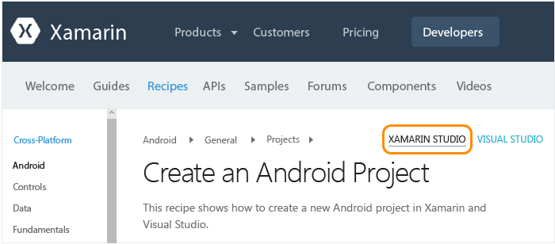

# 針對 Mac 使用者的設定、安裝和驗證
本主題適用於主要在 Mac 上工作的開發人員，這些開發人員會選擇性地在 Mac 上的 Windows 虛擬機器中使用 Visual Studio。 如果您是主要在 Windows 電腦上工作的開發人員，並且需要設定以 iOS 為目標的次要 Mac，請參閱主要的[設定和安裝](../cross-platform/setup-and-install.md)主題。

 若要在 Mac 上使用 Xamarin，您需要下列項目：

-   具有 macOS Sierra 10.12 或更新版本的 Mac，並已安裝 XCode 和 Xamarin。

-   下列其中一項設定：

    -   **若要在 Mac 上直接執行 Xamarin Studio：**Xamarin Studio 是 Xamarin 的開發環境，可使用 C# 建置 Android、iOS 和 Windows 應用程式。  若要取得 Xamarin Studio 的快速概觀，請參閱 [Xamarin Studio 概觀](https://xamarin.com/studio) (xamarin.com)。

    -   **如果您已在 Mac 上設定 Parallels 或 VMWare：**在 Parallels 或 VMWare 內搭配 Visual Studio 2017 和 Xamarin 執行 Windows。  在這項設定中，Xamarin 是 Visual Studio 隨附安裝的擴充功能，可讓您使用 Visual Studio 做為開發環境，以使用 C# 建置 Android、iOS 和 Windows 應用程式。  請注意，您可以參加 Visual Studio Developer Essentials 計畫，以免費取得 3 個月的 Parallels 訂閱。 請參閱 [Microsoft Visual Studio Dev Essentials 將包含 Parallels Desktop Pro 和 Parallels Access](http://blog.parallels.com/blog/2015/11/18/visual-studio-dev-essentials/) (Parallels 部落格)。

 本主題提供這些需求的指示。  在安裝程序執行期間，您可以檢閱[了解 Xamarin 的行動裝置開發](../cross-platform/learn-about-mobile-development-with-xamarin.md)主題，以閱讀並留意必要的背景資料。

##   Mac 設定 (Apple ID、Xcode 和 Xamarin)

1.  如果您還沒有 Apple ID，請在[我的 Apple ID](https://appleid.apple.com/) 免費建立一個 ID。 安裝及登入 Xcode 時需要這個 ID。

2.  從 [https://developer.apple.com/xcode/](https://developer.apple.com/xcode/)下載並安裝 Xcode。

3.  遵循 [安裝和設定 Xamarin.iOS](http://developer.xamarin.com/guides/ios/getting_started/installation/mac/) (xamarin.com) 上的指示，下載並安裝 Xamarin。

4.  當您在 Windows 和 Mac 電腦上完成安裝 Xamarin 之後，請遵循[使用 XMA 連線到 Mac](http://developer.xamarin.com/guides/ios/getting_started/installation/windows/#Connecting_to_the_Mac_Using_XMA) (xamarin.com) 上的指示執行，如此就能在 Windows 電腦上透過 Visual Studio 使用 iOS 和 Mac。

##   在 Parallels 內設定 Windows (Visual Studio 和 Xamarin)

1.  使用您在 Parallels/VMWare 內設定的 Windows 桌面，[下載並啟動任何 Visual Studio 2017 版本的安裝程式](https://www.visualstudio.com/downloads/) (Community、Professional 或 Enterprise)。 Visual Studio 2017 Community 是免費版本，而 Professional 和 Enterprise 版則可試用 30 天。

2.  在安裝程式內，按一下 [啟動] 旁的 [其他選擇] (三橫條圖示) 按鈕，然後選擇 [修改]：  
  
     ![在 Visual Studio 安裝中選擇 [修改] 選項](../cross-platform/media/cross-plat-xamarin-setup-1a.png "跨平台 Xamarin 設定 1")  
  
3.  核取下列方塊：

    1.  [行動裝置與遊戲] > [使用 .NET 進行行動開發]。 這樣做也會自動選取 [常用工具及軟體開發套件] 下的各種 Android 工具。 此選項應該也會更新任何現有的 Xamarin 安裝。  
  
         ![選取 [遊戲與行動開發] 下的 [行動開發] 選項](../cross-platform/media/cross-plat-xamarin-setup-2a.png "跨平台 Xamarin 設定 2")  
  
    2. (選擇性) [Windows] > [通用 Windows 平台開發]。 這包括安裝模擬器映像的選項，需要較長的時間下載。您可以稍後返回 Visual Studio 安裝程式以加入這些選項。  

4.  按一下 [修改] 按鈕，並讓處理序執行。 同樣地，這需要一些時間才能完成，在這段期間，您可以繼續進行 Mac 設定指示，並瀏覽[了解 Xamarin 的行動裝置開發](../cross-platform/learn-about-mobile-development-with-xamarin.md)。

5.  安裝完成之後，請啟動 Visual Studio，並在出現提示時，以您的 Microsoft 帳戶進行登入 (這是您用於 Windows 的相同帳戶)。

6.  當您在 Windows 和 Mac 電腦上完成安裝 Xamarin 之後，請遵循[使用 XMA 連線到 Mac](http://developer.xamarin.com/guides/ios/getting_started/installation/windows/#Connecting_to_the_Mac_Using_XMA) (xamarin.com) 上的指示執行，如此就能透過 Visual Studio 使用 iOS。

##   驗證您的環境
 安裝程式完成之後，請花幾分鐘的時間來確認一切就緒，以便體驗 Xamarin 開發。

### Xamarin Studio
 首先，請確定當您巡覽至所提供的連結時，選取了右上角的 [Xamarin Studio]  ，以查看 Xamarin 文件的正確版本：

 

**Android**

1.  遵循 [建立 Android 專案](http://developer.xamarin.com/recipes/android/general/projects/create_an_android_project/) (xamarin.com) 上的指示，驗證 Android 專案的建立作業。

2.  透過 [Android Player > 與 Xamarin Studio 整合文件 (英文)](https://developer.xamarin.com/guides/android/getting_started/installation/android-player/#Integration_with_Xamarin_Studio) (xamarin.com)，來驗證 Android 模擬器中的偵錯作業。

**iOS**

1.  遵循 [建立 iOS](http://developer.xamarin.com/recipes/ios/general/projects/create_an_ios_project/) (xamarin.com) 上的指示，驗證 iOS 專案的建立作業。

2.  透過 [在模擬器中偵錯文件](https://developer.xamarin.com/guides/ios/deployment,_testing,_and_metrics/debugging_in_xamarin_ios/#Debugging_on_the_Simulator) (xamarin.com)，驗證 iOS 模擬器中的偵錯作業。

### Visual Studio
 首先，請確定當您巡覽至所提供的連結時，選取了右上角的 [Visual Studio]  ，以查看 Xamarin 文件的正確版本：

 

**Android**

1.  遵循 [建立 Android 專案](http://developer.xamarin.com/recipes/android/general/projects/create_an_android_project/) (xamarin.com) 上的指示，驗證 Android 專案的建立作業。

2.  驗證 Android 設計工具：在 [方案總管] 的 Android 專案中，開啟 [資源] > [配置] > [Main.axml] 檔案。

    -   如果您收到錯誤，指出「安裝的 Android SDK 太舊」，請在該訊息中按一下 [開啟 Android SDK]，然後選取可用的最新 SDK 版本。 請注意，您必須以系統管理員身分執行 Visual Studio，來更新 SDK。

3.  驗證您可以從 Visual Studio 連接到 Mac 上所安裝的模擬器。  這項驗證的結果是您會在模擬器清單中看見 Xamarin Player，您可以從 Visual Studio 中選取此項目以進行偵錯。  若要這樣做，請遵循 [將 Visual Studio 連接到 Xamarin Android Player](http://developer.xamarin.com/guides/android/deployment,_testing,_and_metrics/android-player-with-visual-studio-in-vm/) (xamarin.com) 上的指示。

**iOS**

1.  請確定您的 Mac 在網路上可用並已和 Visual Studio 配對，如[連線至 Mac (英文)](https://developer.xamarin.com/guides/ios/getting_started/installation/windows/#Connecting_to_the_Mac) (xamarin.com) 中所述。

2.  遵循 [建立 iOS](http://developer.xamarin.com/recipes/ios/general/projects/create_an_ios_project/) (xamarin.com) 上的指示，驗證 iOS 專案的建立作業。

3.  驗證分鏡腳本設計工具：在方案總管的 iOS 專案中，開啟 **MainStoryboard.storyboard** 檔案。 在此，Visual Studio 會裝載在 Mac 上遠端執行的設計工具。

4.  驗證建置與偵錯：

    1.  以滑鼠右鍵按一下方案總管中的 iOS 專案，然後選取 [設定為啟始專案] 。

    2.  如下所示，從 Visual Studio 的 [組建] 下拉式清單中選取 [iPhoneSimulator] 目標。 如果未列出任何模擬器，請在您的 Mac 上啟動 Xcode，選取 [Xcode] -> [喜好設定]，然後按一下 [下載]。 在 [元件]  下，您應該會看到可供下載的模擬器版本。 您可以在 Xamarin 的[偵錯](https://developer.xamarin.com/guides/ios/deployment,_testing,_and_metrics/debugging_in_xamarin_ios/#Debugging_on_the_Simulator)頁面 (xamarin.com) 上找到偵錯的其他指示。

         

    3.  如下所示，從 Visual Studio 的 [偵錯] 下拉式清單中選取 iPhone 目標，然後按 F5 鍵啟動偵錯工具。 這會在 Mac 上啟動模擬器，以在 Visual Studio 中偵錯時與應用程式進行互動。

         
