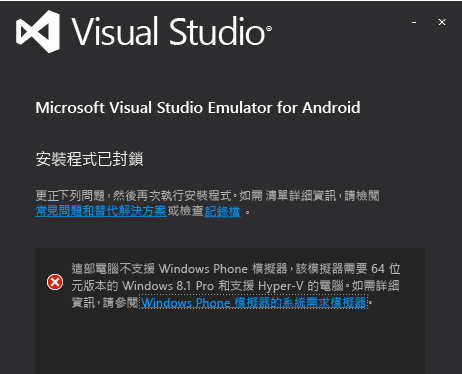
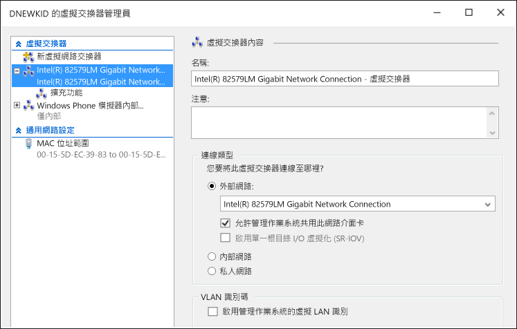

# Troubleshooting the Visual Studio Emulator for Android
本主題所包含的資訊，可協助您解決使用 Visual Studio Emulator for Android 時可能遇到的問題。  
  
> [!WARNING]
>  安裝模擬器時，安裝程式會檢查執行軟體的必要元件。 如果必要元件不存在，則會顯示警告，但安裝時不需要這些元件。  
  
 此主題包括下列各節。  
  
-   [開始之前](#BeforeYouStart)  
  
-   [無法安裝模擬器](#NoInstall)  
  
-   [無法連線到網域或公司網路上的網路目的地](#DomainNetwork)  
  
-   [當網路設定需要手動進行時，無法連線到網路目的地](#ManualNetworkConfig)  
  
-   [模擬器啟動很慢、因逾時而無法啟動，或應用程式部署失敗](#SlowStart)  
  
-   [模擬器無法啟動](#NoStart2)  
  
-   [無法啟動模擬器 (第一次使用)](#NoStart)  
  
-   [安裝模擬器後無法啟動電腦](#NoBoot)  
  
-   [Visual Studio 在嘗試將應用程式部署至模擬器時遇遭困難，或模擬器未作為偵錯目標出現在其他 IDE 中](#ADB)  
  
-   [模擬器因為無法設定 UDP 連接埠而停止回應](#XamarinPlayer)  
  
-   [無法將偵錯工具附加至 Xamarin 專案](#Skylake)  
  
-   [模擬器無法執行使用 Google Play Services 的應用程式](#GooglePlay)  
  
-   [無法拖放檔案、APK 或可刷新的 zip 檔案](#DragAndDrop)  
  
-   [螢幕擷取畫面的解析度不正確](#Resolution)  
  
-   [模擬器無法轉譯 OpenGL 內容](#OpenGL)  
  
-   [模擬器未回應多點觸控筆勢](#Multitouch)  
  
-   [支援資源](#Support)  
  
##   開始之前  
 開始進行疑難排解之前，檢閱下列主題可能會很有幫助：  
  
-   [Android 版 Visual Studio 模擬器的系統需求](../cross-platform/system-requirements-for-the-visual-studio-emulator-for-android.md)  
  
##   無法安裝模擬器  
 若您沒有安裝 Hyper-V，在嘗試安裝模擬器時，會看到下列訊息。 您必須有支援 HyperV 的電腦，並已加以啟用。  
  
   
  
> [!NOTE]
>  此訊息對 Visual Studio Emulator for Android 及 Windows Phone 模擬器皆適用。 Windows 8.1 和 Windows 10 都支援模擬器。  
  
 若您看到此訊息，請檢查 [Android 版 Visual Studio 模擬器的系統需求](../cross-platform/system-requirements-for-the-visual-studio-emulator-for-android.md)，以查看您是否可以執行模擬器。  
  
##   無法連線到網域或公司網路上的網路目的地  
 Visual Studio Emulator for Android 以具有自己的 IP 位址的個別裝置形式出現在網路上。 該模擬器未加入 Windows 網域，並且不會與主機電腦共用網域或工作群組認證。  
  
 如果您的網路需要基本網路和網際網路連線的網域或工作群組授權，請連絡 IT 系統管理員以當做例外狀況來處理。 這個例外狀況可將您的開發電腦當做界限電腦，並接受來自未加入網域之網路裝置 (例如模擬器) 的連線。  
  
 Visual Studio Emulator for Android 也會使用自己的 MAC 位址集。 如果您無法從模擬器存取網路或網際網路資源，請洽詢 IT 系統管理員，確定模擬器的 MAC 位址已取得網路授權。  
  
#### 檢視模擬器的 MAC 位址  
  
1.  啟動模擬器。  
  
2.  在模擬器工具列上，按一下＞形箭號按鈕 (>>)，以開啟 [其他工具] 視窗。  
  
3.  在 [其他工具] 視窗中，按一下 [網路] 索引標籤。  
  
4.  在 [網路] 頁面上，尋找實體位址項目。  
  
##   當網路設定需要手動進行時，無法連線到網路目的地  
 若要從模擬器連接到網路目的地，您的網路必須符合下列需求：  
  
-   DHCP。 模擬器需要 DHCP，因為它會將本身設定為網路上具有自己的 IP 位址的個別裝置。  
  
-   自動設定的 DNS 和閘道設定。 您無法手動設定模擬器的 DNS 和閘道設定。  
  
 如果您的網路需要手動進行設定，請洽詢 IT 系統管理員，確定如何啟用模擬器的網路連線。  
  
##   模擬器啟動很慢、因逾時而無法啟動，或應用程式部署失敗  
 在某些情況下，模擬器需要幾分鐘的時間才能啟動，或因逾時而無法啟動。 當模擬器無法啟動時，您會看到下列訊息：`App deployment failed. Please try again`。 下列情況可能會導致這個錯誤。  
  
-   從可開機的 VHD 執行 Visual Studio Emulator for Android。 不支援這個組態。  
  
-   硬碟故障。 請考慮執行 chkdsk 程式。  
  
-   需要重組硬碟。 請考慮重組磁碟機。  
  
-   硬碟幾乎已滿。 請檢查磁碟機上的可用空間。  
  
-   因為有其他執行中的應用程式，導致記憶體不足。 請減少正在使用記憶體的應用程式數目，或增加記憶體數量。  
  
-   一般會造成系統效能不佳的任何因素。 從 Windows 體驗指數子分數最低的元件開始進行疑難排解，您可以在 [控制台] 的 [效能資訊及工具] 頁面上找到這項資訊。  
  
##   模擬器無法啟動  
 若模擬器先前可以運作，但現在無法運作，請執行下列工作。 如果您第一次使用模擬器，請先參閱 [Emulator fails to start (first use)](#NoStart) ，再嘗試執行這些步驟。  
  
-   移除模擬器的其他任何 Hyper-V 執行個體。  
  
    1.  關閉 Visual Studio。  
  
    2.  開啟 Hyper-V 管理員，並停止任何已在執行且可能處於損毀狀態之模擬器 (虛擬機器) 的 Hyper-V 執行個體。  
  
    3.  在 Hyper-V 管理員中，刪除其他任何模擬器 VM。  
  
    4.  將電腦重新開機。  
  
-   確定您至少有 4 GB 的系統記憶體，而且沒有其他資源密集的程式和處理序正在使用這些記憶體 (例如，嘗試關閉和瀏覽器視窗)。  
  
-   在 Hyper-V 管理員中開啟虛擬交換器管理員，並檢查您是否有兩個網路交換器；確認第一個為內部交換器，而第二個為外部交換器。  
  
       
  
     若設定不正確，且您正使用 Windows 10，您可以嘗試 [使用 netcfg –d 命令重新安裝網路裝置](http://windows.microsoft.com/en-us/windows-10/fix-network-connection-issues) (第 6 章節)。  
  
-   如果這些步驟都無法解決問題，請參閱 [Emulator fails to start (first use)](#NoStart) ，以取得可能干擾模擬器之協力廠商軟體的詳細資訊。  
  
##   無法啟動模擬器 (第一次使用)  
 如果模擬器未啟動，請進行下列工作來找出並修正問題。  
  
-   確定符合最低硬體需求且 BIOS 設定正確無誤。  
  
     模擬器和 Windows 8 Hyper-V 需要支援第二層位址轉譯 (SLAT) 的 64 位元處理器。 針對 Intel，您基本上需要 Core i3、i5 或 i7 處理器 (或多個 Xeon 中的其中一個)。 AMD 晶片清單可在 [這裡](http://support.amd.com/en-us)取得。  
  
    1.  確定您的電腦符合[系統需求](../cross-platform/system-requirements-for-the-visual-studio-emulator-for-android.md)。  
  
    2.  確認 [SLAT 工具](https://slatstatuscheck.codeplex.com/) 回報您的電腦支援 SLAT。  
  
    3.  在電腦的 BIOS 設定中，確定已啟用所有虛擬化技術。 確切 BIOS 描述可能會因每個硬體製造商而異。 一般而言，請啟用下列相關功能：  
  
        -   SLAT (第二層位址轉譯)  
  
        -   EPT (延伸分頁表) (Intel)  
  
        -   NPT (巢狀分頁表) (AMD)  
  
        -   RVI (快速虛擬化索引編制) (AMD)  
  
        -   VMX (表示硬體輔助虛擬化支援的 Intel 縮寫)  
  
        -   SVM (表示硬體輔助虛擬化支援的 AMD 縮寫)  
  
        -   XD (執行停用) (Intel)；必須啟用這項功能  
  
        -   NX (沒有執行) (AMD)；必須啟用這項功能  
  
    4.  如果 BIOS 中有下列選項，請加以停用。  
  
        -   停用 Intel VT-d  
  
        -   停用 Trusted Execution  
  
         如需詳細資訊，請參閱這篇文章：Technet：Hyper-V：如何修正啟用 Hyper-V 的 BIOS 錯誤  
  
    5.  確定您至少有 4 GB 的系統記憶體，而且沒有其他資源密集的程式和處理序正在使用這些記憶體。  
  
    6.  確定您執行的是 Windows 8 Professional (含) 以後版本 (不支援 Windows Server 2008)。 支援 Windows Server 2012，但您必須啟用 [桌面體驗]。  
  
     您可以檢查事件檢視器，以查看是否有任何 Hypervisor 錯誤。 若要執行這個動作，請開啟事件檢視器 (開始鍵 + R，接著輸入 `eventvwr`)，並選取 [Windows 記錄] 、[系統] 。 然後依事件來源篩選記錄，並將來源設定為 [Hyper-V-Hypervisor] 。 請查看錯誤，以協助找出根本原因。  
  
     如果您的處理器符合最低需求，但 Hypervisor 仍然失敗，建議您了解電腦是否有可用的 BIOS 升級。 如果有，而且您選擇升級，則當您升級 BIOS 時，請務必遵守製造商的所有注意事項 (例如，確保 BIOS 韌體升級不會因電源中斷而中斷，這可能會永久損毀 BIOS)。  
  
-   確定您至少有 4 GB 的系統記憶體，而且沒有其他資源密集的程式和處理序正在使用這些記憶體。  
  
-   移除/停用可能會干擾虛擬網路的協力廠商驅動程式或軟體。  
  
     安裝在 Windows 8 下的某些協力廠商產品有一些已知問題，例如網路驅動程式/通訊協定與 Hyper-V 網路堆疊不完全相容。  
  
     一般而言，這些產品的開發人員必須將其軟體更新為與 Windows 8 和 Hyper-V 相容。  
  
     下列產品可能需要升級，才能與 Windows 8 相容：VirtualBox、Virtual PC 7、VMWare、某些 VPN 用戶端、軟體防火牆、某些 Cisco VPN 用戶端版本，以及其他虛擬化系統。 請與有問題之虛擬化軟體的開發人員合作，並建議他們升級軟體，以與 Windows 8 和 Hyper-V 相容。  
  
     其中一個 **因應措施**，是停用可能會干擾模擬器用來與 Visual Studio 通訊之虛擬網路的所有協力廠商驅動程式和應用程式。 這些應用程式可能包括：  
  
    -   防毒應用程式 (連接到網路堆疊)  
  
    -   網路監視工具  
  
    -   網路記錄工具  
  
    -   其他系統監視軟體  
  
     除了解除安裝有問題的產品 (並要求產品開發人員發行更新版本) 之外，另一個可能的解決方法是執行下列步驟。  
  
    1.  啟動網路連線管理員 (從 [開始] 畫面輸入 `View Network Connections` ，然後選取這個選項以檢視網路連線)。  
  
    2.  針對虛擬乙太網路 (內部乙太網路連接埠 Windows Phone 模擬器內部交換器) 介面卡，從內容功能表選擇 [內容]  。  
  
           
  
         介面卡內容如下所示。  
  
           
  
    3.  針對這張介面卡，您只需要在 [這個連線使用下列項目]  下選取下列選項：  
  
        -   Client for Microsoft Networks  
  
        -   QoS 封包排程器  
  
        -   File and Printer Sharing for Microsoft Networks  
  
        -   Microsoft LLDP 通訊協定驅動程式  
  
        -   Link-Layer Topology Discovery Mapper I/O Driver  
  
        -   Link-Layer Topology Discovery Responder  
  
        -   網際網路通訊協定第 6 版 (TCP/IPv6)  
  
        -   網際網路通訊協定第 4 版 (TCP/IPv4)  
  
    4.  取消選取其他任何項目。  
  
     使用這種方法的缺點是，每當新的協力廠商產品安裝不支援的驅動程式時，或安裝模擬器時，都必須重複執行這些步驟。  
  
     解除安裝協力廠商產品之後，您可能需要還原 Windows Phone 模擬器內部交換器。 若要執行這個動作：  
  
    -   開啟 Hyper V 並移至虛擬交換器管理員。 建立名為「Windows Phone 模擬器內部交換器」的虛擬交換器，然後將其連線類型設定為 [內部網路] 。  
  
           
  
     現在啟動模擬器。 模擬器應該會正常運作。  
  
##   安裝模擬器後無法啟動電腦  
 下列條件成立時，可能會發生這個問題：  
  
-   您的電腦具有有 1 GB 的主機板。  
  
-   主機板上已啟用 USB3。  
  
 若要解決這個問題，請停用主機板之 BIOS 設定中的 USB3 並重新啟動電腦。 然後檢查是否已針對主機板的 BIOS 發行 GB 更新。  
  
 如需詳細資訊，請參閱下列知識庫文章 [在 GB 系統上安裝 Hyper-V 角色後開機失敗](https://support.microsoft.com/en-us/kb/2693144)。  
  
##   Visual Studio 在嘗試將應用程式部署至模擬器時遇遭困難，或模擬器未作為偵錯目標出現在其他 IDE 中  
 若模擬器正在執行，但似乎未連接到 ADB (Android Debug Bridge) 或未顯示在使用 ADB (例如 Android Studio 或 Eclipse) 的 Android 工具 中，則您可能需要調整模擬器尋找 ADB 的位置。 模擬器使用登錄機碼來識別您的 Android SDK 的基礎位置，並尋找該目錄下的 \platform-tools\adb.exe 檔案。 若要修改模擬器所使用的 Android SDK 路徑：  
  
-   從 [開始] 按鈕內容功能選取 [執行]  ，在對話方塊中輸入 `regedit` ，然後選擇 [確定] ，以開啟登錄編輯程式。  
  
-   巡覽至左側資料夾樹狀目錄中的 HKEY_LOCAL_MACHINE\SOFTWARE\Wow6432Node\Android SDK Tools。  
  
-   修改 [路徑]  登錄變數，以符合您的 Android SDK 路徑。  
  
 重新啟動模擬器，您現在應該可以看到模擬器連接到 ADB 和關聯的 Android 工具。  
  
##   模擬器因為無法設定 UDP 連接埠而停止回應  
 您可能會因為與 Xamarin Player 不相容而遇到此問題。 若模擬器似乎停止回應，或您看到此錯誤訊息「模擬器無法連接到裝置作業系統：無法設定 UDP 連接埠。  可能停用部分功能」，即表示您遇到此問題。 請採取下列步驟。  
  
1.  將 Xamarin Player 解除安裝。  
  
2.  確認已移除該虛擬方塊 (Xamarin Player 會在虛擬方塊頂端執行)。  
  
3.  前往裝置管理員，選取可顯示隱藏裝置的選項，然後刪除實體網路卡以外的所有內容。  
  
4.  您可以先移除任何非實體網路介面卡，再嘗試將 Hyper-V 解除安裝/重新安裝。  
  
##   無法將偵錯工具附加至 Xamarin 專案  
 如果您使用 Intel Skylake 處理器來執行 Windows 10，Xamarin 應用程式可能無法在模擬器中執行，或者 Visual Studio 偵錯工具可能不會附加至它們。 這是因為 HYPER-V 和 Skylake 處理器的問題所導致。 請執行下列步驟來因應。  
  
1.  開啟 [HYPER-V 管理員]，然後選取 VM 以供您使用的模擬器設定檔使用。  
  
2.  選取 [刪除儲存狀態]\(右下方)。  
  
3.  選擇 [設定...]  
  
4.  展開處理器節點，然後選擇 [相容性]。  
  
5.  啟用 [移轉至使用不同處理器版本的實體電腦]。  
  
6.  重新啟動服務 (位於 [動作] 下方)，然後再試一次。  
  
##   模擬器無法執行使用 Google Play Services 的應用程式  
 Google Play 服務的程式庫未隨附模擬器。 但模擬器支援可刷新之 zip 檔案的拖放安裝。  
  
##   無法拖放檔案、APK 或可刷新的 zip 檔案  
 當您將檔案拖放到畫面上時，模擬器會使用 ADB.exe 來協助傳輸檔案。 如果您在嘗試拖放檔案時發生錯誤，可能表示模擬器並未連接到 ADB.exe。 若要解決此問題，請遵循 [Visual Studio 在嘗試將應用程式部署至模擬器時遇遭困難，或模擬器未作為偵錯目標出現在其他 IDE 中](#ADB)的步驟。  
  
##   螢幕擷取畫面的解析度不正確  
 如果您使用 [其他工具]  視窗中的 [螢幕擷取畫面] 索引標籤取得螢幕擷取畫面，但所產生的影像不是預期的大小，您可能需要調整螢幕的縮放比例，再選擇 [擷取] 。 模擬器會以您主機電腦螢幕的螢幕解析度，來取得螢幕擷取畫面。  
  
##   模擬器無法轉譯 OpenGL 內容  
 模擬器使用您主機電腦的 GPU 來轉譯 OpenGL 內容，並使用 ANGLE 專案將這些呼叫轉換成 DirectX，或從 DirectX 轉換成這些呼叫。 如果您的應用程式在裝置上正確地呈現，但在模擬器上卻不正確地呈現，可能是裝置正在緩和不正確的 OpenGL 呼叫 (例如使用不相符的著色器變數)。  
  
##   模擬器未回應多點觸控筆勢  
 在某些情況下，模擬器會啟動，但無法透過具備觸控功能之顯示器的直接互動，或使用模擬器工具列上的多點觸控工具，來回應多點觸控。 如果發生這種情況，請選擇模擬器工具列上的 [旋轉]  按鈕，然後再次嘗試使用多點觸控。 如果此問題持續發生，請閱讀 [模擬器無法轉譯 OpenGL 內容](#OpenGL) 問題。  
  
##   支援資源  
 若您的主機電腦符合系統需求，但發生了此疑難排解指南未涵蓋的問題：  
  
-   使用 [android-emulator](http://stackoverflow.com/questions/tagged/android-emulator) 與 visual-studio 標記在 StackOverflow 上發問。  
  
-   使用 Visual Studio 或模擬器管理員中的 [傳送笑臉] 工具回報問題。
