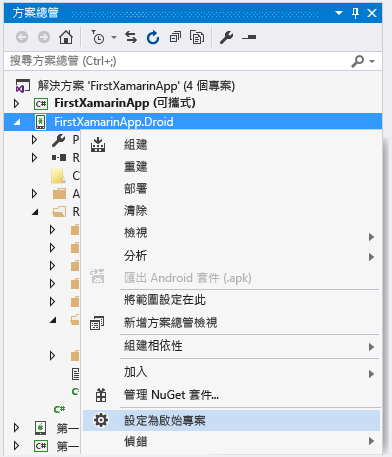
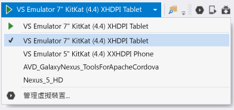
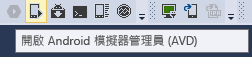
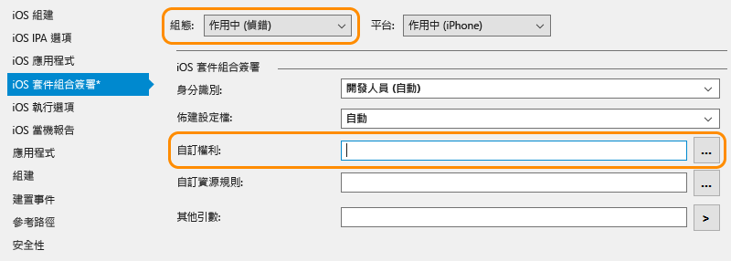

# 驗證您的 Xamarin 環境
安裝程式完成之後 (請參閱[設定和安裝](../cross-platform/setup-and-install.md))，請花幾分鐘的時間來確認一切就緒，以便體驗 Xamarin 開發。  
  
 完成這些驗證之後，您就能執行下列一或兩個逐步解說：  
  
-   [了解在 Visual Studio 中建置 Xamarin.Forms 應用程式的基本概念](../cross-platform/learn-app-building-basics-with-xamarin-forms-in-visual-studio.md)  
  
-   [使用 Visual Studio 的 Xamarin 建置具有原生 UI 的應用程式](../cross-platform/build-apps-with-native-ui-using-xamarin-in-visual-studio.md)  
  
## 所有平台  
 首先，選取 [工具] > [選項]、展開 [Xamarin] > [其他]，然後按一下更新的 [立即檢查] 連結。 您需要使用 Xamarin 4.0.3.214 或更新版本，以避免發生先前的授權問題。  
  
 接著，在 Visual Studio 中建立新的 Xamarin 解決方案，方法是使用 [檔案] > [新增專案]，接著在對話方塊中，展開 [範本] > [其他語言] > [Visual C#] > [跨平台]、選取 [空白應用程式 (原生可攜式)]，然後按一下 [確定]。 這會建立一個方案，其中包含一個共用可攜式類別庫專案，以及 Android、iOS 和 Windows 的個別專案：  
  
 ![從 [空白應用程式 &#40;原生可攜式&#41;] 範本建立新專案的結果](../cross-platform/media/crossplat-xamarin-verify-1.png "CrossPlat Xamarin 驗證 1")  
  
> [!NOTE]
>  若無範本，請參閱[沒有 Xamarin 專案範本嗎？試試這個](#missing) (位於本頁面底端)。  
  
## Android  
  
1. 檢查是否已安裝最新的 Android SDK 工具，方法是移至 [工具] > [Android] > [Android SDK 管理員]，然後安裝最新版的 Android SDK Tools、Android SDK Platform-Tools 和 Android SDK Build-Tools 元件。 請注意，不一定要安裝最新的 Android API 層級；您所需的 API 取決於您想要做為目標的平台層級。 通常，安裝 Xamarin，將會安裝它所需的平台層級。  

2.  驗證 Android 設計工具：在 [方案總管] 的 Android 專案中，開啟 [資源] > [配置] > [Main.axml] 檔案。 (如果您並未直接看見此檔案，請嘗試在 [方案總管] 中進行搜尋；它只存在於 Android 專案，而不在 iOS 專案中)。  
  
    - 如果您收到錯誤，指出「安裝的 Android SDK 太舊」，請在該訊息中按一下 [開啟 Android SDK] ，然後選取可用的最新 SDK 版本，如先前步驟 1 所述。 
  
3.  驗證模擬器 (或裝置) 中的建置與偵錯：  
  
    -   以滑鼠右鍵按一下方案總管中的 Android 專案，然後選取 [設定為啟始專案] 。  
  
           
  
    -   根據您的目標 Android 版本選取適當的模擬器；如果您已將 Android 開發裝置連接到電腦，也會在此處看到該裝置列於模擬器一旁：  
  
        -   Windows 8 及更新版本：如下所示，在 Visual Studio 的 [偵錯] 下拉式清單中選取 [VS Emulator] 目標，然後按 **F5** 啟動偵錯工具。 如需詳細資訊，請參閱 [Visual Studio 的 Android 模擬器簡介](http://blogs.msdn.com/b/visualstudioalm/archive/2014/11/12/introducing-visual-studio-s-emulator-for-android.aspx) (Visual Studio ALM 部落格)。 若在讓模擬器運作時發生問題，請參閱 [Troubleshooting the Visual Studio Emulator for Android](../cross-platform/troubleshooting-the-visual-studio-emulator-for-android.md)。 您也可以選取 [工具] > [Android 版 Visual Studio 模擬器...]，為模擬器建立新的裝置設定檔。  
  
               
  
             注意︰如果沒看見 [工具] > [Android 版 Visual Studio 模擬器...] 功能表選項，您可能並未安裝該模擬器。 移至 [控制台] > [程式和功能]、選取 [Microsoft Visual Studio]，然後按一下 [變更] 以重新執行安裝程式。 按一下安裝程式中的 [修改]、核取 [跨平台行動開發] > [Android 版 Microsoft Visual Studio 模擬器] 的核取方塊，然後按一下 [更新]。  
  
        -   Windows 7 及舊版：在下拉式清單中改選取 [Xamarin Player for Android]，然後按 F5 鍵執行。 如需 Xamarin Player、其裝置管理員和疑難排解提示的詳細資訊，請閱讀 [Xamarin Android Player](http://developer.xamarin.com/guides/android/getting_started/installation/android-player/) (xamarin.com)。  
  
> [!NOTE]
>  在 Visual Studio 中，您可能會發現工具列中有 Android Emulator Manager (AVD) 按鈕 (如下所示)，這會開啟特別用來設定 Google Android 模擬器的裝置管理員。  這對 Visual Studio Emulator for Android 或 Xamarin Player 不會有影響，這兩者會有各自用來設定設定檔的裝置管理員。  如需詳細資訊，請參閱 [Visual Studio 的 Android 模擬器簡介](http://blogs.msdn.com/b/visualstudioalm/archive/2014/11/12/introducing-visual-studio-s-emulator-for-android.aspx) (Visual Studio ALM 部落格) 和 [Xamarin Android Player](http://developer.xamarin.com/guides/android/getting_started/installation/android-player/) (xamarin.com)。  
>   
  
## Windows Phone  
  
1.  驗證 Windows Phone 設計工具：在方案總管的 Windows Phone 專案中，開啟 **MainPage.xaml** 檔案。  
  
2.  驗證模擬器或裝置中的建置與偵錯 (注意：針對這個步驟，您必須已透過 Visual Studio 安裝程式安裝 Windows Phone 模擬器，或具有行動網卡)：  
  
    -   以滑鼠右鍵按一下方案總管中的 Windows Phone 專案，然後選取 [設定為啟始專案] 。  
  
    -   如下所示，在 Visual Studio 的 [偵錯] 下拉式清單中選取 [Emulator 8.1] 目標或連接裝置，然後按 F5 鍵啟動偵錯工具。  
  
           
  
    -   如果您在讓模擬器運作時發生問題，請閱讀 [Windows Phone 8 模擬器疑難排解](https://msdn.microsoft.com/library/windows/apps/jj681694.aspx)。  
  
## iOS  
  
1.  請確定您的 Mac 在網路上可用並搭配 Visual Studio，如 [Connecting to the Mac (連接到 Mac)](http://developer.xamarin.com/guides/ios/getting_started/installation/windows/xamarin-mac-agent/) (xamarin.com) 中所述。  
  
2.  驗證分鏡腳本設計工具：在方案總管的 iOS 專案中，開啟 **Main.storyboard** 檔案。 在此，Visual Studio 會裝載在 Mac 上遠端執行的設計工具。  
  
3.  驗證建置與偵錯：  
  
    1.  以滑鼠右鍵按一下方案總管中的 iOS 專案，然後選取 [設定為啟始專案] 。  
  
    2.  如下所示，從 Visual Studio 的 [組建] 下拉式清單中選取 [iPhoneSimulator] 目標；如果具有行動網卡，請選取 [iPhone] 目標。 如果未列出任何模擬器，請在您的 Mac 上啟動 Xcode，選取 [Xcode] -> [喜好設定]，然後按一下 [下載]。 在 [元件]  下，您應該會看到可供下載的模擬器版本。 您可以在 Xamarin 的[偵錯](https://developer.xamarin.com/guides/ios/deployment,_testing,_and_metrics/debugging_in_xamarin_ios/#Debugging_on_the_Simulator)頁面 (xamarin.com) 上找到偵錯的其他指示。  
  
           
  
    3.  如下所示，從 Visual Studio 的 [偵錯] 下拉式清單中選取 iPhone 目標，然後按 F5 鍵啟動偵錯工具。 這會在 Mac 上啟動模擬器，以在 Visual Studio 中偵錯時與應用程式進行互動。 若您有連接到 Mac 的實體 iPhone 或 iPad，其會在此處顯示，且您可改為選取之。 若未看見任何列出的裝置或模擬器，請檢查與 Mac 之間的連線，方法為檢閱上方步驟 1 中所連結的主題，或移至 [工具]  >**iOS** >  
  
           
  
    4.  如果您在連接到 Mac 時發生問題，請閱讀 [連接疑難排解](http://developer.xamarin.com/guides/ios/getting_started/installation/windows/xamarin-mac-agent/xma-troubleshooting/) (xamarin.com)。  
  
    5.  如果您看到錯誤指出「沒有安裝的佈建設定檔符合安裝的 iOS 簽署金鑰」，請執行下列動作：  
  
        -   依照 [將您的帳戶加入 Xcode 中](https://developer.apple.com/library/content/documentation/IDEs/Conceptual/AppStoreDistributionTutorial/AddingYourAccounttoXcode/AddingYourAccounttoXcode.html#//apple_ref/doc/uid/TP40013839-CH40-SW1) (apple.com) 所述，檢查您在 Mac 上的 Apple ID 帳戶是否已加入 Xcode 中。  加入您的帳戶之後，請務必重新啟動 Visual Studio 和 Xcode。  
  
               
  
        -   確認在 [iOS 套件組合簽署] 索引標籤的 iOS 專案屬性中，使用中偵錯組態的 [自訂權益] 欄位是空的。  注意：如果遇到上述錯誤訊息，只能嘗試移除此設定。  
  
##   沒有 Xamarin 專案範本嗎？ 試試這個  
 如果您是從 Xamarin 網站直接安裝 Xamarin，且以並存方式安裝 Visual Studio 2013 和 Visual Studio 2015，則可能會遺漏範本。 不過此問題很容易修正：只要在 Xamarin 安裝程式中啟用 [Xamarin for Visual Studio 2015] 功能即可。  
  
1.  在 [控制台] 中開啟 [程式和功能] ，選擇 [Xamarin]  項目，然後按一下 [變更] 。  
  
2.  在出現的 Xamarin 安裝精靈中，按一下 [下一步]  ，然後按一下 [變更] 。  
  
3.  在要安裝的選擇性功能清單中，展開 [Xamarin for Visual Studio 2015] ，選擇 [將安裝在本機磁碟機] ，然後按一下 [下一步]  繼續新增此功能。
