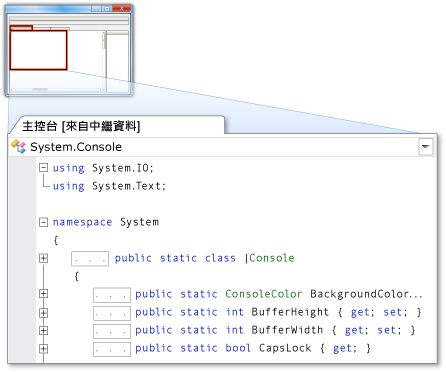

# 中繼資料當做原始碼
[!INCLUDE[vs2017banner](../code-quality/includes/vs2017banner.md)]

中繼資料當做原始程式碼，可讓您檢視在唯讀緩衝區中顯示為 C\# 原始程式碼的中繼資料。 這會啟用類型和成員 \(不含實作\) 宣告的檢視。 針對專案或解決方案不提供原始程式碼的類型或成員執行 \[移至定義\] 命令，就可以檢視當做原始程式碼的中繼資料。  
  
> [!NOTE]
>  當您嘗試對標記為內部的類型或成員執行 \[移至定義\] 命令時，整合式的開發環境 \(IDE\) 不會將它們的中繼資料顯示為原始程式碼，無論參考的組件是否為 Friend 組件。  
  
 您可以在程式碼編輯器或 \[程式碼定義\] 視窗中檢視當做原始程式碼的中繼資料。  
  
## 在程式碼編輯器中檢視當做原始程式碼的中繼資料  
 當您對無法取得其原始程式碼的項目執行 \[移至定義\] 命令時，包含該項目中繼資料 \(顯示為原始程式碼\) 檢視的索引標籤式文件，會出現在程式碼編輯器中。 後面加上 **\[來自中繼資料\]** 的類型名稱會出現在文件的索引標籤上。  
  
 例如，如果對 <xref:System.Console> 執行 \[移至定義\] 命令，<xref:System.Console> 的中繼資料就會當做 C\# 原始程式碼出現在程式碼編輯器中，與其宣告類似，但沒有實作。  
  
   
  
## 在 \[程式碼定義\] 視窗中檢視當做原始程式碼的中繼資料  
 當 \[程式碼定義\] 視窗在使用中或出現時，IDE 會自動對程式碼編輯器中游標下的項目，和 \[類別檢視\] 或 \[物件瀏覽器\] 中所選的項目，執行 \[移至定義\] 命令。 如果該項目沒有原始程式碼，IDE 就會在 \[程式碼定義\] 視窗中將該項目的中繼資料當做原始程式碼顯示。  
  
 例如，如果您將游標放在程式碼編輯器的單字 <xref:System.Console> 中，<xref:System.Console> 的中繼資料在 \[程式碼定義\] 視窗中就會顯示成原始程式碼。 原始程式碼類似 <xref:System.Console> 宣告，但沒有實作。  
  
 如果您想要看到項目的宣告出現在 \[程式碼定義\] 視窗中，請以滑鼠右鍵按一下項目，然後按一下 \[移至定義\]。