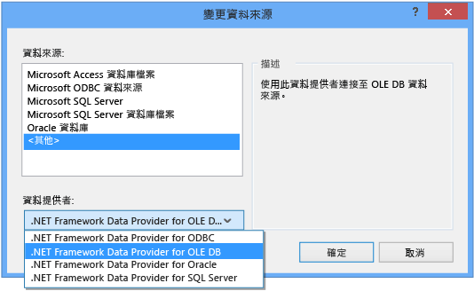
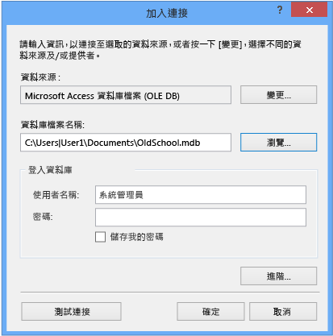

# 逐步解說：連接至 Access 資料庫中的資料 (Windows Form)
您可以使用 Visual Studio 連接到 Access 資料庫 \(.mdf 檔案或 .accdb 檔案\)。  定義連接之後，資料就會出現在 \[**資料來源視窗**\] 中。  您可以從這個視窗將資料表或檢視表拖曳至表單上。  如果您要了解 Visual Studio 中的專案系統如何管理這些本機資料庫檔案，請參閱 [如何：管理專案中的本機資料檔](../data-tools/how-to-manage-local-data-files-in-your-project.md)。  
  
## 必要條件  
 若要使用這些程序，您需要 Windows Form 應用程式專案，以及 Access 資料庫 \(.accdb 檔案\) 或 Access 2000\-2003 資料庫 \(.mdb 檔案\)。  依照對應您的檔案類型的程序進行。  
  
## 為 .accdb 檔案建立資料集  
 您可以利用下列程序連接到使用 Access 2013、Office 365、Access 2010 或 Access 2007 建立的資料庫。  
  
#### 建立資料集  
  
1.  開啟資料要連接的 Windows Form 應用程式。  
  
2.  在 \[**檢視**\] 功能表上選擇 \[**其他視窗**\] \> \[**資料來源**\]。  
  
       
  
3.  在 \[**資料來源**\] 視窗中，按一下 \[**加入新資料來源**\]。  
  
       
  
4.  在 \[**選擇資料來源類型**\] 頁面上選擇 \[**資料庫**\]，然後選擇 \[**下一步**\]。  
  
5.  在 \[**選擇資料庫模型**\] 頁面上選擇 \[**資料集**\]，然後選擇 \[**下一步**\]。  
  
6.  在 \[**選擇資料連接**\] 頁上，選取 \[**新增連接**\]，設定新的資料連接。  
  
7.  將 \[**資料來源**\] 變更為 \[**.NET Framework Data Provider for OLE DB**\]。  
  
       
  
    > [!IMPORTANT]
    >  雖然 \[**Microsoft Access 資料庫檔案 \(OLE DB\)**\] 資料來源似乎是正確的選擇，但是該資料來源類型僅適用於 .mdb 資料庫檔案。  
  
8.  在 \[**OLE DB 提供者**\] 中選擇 \[**Microsoft Office 12.0 Access 資料庫引擎 OLE DB 提供者**\]。  
  
       
  
9. 在 \[**伺服器名稱或檔名**\] 中，指定您要連接的 .accdb 檔案路徑和名稱，然後選擇 \[**確定**\]。  
  
    > [!NOTE]
    >  如果資料庫檔案有使用者名稱和密碼，請先指定這兩項再選擇 \[**確定**\]。  
  
10. 在 \[**選擇資料連接**\] 頁面上選擇 \[**下一步**\]。  
  
11. 在 \[**將連接字串儲存到應用程式組態檔**\] 頁面上選擇 \[**下一步**\]。  
  
12. 在 \[**選擇您的資料庫物件**\] 頁面上，展開 \[**資料表**\] 節點。  
  
13. 選擇您的資料集中藥包含的資料表或檢視表，然後選擇 \[**完成**\]。  
  
     資料集會加入至專案中，而且資料表和檢視表會出現在 \[**資料來源**\] 視窗中。  
  
## 為 .mdb 檔案建立資料集  
 執行 \[**資料來源組態精靈**\] 來建立資料集。  
  
#### 建立資料集  
  
1.  開啟資料要連接的 Windows Form 應用程式。  
  
2.  在 \[**檢視**\] 功能表上選擇 \[**其他視窗**\] \> \[**資料來源**\]。  
  
       
  
3.  在 \[**資料來源**\] 視窗中，按一下 \[**加入新資料來源**\]。  
  
       
  
4.  在 \[**選擇資料來源類型**\] 頁面上選擇 \[**資料庫**\]，然後選擇 \[**下一步**\]。  
  
5.  在 \[**選擇資料庫模型**\] 頁面上選擇 \[**資料集**\]，然後選擇 \[**下一步**\]。  
  
6.  在 \[**選擇資料連接**\] 頁上，選取 \[**新增連接**\]，設定新的資料連接。  
  
7.  如果 \[**資料來源**\] 不是 \[**Microsoft Access 資料庫檔案 \(OLE DB\)**\]，請選擇 \[**變更**\] 開啟 \[**變更資料來源**\] 對話方塊，並且選擇 \[**Microsoft Access 資料庫檔案**\]，然後選擇 \[**確定**\]。  
  
8.  在 \[**資料庫檔名**\] 中，指定您要連接的 .mdb 檔案路徑和名稱，然後選擇 \[**確定**\]。  
  
       
  
9. 在 \[**選擇資料連接**\] 頁面上選擇 \[**下一步**\]。  
  
10. 在 \[**將連接字串儲存到應用程式組態檔**\] 頁面上選擇 \[**下一步**\]。  
  
11. 在 \[**選擇您的資料庫物件**\] 頁面上，展開 \[**資料表**\] 節點。  
  
12. 選擇您的資料集中藥包含的資料表或檢視表，然後選擇 \[**完成**\]。  
  
     資料集會加入至專案中，而且資料表和檢視表會出現在 \[**資料來源**\] 視窗中。  
  
## 安全性  
 儲存敏感資料 \(如密碼\) 會影響應用程式的安全性。  使用 Windows 驗證 \(也稱為整合式安全性\) 是控制資料庫存取的更安全方式。  如需詳細資訊，請參閱[保護連接資訊](../Topic/Protecting%20Connection%20Information.md)。  
  
## 後續步驟  
 剛才建立的資料集，現在可以在 \[**資料來源**\] 視窗中使用了。  現在您可以執行下列任一項工作  
  
-   在 \[**資料來源**\] 視窗中選取項目，然後將這些項目拖曳到表單上 \(請參閱[將 Windows Form 控制項繫結至 Visual Studio 中的資料](../data-tools/bind-windows-forms-controls-to-data-in-visual-studio.md)\)。  
  
-   在 [DataSet 設計工具](../data-tools/creating-and-editing-typed-datasets.md)中開啟資料來源，加入或編輯組成資料集的物件。  
  
-   將驗證邏輯加入資料集內資料表的 <xref:System.Data.DataTable.ColumnChanging> 或 <xref:System.Data.DataTable.RowChanging> 事件中 \(請參閱[驗證資料集中的資料](../data-tools/validate-data-in-datasets.md)\)。  
  
## 請參閱  
 [連接至 Visual Studio 中的資料](../data-tools/connecting-to-data-in-visual-studio.md)   
 [準備您的應用程式以接收資料](../Topic/Preparing%20Your%20Application%20to%20Receive%20Data.md)   
 [將資料擷取至您的應用程式中](../data-tools/fetching-data-into-your-application.md)   
 [將控制項繫結至 Visual Studio 中的資料](../data-tools/bind-controls-to-data-in-visual-studio.md)   
 [在您的應用程式中編輯資料](../data-tools/editing-data-in-your-application.md)   
 [驗證資料](../Topic/Validating%20Data.md)   
 [儲存資料](../data-tools/saving-data.md)   
 [資料逐步解說](../Topic/Data%20Walkthroughs.md)