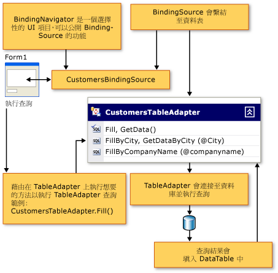

# 連接至 Windows Form 應用程式中的資料
[!INCLUDE[vsprvs](../code-quality/includes/vsprvs_md.md)] 提供您工具，讓您將應用程式連接至不同來源 \(例如資料庫、Web 服務及物件\) 的資料。  若您使用 [!INCLUDE[vsprvs](../code-quality/includes/vsprvs_md.md)] 中的資料設計工具，則通常不需要明確地為表單或元件建立連接物件。  連接物件的建立通常是完成其中一個資料精靈，或是將資料物件拖曳至表單中所產生的結果。  若要將應用程式連接至資料庫、Web 服務或物件中的資料，請從 [資料來源視窗](../Topic/Data%20Sources%20Window.md) 選取 \[加入新資料來源\]，以執行 [資料來源組態精靈](../data-tools/media/data-source-configuration-wizard.png)。  
  
 下圖示範透過執行 TableAdapter 查詢連接至資料，以擷取資料，並將資料顯示在 Windows 應用程式中的表單時的標準作業流程。  
  
   
  
 在某些情況中，不經由任何資料設計工具的協助而建立連接物件是很方便的。  如需以程式設計方式建立連接的資訊，請參閱 [連接資料來源](../Topic/Connecting%20to%20a%20Data%20Source%20in%20ADO.NET.md)。  
  
> [!NOTE]
>  如需將 Web 應用程式連接到資料的資訊，請參閱 [ASP.NET Data Access Content Map](http://msdn.microsoft.com/zh-tw/f9219396-a0fa-481f-894d-e3d9c67d64f2)。  
  
## 將 Windows Form 應用程式連接至資料的逐步解說  
 下列逐步解說提供連接至 Windows Form 應用程式中資料的相關程序：  
  
-   [逐步解說：連接至資料庫中的資料 \(Windows Form\)](../Topic/Walkthrough:%20Connecting%20to%20Data%20in%20a%20Database%20\(Windows%20Forms\).md)  
  
-   [逐步解說：連接至本機資料庫檔案中的資料 \(Windows Form\)](../Topic/Walkthrough:%20Connecting%20to%20Data%20in%20a%20Local%20Database%20File%20\(Windows%20Forms\).md)  
  
-   [逐步解說：連接至 Web 服務中的資料 \(Windows Form\)](../Topic/Walkthrough:%20Connecting%20to%20Data%20in%20a%20Web%20Service%20\(Windows%20Forms\).md)  
  
-   [逐步解說：連接至物件中的資料 \(Windows Form\)](../Topic/Walkthrough:%20Connecting%20to%20Data%20in%20Objects%20\(Windows%20Forms\).md)  
  
-   [逐步解說：連接至 Access 資料庫中的資料 \(Windows Form\)](../data-tools/connect-to-data-in-an-access-database-windows-forms.md)  
  
## 建立連接  
 在 [!INCLUDE[vsprvs](../code-quality/includes/vsprvs_md.md)] 中，是使用 \[加入\/修改連線\] 對話方塊設定連接。  當您在其中一個資料精靈，或是在[伺服器總管\/資料庫總管](../Topic/Server%20Explorer.md)中編輯或建立連接，或是當您在 \[屬性\] 視窗中編輯連接屬性時，會顯示 \[加入連線\] 對話方塊。  
  
 當您執行下列其中一個動作時，會自動設定資料連線。  
  
|動作|描述|  
|--------|--------|  
|執行 [資料來源組態精靈](../data-tools/media/data-source-configuration-wizard.png)。|在 \[資料來源組態精靈\] 中選擇資料庫路徑時，會設定連接。  如需詳細資訊，請參閱[如何：連接至資料庫中的資料](../data-tools/how-to-connect-to-data-in-a-database.md)。|  
|執行 [TableAdapter 組態精靈](../Topic/TableAdapter%20Configuration%20Wizard.md)。|會在 \[TableAdapter 組態精靈\] 中建立連接。  如需詳細資訊，請參閱[如何：建立 TableAdapter](../data-tools/create-and-configure-tableadapters.md)。|  
|執行 [TableAdapter 查詢組態精靈](../data-tools/editing-tableadapters.md)。|會在 \[TableAdapter 查詢組態精靈\] 中建立連接。  如需詳細資訊，請參閱[如何：建立 TableAdapter 查詢](../data-tools/how-to-create-tableadapter-queries.md)。|  
|從 [資料來源視窗](../Topic/Data%20Sources%20Window.md) 將項目拖曳至表單或 [Component Designer](../Topic/Component%20Designer.md)。|當您從 \[資料來源\] 視窗，將項目拖曳至 **Windows Form 設計工具**或**元件設計工具**時，會建立連接物件。  如需詳細資訊，請參閱[將控制項繫結至 Visual Studio 中的資料](../data-tools/bind-controls-to-data-in-visual-studio.md)。|  
|將新的資料連線加入至[伺服器總管\/資料庫總管](../Topic/Server%20Explorer.md)。|\[伺服器總管\/資料庫總管\] 中的資料連線會顯示在資料精靈的可用連線清單中。|  
  
## 連接字串  
 連接字串可以儲存在編譯過的應用程式中，或是儲存在應用程式組態檔中。  如需詳細資訊，請參閱[如何：儲存和編輯連接字串](../Topic/How%20to:%20Save%20and%20Edit%20Connection%20Strings.md)。  
  
## 連接資訊及安全性  
 由於開啟連接涉及取得重要資源，也就是資料庫的存取權，因此設定及使用連接通常會牽扯到安全性問題。  
  
 您要如何根據您的系統架構，保護應用程式以及其對資料來源的存取。  例如，在 Web 應用程式中，使用者一般會獲得對網際網路資訊服務 \(IIS\) 的匿名存取權，而因此沒有提供安全性認證。  在該情況中，應用程式會維護並使用其自己的登入資訊 \(而不是任何特定使用者的資訊\)，來開啟連接並存取資料庫。  
  
> [!IMPORTANT]
>  儲存密碼之類的連接字串詳細資料，會影響應用程式的安全性。  使用 Windows 整合式安全性是控制資料庫存取的更安全方式。  如需詳細資訊，請參閱[保護連接資訊](../Topic/Protecting%20Connection%20Information.md)。  
  
 您可以在內部網路或多介層應用程式中，利用 Windows、IIS 及 SQL Server 提供的整合式安全性選項。  在該模型中，也會運用使用者的區域網路驗證認證存取資料庫資源，且不會在連接字串中使用明確的使用者名稱或密碼。  一般而言，是透過群組將權限建立在資料庫伺服器電腦上，因此您不需要為每個可能存取資料庫的使用者建立個別權限。  在此模型中，您完全不需要為連接儲存登入資訊，也不需要為保護連接字串資訊採取任何其他步驟。  
  
 如需安全性的詳細資訊，請參閱下列主題：  
  
-   [保護 ADO.NET 應用程式](../Topic/Securing%20ADO.NET%20Applications.md)  
  
-   [Windows Form 中更安全的檔案和資料存取](../Topic/More%20Secure%20File%20and%20Data%20Access%20in%20Windows%20Forms.md)  
  
## 伺服器總管\/資料庫總管中的設計階段連接  
 **伺服器總管\/資料庫總管**提供您與資料來源建立設計階段連接的方式。  這可以讓您瀏覽可使用的資料來源，以及顯示資料來源所包含的資料表、資料行及其他項目的相關資訊，還可以編輯及建立資料庫項目。  
  
 您的應用程式不會直接使用**伺服器總管\/資料庫總管**中提供的連接。  這些連接是由 [!INCLUDE[vsprvs](../code-quality/includes/vsprvs_md.md)] 在設計階段使用您資料庫時使用。  如需詳細資訊，請參閱[Visual Database Tools](http://msdn.microsoft.com/zh-tw/6b145922-2f00-47db-befc-bf351b4809a1)。  
  
 例如，在設計階段您可能會使用**伺服器總管\/資料庫總管**建立與資料庫的連接。  之後當您在設計表單時，就可以瀏覽資料庫，以及從資料表選取資料行，並將其拖曳至 [DataSet 設計工具](../data-tools/creating-and-editing-typed-datasets.md)。  這麼做可以在資料集中建立 [TableAdapter](../data-tools/tableadapter-overview.md)。  而這也會建立新的連接物件，且此連接物件會包含在最新建立的 TableAdapter 中。  
  
 關於設計階段連接的資訊，會在特定專案或方案之外，分別儲存在您本機電腦中。  因此，當您在應用程式中建立設計階段連接後，只要伺服器的連接點可以使用，就會在您使用 [!INCLUDE[vsprvs](../code-quality/includes/vsprvs_md.md)] 時於**伺服器總管\/資料庫總管**中顯示這些資訊。  如需詳細資訊，請參閱[How to: Connect to a Database from Server Explorer](http://msdn.microsoft.com/zh-tw/7c1c3067-0d77-471b-872b-639f9f50db74)。  
  
 [!INCLUDE[SQLObjectExplorer](../data-tools/includes/sqlobjectexplorer_md.md)]  
  
## 請參閱  
 [連接至 Visual Studio 中的資料](../data-tools/connecting-to-data-in-visual-studio.md)   
 [如何：連接至資料庫中的資料](../data-tools/how-to-connect-to-data-in-a-database.md)   
 [逐步解說：連接至資料庫中的資料 \(Windows Form\)](../Topic/Walkthrough:%20Connecting%20to%20Data%20in%20a%20Database%20\(Windows%20Forms\).md)   
 [ASP.NET Data Access Content Map](http://msdn.microsoft.com/zh-tw/f9219396-a0fa-481f-894d-e3d9c67d64f2)   
 [準備您的應用程式以接收資料](../Topic/Preparing%20Your%20Application%20to%20Receive%20Data.md)   
 [將資料擷取至您的應用程式中](../data-tools/fetching-data-into-your-application.md)   
 [將控制項繫結至 Visual Studio 中的資料](../data-tools/bind-controls-to-data-in-visual-studio.md)   
 [在您的應用程式中編輯資料](../data-tools/editing-data-in-your-application.md)   
 [驗證資料](../Topic/Validating%20Data.md)   
 [儲存資料](../data-tools/saving-data.md)