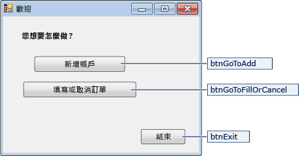
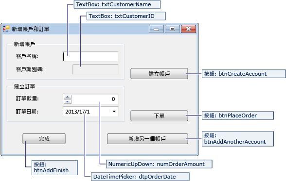
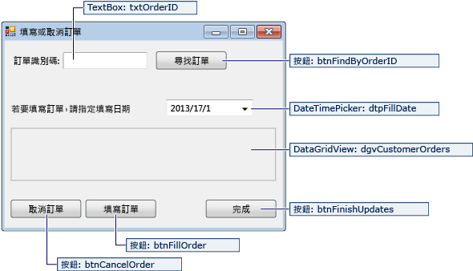

# 逐步解說：使用 ADO.NET 建立簡單資料應用程式
建立應用程式來管理資料庫中的資料時，您會執行基本工作，例如定義連接字串、插入資料及執行預存程序。  遵循本主題，您可以探索如何使用 Visual C\# 或 Visual Basic 和 ADO.NET，與簡單的 Windows Form 應用程式內的資料庫互動。  
  
> [!IMPORTANT]
>  為了簡化程式碼，它不會包含可實際執行的例外狀況處理。  
  
 **本主題內容**  
  
-   [設定範例資料庫](../data-tools/create-a-simple-data-application-by-using-adonet.md#BKMK_setupthesampledatabase)  
  
-   [建立表單並加入控制項](../data-tools/create-a-simple-data-application-by-using-adonet.md#BKMK_createtheformsandaddcontrols)  
  
-   [儲存連接字串](../data-tools/create-a-simple-data-application-by-using-adonet.md#BKMK_storetheconnectionstring)  
  
-   [擷取連接字串](../data-tools/create-a-simple-data-application-by-using-adonet.md#BKMK_retrievetheconnectionstring)  
  
-   [撰寫表單的程式碼](../data-tools/create-a-simple-data-application-by-using-adonet.md#BKMK_writethecodefortheforms)  
  
-   [測試您的應用程式](../data-tools/create-a-simple-data-application-by-using-adonet.md#BKMK_testyourapplication)  
  
## 必要條件  
 若要建立應用程式，您需要：  
  
-   Visual Studio 2012 Update 1 或 [!INCLUDE[vs_dev12](../data-tools/includes/vs_dev12_md.md)]  
  
-   SQL Server 2012 Express LocalDB  
  
-   遵循[逐步解說：建立小型範例資料庫](../data-tools/create-a-sql-database-by-using-a-script.md)中的步驟，建立的小型範例資料庫。  
  
-   您設定之後的資料庫連接字串。  您可以找到此值，方法是開啟 **SQL Server 物件總管**、開啟資料庫的快顯功能表、選擇 \[**屬性**\]，然後捲動至 \[**連接字串**\] 屬性。  
  
 本主題假設您熟悉 Visual Studio IDE 的基本功能，且可以建立 Windows Form 應用程式、將表單加入至該專案、將按鈕和其他控制項放置在這些表單上、設定這些控制項的屬性，以及編碼簡單事件。  如果您不熟悉這些工作，我們建議您先完成[Visual C\# 和 Visual Basic 使用者入門](../ide/getting-started-with-visual-csharp-and-visual-basic.md)，再開始本主題。  
  
##  <a name="BKMK_setupthesampledatabase"></a> 設定範例資料庫  
 本逐步解說的範例資料庫包含 Customer 和 Orders 資料表。  資料表一開始不包含任何資料，但是當您執行建立的應用程式時，您會加入資料。  此資料庫也會有五個簡單的預存程序。  [逐步解說：建立小型範例資料庫](../data-tools/create-a-sql-database-by-using-a-script.md)包含建立資料表的 TRANSACT\-SQL 指令碼、主要與外部索引鍵、條件約束和預存程序。  
  
##  <a name="BKMK_createtheformsandaddcontrols"></a> 建立表單並加入控制項  
  
1.  建立 Windows Form 應用程式的專案，然後將其命名為 `SimpleDataApp`。  
  
     Visual Studio 會建立專案和數個檔案，包括名為 Form1 的空白 Windows Form。  
  
2.  將兩個 Windows Form 加入至專案，使其具有三種形式，再提供下列名稱。  
  
    -   巡覽  
  
    -   NewCustomer  
  
    -   FillOrCancel  
  
3.  為每個表單加入下圖中顯示的文字方塊、按鈕和其他控制項。  對每個控制項設定資料表描述的屬性。  
  
    > [!NOTE]
    >  加入群組方塊和標籤控制項會更清楚，但是不在程式碼中使用。  
  
 **導覽表單**  
  
   
  
|瀏覽表單的控制項|屬性|  
|--------------|--------|  
|按鈕|Name \= btnGoToAdd|  
|按鈕|Name \= btnGoToFillOrCancel|  
|按鈕|Name \= btnExit|  
  
 **NewCustomer 表單**  
  
   
  
|NewCustomer 表單的控制項|屬性|  
|------------------------|--------|  
|TextBox|Name \= txtCustomerName|  
|TextBox|Name \= txtCustomerID<br /><br /> Readonly \= True|  
|按鈕|Name \= btnCreateAccount|  
|NumericUpdown|DecimalPlaces \= 0<br /><br /> Maximum \= 5000<br /><br /> Name \= numOrderAmount|  
|DateTimePicker|Format \= Short<br /><br /> Name \= dtpOrderDate|  
|按鈕|Name \= btnPlaceOrder|  
|按鈕|Name \= btnAddAnotherAccount|  
|按鈕|Name \= btnAddFinish|  
  
 **FillOrCancel 表單**  
  
   
  
|FillOrCancel 表單的控制項|屬性|  
|-------------------------|--------|  
|TextBox|Name \= txtOrderID|  
|按鈕|Name \= btnFindByOrderID|  
|DateTimePicker|Format \= Short<br /><br /> Name \= dtpFillDate|  
|DataGridView|Name \= dgvCustomerOrders<br /><br /> Readonly \= True<br /><br /> RowHeadersVisible \= False|  
|按鈕|Name \= btnCancelOrder|  
|按鈕|Name \= btnFillOrder|  
|按鈕|Name \= btnFinishUpdates|  
  
##  <a name="BKMK_storetheconnectionstring"></a> 儲存連接字串  
 當您的應用程式嘗試開啟資料庫的連接時，應用程式必須存取連接字串。  若要避免在每個表單上手動輸入字串，請將字串儲存在專案的應用程式組態檔中，並建立方法以在從應用程式中的任何表單呼叫時傳回字串。  
  
1.  開啟專案的快顯功能表，然後選擇 \[**屬性**\]。  
  
2.  在 \[**屬性**\] 視窗的左面板中，選擇 \[**設定**\] 索引標籤。  
  
3.  在 \[**名稱**\] 資料行中，輸入 `connString`。  
  
4.  在 \[**類型**\] 清單中，選擇 \[**\(連接字串\)**\]。  
  
5.  在 \[**範圍**\] 清單中，選擇 \[**應用程式**\]。  
  
6.  在 \[**值**\] 資料行中，輸入您的連接字串，然後儲存您的變更。  
  
##  <a name="BKMK_retrievetheconnectionstring"></a> 擷取連接字串  
  
1.  在功能表列上選擇 \[**專案**\]、\[**加入參考**\]，然後將參考加入至 System.Configuration.dll。  
  
2.  在功能表列上選擇 \[**專案**\]、\[**加入參考**\] 以將類別檔案加入至您的專案，然後將檔案命名為 \[`公用程式`\]。  
  
     Visual Studio 會建立新的檔案，並且在 \[**方案總管**\] 中顯示。  
  
3.  在 \[公用程式\] 檔案中，將預留位置程式碼取代為下列程式碼。  請注意編號的註解 \(以 Util\- 為前置詞\)，來識別程式碼區段。  下表顯示程式碼呼叫關鍵點。  
  
    ```c#  
    using System;  
    using System.Collections.Generic;  
    using System.Linq;  
    using System.Text;  
    using System.Threading.Tasks;  
    //Util-1 More namespaces.  
    using System.Configuration;   
  
    namespace SimpleDataApp  
    {  
        internal class Utility  
        {  
  
            //Get the connection string from App config file.  
            internal static string GetConnectionString()  
            {  
                //Util-2 Assume failure.  
                string returnValue = null;  
  
                //Util-3 Look for the name in the connectionStrings section.  
                ConnectionStringSettings settings =  
                ConfigurationManager.ConnectionStrings["SimpleDataApp.Properties.Settings.connString"];  
  
                //If found, return the connection string.  
                if (settings != null)  
                    returnValue = settings.ConnectionString;  
  
                return returnValue;  
            }  
        }  
    }  
    ```  
  
    ```vb  
    Imports System  
    Imports System.Collections.Generic  
    Imports System.Linq  
    Imports System.Text  
    Imports System.Threading.Tasks  
    ' Util-1 More namespaces.  
    Imports System.Configuration  
  
    Namespace SimpleDataApp  
        Friend Class Utility  
  
            ' Get connection string from App config file.  
            Friend Shared Function GetConnectionString() As String  
  
                ' Util-2 Assume failure.  
                Dim returnValue As String = Nothing  
  
                ' Util-3 Look for the name in the connectionStrings section.  
                Dim settings As ConnectionStringSettings = ConfigurationManager.ConnectionStrings("SimpleDataApp.My.MySettings.connString")  
  
                ' If found, return the connection string.  
                If settings IsNot Nothing Then  
                    returnValue = settings.ConnectionString  
                End If  
  
                Return returnValue  
            End Function  
        End Class  
    End Namespace  
    ```  
  
    |註解|描述|  
    |--------|--------|  
    |Util\-1|加入 System.Configuration 命名空間。|  
    |Util\-2|定義變數 `returnValue`，並將它初始化為 `null` \(C\#\) 或 `Nothing` \(Visual Basic\)。|  
    |Util\-3|即使您輸入 `connString` 做為 \[**屬性**\] 視窗中連接字串的名稱，您必須在程式碼中指定 `"SimpleDataApp.Properties.Settings.connString"` \(C\#\) 或 `"SimpleDataApp.My.MySettings.connString"` \(Visual Basic\)。|  
  
##  <a name="BKMK_writethecodefortheforms"></a> 撰寫表單的程式碼  
 本章節包含每個表單的工作，而且會顯示建立表單之程式碼的簡短概觀。  編號的註解會識別程式碼區段。  
  
### 導覽表單  
 當您執行應用程式時，瀏覽表單隨即開啟。  \[**加入帳戶**\] 按鈕會開啟 NewCustomer 表單。  \[**填寫或取消訂單**\] 按鈕會開啟 FillOrCancel 表單。  \[**結束**\] 按鈕會關閉應用程式。  
  
#### 讓瀏覽表單成為啟動表單  
 如果您使用 C\#，在 \[**方案總管**\] 中開啟 Program.cs，然後將 `Application.Run` 這一行變更如下：`Application.Run(new Navigation());`  
  
 如果您使用 Visual Basic，在 \[**方案總管**\] 中開啟 \[**屬性**\] 視窗，選擇 \[**應用程式**\] 索引標籤，然後在 \[**啟動表單**\] 清單上選擇 SimpleDataApp.Navigation。  
  
#### 建立事件處理常式  
 為表單上的三個按鈕建立空白 Click 事件處理常式。  請參閱[作法：Windows Form 設計工具建立預設事件處理常式](http://msdn.microsoft.com/zh-tw/757bcc16-1dc2-4d68-b115-ac0f53f05c8d)。  
  
#### 建立導覽的程式碼  
 在導覽表單中，將現有程式碼取代為下面程式碼。  
  
```c#  
using System;  
using System.Collections.Generic;  
using System.ComponentModel;  
using System.Data;  
using System.Drawing;  
using System.Linq;  
using System.Text;  
using System.Threading.Tasks;  
using System.Windows.Forms;  
  
namespace SimpleDataApp  
{  
    public partial class Navigation : Form  
    {  
        public Navigation()  
        {  
            InitializeComponent();  
        }  
  
        //Open the NewCustomer form as a dialog box, which will return focus to the calling form when it closes.  
        private void btnGoToAdd_Click(object sender, EventArgs e)  
        {  
            Form frm = new NewCustomer();  
            frm.Show();  
        }  
  
        //Open the FillorCancel form as a dialog box.  
        private void btnGoToFillOrCancel_Click(object sender, EventArgs e)  
        {  
            Form frm = new FillOrCancel();  
            frm.ShowDialog();  
        }  
  
        //Close the application, not just the Navigation form.  
        private void btnExit_Click(object sender, EventArgs e)  
        {  
            this.Close();  
        }  
    }  
}  
```  
  
```vb  
Imports System  
Imports System.Collections.Generic  
Imports System.ComponentModel  
Imports System.Data  
Imports System.Drawing  
Imports System.Linq  
Imports System.Text  
Imports System.Threading.Tasks  
Imports System.Windows.Forms  
  
Namespace SimpleDataApp  
    Partial Public Class Navigation  
        Inherits Form  
        Public Sub New()  
            InitializeComponent()  
        End Sub  
  
        ' Open the NewCustomer form as a dialog box, which will return focus to the calling form when it closes.  
        Private Sub btnGoToAdd_Click() Handles btnGoToAdd.Click  
            Dim frm As Form = New NewCustomer()  
            frm.Show()  
        End Sub  
  
        ' Open the FillorCancel form as a dialog box.  
        Private Sub btnGoToFillOrCancel_Click() Handles btnGoToFillOrCancel.Click  
            Dim frm As Form = New FillOrCancel()  
            frm.ShowDialog()  
        End Sub  
  
        ' Close the application, not just the Navigation form.  
        Private Sub btnExit_Click() Handles btnExit.Click  
            Me.Close()  
        End Sub  
    End Class  
End Namespace  
  
```  
  
### NewCustomer 表單  
 當您輸入客戶名稱，然後選擇 \[**建立帳戶**\] 按鈕時，NewCustomer 表單會建立客戶帳戶，SQL Server 會傳回 IDENTITY 值做為新的帳戶號碼。  然後排序新帳戶，方法是指定數量和訂單日期，然後選擇 \[**訂購**\] 按鈕。  
  
#### 建立事件處理常式  
 為表單上的每個按鈕建立空白 Click 事件處理常式。  
  
#### 建立 NewCustomer 的程式碼  
 將下列程式碼加入至 NewCustomer 表單。  使用程式碼之後的已編號的註解和資料表，以逐步執行每個程式碼區塊。  
  
```c#  
using System;  
using System.Collections.Generic;  
using System.ComponentModel;  
using System.Data;  
using System.Drawing;  
using System.Linq;  
using System.Text;  
using System.Threading.Tasks;  
using System.Windows.Forms;  
//NC-1 More namespaces.  
using System.Data.SqlClient;  
using System.Configuration;  
  
namespace SimpleDataApp  
{  
    public partial class NewCustomer : Form  
    {  
        //NC-2 Storage for IDENTITY values returned from database.  
        private int parsedCustomerID;  
        private int orderID;  
  
        //NC-3 Specify a connection string.  
        string connstr = SimpleDataApp.Utility.GetConnectionString();  
  
        public NewCustomer()  
        {  
            InitializeComponent();  
        }  
  
        //NC-4 Create account.  
        private void btnCreateAccount_Click(object sender, EventArgs e)  
        {  
            //NC-5 Set up and run stored procedure only if Customer Name is present.  
            if (isCustomerName())  
            {  
  
                //NC-6 Create the connection.  
                SqlConnection conn = new SqlConnection(connstr);  
  
                //NC-7 Create a SqlCommand, and identify it as a stored procedure.  
                SqlCommand cmdNewCustomer = new SqlCommand("Sales.uspNewCustomer", conn);  
                cmdNewCustomer.CommandType = CommandType.StoredProcedure;  
  
                //NC-8 Add input parameter from the stored procedure and specify what to use as its value.  
                cmdNewCustomer.Parameters.Add(new SqlParameter("@CustomerName", SqlDbType.NVarChar, 40));  
                cmdNewCustomer.Parameters["@CustomerName"].Value = txtCustomerName.Text;  
  
                //NC-9 Add output parameter.  
                cmdNewCustomer.Parameters.Add(new SqlParameter("@CustomerID", SqlDbType.Int));  
                cmdNewCustomer.Parameters["@CustomerID"].Direction = ParameterDirection.Output;  
  
                //NC-10 try-catch-finally  
                try  
                {  
                    //NC-11 Open the connection.  
                    conn.Open();  
  
                    //NC-12 Run the stored procedure.  
                    cmdNewCustomer.ExecuteNonQuery();  
  
                    //NC-13 Customer ID is an IDENTITY value from the database.   
                    this.parsedCustomerID = (int)cmdNewCustomer.Parameters["@CustomerID"].Value;  
                    this.txtCustomerID.Text = Convert.ToString(parsedCustomerID);  
  
                }  
                catch  
                {  
                    //NC-14 A simple catch.  
  
                    MessageBox.Show("Customer ID was not returned. Account could not be created.");  
                }  
                finally  
                {  
                    //NC-15 Close the connection.  
                    conn.Close();  
                }  
            }  
        }  
  
        //NC-16 Verify that Customer Name is present.  
        private bool isCustomerName()  
        {  
            if (txtCustomerName.Text == "")  
            {  
                MessageBox.Show("Please enter a name.");  
                return false;  
            }  
            else  
            {  
                return true;  
            }  
        }  
  
        //NC-17 Place order.  
        private void btnPlaceOrder_Click(object sender, EventArgs e)  
        {  
            //NC-18 Set up and run stored procedure only if required input is present.  
            if (isPlaceOrderReady())  
            {  
                // Create the connection.  
                SqlConnection conn = new SqlConnection(connstr);  
  
                //NC-19 Create SqlCommand and identify it as a stored procedure.  
                SqlCommand cmdNewOrder = new SqlCommand("Sales.uspPlaceNewOrder", conn);  
                cmdNewOrder.CommandType = CommandType.StoredProcedure;  
  
                //NC-20 @CustomerID, which was an output parameter from uspNewCustomer.  
                cmdNewOrder.Parameters.Add(new SqlParameter("@CustomerID", SqlDbType.Int));  
                cmdNewOrder.Parameters["@CustomerID"].Value = this.parsedCustomerID;  
  
                //NC-21 @OrderDate.  
                cmdNewOrder.Parameters.Add(new SqlParameter("@OrderDate", SqlDbType.DateTime, 8));  
                cmdNewOrder.Parameters["@OrderDate"].Value = dtpOrderDate.Value;  
  
                //NC-22 @Amount.  
                cmdNewOrder.Parameters.Add(new SqlParameter("@Amount", SqlDbType.Int));  
                cmdNewOrder.Parameters["@Amount"].Value = numOrderAmount.Value;  
  
                //NC-23 @Status. For a new order, the status is always O (open)  
                cmdNewOrder.Parameters.Add(new SqlParameter("@Status", SqlDbType.Char, 1));  
                cmdNewOrder.Parameters["@Status"].Value = "O";  
  
                //NC-24 Add return value for stored procedure, which is the orderID.  
                cmdNewOrder.Parameters.Add(new SqlParameter("@RC", SqlDbType.Int));  
                cmdNewOrder.Parameters["@RC"].Direction = ParameterDirection.ReturnValue;  
  
                //try – catch - finally  
                try  
                {  
                    //Open connection.  
                    conn.Open();  
  
                    //Run the stored procedure.  
                    cmdNewOrder.ExecuteNonQuery();  
  
                    //NC-25 Display the order number.  
                    this.orderID = (int)cmdNewOrder.Parameters["@RC"].Value;  
                    MessageBox.Show("Order number " + this.orderID + " has been submitted.");  
                }  
                catch  
                {  
                    //A simple catch.  
                    MessageBox.Show("Order could not be placed.");  
                }  
                finally  
                {  
                    //Close connection.  
                    conn.Close();  
                }  
            }  
        }  
  
        //NC-26 Verify that order data is ready.  
        private bool isPlaceOrderReady()  
        {  
            // Verify that CustomerID is present.  
            if (txtCustomerID.Text == "")  
            {  
                MessageBox.Show("Please create customer account before placing order.");  
                return false;  
            }  
  
            // Verify that Amount isn't 0.   
            else if ((numOrderAmount.Value < 1))  
            {  
                MessageBox.Show("Please specify an order amount.");  
                return false;  
            }  
            else  
            {  
                // Order can be submitted.  
                return true;  
            }  
        }  
  
        //NC-27 Reset the form for another new account  
        private void btnAddAnotherAccount_Click(object sender, EventArgs e)  
        {  
            this.ClearForm();  
        }  
  
        //NC-28 Clear values from controls  
        private void ClearForm()  
        {  
            txtCustomerName.Clear();  
            txtCustomerID.Clear();  
            dtpOrderDate.Value = DateTime.Now;  
            numOrderAmount.Value = 0;  
            this.parsedCustomerID = 0;  
        }  
  
        //NC-29 Close the form.  
        private void btnAddFinish_Click(object sender, EventArgs e)  
        {  
            this.Close();  
        }  
  
    }  
}  
  
```  
  
```vb  
Imports System  
Imports System.Collections.Generic  
Imports System.ComponentModel  
Imports System.Data  
Imports System.Drawing  
Imports System.Linq  
Imports System.Text  
Imports System.Threading.Tasks  
Imports System.Windows.Forms  
' NC-1 More namespaces.  
Imports System.Data.SqlClient  
Imports System.Configuration  
  
Namespace SimpleDataApp  
    Partial Public Class NewCustomer  
        Inherits Form  
  
        ' NC-2 Storage for IDENTITY values returned from database.  
        Private parsedCustomerID As Integer  
        Private orderID As Integer  
  
        ' NC-3 Specify a connection string.  
        Private connstr As String = SimpleDataApp.Utility.GetConnectionString()  
  
        Public Sub New()  
            InitializeComponent()  
        End Sub  
  
        ' NC-4 Create account.  
        Private Sub btnCreateAccount_Click() Handles btnCreateAccount.Click  
  
            ' NC-5 Set up and run stored procedure only if Customer Name is present.  
            If isCustomerName() Then  
  
                ' NC-6 Create the connection.  
                Dim conn As New SqlConnection(connstr)  
  
                ' NC-7 Create a SqlCommand, and identify it as a stored procedure.  
                Dim cmdNewCustomer As New SqlCommand("Sales.uspNewCustomer", conn)  
                cmdNewCustomer.CommandType = CommandType.StoredProcedure  
  
                ' NC-8 Add input parameter from the stored procedure and specify what to use as its value.  
                cmdNewCustomer.Parameters.Add(New SqlParameter("@CustomerName", SqlDbType.NVarChar, 40))  
                cmdNewCustomer.Parameters("@CustomerName").Value = txtCustomerName.Text  
  
                ' NC-9 Add output parameter.  
                cmdNewCustomer.Parameters.Add(New SqlParameter("@CustomerID", SqlDbType.Int))  
                cmdNewCustomer.Parameters("@CustomerID").Direction = ParameterDirection.Output  
  
                ' NC-10 try-catch-finally  
                Try  
                    ' NC-11 Open the connection.  
                    conn.Open()  
  
                    ' NC-12 Run the stored procedure.  
                    cmdNewCustomer.ExecuteNonQuery()  
  
                    ' NC-13 Customer ID is an IDENTITY value from the database.   
                    Me.parsedCustomerID = CInt(cmdNewCustomer.Parameters("@CustomerID").Value)  
                    Me.txtCustomerID.Text = Convert.ToString(parsedCustomerID)  
  
                Catch  
                    ' NC-14 A simple catch.  
                    MessageBox.Show("Customer ID was not returned. Account could not be created.")  
                Finally  
                    ' NC-15 Close the connection.  
                    conn.Close()  
                End Try  
            End If  
        End Sub  
  
        ' NC-16 Verify that Customer Name is present.  
        Private Function isCustomerName() As Boolean  
            If txtCustomerName.Text = "" Then  
                MessageBox.Show("Please enter a name.")  
                Return False  
            Else  
                Return True  
            End If  
        End Function  
  
        ' NC-17 Place order.  
        Private Sub btnPlaceOrder_Click() Handles btnPlaceOrder.Click  
  
            ' NC-18 Set up and run stored procedure only if necessary input is present.  
            If isPlaceOrderReady() Then  
  
                ' Create the connection.  
                Dim conn As New SqlConnection(connstr)  
  
                ' NC-19 Create SqlCommand and identify it as a stored procedure.  
                Dim cmdNewOrder As New SqlCommand("Sales.uspPlaceNewOrder", conn)  
                cmdNewOrder.CommandType = CommandType.StoredProcedure  
  
                ' NC-20 @CustomerID, which was an output parameter from uspNewCustomer.  
                cmdNewOrder.Parameters.Add(New SqlParameter("@CustomerID", SqlDbType.Int))  
                cmdNewOrder.Parameters("@CustomerID").Value = Me.parsedCustomerID  
  
                ' NC-21 @OrderDate.  
                cmdNewOrder.Parameters.Add(New SqlParameter("@OrderDate", SqlDbType.DateTime, 8))  
                cmdNewOrder.Parameters("@OrderDate").Value = dtpOrderDate.Value  
  
                ' NC-22 @Amount.  
                cmdNewOrder.Parameters.Add(New SqlParameter("@Amount", SqlDbType.Int))  
                cmdNewOrder.Parameters("@Amount").Value = numOrderAmount.Value  
  
                ' NC-23 @Status. For a new order, the status is always O (open).  
                cmdNewOrder.Parameters.Add(New SqlParameter("@Status", SqlDbType.[Char], 1))  
                cmdNewOrder.Parameters("@Status").Value = "O"  
  
                ' NC-24 add return value for stored procedure, which is the orderID  
                cmdNewOrder.Parameters.Add(New SqlParameter("@RC", SqlDbType.Int))  
                cmdNewOrder.Parameters("@RC").Direction = ParameterDirection.ReturnValue  
  
                ' try – catch - finally  
                Try  
                    ' Open connection.  
                    conn.Open()  
  
                    ' Run the stored procedure.  
                    cmdNewOrder.ExecuteNonQuery()  
  
                    ' NC-25 Display the order number.  
                    Me.orderID = CInt(cmdNewOrder.Parameters("@RC").Value)  
                    MessageBox.Show("Order number " & (Me.orderID).ToString & " has been submitted.")  
  
                Catch  
                    ' A simple catch.  
                    MessageBox.Show("Order could not not be placed.")  
  
                Finally  
                    ' Close connection.  
                    conn.Close()  
                End Try  
            End If  
        End Sub  
  
        ' NC-26 Verify that order data is ready.  
        Private Function isPlaceOrderReady() As Boolean  
  
            ' Verify that CustomerID is present.  
            If txtCustomerID.Text = "" Then  
                MessageBox.Show("Please create customer account before placing order.")  
                Return False  
  
                ' Verify that Amount isn't 0   
            ElseIf (numOrderAmount.Value < 1) Then  
  
                MessageBox.Show("Please specify an order amount.")  
                Return False  
            Else  
                ' Order can be submitted.  
                Return True  
            End If  
        End Function  
  
        ' NC-27 Reset the form for another new account.  
        Private Sub btnAddAnotherAccount_Click() Handles btnAddAnotherAccount.Click  
            Me.ClearForm()  
        End Sub  
  
        ' NC-28 Clear values from controls.  
        Private Sub ClearForm()  
            txtCustomerName.Clear()  
            txtCustomerID.Clear()  
            dtpOrderDate.Value = DateTime.Now  
            numOrderAmount.Value = 0  
            Me.parsedCustomerID = 0  
        End Sub  
  
        ' NC-29 Close the form.  
        Private Sub btnAddFinish_Click() Handles btnAddFinish.Click  
            Me.Close()  
        End Sub  
  
    End Class  
End Namespace  
```  
  
|註解|描述|  
|--------|--------|  
|NC\-1|將 System.Data.SqlClient 和 System.Configuration 加入至命名空間清單。|  
|NC\-2|宣告您稍後將會使用的 `parsedCustomerID` 和 `orderID` 變數。|  
|NC\-3|呼叫 `GetConnectionString` 方法從應用程式組態檔中取得連接字串，並且在 `connstr` 字串變數中儲存值。|  
|NC\-4|為 `btnCreateAccount` 按鈕將程式碼加入至 Click 事件處理常式。|  
|NC\-5|將呼叫包裝至 Click 事件處理常式周圍的 `isCustomerName`，讓 `uspNewCustomer` 只有在客戶名稱存在時執行。|  
|NC\-6|建立 `SqlConnection` 物件 \(`conn`\)，並且在 `connstr` 中傳入連接字串。|  
|NC\-7|建立 `SqlCommand` 物件 `cmdNewCustomer`。<br /><br /> -   指定 `Sales.uspNewCustomer` 為要執行的預存程序。<br />-   使用 `CommandType` 屬性，以指定命令是預存程序。|  
|NC\-8|從預存程序加入 `@CustomerName` 輸入參數。<br /><br /> -   將參數加入至 `Parameters` 集合。<br />-   使用 SqlDbType 列舉，將參數類型指定為 nvarchar \(40\)。<br />-   指定 `txtCustomerName.Text` 做為來源。|  
|NC\-9|從預存程序加入輸出參數。<br /><br /> -   將參數加入至 `Parameters` 集合。<br />-   使用 `ParameterDirection.Output` 將參數識別為輸出。|  
|NC\-10|加入 Try – Catch – Finally 區塊來開啟連接、執行預存程序、處理例外狀況，然後關閉連線。|  
|NC\-11|開啟您在 NC\-6 建立的連接 \(`conn`\)。|  
|NC\-12|使用 `cmdNewCustomer` 的 `ExecuteNonQuery` 方法來執行 `Sales.uspNewCustomer` 預存程序，這樣會執行 `INSERT` 陳述式，而不是查詢。|  
|NC\-13|會從資料庫傳回 `@CustomerID` 值做為 IDENTITY 值。  因為它是整數，您必須將它轉換成字串，才能在 \[客戶 ID\] 文字方塊中顯示。<br /><br /> -   您在 NC\-2 宣告 `parsedCustomerID`。<br />-   在 `parsedCustomerID` 中儲存 `@CustomerID` 值以供日後使用。<br />-   將傳回的客戶 ID 轉換成字串，並將它插入 `txtCustomerID.Text`。|  
|NC\-14|對於此範例，加入簡單且不是實際執行品質的 catch 子句。|  
|NC\-15|使用完畢之後一律關閉連接，讓它可以釋放至連接集區。  請參閱 [SQL Server 連接共用 \(ADO.NET\)](http://msdn.microsoft.com/library/8xx3tyca\(l=en-us,v=VS.110\).aspx)。|  
|NC\-16|定義方法以驗證客戶名稱會顯示出來。<br /><br /> -   如果文字方塊是空的，則顯示一則訊息並傳回 `false`，因為需要有名稱才能建立帳戶。<br />-   如果文字方塊不是空的，則傳回 `true`。|  
|NC\-17|為 `btnPlaceOrder` 按鈕將程式碼加入至 Click 事件處理常式。|  
|NC\-18|將呼叫包裝至 `btnPlaceOrder_Click` 事件程式碼周圍的 `isPlaceOrderReady`，讓 `uspPlaceNewOrder` 在必要的輸入未顯示時不執行。|  
|NC\-19 到 NC\-25|這些程式碼區段類似於您為 `btnCreateAccount_Click` 事件處理常式加入的程式碼。<br /><br /> -   NC\-19。  建立 `SqlCommand` 物件 `cmdNewOrder`，並且指定 `Sales.uspPlaceOrder` 為預存程序。<br />-   NC\-20 到 NC\-23 是預存程序的輸入參數。<br />-   NC\-24。  `@RC` 將包含傳回值，這是從資料庫產生的順序 ID。  此參數的說明指定為 `ReturnValue`。<br />-   NC\-25。  在您於 NC\-2 宣告的 `orderID` 變數中儲存順序 ID 值，並且在訊息方塊中顯示值。|  
|NC\-26|定義方法以驗證客戶 ID 存在，而且已在 `numOrderAmount` 中指定數量。|  
|NC\-27|在 `btnAddAnotherAccount` Click 事件處理常式中呼叫 `ClearForm` 方法。|  
|NC\-28|建立 `ClearForm` 方法，當您要加入其他客戶時，清除表單中的值。|  
|NC29|關閉 NewCustomer 表單，並將焦點返回到瀏覽表單。|  
  
### FillOrCancel 表單  
 當您輸入訂單 ID，然後選擇 \[**尋找訂單**\] 按鈕時，FillorCancel 表單會執行查詢來傳回訂單。  傳回的資料列會顯示在唯讀的資料格。  如果您選擇 \[**取消訂單**\] 按鈕，可以將訂單標示為已取消 \(X\)，或者如果您選擇 \[**填寫訂單**\] 按鈕，可以將訂單標示為已填寫 \(F\)。  如果您再次選擇 \[**尋找訂單**\] 按鈕，則會顯示更新的資料列。  
  
#### 建立事件處理常式  
 為表單上的四個按鈕建立空白 Click 事件處理常式。  
  
#### 建立 FillOrCancel 的程式碼  
 將下列程式碼加入至 FillOrCancel 表單。  使用程式碼之後已編號的註解和資料表，以逐步執行程式碼區塊。  
  
```c#  
using System;  
using System.Collections.Generic;  
using System.ComponentModel;  
using System.Data;  
using System.Drawing;  
using System.Linq;  
using System.Text;  
using System.Threading.Tasks;  
using System.Windows.Forms;  
//FC-1 More namespaces.  
using System.Text.RegularExpressions;  
using System.Data.SqlClient;  
using System.Configuration;  
  
namespace SimpleDataApp  
{  
    public partial class FillOrCancel : Form  
    {  
        //FC-2 Storage for OrderID.  
        private int parsedOrderID;  
  
        //FC-3 Specify a connection string.  
        string connstr = SimpleDataApp.Utility.GetConnectionString();  
  
        public FillOrCancel()  
        {  
            InitializeComponent();  
        }  
  
        //FC-4 Find an order.  
        private void btnFindByOrderID_Click(object sender, EventArgs e)  
        {  
            //FC-5 Prepare the connection and the command  
            if (isOrderID())  
            {  
                //Create the connection.  
                SqlConnection conn = new SqlConnection(connstr);  
  
                //Define a query string that has a parameter for orderID.  
                string sql = "select * from Sales.Orders where orderID = @orderID";  
  
                //Create a SqlCommand object.  
                SqlCommand cmdOrderID = new SqlCommand(sql, conn);  
  
                //Define the @orderID parameter and its value.  
                cmdOrderID.Parameters.Add(new SqlParameter("@orderID", SqlDbType.Int));  
                cmdOrderID.Parameters["@orderID"].Value = parsedOrderID;  
  
                //try – catch - finally  
                try  
                {  
                    //FC-6 Run the command and display the results.  
                    //Open the connection.  
                    conn.Open();  
  
                    //Run the command by using SqlDataReader.  
                    SqlDataReader rdr = cmdOrderID.ExecuteReader();  
  
                    //Create a data table to hold the retrieved data.  
                    DataTable dataTable = new DataTable();  
  
                    //Load the data from SqlDataReader into the data table.  
                    dataTable.Load(rdr);  
  
                    //Display the data from the datatable in the datagridview.  
                    this.dgvCustomerOrders.DataSource = dataTable;  
  
                    //Close the SqlDataReader.  
                    rdr.Close();  
                }  
                catch  
                {  
                    //A simple catch.  
                    MessageBox.Show("The requested order could not be loaded into the form.");  
                }  
                finally  
                {  
                    //Close the connection.  
                    conn.Close();  
                }  
            }  
        }  
  
        //FC-7 Cancel an order.  
        private void btnCancelOrder_Click(object sender, EventArgs e)  
        {  
            //Set up and run stored procedure only if OrderID is ready.  
            if (isOrderID())  
            {  
                //Create the connection.  
                SqlConnection conn = new SqlConnection(connstr);  
  
                // Create command and identify it as a stored procedure.  
                SqlCommand cmdCancelOrder = new SqlCommand("Sales.uspCancelOrder", conn);  
                cmdCancelOrder.CommandType = CommandType.StoredProcedure;  
  
                cmdCancelOrder.Parameters.Add(new SqlParameter("@orderID", SqlDbType.Int));  
                cmdCancelOrder.Parameters["@orderID"].Value = parsedOrderID;  
  
                // try-catch-finally  
                try  
                {  
                    // Open the connection.  
                    conn.Open();  
  
                    // Run the cmdCancelOrder command.  
                    cmdCancelOrder.ExecuteNonQuery();  
                }  
                // A simple catch.  
                catch  
                {  
                    MessageBox.Show("The cancel operation was not completed.");  
                }  
                finally  
                {  
                    //Close connection.  
                    conn.Close();  
                }  
            }  
        }  
  
        //FC-8 Fill an order.  
        private void btnFillOrder_Click(object sender, EventArgs e)  
        {  
            //Set up and run stored procedure only if OrderID is ready.  
            if (isOrderID())  
            {  
                //Create the connection.  
                SqlConnection conn = new SqlConnection(connstr);  
  
                //Create command and identify it as a stored procedure.  
                SqlCommand cmdFillOrder = new SqlCommand("Sales.uspFillOrder", conn);  
                cmdFillOrder.CommandType = CommandType.StoredProcedure;  
  
                // Add input parameter from the stored procedure.  
                cmdFillOrder.Parameters.Add(new SqlParameter("@orderID", SqlDbType.Int));  
                cmdFillOrder.Parameters["@orderID"].Value = parsedOrderID;  
  
                //Add the second input parameter.  
                cmdFillOrder.Parameters.Add(new SqlParameter("@FilledDate", SqlDbType.DateTime, 8));  
                cmdFillOrder.Parameters["@FilledDate"].Value = dtpFillDate.Value;  
  
                //try – catch - finally  
                try  
                {  
                    //Open the connection.  
                    conn.Open();  
  
                    //Run the cmdFillOrder command.  
                    cmdFillOrder.ExecuteNonQuery();  
                }  
                catch  
                {  
                    //A simple catch.  
                    MessageBox.Show("The fill operation was not completed.");  
                }  
                finally  
                {  
                    //Close the connection.  
                    conn.Close();  
                }  
            }  
        }  
  
        //FC-9 Verify that OrderID is ready.  
        private bool isOrderID()  
        {  
  
            //Check for input in the Order ID text box.  
            if (txtOrderID.Text == "")  
            {  
                MessageBox.Show("Please specify the Order ID.");  
                return false;  
            }  
  
            // Check for characters other than integers.  
            else if (Regex.IsMatch(txtOrderID.Text, @"^\D*$"))  
            {  
               //Show message and clear input.  
                MessageBox.Show("Please specify integers only.");  
                txtOrderID.Clear();  
                return false;  
            }  
            else  
            {  
                //Convert the text in the text box to an integer to send to the database.  
                parsedOrderID = Int32.Parse(txtOrderID.Text);  
                return true;  
            }  
        }  
  
        //Close the form.  
        private void btnFinishUpdates_Click(object sender, EventArgs e)  
        {  
            this.Close();  
        }  
    }  
}  
```  
  
```vb  
Imports System  
Imports System.Collections.Generic  
Imports System.ComponentModel  
Imports System.Data  
Imports System.Drawing  
Imports System.Linq  
Imports System.Text  
Imports System.Threading.Tasks  
Imports System.Windows.Forms  
' FC-1 More namespaces.  
Imports System.Text.RegularExpressions  
Imports System.Data.SqlClient  
Imports System.Configuration  
  
Namespace SimpleDataApp  
    Partial Public Class FillOrCancel  
        Inherits Form  
        ' FC-2 Storage for OrderID  
        Private parsedOrderID As Integer  
  
        ' FC-3 Specify a connection string  
        Private connstr As String = SimpleDataApp.Utility.GetConnectionString()  
  
        Public Sub New()  
            InitializeComponent()  
        End Sub  
  
        ' FC-4 Find an order.  
        Private Sub btnFindByOrderID_Click() Handles btnFindByOrderID.Click  
  
            ' FC-5 Prepare the connection and the command.  
  
            If isOrderID() Then  
                ' Create the connection.  
                Dim conn As New SqlConnection(connstr)  
  
                ' Define the query string that has a parameter for orderID.  
                Dim sql As String = "select * from Sales.Orders where orderID = @orderID"  
  
                ' Create a SqlCommand object.  
                Dim cmdOrderID As New SqlCommand(sql, conn)  
  
                ' Define the @orderID parameter and its value.  
                cmdOrderID.Parameters.Add(New SqlParameter("@orderID", SqlDbType.Int))  
                cmdOrderID.Parameters("@orderID").Value = parsedOrderID  
  
                ' try-catch-finally  
                Try  
                    ' FC-6 Run the command and display the results.  
                    ' Open connection.  
                    conn.Open()  
  
                    ' Run the command by using SqlDataReader.  
                    Dim rdr As SqlDataReader = cmdOrderID.ExecuteReader()  
  
                    ' Create a data table to hold the retrieved data.  
                    Dim dataTable As New DataTable()  
  
                    ' Load the data from the SqlDataReader into the data table.  
                    dataTable.Load(rdr)  
  
                    ' Display the data from the data table in the datagridview.  
                    Me.dgvCustomerOrders.DataSource = dataTable  
  
                    ' Close the SqlDataReader.  
                    rdr.Close()  
                Catch  
                    ' A simple catch.  
                    MessageBox.Show("The requested order could not be loaded into the form.")  
                Finally  
                    ' Close the connection.  
                    conn.Close()  
                End Try  
            End If  
        End Sub  
  
        ' FC-7 Cancel an order.  
        Private Sub btnCancelOrder_Click() Handles btnCancelOrder.Click  
  
            ' Set up and run stored procedure only if OrderID is ready.  
            If isOrderID() Then  
  
                ' Create the connection.  
                Dim conn As New SqlConnection(connstr)  
  
                ' Create the command and identify it as a stored procedure.  
                Dim cmdCancelOrder As New SqlCommand("Sales.uspCancelOrder", conn)  
                cmdCancelOrder.CommandType = CommandType.StoredProcedure  
  
                ' Add input parameter from the stored procedure.  
                cmdCancelOrder.Parameters.Add(New SqlParameter("@orderID", SqlDbType.Int))  
                cmdCancelOrder.Parameters("@orderID").Value = parsedOrderID  
  
                ' try-catch-finally  
                Try  
                    ' Open the connection.  
                    conn.Open()  
  
                    ' Run the cmdCancelOrder command.  
                    cmdCancelOrder.ExecuteNonQuery()  
                Catch  
                    ' A simple catch.  
                    MessageBox.Show("The cancel operation was not completed.")  
                Finally  
                    ' Close connection.  
                    conn.Close()  
                End Try  
            End If  
        End Sub  
  
        ' FC-8 Fill an order.  
        Private Sub btnFillOrder_Click() Handles btnFillOrder.Click  
  
            ' Set up and run stored procedure only if OrderID is ready.  
            If isOrderID() Then  
  
                ' Create the connection.  
                Dim conn As New SqlConnection(connstr)  
  
                ' Create command and identify it as a stored procedure.  
                Dim cmdFillOrder As New SqlCommand("Sales.uspFillOrder", conn)  
                cmdFillOrder.CommandType = CommandType.StoredProcedure  
  
                ' Add input parameter from the stored procedure.  
                cmdFillOrder.Parameters.Add(New SqlParameter("@orderID", SqlDbType.Int))  
                cmdFillOrder.Parameters("@orderID").Value = parsedOrderID  
  
                ' Add second input parameter.  
                cmdFillOrder.Parameters.Add(New SqlParameter("@FilledDate", SqlDbType.DateTime, 8))  
                cmdFillOrder.Parameters("@FilledDate").Value = dtpFillDate.Value  
  
                ' try-catch-finally  
                Try  
                    ' Open the connection.  
                    conn.Open()  
  
                    ' Run the cmdFillOrder command.   
                    cmdFillOrder.ExecuteNonQuery()  
                Catch  
                    ' A simple catch.  
                    MessageBox.Show("The fill operation was not completed.")  
                Finally  
                    ' Close the connection.  
                    conn.Close()  
                End Try  
            End If  
        End Sub  
  
        ' FC-9 Verify that OrderID is ready.  
        Private Function isOrderID() As Boolean  
  
            ' Check for input in the Order ID text box.  
            If txtOrderID.Text = "" Then  
                MessageBox.Show("Please specify the Order ID.")  
                Return False  
  
                ' Check for characters other than integers.  
            ElseIf Regex.IsMatch(txtOrderID.Text, "^\D*$") Then  
  
                ' Show message and clear input.  
                MessageBox.Show("Please specify integers only.")  
                txtOrderID.Clear()  
                Return False  
  
            Else  
                ' Convert the text in the text box to an integer to send to the database.  
                parsedOrderID = Int32.Parse(txtOrderID.Text)  
                Return True  
  
            End If  
        End Function  
  
        ' Close the form.  
        Private Sub btnFinishUpdates_Click() Handles btnFinishUpdates.Click  
            Me.Close()  
        End Sub  
    End Class  
End Namespace  
```  
  
|註解|描述|  
|--------|--------|  
|FC\-1|將 System.Data.SqlClient、System.Configuration 及 System.Text.RegularExpressions 加入至命名空間清單。|  
|FC\-2|宣告 `parsedOrderID` 變數。|  
|FC\-3|呼叫 `GetConnectionString` 方法從應用程式組態檔中取得連接字串，並且在 `connstr` 字串變數中儲存值。|  
|FC\-4|為 `btnFindOrderByID` 將程式碼加入至 Click 事件處理常式。|  
|FC\-5|看起來很熟悉嗎？  您嘗試執行 SQL 陳述式或預存程序之前，需要執行這些工作。<br /><br /> -   建立 SqlConnection 物件。<br />-   定義 SQL 陳述式或指定預存程序的名稱。  \(在這個範例中，您將會執行 `SELECT` 陳述式。\)<br />-   建立 `SqlCommand` 物件。<br />-   定義 SQL 陳述式或預存程序的任何參數。|  
|FC\-6|此程式碼使用 `SqlDataReader` 和 `DataTable` 以擷取及顯示查詢結果。<br /><br /> -   開啟連接。<br />-   建立 SqlDataReader，`rdr`，方法是執行 `cmdOrderID` 的 `ExecuteReader` 方法。<br />-   建立 `DataTable` 物件來保存擷取的資料。<br />-   從 `SqlDataReader` 將資料載入至 `DataTable` 物件。<br />-   在 datagridview 中顯示資料，方法是指定 `DataTable` 做為 datagridview 的 `DataSource`。<br />-   關閉 SqlDataReader。|  
|FC\-7|為 `btnCancelOrder` 將程式碼加入至 Click 事件處理常式。  此程式碼會執行 `Sales.uspCancelOrder` 預存程序。|  
|FC\-8|為 `btnFillOrder` 將程式碼加入至 Click 事件處理常式。  此程式碼會執行 `Sales.uspFillOrder` 預存程序。|  
|FC\-9|建立方法以確認 `OrderID` 已準備好做為參數提交至 `SqlCommand` 物件。<br /><br /> -   請確定已在 `txtOrderID` 中輸入 ID。<br />-   使用 `Regex.IsMatch` 來定義非整數字元的簡單檢查。<br />-   您在 FC\-2 宣告 `parsedOrderID` 變數。<br />-   如果輸入有效，請將文字轉換成整數，並在 `parsedOrderID` 變數中儲存值。<br />-   包裝 `btnFindByOrderID`、`btnCancelOrder` 及 `btnFillOrder` Click 事件處理常式周圍的 `isOrderID` 方法。|  
  
##  <a name="BKMK_testyourapplication"></a> 測試您的應用程式  
 在您編碼每一個 Click 事件處理常式，然後完成撰寫程式碼之後，選擇 F5 鍵來建置及測試您的應用程式。