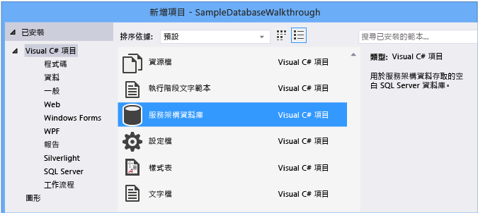
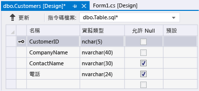
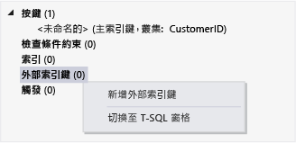

# 逐步解說：在 Visual Studio 中建立本機資料庫檔案
您可以使用 Visual Studio，在[區域資料概觀](../data-tools/local-data-overview.md)所述的 SQL Server Express LocalDB 中建立和更新本機資料庫檔案，來查看基本工作，例如加入資料表和定義資料行。  當您完成本逐步解說之後，您可以使用本機資料庫做為其他逐步解說的起點，探索更多進階的功能。  
  
 如需如何使用 SQL Server Management Studio 或 Transact\-SQL 建立資料庫的詳細資訊，請參閱[Create a Database](http://msdn.microsoft.com/zh-tw/4c4beea2-6cbc-4352-9db6-49ea8130bb64)。  
  
 在這個逐步解說中，您將探索下列工作：  
  
-   [建立專案和本機資料庫檔案](../data-tools/create-a-sql-database-by-using-a-designer.md#BKMK_CreateNewSQLDB)。  
  
-   [建立資料表、資料行、主索引鍵和外部索引鍵](../data-tools/create-a-sql-database-by-using-a-designer.md#BKMK_CreateNewTbls)。  
  
-   [將資料填入資料表](../data-tools/create-a-sql-database-by-using-a-designer.md#BKMK_Populating)。  
  
## 必要條件  
 若要完成本逐步解說，請安裝 [!INCLUDE[vs_dev12_expwin](../data-tools/includes/vs_dev12_expwin_md.md)]、Visual Studio Professional 2013、Visual Studio Premium 2013 或 Visual Studio Ultimate 2013。  這些 Visual Studio 版本都包括 SQL Server Data Tools。  
  
##  <a name="BKMK_CreateNewSQLDB"></a> 建立專案和本機資料庫檔案  
  
#### 若要建立專案和資料庫檔案  
  
1.  建立名為 `SampleDatabaseWalkthrough`的 Windows Form 專案。  
  
     請參閱 [建立方案與專案](../ide/creating-solutions-and-projects.md)。  
  
2.  在功能表列中，選擇 \[**專案**\]、\[**加入新項目**\]。  
  
     \[**加入新項目**\] 對話方塊隨即出現，讓您可以加入適用於 Windows Form 專案的項目。  
  
3.  在項目範本清單中，向下捲動直到出現 \[**服務架構資料庫**\]，然後選擇它。  
  
       
  
4.  將資料庫命名為 SampleDatabase，然後選擇 \[**加入**\] 按鈕。  
  
5.  如果 \[資料來源\] 視窗未開啟，請選擇 Shift\-Alt\-D 鍵將它開啟，或是在功能表列上選擇 \[**檢視**\]、\[**其他視窗**\]、\[**資料來源**\] 將它開啟。  
  
6.  在 \[資料來源\] 視窗中，選擇 \[**加入新資料來源**\] 連結。  
  
7.  在 \[**資料來源組態精靈**\] 中，選擇 \[**下一步**\] 按鈕四次接受預設設定，然後選擇 \[**完成**\] 按鈕。  
  
 藉由開啟資料庫的屬性視窗，就可以檢視其連接字串和主要 .mdf 檔案的位置。  
  
-   在 Visual Studio Express 中，如果視窗尚未開啟，請選擇 \[**檢視**\]、\[**其他視窗**\]、\[**資料庫總管**\]。  展開 \[**資料連接**\] 節點、開啟 SampleDatabase.mdf 的捷徑功能表，然後選擇 \[**屬性**\]，即可開啟屬性視窗。  
  
-   在其他 Visual Studio 版本中，如果視窗尚未開啟，請選擇 \[**檢視**\]、\[**伺服器總管**\]。  展開 \[**資料連接**\] 節點、開啟 SampleDatabase.mdf 的捷徑功能表，然後選擇 \[**屬性**\]，即可開啟屬性視窗。  
  
##  <a name="BKMK_CreateNewTbls"></a> 建立資料表、資料行、主索引鍵和外部索引鍵  
 在本節中，您將建立幾個資料表、每個資料表中的主索引鍵以及一些範例資料列。  在下一個逐步解說中，您將會了解該資訊可能會以哪種方式出現在應用程式中的概念。  您也會建立外部索引鍵，以指定資料表中的記錄如何與另一個資料表中的記錄對應。  
  
#### 若要建立 Customers 資料表  
  
1.  在 \[**伺服器總管**\] 或 \[**資料庫總管**\] 中，展開 \[**資料連接**\] 節點，然後展開 \[**SampleDatabase.mdf**\] 節點。  
  
     如果您的 Visual Studio 版本的總管尚未開啟，請在功能表列上選擇 \[**檢視**\]、\[**伺服器總管**\] 或 \[**檢視**\]、\[**其他視窗**\]、\[**資料庫總管**\]。  
  
2.  開啟 \[**資料表**\] 的捷徑功能表，然後選擇 \[**加入新的資料表**\]。  
  
     \[**資料表設計工具**\] 隨即開啟並顯示含有一個預設列的格線，這表示您要建立的資料表中的單一資料行。  藉由在格線中加入資料列，您就是在資料表中加入資料行。  
  
3.  在格線中，為下列每一個項目加入一個資料列：  
  
    |資料行名稱|資料類型|允許 Null|  
    |-----------|----------|-------------|  
    |`CustomerID`|`nchar(5)`|False \(已清除\)|  
    |`CompanyName`|`nvarchar(40)`|False \(已清除\)|  
    |`ContactName`|`nvarchar (30)`|True \(已選取\)|  
    |`Phone`|`nvarchar (24)`|True \(已選取\)|  
  
4.  開啟 `CustomerID` 資料列的捷徑功能表，然後選擇 \[**設定主索引鍵**\]。  
  
5.  開啟預設資料列的捷徑功能表，然後選擇 \[**刪除**\]。  
  
6.  透過更新指令碼窗格中的第一行來命名 Customers 資料表，以符合下面範例：  
  
    ```  
    CREATE TABLE [dbo].[Customers]  
    ```  
  
7.  在 \[資料表設計工具\] 的左上角，選擇 \[**更新**\] 按鈕，如下圖所示。  
  
       
  
8.  在 \[**預覽資料庫更新**\] 對話方塊中，選擇 \[**更新資料庫**\] 按鈕。  
  
     您所做的變更會儲存到本機資料庫檔案中。  
  
#### 若要建立 Orders 資料表  
  
1.  加入另一個資料表，然後為下表中的每個項目加入一個資料列：  
  
    |資料行名稱|資料類型|允許 Null|  
    |-----------|----------|-------------|  
    |`OrderID`|`int`|False \(已清除\)|  
    |`CustomerID`|`nchar(5)`|False \(已清除\)|  
    |`OrderDate`|`datetime`|True \(已選取\)|  
    |`OrderQuantity`|`int`|True \(已選取\)|  
  
2.  將 \[**OrderID**\] 設為主索引鍵，然後刪除預設的資料列。  
  
3.  透過更新指令碼窗格中的第一行來命名 Orders 資料表，以符合下面範例：  
  
    ```  
    CREATE TABLE [dbo].[Orders]  
    ```  
  
4.  在 \[資料表設計工具\] 的左上角，選擇 \[**更新**\] 按鈕。  
  
5.  在 \[**預覽資料庫更新**\] 對話方塊中，選擇 \[**更新資料庫**\] 按鈕。  
  
     您所做的變更會儲存到本機資料庫檔案中。  
  
#### 若要建立外部索引鍵  
  
1.  在格線右側的內容窗格中，開啟 \[**外部索引鍵**\] 的捷徑功能表，然後選擇 \[**加入新的外部索引鍵**\]，如下圖所示。  
  
       
  
2.  在出現的文字方塊中，以 `Customers` 取代 \[**ToTable**\]。  
  
3.  在指令碼窗格中，更新最後一行以符合下面範例：  
  
    ```  
    CONSTRAINT [FK_Orders_Customers] FOREIGN KEY ([CustomerID]) REFERENCES [Customers]([CustomerID])  
    ```  
  
4.  在 \[資料表設計工具\] 的左上角，選擇 \[**更新**\] 按鈕。  
  
5.  在 \[**預覽資料庫更新**\] 對話方塊中，選擇 \[**更新資料庫**\] 按鈕。  
  
     您所做的變更會儲存到本機資料庫檔案中。  
  
##  <a name="BKMK_Populating"></a> 將資料填入資料表  
  
#### 若要將資料填入資料表  
  
1.  在 \[**伺服器總管**\] 或 \[**資料庫總管**\] 中，展開範例資料庫的節點。  
  
2.  開啟資料表節點的捷徑功能表，選擇 \[**重新整理**\]，然後展開資料表節點。  
  
3.  開啟 Customers 資料表的捷徑功能表，然後選擇 \[**顯示資料表資料**\]。  
  
4.  針對至少三個客戶，加入任何想要的資料。  
  
     您可以指定要做為客戶 ID 的五個任意字元，不過，請至少選擇一個可記住且之後可在此程序中使用的字元。  
  
5.  開啟 Orders 資料表的捷徑功能表，然後選擇 \[**顯示資料表資料**\]。  
  
6.  加入至少三筆訂單的資料。  
  
    > [!IMPORTANT]
    >  確定所有訂單 ID 和訂單數量都是整數，而且每個客戶 ID 都符合您在 Customers 資料表的 CustomerID 資料行中指定的值。  
  
7.  在功能表列上，選擇 \[**檔案**\]、\[**全部儲存**\]。  
  
8.  在功能表列上，選擇 \[**檔案**\]、\[**關閉方案**\]。  
  
    > [!NOTE]
    >  最佳做法是，複製資料庫檔案，然後將複本貼到其他位置或為複本指定不同的名稱，以此方式備份剛建立的資料庫檔案。  
  
## 後續步驟  
 現在您已經有包含一些範例資料的本機資料庫檔案，除了示範資料庫工作的其他逐步解說之外，您還可以完成[逐步解說：連接至本機資料庫檔案中的資料 \(Windows Form\)](../Topic/Walkthrough:%20Connecting%20to%20Data%20in%20a%20Local%20Database%20File%20\(Windows%20Forms\).md)。  
  
## 請參閱  
 [如何：管理專案中的本機資料檔](../data-tools/how-to-manage-local-data-files-in-your-project.md)   
 [區域資料概觀](../data-tools/local-data-overview.md)   
 [將 Windows Form 控制項繫結至 Visual Studio 中的資料](../data-tools/bind-windows-forms-controls-to-data-in-visual-studio.md)   
 [Visual Studio 資料應用程式的概觀](../data-tools/overview-of-data-applications-in-visual-studio.md)   
 [連接至 Visual Studio 中的資料](../data-tools/connecting-to-data-in-visual-studio.md)   
 [準備您的應用程式以接收資料](../Topic/Preparing%20Your%20Application%20to%20Receive%20Data.md)   
 [將資料擷取至您的應用程式中](../data-tools/fetching-data-into-your-application.md)   
 [將控制項繫結至 Visual Studio 中的資料](../data-tools/bind-controls-to-data-in-visual-studio.md)   
 [在您的應用程式中編輯資料](../data-tools/editing-data-in-your-application.md)   
 [驗證資料](../Topic/Validating%20Data.md)   
 [儲存資料](../data-tools/saving-data.md)