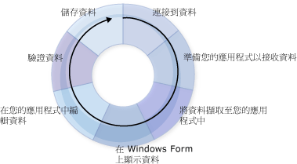

# 建立資料應用程式
Visual Studio 提供許多設計階段工具，可協助您建立存取資料的應用程式。  本簡介提供有關建立搭配資料使用之應用程式的基本程序概觀。  這裡的資訊刻意略過許多細節，並設計做為與建立資料應用程式相關的許多其他 \[說明\] 頁的一般資訊來源和起點。  
  
 當您在 [!INCLUDE[vsprvs](../code-quality/includes/vsprvs_md.md)] 中開發存取資料的應用程式時，會有不同需求。  在一些情況下，您可能只要將資料顯示在表單上。  而在另一些情況下，您可能需要設計一個方法，與其他應用程式或處理序共用資訊。  
  
 不論您如何處理資料，都應該了解特定基礎概念。  您可能永遠都不需要知道資料處理的某些細節 \(例如，以程式設計方式建立資料庫\)，但是了解基本資料概念以及 [!INCLUDE[vsprvs](../code-quality/includes/vsprvs_md.md)] 的資料工具 \(精靈和設計工具\)，非常有用。  
  
 一般資料應用程式會使用下圖中說明的大部分程序：  
  
   
資料循環  
  
 當您建立應用程式時，思考要完成的工作。  請利用下列幾節的資訊，協助您尋找合適的 [!INCLUDE[vsprvs](../code-quality/includes/vsprvs_md.md)] 工具和物件。  
  
> [!NOTE]
>  [!INCLUDE[vsprvs](../code-quality/includes/vsprvs_md.md)] 可提供精靈以簡化上圖所顯示的數個流程。  例如，執行 \[**資料來源組態精靈**\] 將提供充分資訊給應用程式、連接至資料、建立接收資料的具類型資料集，以及將資料送回應用程式中。  
  
 若要快速了解 [!INCLUDE[vsprvs](../code-quality/includes/vsprvs_md.md)] 如何協助您開發資料應用程式，請參閱[逐步解說：建立簡單資料應用程式](../Topic/Walkthrough:%20Creating%20a%20Simple%20Data%20Application.md)。  
  
## 連接到資料  
 若要將資料送回應用程式中 \(並將變更傳送回資料來源\)，必須建立特定雙向通訊類型。  這個雙向通訊一般是由資料模型中的物件所處理。  
  
 例如，`TableAdapter` 會將使用資料集的應用程式連接至資料庫，而 <xref:System.Data.Objects.ObjectContext> 則會將 Entity Framework 中的實體連接至資料庫。  [!INCLUDE[vsprvs](../code-quality/includes/vsprvs_md.md)] 提供幾種工具，可協助建立您的應用程式可以使用的連線。  如需將應用程式連接到資料的相關資訊，請參閱[連接至 Visual Studio 中的資料](../data-tools/connecting-to-data-in-visual-studio.md)。  
  
 若要了解如何使用資料集將應用程式連接至資料庫中的資料，請參閱[逐步解說：連接至資料庫中的資料 \(Windows Form\)](../Topic/Walkthrough:%20Connecting%20to%20Data%20in%20a%20Database%20\(Windows%20Forms\).md)。  
  
## 準備您的應用程式以接收資料  
 如果您的應用程式使用中斷連接的資料模型，則當您使用此資料模型時，必須暫時將資料儲存在應用程式中。  Visual Studio 提供的工具可幫助您建立物件，讓應用程式用於暫存資料：資料集、實體和 [!INCLUDE[vbtecdlinq](../data-tools/includes/vbtecdlinq_md.md)] 物件。  
  
> [!NOTE]
>  使用中斷連接之資料模型的應用程式，通常會連接至資料庫、執行查詢將資料送回應用程式中、中斷與資料庫的連接，然後以離線方式管理資料，再重新連接和更新資料庫。  
  
 如需在應用程式中建立具類型資料集的詳細資訊，請參閱[準備您的應用程式以接收資料](../Topic/Preparing%20Your%20Application%20to%20Receive%20Data.md)。  如需在 N\-Tier 應用程式中使用資料集的詳細資訊，請參閱 [如何：將資料集和 TableAdapters 分成不同的專案](../data-tools/separate-datasets-and-tableadapters-into-different-projects.md)。  
  
 若要了解如何建立資料集，請完成[逐步解說：以 DataSet 設計工具建立資料集](../data-tools/walkthrough-creating-a-dataset-with-the-dataset-designer.md)中的程序。  
  
 若要了解如何建立 [!INCLUDE[vbtecdlinq](../data-tools/includes/vbtecdlinq_md.md)] 物件，請完成[逐步解說：建立 LINQ to SQL 類別 \(O\/R 設計工具\)](../Topic/Walkthrough:%20Creating%20LINQ%20to%20SQL%20Classes%20\(O-R%20Designer\).md) 中的程序。  
  
## 將資料擷取至您的應用程式中  
 不論應用程式是否使用中斷連接資料模型，都必須能夠擷取資料放入應用程式中。  透過對資料庫執行查詢或預存程序，將資料送回應用程式中。  將資料儲存在資料集中的應用程式會使用 `TableAdapter` 執行查詢和預存程序，而將資料儲存在實體中的應用程式則使用 [LINQ to Entities](../Topic/LINQ%20to%20Entities.md) 或直接將實體連接至預存程序來執行查詢。  如需使用 TableAdapter 建立和編輯查詢的詳細資訊，請參閱 [如何：建立 TableAdapter 查詢](../data-tools/how-to-create-tableadapter-queries.md)和 [如何：編輯 TableAdapter 查詢](../data-tools/how-to-edit-tableadapter-queries.md)。  
  
 如需將資料載入資料集，以及執行查詢和預存程序的詳細資訊，請參閱[將資料擷取至您的應用程式中](../data-tools/fetching-data-into-your-application.md)。  
  
 若要了解如何將資料載入資料集，請完成[逐步解說：顯示 Windows Form 上的資料](../data-tools/walkthrough-displaying-data-on-a-windows-form.md)中的程序，並檢查表單載入事件處理常式中的程式碼。  
  
 若要了解如何將資料載入 [!INCLUDE[vbtecdlinq](../data-tools/includes/vbtecdlinq_md.md)] 物件，請完成[逐步解說：建立 LINQ to SQL 類別 \(O\/R 設計工具\)](../Topic/Walkthrough:%20Creating%20LINQ%20to%20SQL%20Classes%20\(O-R%20Designer\).md) 中的程序。  
  
 若要了解如何建立和執行 SQL 查詢，請參閱 [如何：建立及執行傳回資料列的 SQL 陳述式](../Topic/How%20to:%20Create%20and%20Execute%20an%20SQL%20Statement%20that%20Returns%20Rows.md)。  
  
 若要了解預存程序的執行方式，請參閱 [如何：執行傳回資料列的預存程序](../Topic/How%20to:%20Execute%20a%20Stored%20Procedure%20that%20Returns%20Rows.md)。  
  
## 在表單中顯示資料  
 將資料送至應用程式後，通常會在表單上顯示資料，供使用者檢視或修改。  [!INCLUDE[vsprvs](../code-quality/includes/vsprvs_md.md)] 提供[資料來源視窗](../Topic/Data%20Sources%20Window.md)，您可以在此將項目拖曳至表單，自動建立顯示資料的資料繫結控制項。  如需資料繫結和顯示資料給使用者的詳細資訊，請參閱[將控制項繫結至 Visual Studio 中的資料](../data-tools/bind-controls-to-data-in-visual-studio.md)。  
  
 若要了解如何將資料呈現給使用者，請完成下列逐步解說中的程序 \(特別注意從 \[**資料來源**\] 視窗拖曳項目的程序\)：  
  
-   [逐步解說：顯示 Windows Form 上的資料](../data-tools/walkthrough-displaying-data-on-a-windows-form.md).  
  
-   [逐步解說：將 WPF 控制項繫結至 WCF 資料服務](../data-tools/bind-wpf-controls-to-a-wcf-data-service.md)  
  
-   [逐步解說：將 Silverlight 控制項繫結至 WCF 資料服務](../Topic/Walkthrough:%20Binding%20Silverlight%20Controls%20to%20a%20WCF%20Data%20Service.md)  
  
## 在您的應用程式中編輯資料  
 資料呈現給使用者之後，使用者可能會進行加入新資料錄、編輯和刪除資料錄等修改資料的動作，然後再將資料傳送回資料庫。  
  
 如需資料載入資料集後資料處理的詳細資訊，請參閱[在您的應用程式中編輯資料](../data-tools/editing-data-in-your-application.md)。  
  
## 驗證資料  
 變更資料時，通常先要驗證變更，才能允許值送回資料集或寫入資料庫。  「*驗證*」\(Validation\) 是根據應用程式需求，驗證新值是否可接受的程序名稱。  您可以加入邏輯，在應用程式中的值有所變更時查看。  Visual Studio 提供工具可協助加入程式碼，在資料行及資料列變更時驗證資料。  如需詳細資訊，請參閱[驗證資料](../Topic/Validating%20Data.md)。  
  
 若要了解如何將資料驗證加入至應用程式，請參閱[逐步解說：加入驗證至資料集](../Topic/Walkthrough:%20Adding%20Validation%20to%20a%20Dataset.md)。  
  
 若要了解如何將驗證加入分割為 N\-Tier 應用程式的資料集中，請參閱 [如何：將驗證加入 N\-Tier 資料集](../data-tools/add-validation-to-an-n-tier-dataset.md)。  
  
## 儲存資料  
 在應用程式變更 \(並且驗證這些變更\) 之後，通常要將變更送回資料庫。  將資料儲存在資料集中的應用程式，通常會使用 TableAdapterManager 來儲存資料。  如需詳細資訊，請參閱 [TableAdapterManager 概觀](../Topic/TableAdapterManager%20Overview.md)。  Entity Framework 應用程式會使用 <xref:System.Data.Objects.ObjectContext.SaveChanges%2A> 方法來儲存資料。  
  
 如需將更新資料傳送回資料庫的詳細資訊，請參閱[儲存資料](../data-tools/saving-data.md)。  
  
 若要了解如何將資料集中的更新資料傳送到資料庫，請完成[逐步解說：儲存關聯資料表的資料 \(階層式更新\)](../Topic/Walkthrough:%20Saving%20Data%20from%20Related%20Data%20Tables%20\(Hierarchical%20Update\).md) 中的程序。  
  
## 相關主題  
 [Visual Studio 資料應用程式的概觀](../data-tools/overview-of-data-applications-in-visual-studio.md)  
 提供主題的連結，說明如何建立使用資料的應用程式。  
  
 [連接至 Visual Studio 中的資料](../data-tools/connecting-to-data-in-visual-studio.md)  
 提供主題的連結，說明如何使用 [!INCLUDE[vsprvs](../code-quality/includes/vsprvs_md.md)] 將應用程式連接至資料以及建立應用程式的資料來源。  
  
 [準備您的應用程式以接收資料](../Topic/Preparing%20Your%20Application%20to%20Receive%20Data.md)  
 包括各項主題連結，說明如何在應用程式中使用資料模型，包括資料集和實體資料模型。  
  
 [將資料擷取至您的應用程式中](../data-tools/fetching-data-into-your-application.md)  
 提供說明如何將資料載入應用程式的主題連結。  
  
 [將控制項繫結至 Visual Studio 中的資料](../data-tools/bind-controls-to-data-in-visual-studio.md)  
 提供主題的連結，說明如何將 Windows Form 控制項、WPF 控制項和 Silverlight 控制項繫結至資料來源。  
  
 [在您的應用程式中編輯資料](../data-tools/editing-data-in-your-application.md)  
 提供說明如何在應用程式中變更資料的主題連結。  
  
 [驗證資料](../Topic/Validating%20Data.md)  
 提供說明如何將驗證加入至資料變更的主題連結。  
  
 [儲存資料](../data-tools/saving-data.md)  
 提供主題的連結，說明如何將更新的資料從應用程式傳送至資料庫，或如何以其他格式 \(例如 XML\) 儲存資料。  
  
 [用來在 Visual Studio 中使用資料來源的工具](../Topic/Tools%20for%20Working%20with%20Data%20Sources%20in%20Visual%20Studio.md)  
 提供工具的相關主題連結，這些工具可用於 Visual Studio 中使用資料來源，例如 \[**資料來源**\] 視窗和 ADO.NET 實體資料模型設計工具。