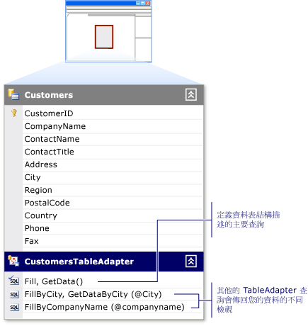

# 如何：編輯 TableAdapter 查詢
您可以使用 \[**DataSet 設計工具**\] 中的 [TableAdapter 查詢組態精靈](../data-tools/editing-tableadapters.md)，編輯 TableAdapter 查詢。  當現有的 TableAdapter 查詢不再符合應用程式需求時，您應該修改此 TableAdapter 查詢  \(或者也可以建立 TableAdapter 的其他查詢。  如需加入新查詢的詳細資訊，請參閱 [如何：建立 TableAdapter 查詢](../data-tools/how-to-create-tableadapter-queries.md)\)。  
  
> [!NOTE]
>  如果 [TableAdapter 組態精靈](../Topic/TableAdapter%20Configuration%20Wizard.md)開啟而非 \[**TableAdapter 查詢組態精靈**\]，表示您選取的可能是 TableAdapter 的 `Fill` 主查詢，而不是 TableAdapter 的任一其他查詢。  如需編輯 TableAdapter 的 `Fill` 主查詢的詳細資訊，請參閱 [如何：編輯 TableAdapter](../Topic/How%20to:%20Edit%20TableAdapters.md)。  
  
   
  
### 若要編輯 TableAdapter 查詢  
  
1.  在 \[**DataSet 設計工具**\] 中開啟資料集。  如需詳細資訊，請參閱 [如何：在 DataSet 設計工具中開啟資料集](../Topic/How%20to:%20Open%20a%20Dataset%20in%20the%20Dataset%20Designer.md)。  
  
2.  選取您要編輯的 TableAdapter 查詢。  
  
3.  在 TableAdapter 查詢上按一下滑鼠右鍵，選取 \[**設定**\]。  
  
     \[**TableAdapter 查詢組態精靈**\] 隨即開啟，準備好讓您修改查詢或該查詢的預存程序。  
  
4.  使用您所要的變更來完成 \[**TableAdapter 查詢組態精靈**\] 各項程序。  如需詳細資訊，請參閱 [TableAdapter 查詢組態精靈](../data-tools/editing-tableadapters.md)。  
  
## 請參閱  
 [TableAdapter](../Topic/TableAdapters.md)   
 [連接至 Visual Studio 中的資料](../data-tools/connecting-to-data-in-visual-studio.md)   
 [準備您的應用程式以接收資料](../Topic/Preparing%20Your%20Application%20to%20Receive%20Data.md)   
 [將資料擷取至您的應用程式中](../data-tools/fetching-data-into-your-application.md)   
 [將控制項繫結至 Visual Studio 中的資料](../data-tools/bind-controls-to-data-in-visual-studio.md)   
 [在您的應用程式中編輯資料](../data-tools/editing-data-in-your-application.md)   
 [驗證資料](../Topic/Validating%20Data.md)   
 [儲存資料](../data-tools/saving-data.md)   
 [資料逐步解說](../Topic/Data%20Walkthroughs.md)