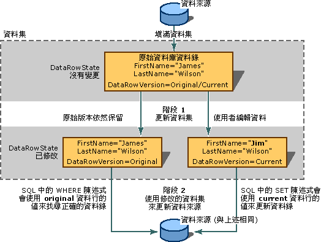

# 儲存資料集中的資料
儲存資料是將應用程式中已變更的資料維持在原始資料存放區 \(通常是關聯式資料庫，例如 SQL Server\) 中的程序。  
  
 由於資料集實際上就是資料的快取 \(記憶體內的複本\)，因此將資訊寫入原始資料來源的處理序和修改資料集中資料的處理序是分別進行的。  您可以將資料集的更新資料送回資料庫，只需要呼叫其中一個 TableAdapter `Update` 方法，或呼叫其中一個 TableAdapter DBDirect 方法即可。  
  
 如需將資料集的變更送回資料庫的詳細資訊，請參閱 [如何：使用 TableAdapter 更新資料](../data-tools/update-data-by-using-a-tableadapter.md)和 [如何：將資料集變更儲存至資料庫](../Topic/How%20to:%20Save%20Dataset%20Changes%20to%20a%20Database.md)。  
  
 Visual Studio 提供 `TableAdapterManager` 元件，可協助您儲存關聯資料表中的資料。  這個元件可確保根據資料庫中所定義的外部索引鍵條件約束，按照適當的順序執行儲存。  如需詳細資訊，請參閱[階層式更新概觀](../Topic/Hierarchical%20Update%20Overview.md)。  
  
 如需修改資料集中資料的詳細資訊，請參閱[在您的應用程式中編輯資料](../data-tools/editing-data-in-your-application.md)。  
  
## 兩階段更新  
 透過資料集更新資料來源需要兩個步驟。  第一個步驟是以新資訊 \(新增的資料錄、變更的資料錄或刪除的資料錄\) 更新資料集。  如果您的應用程式只需處理資料集，例如在更新資料集之後，您會將它傳送到另一個應用程式來進一步處理資料集，那麼您這時就已完成更新。  
  
> [!NOTE]
>  在 Windows Form 中，將變更從資料繫結控制項傳送至資料集的工作，是由資料繫結架構處理，您不需要使用您自己的程式碼來明確更新資料集。  如需詳細資訊，請參閱[Windows Form 資料繫結](../Topic/Windows%20Forms%20Data%20Binding.md)。  
  
 如果您要更新資料來源 \(例如資料庫\)，第二個步驟就是將變更從資料集傳送至原始資料來源。  也就是說，更新資料集的處理序並不會同時將變更寫入基礎資料來源；您必須明確執行第二個步驟。  通常可以藉由呼叫您用來填入資料集那個 TableAdapter \(或資料配接器\) 的 Update 方法來完成這項處理，不過您也可以使用不同的配接器，將資料從某個資料來源移至另一個，或是更新多個資料來源。  
  
   
兩階段更新過程以及 DataRowVersion 在成功更新中所扮演的角色  
  
 以結構來說，資料集會讓資料變成一組集合來使用。  資料集包含資料表的集合。  資料表又包含資料列的集合。  資料表會公開為 <xref:System.Data.DataSet> 物件的集合，而資料錄可從 <xref:System.Data.DataTable> 物件的 <xref:System.Data.DataTable.Rows%2A> 集合取得。  只要使用基底集合方法來操作這些集合就可變更資料集中的資料，但如果您要更新基礎資料來源，您就必須使用特別設計來修改資料集的方法。  
  
 例如，若要將資料錄從資料表中移除，您應該呼叫資料表之 <xref:System.Data.DataTable.Rows%2A> 集合的 [RemoveAt 方法](https://msdn.microsoft.com/en-us/library/system.data.datarowcollection.removeat.aspx)，這樣就能夠實際將該資料錄從資料集刪除。  如果您只是將資料集當做資料的結構化存放區使用，而且不考慮將變更資訊傳送至其他應用程式，那麼就可以這種方式操作集合來更新資料集。  
  
 不過，如果您要將變更傳送至資料來源或其他應用程式，您就需要在每次更新時維護變更資訊 \(即中繼資料，Metadata\)。  稍後當您將變更傳送至資料來源或應用程式時，處理序就具有找出和更新適當資料錄所需的資訊。  例如，如果您刪除資料集中的資料錄，就必須在此資料集中維護與刪除的資料錄有關的資訊。  如此一來，當叫用 TableAdapter 的 `DeleteCommand` 時，就有足夠的歷程資訊可以找出資料來源中的原始資料錄，以便將它刪除。  如需詳細資訊，請參閱以下的「維護變更的資訊」。  
  
## 合併資料集  
 您可藉由「*合併*」\(Merging\) 的方式來更新資料集的內容，也就是說，將某資料集 \(稱為「*來源*」資料集\) 的內容複製到呼叫資料集 \(稱為「*目標*」\(Target\) 資料集\)。  當您合併資料集時，來源資料集中的新資料錄會加入目標資料集中。  除此之外，來源資料集中額外的資料行也會加入目標資料集中。  當您具有區域資料集，並從其他應用程式或從類似 XML Web Service 的元件中取得第二個資料集時，合併資料集會特別實用。  當您需要整合多個資料集的資料時，這樣的處理方式也會很有用處。  
  
 當合併資料集時，您也可以傳遞選擇性布林值引數 \(`preserveChanges`\)，告知 <xref:System.Data.DataSet.Merge%2A> 方法是否要在目標資料集中保留現有的修改。  由於資料集維護資料錄的多個版本，因此請注意這時是合併超過一個以上的資料錄版本。  下列資料表會顯示將合併之兩資料集當中的一筆資料錄：  
  
|DataRowVersion|目標資料集|來源資料集|  
|--------------------|-----------|-----------|  
|原始|James Wilson|James C.   Wilson|  
|Current|Jim Wilson|James C.   Wilson|  
  
 利用 `preserveChanges=false targetDataset.Merge(sourceDataset)` 在上面的資料表上呼叫 <xref:System.Data.DataSet.Merge%2A> 方法時，將產生以下的結果：  
  
|DataRowVersion|目標資料集|來源資料集|  
|--------------------|-----------|-----------|  
|原始|James C.   Wilson|James C.   Wilson|  
|Current|James C.   Wilson|James C.   Wilson|  
  
 利用 `preserveChanges = true targetDataset.Merge(sourceDataset, true)` 呼叫 <xref:System.Data.DataSet.Merge%2A> 方法時，將產生以下的結果：  
  
|DataRowVersion|目標資料集|來源資料集|  
|--------------------|-----------|-----------|  
|原始|James C.   Wilson|James C.   Wilson|  
|Current|Jim Wilson|James C.   Wilson|  
  
> [!CAUTION]
>  在 `preserveChanges = true` 案例中，如果在目標資料集中的資料錄上呼叫 <xref:System.Data.DataSet.RejectChanges%2A> 方法，則它會還原成「*來源*」\(Source\) 資料集的原始資料。  這表示，如果您嘗試利用目標資料集更新原始資料來源，它可能會找不到要更新的原始資料列。  但是，您可以防止並行違規的發生，其方式是將資料來源的更新資料錄填入另一個資料集，然後執行合併，這樣就可以防止並行違規的發生 \(當另一位使用者在填入資料集之後修改了資料來源中的資料錄時，即會發生並行違規\)。  
  
## 更新條件約束  
 若要變更現有資料列，您可加入或更新個別資料行中的資料。  如果資料集包含條件約束 \(例如，外部索引鍵或不可為 Null 的條件約束\)，那麼當您更新資料錄時 \(在您已完成一個資料行的更新，但在嘗試更新下一個資料行之前\)，資料錄有可能暫時處於錯誤狀態。  
  
 若要避免不當條件約束違規，您可暫止使用更新條件約束。  這麼做的目的有二：  
  
-   當您在資料行之間進行更新時，可避免擲回錯誤。  
  
-   可暫止引發特定更新事件 \(通常供驗證之用的事件\)。  
  
 在完成更新之後，您可重新啟用條件約束檢查，如此一來也會重新啟用並引發更新事件。  
  
> [!NOTE]
>  在 Windows Form 中，將焦點移出資料列之前，內建在資料格中的資料繫結架構會暫止條件約束檢查，而您並不需要明確呼叫 <xref:System.Data.DataRow.BeginEdit%2A>、<xref:System.Data.DataRow.EndEdit%2A> 或 <xref:System.Data.DataRow.CancelEdit%2A> 方法。  
  
 當在資料集上叫用 <xref:System.Data.DataSet.Merge%2A> 方法時，會自動停用條件約束。  當合併完成時，如果資料集上的任一條件約束無法啟用，就會擲回 <xref:System.Data.ConstraintException>。  在這種情況下，<xref:System.Data.DataSet.EnforceConstraints%2A> 屬性會設定為 `false`，且必須先解決所有條件約束的違規情況後，才能將 <xref:System.Data.DataSet.EnforceConstraints%2A> 屬性設定為 `true`。  
  
 在完成更新之後，您可重新啟用條件約束檢查，如此一來也會重新啟用並引發更新事件。  
  
 如需暫止事件的詳細資訊，請參閱 [如何：填入 DataSet 時關閉條件約束](../data-tools/turn-off-constraints-while-filling-a-dataset.md)。  
  
## 資料集更新錯誤  
 當您更新資料集中的資料錄時，有可能會發生錯誤。  例如，您可能不慎將錯誤資料型別、太大或是具有其他完整性問題的資料寫入資料行。  除此之外，有些特定應用程式的驗證檢查也可能會在更新事件的任一階段引發自訂錯誤。  如需詳細資訊，請參閱[驗證資料集中的資料](../data-tools/validate-data-in-datasets.md)。  
  
## 維護變更的資訊  
 資料集中有關變更的資訊可利用以下兩種方式維護：一是將資料列標示旗標，以表示它是否已變更 \(<xref:System.Data.DataRow.RowState%2A>\)，另一種則是保留資料錄的多個複本 \(<xref:System.Data.DataRowVersion>\)。  藉由使用這些資訊，處理序就可判斷資料集中有哪些部分變更，並且將適當的更新傳送至資料來源。  
  
### RowState 屬性  
 <xref:System.Data.DataRow> 物件的 <xref:System.Data.DataRow.RowState%2A> 屬性是一個值，可提供有關資料的特定資料列狀態之資訊。  
  
 下表將詳述 <xref:System.Data.DataRowState> 列舉型別的可能值：  
  
|DataRowState 值|描述|  
|--------------------|--------|  
|<xref:System.Data.DataRowState>|資料列已被當做項目加入到 <xref:System.Data.DataRowCollection> \(這種狀態中的資料列並沒有對應的原始版本，因為最後一次呼叫 <xref:System.Data.DataRow.AcceptChanges%2A> 方法時，它並不存在\)。|  
|<xref:System.Data.DataRowState>|使用 <xref:System.Data.DataRow> 物件的 <xref:System.Data.DataRow.Delete%2A> 來刪除資料列。|  
|<xref:System.Data.DataRowState>|資料列已建立，但它不屬於任何 <xref:System.Data.DataRowCollection>。  <xref:System.Data.DataRow> 物件在建立之後且加入到集合之前，或是從集合中移除時，就會立即處於這種狀態。|  
|<xref:System.Data.DataRowState>|資料列中的資料行值已經變更。|  
|<xref:System.Data.DataRowState>|資料列從上次呼叫 <xref:System.Data.DataRow.AcceptChanges%2A> 之後就未變更。|  
  
### DataRowVersion 列舉型別  
 資料集會維護資料錄的多個版本。  <xref:System.Data.DataRow> 物件的 <xref:System.Data.DataRowVersion> 列舉型別是一個值，可用來傳回 <xref:System.Data.DataRow> 物件的特定版本。  
  
 下表將詳述 <xref:System.Data.DataRowVersion> 列舉型別可能出現的值：  
  
|DataRowVersion 值|描述|  
|----------------------|--------|  
|<xref:System.Data.DataRowVersion>|資料錄的目前版本包含上次呼叫 <xref:System.Data.DataRow.AcceptChanges%2A> 之後在資料錄上執行過的所有修改。  如果資料列已被刪除，則無目前的版本。|  
|<xref:System.Data.DataRowVersion>|資料錄的預設值，由資料集結構描述 \(Schema\) 或資料來源定義。|  
|<xref:System.Data.DataRowVersion>|資料錄的原始版本，是上次資料集中之變更被認可後的版本。  實際上這通常也就是從資料來源讀取的資料錄版本。|  
|<xref:System.Data.DataRowVersion>|資料錄的建議版本，供您在更新期間，也就是在您呼叫 <xref:System.Data.DataRow.BeginEdit%2A> 方法和 <xref:System.Data.DataRow.EndEdit%2A> 方法之間的這一段時間暫時使用的。  您通常會在類似 <xref:System.Data.DataTable.RowChanging> 事件的處理常式中存取資料錄的建議版本。  叫用 <xref:System.Data.DataRow.CancelEdit%2A> 方法可復原變更，並刪除資料列的建議版本。|  
  
 當將更新資訊傳送至資料來源時，原始和目前版本是相當有用的。  一般來說，將更新傳送到資料來源時，新的資料庫資訊會位於資料錄的目前版本中；  原始版本的資訊則是用來尋找要更新的資料錄。  例如，在資料錄的主索引鍵變更的情況下，您必須能夠找出資料來源中的適當資料錄以更新變更。  如果沒有原始版本存在，則資料錄很可能會附加在資料來源之後，這樣不但會產生多餘的資料錄，而且產生的資料錄是不正確且過期的。  這兩個版本也可用在並行存取控制項中；您可將原始版本與資料來源中的資料錄比較，判斷資料錄在載入資料集之後是否變更過。  
  
 當您在實際認可資料集的變更之前需要執行驗證時，建議版本就會相當有用。  
  
 即使資料錄已變更，也不一定會有該資料列的原始或目前版本存在。  當您將新資料列插入資料表時，原始版本就不存在，只有目前版本。  同樣地，如果您呼叫資料表的 `Delete` 方法來刪除資料列，那麼就只有原始版本，而無目前版本。  
  
 您可以查詢資料列的 <xref:System.Data.DataRow.HasVersion%2A> 方法，以測試檢查資料錄的特定版本是否存在。  當您要求資料行的值時，您可將 <xref:System.Data.DataRowVersion> 列舉值當做選擇性引數傳遞，以存取資料錄的任一版本。  
  
## 取得變更的資料錄  
 在一般情況下，您可能不需要更新資料集中的每個資料錄。  例如，使用者可能會使用可顯示許多資料錄的 Windows Form <xref:System.Windows.Forms.DataGridView> 控制項。  不過，這位使用者可能只要更新一些資料錄、刪除一個資料錄並插入一個資料錄。  資料集和資料表提供一個方法 \(`GetChanges`\) 來只傳回已修改的資料列。  
  
 您可使用資料表 \(<xref:System.Data.DataTable.GetChanges%2A>\) 或資料集本身 \(<xref:System.Data.DataSet.GetChanges%2A>\) 的 `GetChanges` 方法，建立變更的資料錄子集。  如果您呼叫資料表的方法，它會傳回只有變更資料錄的資料表。  同樣地，如果您在資料集上呼叫此方法，您就會取得只包含變更之資料錄的新資料集。  `GetChanges` 本身將會傳回所有變更的資料錄。  相較之下，將所需的 <xref:System.Data.DataRowState> 當做參數傳遞到 `GetChanges` 方法時，您可以指定您所要的已變更資料錄之子集為何：新加入的資料錄、標記為要刪除的資料錄、中斷連結的資料錄，或是已修改的資料錄。  
  
 當您要將資料錄傳送至其他元件進行處理時，取得變更資料錄的子集會是相當有用的做法。  藉由只取得元件所需的資料錄，您就不需傳送整個資料集，因而降低與其他元件通訊的負荷量。  如需詳細資訊，請參閱[如何：擷取已變更的資料列](../Topic/How%20to:%20Retrieve%20Changed%20Rows.md)。  
  
## 認可資料集中的變更  
 由於變更都是在資料集中進行，因此會設定變更之資料列的 <xref:System.Data.DataRow.RowState%2A> 屬性。  資料錄的原始和目前版本是透過 <xref:System.Data.DataRowView.RowVersion%2A> 屬性來建立和維護，而您也是透過這個屬性取得這兩個版本。  將適當的更新傳送至資料來源時，需要使用儲存在這些屬性中表示變更的中繼資料。  
  
 如果變更反映資料來源的目前狀態，您就不再需要維護這項資訊。  一般來說，資料集與其來源會在下列兩種情況下保持同步：  
  
-   在您將資訊載入資料集之後即為同步，例如當您從來源讀取資料時。  
  
-   在將變更從資料集傳送至資料來源之後 \(不是之前，因為您會遺失將變更傳送至資料庫所需的變更資訊\)。  
  
 您可呼叫 <xref:System.Data.DataSet.AcceptChanges%2A> 方法來認可對資料集的暫止變更。  一般來說，您的應用程式會在下列時機呼叫 <xref:System.Data.DataSet.AcceptChanges%2A>。  
  
-   在您載入資料集之後。  如果您是呼叫 TableAdapter 的 `Fill` 方法來載入資料集，則配接器會自動為您認可變更。  不過，如果您是以合併其他資料集的方式載入資料集，您就需要手動認可變更。  
  
    > [!NOTE]
    >  您可以在呼叫 `Fill` 方法時防止配接器自動認可變更，其方式是將配接器的 `AcceptChangesDuringFill` 屬性設定為 `false`。  如果設定為 `false`，則每個插入之資料列的 <xref:System.Data.DataRow.RowState%2A> 在填入期間會設定為 <xref:System.Data.DataRowState>。  
  
-   在您將資料集變更傳送至其他處理序 \(例如 XML Web Service\) 之後。  
  
    > [!CAUTION]
    >  利用這種方式認可變更會清除任何變更資訊。  直到您已執行任何應用程式需知道資料集中變更部分的作業之後，再認可變更。  
  
 這個方法會產生下列結果：  
  
-   將資料錄的 <xref:System.Data.DataRowVersion> 版本寫入其 <xref:System.Data.DataRowVersion> 版本，並覆寫原始版本。  
  
-   移除任何 <xref:System.Data.DataRow.RowState%2A> 屬性設定為 <xref:System.Data.DataRowState> 的資料列。  
  
-   將資料錄的 <xref:System.Data.DataRow.RowState%2A> 屬性設定為 <xref:System.Data.DataRowState>。  
  
 您可在三個層次上使用 <xref:System.Data.DataSet.AcceptChanges%2A> 方法。  您可在 <xref:System.Data.DataRow> 物件上呼叫它，這樣就會為這個資料列認可變更。  您也可在 <xref:System.Data.DataTable> 物件上呼叫它來認可資料表中的所有資料列，或是在 <xref:System.Data.DataSet> 物件上呼叫它來認可資料集中，所有資料表之所有資料錄中的所有暫止變更。  
  
 下列資料表將依據呼叫方法所在的物件，說明認可的變更為何。  
  
|方法|結果|  
|--------|--------|  
|<xref:System.Data.DataRow.AcceptChanges%2A?displayProperty=fullName>|只認可特定資料列上的變更|  
|<xref:System.Data.DataTable.AcceptChanges%2A?displayProperty=fullName>|認可特定資料表中所有資料列上的變更|  
|<xref:System.Data.DataSet.AcceptChanges%2A?displayProperty=fullName>|認可資料集中所有資料表的所有資料列上的變更|  
  
> [!NOTE]
>  如果您是呼叫 TableAdapter 的 `Fill` 方法來載入資料集，則您不需要明確接受變更；`Fill` 方法在完成資料表的填入時，預設會呼叫 `AcceptChanges` 方法。  
  
 相關的方法 `RejectChanges` 會復原變更的作用，其方式是透過將 <xref:System.Data.DataRowVersion> 版本複製回資料錄的 <xref:System.Data.DataRowVersion> 版本，並將每一個資料錄的 <xref:System.Data.DataRow.RowState%2A> 設回 <xref:System.Data.DataRowState>。  
  
## 資料驗證  
 為了驗證您應用程式中的資料是否符合接收到之處理序的需求，您通常需要加入驗證。  這可能需要檢查使用者輸入表單的內容是否正確、驗證其他應用程式傳送到您應用程式的資料，甚至是檢查在您元件內計算的資訊是否符合資料來源和應用程式需求的條件約束。  
  
 您可利用下列幾種方式驗證資料：  
  
-   在商務層 \(Business Layer\) 中，將驗證資料的程式碼加入您的應用程式。  資料集是您可以進行這項程序的一個地方，  因為資料集提供了後端驗證的某些優點，例如當資料行和資料列的值變更時，提供驗證變更的能力。  如需詳細資訊，請參閱[驗證資料集中的資料](../data-tools/validate-data-in-datasets.md)。  
  
-   在展示層 \(Presentation Layer\) 中，將驗證加入表單中。  如需詳細資訊，請參閱[Windows Form 中的使用者輸入驗證](../Topic/User%20Input%20Validation%20in%20Windows%20Forms.md)。  
  
-   在資料後端 \(Back End\) 中，將資料傳送至資料來源 \(例如資料庫\)，並允許它接受或拒絕資料。  如果您使用的資料庫具有驗證資料和提供錯誤訊息的精密功能，則這會是相當實用的方法，因為您可驗證各種來源的資料。  不過，它可能無法符合特定應用程式的驗證需求。  除此之外，根據您應用程式如何協助解決由後端引發的驗證錯誤而定，由資料來源驗證資料可能會造成與資料來源之間不斷往返。  
  
    > [!IMPORTANT]
    >  使用 <xref:System.Data.SqlClient.SqlCommand.CommandType%2A> 屬性設為 <xref:System.Data.CommandType> 的資料命令時，請先仔細檢查用戶端傳送出來的資訊，然後再將這些資訊傳遞至資料庫。  惡意使用者會嘗試傳送 \(插入\) 修改過或額外的 SQL 陳述式 \(Statement\)，以獲取未經授權的存取權，或損壞資料庫。  在將使用者輸入傳輸到資料庫之前，一定要確認資訊是有效的；最好的做法是盡可能使用參數型查詢或預存程序。  如需詳細資訊，請參閱[Script Exploits Overview](../Topic/Script%20Exploits%20Overview.md)。  
  
 在資料集中進行變更之後，您可將變更傳送至資料來源。  常見的做法是呼叫 TableAdapter \(或資料配接器\) 的 `Update` 方法。  這個方法會在資料表中的每個資料錄執行迴圈，判斷需要哪種類型的變更 \(更新、插入或刪除\)，若有的話，接著就執行適當的命令。  
  
## 如何將更新傳送至資料來源  
 為了示範如何進行更新，讓我們假設您的應用程式使用內含一個單一資料表的資料集。  應用程式從資料庫擷取兩個資料列。  在擷取之後，記憶體中的資料表外觀應該會像這樣：  
  
```  
(RowState)     CustomerID   Name             Status  
(Unchanged)    c200         Robert Lyon      Good  
(Unchanged)    c400         Nancy Buchanan    Pending  
```  
  
 您的應用程式將 Nancy Buchanan 的狀態變更為 "Preferred"。在這項變更的結果中，該資料列的 <xref:System.Data.DataRow.RowState%2A> 屬性值會從 <xref:System.Data.DataRowState> 變更為 <xref:System.Data.DataRowState>。  第一個資料列的 <xref:System.Data.DataRow.RowState%2A> 屬性值還是維持 <xref:System.Data.DataRowState>。  資料表現在應該像這樣：  
  
```  
(RowState)     CustomerID   Name             Status  
(Unchanged)    c200         Robert Lyon      Good  
(Modified)     c400         Nancy Buchanan    Preferred  
```  
  
 您的應用程式現在會呼叫 `Update` 方法來將資料集傳送至資料庫。  這個方法會依序檢視每個資料列。  針對第一個資料列，方法不會將任何 SQL 陳述式傳送至資料庫，因為這個資料列從資料庫擷取之後就未變更過。  
  
 不過對第二個資料列而言，`Update` 方法就會自動叫用適當的資料命令，並將其傳送至資料庫。  SQL 陳述式的特定語法要視基礎資料來源支援哪種 SQL 語言而定。  但是傳送的 SQL 陳述式有些相通特性是值得注意的：  
  
-   傳送的 SQL 陳述式是 UPDATE 陳述式。  該配接器知道要使用 UPDATE 陳述式，這是因為 <xref:System.Data.DataRow.RowState%2A> 屬性的值是 <xref:System.Data.DataRowState>。  
  
-   傳送的 SQL 陳述式包含 WHERE 子句，表示 UPDATE 陳述式的目標是 `CustomerID = 'c400'` 的資料列。  SELECT 陳述式的這個部分能夠將目標資料列與其他所有資料列區分，因為 `CustomerID` 是目標資料表的主索引鍵。  WHERE 子句的資訊是衍生自資料錄的原始版本 \(`DataRowVersion.Original`\)，這麼做是為了預防用來辨識資料列所需要的值遭到變更。  
  
-   傳送的 SQL 陳述式包含 SET 子句，用來設定修改資料行的新值。  
  
    > [!NOTE]
    >  如果 TableAdapter 的 `UpdateCommand` 屬性已設為預存程序的名稱，則配接器不會建構 SQL 陳述式。  相反地，它會以適當的傳入參數來叫用預存程序。  
  
## 傳遞參數  
 資料庫中要更新資料錄的值通常是使用參數來傳遞。  當 TableAdapter 的 `Update` 方法執行 UPDATE 陳述式時，它需要填入參數值。  它會針對適當的資料命令 \(此例為 TableAdapter 中的 `UpdateCommand` 物件\)，從 `Parameters` 集合中取得這些值。  
  
 如果您是使用 Visual Studio 工具來產生資料配接器，`UpdateCommand` 物件將會包含參數的集合，其中的參數會對應到陳述式中的每個參數替代符號。  
  
 每一個參數的 <xref:System.Data.SqlClient.SqlParameter.SourceColumn%2A?displayProperty=fullName> 屬性會指向資料的資料表中的某個資料行。  例如，`au_id` 和 `Original_au_id` 參數的 `SourceColumn` 屬性就是設定為資料表中包含作者 ID 的資料行。  當配接器的 `Update` 方法執行時，它就會從要更新的資料錄讀取作者 ID 資料行，接著將值填入陳述式。  
  
 在 UPDATE 陳述式中，您需要指定新值 \(將寫入資料錄的值\) 和舊值 \(以便在資料庫中找出要更新的資料錄\)。  因此每個值都有兩個參數：一是供 SET 子句使用，另一則是供 WHERE 子句使用。  這兩個參數都會從要更新的資料錄讀取資料，但是它們會根據參數的 [SqlParameter.SourceVersion 屬性](https://msdn.microsoft.com/en-us/library/system.data.sqlclient.sqlparameter.sourceversion.aspx)而取得資料行值的不同版本。  SET 子句的參數會取得目前版本，而 WHERE 子句的參數會取得原始版本。  
  
> [!NOTE]
>  您也可以在程式碼中自行設定 `Parameters` 集合中的值，您通常會在為資料配接器之 <xref:System.Data.DataTable.RowChanging> 事件建立的事件處理常式中這麼做。  
  
## 更新關聯資料表  
 如果您的資料集包含多個資料表，則您需要分別呼叫每個資料配接器的 `Update` 方法來個別加以更新。  如果資料表具有父\-子關係 \(Parent\-Child Relationship\)，那麼您可能需要以特殊順序將更新傳送至資料庫。  常見的案例是，您已將父資料錄和關聯子資料錄都加入資料集，例如一個新的客戶資料錄和一個或多個關聯訂單資料錄。  如果資料庫本身強制執行關聯完整性規則，則當您在建立父資料錄之前將新的子資料錄傳送至資料庫時，就會引發錯誤。  
  
 相反地，如果您要刪除資料集中的關聯資料錄，您通常需要以相反順序傳送更新：先是子資料表，然後才是父資料表。  否則，資料庫可能會引發錯誤，因為參考完整性 \(Referential Integrity\) 規則在關聯子資料錄還存在的情況下不會讓您刪除父資料錄。  
  
 傳送關聯資料表更新的一般規則是依照下列順序進行：  
  
1.  子資料表：刪除資料錄。  
  
2.  父資料表：插入、更新及刪除資料錄。  
  
3.  子資料表：插入和更新資料錄。  
  
4.  如需詳細資訊，請參閱[逐步解說：儲存資料至資料庫 \(多個資料表\)](../data-tools/save-data-to-a-database-multiple-tables.md)。  
  
## 並行存取控制項  
 由於資料集是與資料來源中斷連接的，因此您不會鎖定資料來源中的資料錄。  因此，如果要更新資料庫，而且如果您的應用程式需要維護並行存取控制項，您就必須協調資料集和資料庫中的資料錄。  例如，您可能要在資料庫中尋找上次填入資料集之後已變更的資料錄。  在這種情況下，您必須執行適當應用程式的邏輯，指定如何處理您資料集中的資料庫資料錄或是變更資料錄。  
  
## 請參閱  
 [TableAdapter 概觀](../data-tools/tableadapter-overview.md)   
 [如何：使用 TableAdapter 更新資料](../data-tools/update-data-by-using-a-tableadapter.md)   
 [Visual Studio 資料應用程式的概觀](../data-tools/overview-of-data-applications-in-visual-studio.md)   
 [連接至 Visual Studio 中的資料](../data-tools/connecting-to-data-in-visual-studio.md)   
 [準備您的應用程式以接收資料](../Topic/Preparing%20Your%20Application%20to%20Receive%20Data.md)   
 [將資料擷取至您的應用程式中](../data-tools/fetching-data-into-your-application.md)   
 [將控制項繫結至 Visual Studio 中的資料](../data-tools/bind-controls-to-data-in-visual-studio.md)   
 [在您的應用程式中編輯資料](../data-tools/editing-data-in-your-application.md)   
 [驗證資料](../Topic/Validating%20Data.md)   
 [儲存資料](../data-tools/saving-data.md)