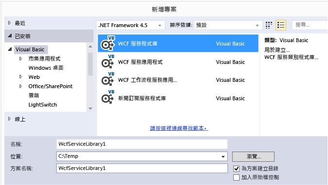
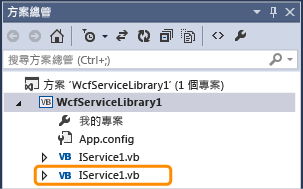
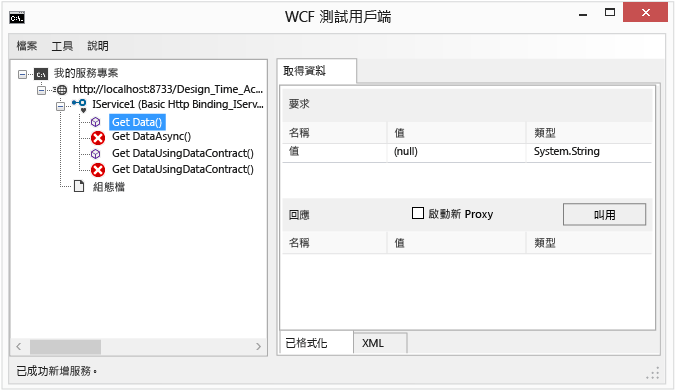
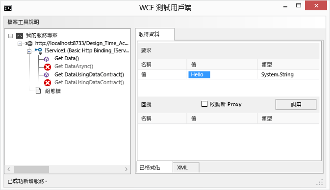
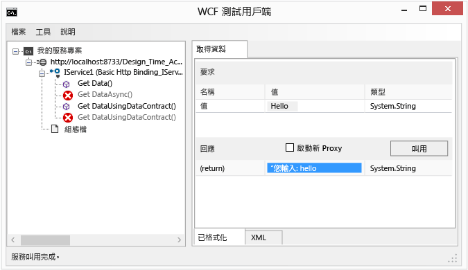
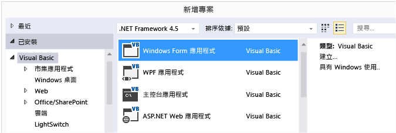
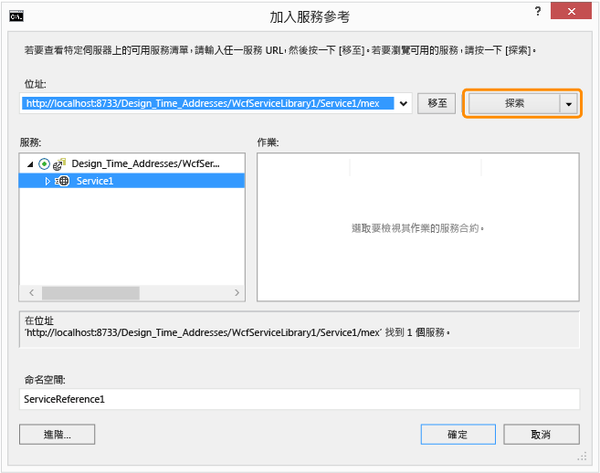
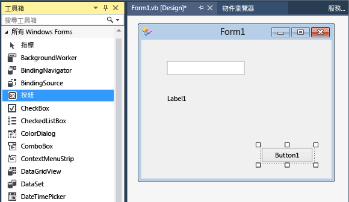

# Walkthrough: Creating and Accessing WCF Services
本逐步解說示範如何建立簡單的 [!INCLUDE[vsindigo](../data-tools/includes/vsindigo_md.md)] 服務、予以測試，然後從 Windows Form 應用程式加以存取。  
  
 [!INCLUDE[note_settings_general](../data-tools/includes/note_settings_general_md.md)]  
  
## 建立服務  
  
#### 建立 WCF 服務  
  
1.  在 \[**檔案**\] 功能表上，指向 \[**新增**\]，然後按一下 \[**專案**\]。  
  
2.  在 \[新增專案\] 對話方塊中，展開 \[Visual Basic\] 或 \[Visual C\#\] 節點，按一下 \[WCF\]，接著是 \[WCF 服務程式庫\]。  按一下 \[確定\] 開啟專案。  
  
       
  
    > [!NOTE]
    >  這樣會建立一個可進行測試和存取的工作服務。  以下兩個步驟示範如何修改預設方法以使用不同的資料類型。  在實際的應用程式中，您也會將自己的功能加入服務。  
  
3.    
  
     在 \[方案總管\] 中，按兩下 IService1.vb 或 IService1.cs，並尋找下面這一行：  
  
     [!code-cs[WCFWalkthrough#4](../data-tools/codesnippet/CSharp/walkthrough-creating-a-simple-wcf-service-in-windows-forms_1.cs)]
     [!code-vb[WCFWalkthrough#4](../data-tools/codesnippet/VisualBasic/walkthrough-creating-a-simple-wcf-service-in-windows-forms_1.vb)]  
  
     將 `value` 參數的類型變更為 `String`：  
  
     [!code-cs[WCFWalkthrough#1](../data-tools/codesnippet/CSharp/walkthrough-creating-a-simple-wcf-service-in-windows-forms_2.cs)]
     [!code-vb[WCFWalkthrough#1](../data-tools/codesnippet/VisualBasic/walkthrough-creating-a-simple-wcf-service-in-windows-forms_2.vb)]  
  
     請注意上述程式碼中的 `<OperationContract()>` 或 `[OperationContract]` 屬性。  服務所公開的所有方法都需要這些屬性。  
  
4.    
  
     在 \[方案總管\] 中，按兩下 Service1.vb 或 Service1.cs，並尋找下面這一行：  
  
     [!code-vb[WCFWalkthrough#5](../data-tools/codesnippet/VisualBasic/walkthrough-creating-a-simple-wcf-service-in-windows-forms_3.vb)]
     [!code-cs[WCFWalkthrough#5](../data-tools/codesnippet/CSharp/walkthrough-creating-a-simple-wcf-service-in-windows-forms_3.cs)]  
  
     將 value 參數的類型變更為 `String`：  
  
     [!code-cs[WCFWalkthrough#2](../data-tools/codesnippet/CSharp/walkthrough-creating-a-simple-wcf-service-in-windows-forms_4.cs)]
     [!code-vb[WCFWalkthrough#2](../data-tools/codesnippet/VisualBasic/walkthrough-creating-a-simple-wcf-service-in-windows-forms_4.vb)]  
  
## 測試服務  
  
#### 測試 WCF 服務  
  
1.  按 **F5** 執行服務。  這樣會顯示 \[WCF 測試用戶端\] 表單並載入服務。  
  
2.  在 \[WCF 測試用戶端\] 表單中，按兩下 \[IService1\] 下的 \[GetData\(\)\] 方法。  \[GetData\] 索引標籤隨即顯示。  
  
       
  
3.  在 \[要求\] 方塊中，選取 \[值\] 欄位，然後輸入 `Hello`。  
  
       
  
4.  按一下 \[叫用\] 按鈕。  如果顯示 \[安全性警告\] 對話方塊，請按一下 \[確定\]。  結果將顯示在 \[回應\] 方塊中。  
  
       
  
5.  在 \[檔案\] 功能表上，按一下 \[結束\] 關閉測試表單。  
  
## 存取服務  
  
#### 參考 WCF 服務  
  
1.  在 \[檔案\] 功能表上，指向 \[新增\]，然後按一下 \[新增專案\]。  
  
2.  在 \[新增專案\] 對話方塊中，展開 \[Visual Basic\] 或 \[Visual C\#\] 節點，選取 \[Windows\]，然後選取 \[Windows Form 應用程式\]。  按一下 \[確定\] 開啟專案。  
  
       
  
3.  以滑鼠右鍵按一下 \[WindowsApplication1\]，然後按一下 \[加入服務參考\]。  \[加入服務參考\] 對話方塊隨即出現。  
  
4.  在 \[加入服務參考\] 對話方塊中，按一下 \[探索\]。  
  
       
  
     \[Service1\] 將顯示在 \[服務\] 窗格中。  
  
5.  按一下 \[確定\] 新增服務參考。  
  
#### 建置用戶端應用程式  
  
1.  在 \[方案總管\] 中，按兩下 \[Form1.vb\] 或 \[Form1.cs\] 開啟 Windows Form 設計工具 \(如果尚未開啟\)。  
  
2.  從 \[工具箱\] 中，將 `TextBox` 控制項、`Label` 控制項及 `Button` 控制項拖曳至表單。  
  
       
  
3.  按兩下 \[`Button`\]，並將下列程式碼加入 `Click` 事件處理常式：  
  
     [!code-cs[WCFWalkthrough#3](../data-tools/codesnippet/CSharp/walkthrough-creating-a-simple-wcf-service-in-windows-forms_5.cs)]
     [!code-vb[WCFWalkthrough#3](../data-tools/codesnippet/VisualBasic/walkthrough-creating-a-simple-wcf-service-in-windows-forms_5.vb)]  
  
4.  在 \[方案總管\] 中，以滑鼠右鍵按一下 \[WindowsApplication1\]，然後按一下 \[設定為啟始專案\]。  
  
5.  按 **F5** 執行專案。  輸入一些文字，然後按一下按鈕。  標籤會顯示「您輸入：」以及您輸入的文字。  
  
       
  
## 請參閱  
 [使用ASMX 和WCF 服務範例](http://msdn.microsoft.com/zh-tw/788ddf2c-2ac1-416b-8789-2fbb1e29b8fe)