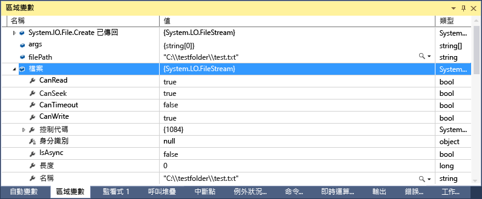
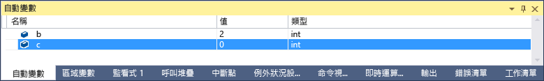
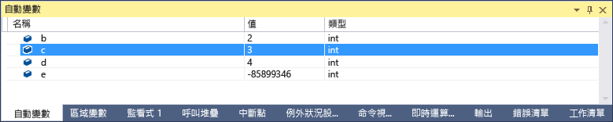
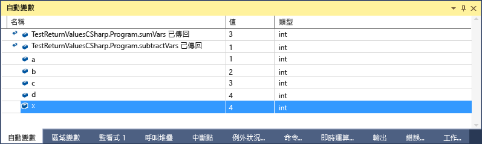

# [自動變數] 和 [區域變數] 視窗
[!INCLUDE[vs2017banner](../code-quality/includes/vs2017banner.md)]

\[自動變數\] 視窗 \(偵錯時，**CTRL\+ALT\+V、A**，或 \[偵錯\] \/ \[視窗\] \/ \[自動變數\]\) 和 \[區域變數\] 視窗 \(偵錯時，**CTRL\+ALT\+V、L**，或 \[偵錯\] \/ \[視窗\] \/ \[區域變數\]\) 相當適合用來在您偵錯時查看變數值。 \[區域變數\] 視窗會顯示在區域範圍中定義的變數，這通常是目前正在執行的函式或方法。 \[自動變數\] 視窗會顯示目前這一行 \(偵錯工具停止處的位置\) 附近使用的變數。 會確切顯示哪些變數在不同語言中是不同的。 請參閱底下的＜\[自動變數\] 視窗中出現哪些變數？＞  
  
 如果您需要基本偵錯的詳細資訊，請參閱 [開始使用偵錯工具](../debugger/getting-started-with-the-debugger.md)。  
  
## 查看 \[自動變數\] 和 \[區域變數\] 視窗中的物件  
 陣列和物件會以樹狀結構控制項顯示在 \[自動變數\] 和 \[區域變數\] 視窗。 按一下變數名稱左邊的箭號，展開檢視來顯示欄位和屬性。 以下是 \[區域變數\] 視窗中的 [FileStream](../Topic/FileStream%20Class.md) 物件範例：  
  
   
  
## \[自動變數\] 視窗中出現哪些變數？  
 您可以在 C\#、Visual Basic 和 C\+\+ 程式碼中使用 \[自動變數\] 視窗。 \[自動變數\] 視窗不支援 JavaScript 或 F\#。  
  
 在 C\# 和 Visual Basic 中，\[自動變數\] 視窗會顯示目前或先前一行使用的任何變數。 例如，如果您宣告四個變數並設定如下：  
  
```c#  
public static void Main() { int a, b, c, d; a = 1; b = 2; c = 3; d = 4; }  
```  
  
 如果您在 `c = 3` 行上設定中斷點並執行偵錯工具，當停止執行時，\[自動變數\] 視窗看起來像這樣：  
  
   
  
 請注意，`c` 值為 0，因為尚未執行 `c = 3` 這行。  
  
 在 C\+\+ 中，\[自動變數\] 視窗會顯示目前這一行 \(停止執行之處的那一行\) 之前至少三行使用的變數。 如果您宣告六個變數：  
  
```cpp  
void main() { int a, b, c, d, e, f; a = 1; b = 2; c = 3; d = 4; e = 5; f = 6; }  
```  
  
 如果您在 `e = 5;` 行上設定中斷點並執行偵錯工具，當停止執行時，\[自動變數\] 視窗看起來像這樣：  
  
   
  
 請注意，變數 e 因為在  `e = 5;`  行的程式碼尚未執行而未初始化。  
  
 在某些情況下，您也可以查看函式和方法的傳回值。 請參閱下方的 [檢視方法呼叫的傳回值](#bkmk_returnValue)。  
  
##  <a name="bkmk_returnValue"></a> 檢視方法呼叫的傳回值  
 在 .NET 和 C\+\+ 程式碼中，您可以在不進入或者跳離方法呼叫時檢查傳回值。 當方法呼叫的結果不會儲存在區域變數中，例如，方法做為另一個方法的參數或傳回值時，這項功能會很有用。  
  
 下列 C\# 程式碼會加入兩個函式的傳回值：  
  
```c#  
static void Main(string[] args) { int a, b, c, d; a = 1; b = 2; c = 3; d = 4; int x = sumVars(a, b) + subtractVars(c, d); } private static int sumVars(int i, int j) { return i + j; } private static int subtractVars(int i, int j) { return j - i; }  
  
```  
  
 在 int `x = sumVars(a, b) + subtractVars(c, d);`  行上設定中斷點。  
  
 開始偵錯，並在第一個中斷點中斷執行時，按下 **F10** \(不進入函式\)。 您應該會在 \[自動變數\] 視窗看到如下：  
  
   
  
## 為什麼變數值有時在 \[區域變數\] 和 \[自動變數\] 視窗中是紅色的？  
 您可能會注意到變數的值有時候在 \[區域變數\] 和 \[自動變數\] 視窗中是紅色。 這些是自從上次評估後已變更的變數值。 變更可能是來自先前的偵錯工作階段，或是因為值在視窗中已變更。  
  
## 變更變數視窗的數字格式  
 預設數值格式為十進位，但您可以將它變更為十六進位。 以滑鼠右鍵按一下 \[區域變數\] 或 \[自動變數\] 視窗並選取 \[十六進位顯示\]。 變更會影響所有偵錯工具視窗。  
  
## 編輯變數視窗中的值  
 您可以編輯 \[自動變數\]、\[區域變數\]、\[監看式\] 和 \[快速監看式\] 視窗中出現的大部分變數值。 如需 \[監看式\] 和 \[快速監看式\] 視窗的相關資訊，請參閱 [監看式及快速監看式視窗](../debugger/watch-and-quickwatch-windows.md)。 只要連按兩下您想要變更的值，並加入新值。  
  
 您可以輸入值的運算式，例如 `a + b`。 偵錯工具接受大部分的有效語言運算式。  
  
 在原生 C\+\+ 程式碼中，您可能必須限定變數名稱的內容。 如需詳細資訊，請參閱[內容運算子 \(C\+\+\)](../debugger/context-operator-cpp.md)。  
  
 不過，變更值時應該謹慎。 部分可能問題如下：  
  
-   評估某些運算式可能會變更變數的值，或是影響程式的狀態。 例如，評估 `var1 = ++var2` 會變更 `var1` 和 `var2` 的值。  
  
     變更資料的運算式被視為具有[副作用](https://en.wikipedia.org/wiki/Side_effect_\(computer_science\))，如果您不知道它們的存在，可能會產生非預期的結果。 請確定您在進行之前了解這類變更的結果。  
  
-   由於分數元件的十進位至二進位轉換，編輯浮點數值會略微不精確。 即使表面上無害的編輯也可能造成浮點變數中的某些最小顯著性位元變更。  
  
## 偵錯位置工具列  
 您可以使用 \[偵錯位置\] 工具列選取想要的函式、執行緒或處理序。 設定中斷點，並開始偵錯。 \(如果看不到此工具列，您可以按一下工具列區域的空白部分來啟用它。 您應該會看到一份工具列。選取 \[偵錯位置\]\)。 當遇到中斷點時，執行會停止而且您可以看到 \[偵錯位置\] 工具列，它是下列圖形的底端列：  
  
   
  
 您也可以按兩下 \[呼叫堆疊\] 視窗、\[執行緒\] 視窗，或 \[處理序\] 視窗中的項目，變更內容至不同的函式呼叫、執行緒或處理程序。  
  
## 請參閱  
 [偵錯工具視窗](../debugger/debugger-windows.md)