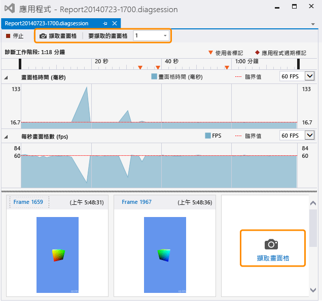

# 擷取圖形資訊
[!INCLUDE[vs2017banner](../code-quality/includes/vs2017banner.md)]

從 DirectX 應用程式擷取圖形資訊，以使用 Visual Studio 圖形分析器來診斷轉譯問題和效能問題。  
  
## 擷取圖形資訊  
 擷取圖形資訊需要兩個步驟：  首先，在 \[圖形診斷\] 下執行您的應用程式，然後指定一個或多個框架以取得其中的詳細資訊。  
  
#### 在圖形診斷下執行您的應用程式  
  
-   在功能表列上，選擇 \[**偵錯**\]、\[**圖形**\]、\[**開始診斷**\]。  \(鍵盤：按 Alt\+F5\)  
  
-   在 \[圖形\] 工具列上，選擇 \[開始診斷\] 按鈕。  
  
 當應用程式在 \[圖形診斷\] 下執行時，會一直擷取某些類型的圖形資訊，這些資訊包括裝置設定、交換鏈結的建立、圖形物件和資源的建立，以及影響多個框架的其他重要事件。  同時，您可以擷取特定框架的詳細資訊 \(這些資訊包括繪製呼叫和計算著色器分派\)，以及支援它們的 Direct3D 物件和資源。  
  
#### 擷取框架  
  
-   在 Visual Studio 中的 \[圖形\] 工具列上，選擇 \[擷取畫面格\] 按鈕 。  
  
-   接下鍵盤上的 Print Screen 鍵。  
  
    > [!NOTE]
    >  當應用程式在 \[**圖形診斷**\] 下執行時，Print Screen 鍵只能用來擷取圖形資訊的框架，而不會執行其一般功能。  此種狀況在停止擷取圖形資訊 \(通常會藉由停止偵錯或正常結束\) 之前都會保持有效狀態，即是程式焦點是在另一個應用程式上亦是如此。  
  
-   在 Visual Studio 擷取介面中，選擇位於 \[診斷工作階段\] 時間軸上方的 \[擷取畫面格\] 按鈕，或選擇位於 \[每秒畫面格數\] 泳道下方且位於先前擷取之任一畫面格右邊的大型 \[擷取畫面格\] 按鈕。  下面的影像中會將這兩個按鈕反白顯示。  
  
       
  
     當您準備要檢查您擷取的畫面格時，可依照影像縮圖上方的 \[畫面格\] 連結或按兩下縮圖，來啟動 \[Visual Studio 圖形分析器\]。  
  
 由於只能擷取整個框架，因此當您啟始擷取時，它其實是從下一個框架的圖形資訊開始錄製。  錄製會在您啟始擷取的框架呈現後立即開始，而當要擷取的框架顯示時就會結束。  您可以在應用程式於 \[圖形診斷\] 下執行時擷取所需的框架數。  如果您不擷取任何框架，則會捨棄圖形記錄。  
  
 擷取畫面格時，Visual Studio 會顯示診斷工作階段 \(.diagsession\) 視窗。  如果您關閉此視窗、停止偵錯或關閉應用程式，則無法再擷取畫面格至該記錄檔。  若要擷取多個圖形資訊，您必須再次於 \[圖形診斷\] 下執行應用程式，開始進行新的診斷工作階段。  
  
### 圖形診斷擷取選項  
 您可以設定擷取來收集所有圖形事件或限定子集的呼叫堆疊、停用擷取抬頭顯示器 \(HUD\)，以及啟用或停用擷取相容性模式。  
  
##### 設定圖形診斷擷取選項  
  
1.  在功能表列上選擇 \[工具\]、\[選項\]。  \[選項\] 對話方塊隨即出現。  
  
2.  在左邊的選項分類清單中，選擇 \[圖形診斷\]，然後設定您想要的 \[圖形診斷\] 選項。  
  
     **收集擷取期間的呼叫堆疊 \(會使擷取速度變慢\)**  
     核取此方塊可收集呼叫堆疊。  根據預設，不會收集呼叫堆疊。  若要擷取呼叫堆疊，請確定 \[收集擷取期間的呼叫堆疊 \(會使擷取速度變慢\)\] 核取方塊設定為啟用收集，然後設定 \[針對繪製、分派、現在和效能標記\] 選項 \(預設值\) 只收集最重要呼叫堆疊，或 \[針對所有項目\] 選項收集所有呼叫堆疊。  若稍後要停止收集呼叫堆疊，請清除 \[收集擷取期間的呼叫堆疊 \(會使擷取速度變慢\)\] 核取方塊。  
  
     **在擷取期間停用遊戲中抬頭顯示器**  
     核取此方塊可停用抬頭顯示器覆疊 \(通常會顯示在圖形診斷下執行的應用程式\)。  將其取消選取會顯示抬頭顯示器覆疊。  
  
     **在相容性模式中擷取**  
     核取此方塊，以在相容性模式下擷取圖形資訊。  以相容性模式擷取是預設值。  在相容性模式下，Direct3D 不會回報 GPU 支援除了基底功能層級中定義的功能之外的任何其他功能。  如此可防止使用 GPU 的硬體特定擴充功能來擷取應用程式，並確保可以使用支援相同或更高功能層級的任何 GPU 來播放圖形記錄檔。  取消核取此方塊可停用相容性模式；如果 GPU 不支援應用程式在擷取期間所使用的相同其他功能，則無法在該 GPU 上播放在停用相容性模式的情況下所擷取的記錄檔。  
  
     **發現任何 SDK 層錯誤時停止擷取**  
     核取此方塊，可在發生錯誤時立即中止擷取。  
  
## 從遠端擷取圖形資訊  
 圖形資訊可以從執行於本機電腦、遠端電腦或裝置的應用程式進行擷取。  [!INCLUDE[winblue_client_2](../debugger/includes/winblue_client_2_md.md)] 電腦和 [!INCLUDE[winblue_winrt_2](../debugger/includes/winblue_winrt_2_md.md)] 裝置支援遠端擷取。  若要從遠端執行的應用程式擷取圖形資訊，請將專案設定為從遠端偵錯，並依先前所述在 \[圖形診斷\] 下執行應用程式。  應用程式會在遠端電腦上執行，而擷取的圖形資訊會記錄在您的開發電腦上。  
  
 如何將專案設定為從遠端偵錯，取決於您所開發的應用程式種類，以及您所使用的程式語言。  如需如何設定 Windows 市集應用程式之遠端偵錯的相關資訊，請參閱[在遠端電腦上執行 Windows 市集應用程式](../debugger/run-windows-store-apps-on-a-remote-machine.md)。  如需如何設定 Windows 桌面應用程式之遠端偵錯的相關資訊，請參閱[為 Visual Studio 專案設定遠端偵錯](../Topic/Set%20Up%20Remote%20Debugging%20for%20a%20Visual%20Studio%20Project.md)。  
  
 之後，您就可以使用遠端電腦或裝置播放圖形資訊，而不管是從何處擷取的資訊。  如需詳細資訊，請參閱[如何：變更圖形診斷播放電腦](../debugger/how-to-change-the-graphics-diagnostics-playback-machine.md)。  
  
## 從命令列擷取圖形資訊  
 您可以使用命令列工具，從應用程式擷取圖形資訊。  這個 DXCap.exe 工具可以快速擷取及播放圖形資訊，而不需使用 Visual Studio 或以程式設計方式擷取。  特別是，您可以使用 DXCap.exe 進行自動化，或是在測試環境中使用。  如需 DXCap.exe 的詳細資訊，請參閱[命令列擷取工具](../debugger/command-line-capture-tool.md)。  
  
## 請參閱  
 [逐步解說：擷取圖形資訊](../debugger/walkthrough-capturing-graphics-information.md)