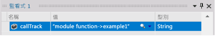
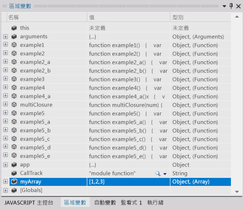
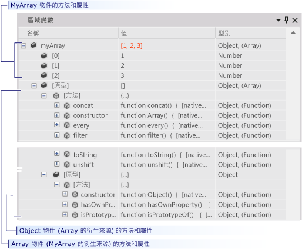
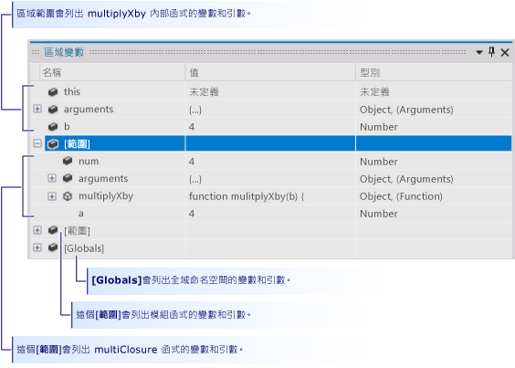

# 為 Windows 市集應用程式，在 Visual Studio 偵錯工作階段中控制市集應用程式的執行 (JavaScript)
[!INCLUDE[vs2017banner](../code-quality/includes/vs2017banner.md)]

本快速入門示範如何在 Visual Studio 偵錯工具中巡覽，以及如何檢視工作階段中的程式狀態。  
  
 本快速入門適用於不熟悉使用 Visual Studio 偵錯的開發人員，以及想要深入了解在 Visual Studio 偵錯工作階段中巡覽的開發人員。 它不會教導偵錯本身的藝術。 範例程式碼中的函式被設計為只示範本主題中所描述的偵錯步驟。 函式不會採用應用程式或函式設計的最佳作法。 事實上，您很快就會發現這些函式與應用程式本身根本沒有太大功用。  
  
 本快速入門各節的設計盡可能獨立，因此您可以跳過包含您已經熟悉的資訊的任何小節。 您也不必建立範例應用程式。 不過，我們還是建議您這麼做，並且已經盡量簡化處理序。  
  
 **偵錯工具鍵盤快速鍵。**滑鼠和鍵盤在 Visual Studio 偵錯工具中的巡覽已最佳化。 本主題中的許多步驟都會以括號備註的方式加上鍵盤快速鍵。 例如，\(鍵盤：F5\) 表示輸入 F5 鍵可啟動或繼續偵錯工具的執行。  
  
> [!NOTE]
>  **模組模式**  
>   
>  Windows 市集應用程式通常會使用 JavaScript*「模組模式」*\(Module pattern\) 來封裝頁面中的資料和函式。 模組模式使用單一、自我執行且匿名的 Closure 讓頁面功能與全域命名空間保持分離。 在這個主題中，我們稱該函式為*「模組」*\(module\)。  
  
## 本主題內容  
 您可以了解如何：  
  
 [建立範例應用程式](#BKMK_Create_the_sample_app)  
  
 [設定並執行至中斷點、 逐步執行函式，以及檢查程式資料](#BKMK_Set_and_run_to_a_breakpoint__step_into_a_function__and_examine_program_data)  
  
 [逐步執行函式、不進入函式、跳離函式](#BKMK_Step_into__over__and_out_of_functions)  
  
 [設定條件中斷點、執行至游標處，並將變數視覺化](#BKMK_Set_a_conditional_breakpoint__run_to_the_cursor__and_visualize_a_variable)  
  
 [檢視 [區域變數] 視窗中的變數資料](#BKMK_View_variable_data_in_the_Locals_window)  
  
-   [檢視變數資料和物件的原型鏈結](#BKMK_View_variable_data_and_the_prototype_chain_of_an_object)  
  
-   [檢查範圍鏈結資料](#BKMK_Examine_scope_chain_data)  
  
 [使用 [呼叫堆疊] 視窗巡覽至程式碼](#BKMK_Navigate_to_code_by_using_the_Call_Stack_window)  
  
##   建立範例應用程式  
 偵錯與程式碼有關，因此範例應用程式會使用 Windows 市集應用程式的架構，只為建立原始程式檔，您可以在檔案裡看到巡覽偵錯工作階段如何運作，以及如何檢查程式狀態。 所有將會叫用的程式碼都是從 `module` default.js 檔案的函式呼叫。 沒有新增的控制項，也沒有被處理的事件。  
  
1.  **建立一個空白 JavaScript Windows 市集應用程式。**開啟 Visual Studio。 在首頁上，選擇 \[新增專案\] 連結。 在 \[新專案\] 對話方塊上，選擇 \[已安裝\] 清單中的 \[JavaScript\]，然後選擇 \[Windows市集\]。 在專案範本清單中，選擇 \[空白的應用程式\]。 Visual Studio 會建立新方案和專案，並在程式碼編輯器中顯示 default.htm 檔案。  
  
     請注意載入頁面的指令碼檔。  
  
    -   **Windows Library for JavaScript** 由 `base.js` 和 `ui.js` 檔案建立。 Windows Library for JavaScript 是一組 JavaScript 和 CSS 檔案，能讓您更輕鬆地使用 JavaScript 建立 Windows 市集應用程式。 您可以用它搭配 HTML、CSS 和 Windows 執行階段來建立您的應用程式。  
  
    -   您的程式碼會在 `default.js`  檔案中開啟。  
  
2.  **開啟 default.js 原始程式檔。**在方案總管中開啟 \[js\] 節點，然後選擇 `default.js`。  
  
3.  **以範例程式碼取代頁面內容。**刪除 `default.js` 檔案內所有內容。 依照此連結進行：[偵錯工具導覽範例程式碼 \(JavaScript\)](../debugger/debugger-navigation-sample-code-javascript.md)，然後將 JavaScript 區段中列出的程式碼複製到剪貼簿。 \(選擇瀏覽器或說明檢視器中的 \[上一頁\] 以返回本快速入門頁面\)。 在 Visual Studio 編輯器中，將程式碼貼上至現在空白的 `default.js`。 選擇 **CTRL \+ S** 以儲存檔案。  
  
 您現在可以依照本主題中的範例進行。  
  
##   設定並執行至中斷點、 逐步執行函式，以及檢查程式資料  
 開始偵錯工作階段的最常用方式，是從 \[偵錯\] 功能表中選擇 \[開始偵錯\] \(鍵盤：F5\)。 應用程式開始並繼續執行至到達中斷點、您以手動方式暫停執行、發生例外狀況，或應用程式結束為止。  
  
 當偵錯工具暫停執行時，可以將滑鼠游標停留在變數上，以檢視資料提示中作用中變數的值。  
  
 暫止應用程式執行 \(或稱中斷偵錯工具\) 之後，您可以控制其餘程式的程式碼執行方式。 您可以逐行繼續，從函式呼叫移動到函式本身，或者在單一步驟中執行被呼叫的函式。 這些程序稱為逐步執行應用程式。 您也可以繼續以標準方式執行應用程式，執行到您已經設定的下一個中斷點，或放置游標所在的那一行。 您可以隨時停止偵錯工作階段。 偵錯工具的設計是為執行必要的清除作業以及結束執行。  
  
###   範例 1  
 在這個範例中，您在 `default.js` 中 `module` 函式的主體內設定一個中斷點，因為它會呼叫使用者陳述式中的第一個中斷點。 接著逐步執行函式，檢視偵錯工具資料提示中的變數值，然後停止偵錯。  
  
1.  **設定中斷點。**在呼叫 `app.start()` 後隨即出現的陳述式 `callTrack = "module function";` 設定中斷點。 選擇原始程式碼編輯器陰影裝訂邊的一行 \(鍵盤：將游標放在該行，然後選擇 **F9** 鍵\)。  
  
       
  
     中斷點圖示會出現在巡覽邊中。  
  
2.  **執行至中斷點。**選擇 \[偵錯\] 功能表上的 \[開始偵錯\] \(鍵盤：F5\)，開始偵錯工作階段。  
  
     應用程式便會開始執行，並在您設定中斷點所在的陳述式之前立即暫停執行。 裝訂邊中的目前行圖示會識別您的位置，且目前的陳述式會反白顯示。  
  
       
  
     您現在可以控制應用程式的執行，而且可以在逐步執行程式陳述式時，檢查程式狀態。  
  
3.  **逐步執行函式。**在 \[偵錯\] 功能表上，選擇 \[逐步執行\] \(鍵盤：**F11**\)。  
  
       
  
     請注意，偵錯工具會移至下一行，這是 `example1` 函式的呼叫。 再次選擇 \[逐步執行\]。 偵錯工具會移至 `example1` 函式的第一行程式碼 。 反白顯示的程式行尚未執行，但函式已載入呼叫堆疊，區域變數的記憶體也已配置。  
  
4.  當您逐步執行一行程式碼時，偵錯工具會執行下列其中一個動作：  
  
    -   如果下一個陳述式不是您方案中某個函式的呼叫，偵錯工具會執行該陳述式、移至下一個陳述式，然後暫停執行。  
  
    -   如果陳述式在您的方案中是函式的呼叫，偵錯工具會移至被呼叫的函式第一行，然後暫止執行。  
  
     繼續逐步執行 `example1` 的陳述式，直到到達結束點。 偵錯工具會反白顯示函式的右大括號。  
  
5.  **檢視資料提示中的變數值。**繼續逐步執行 `example1` 的陳述式，直到到達結束點。 偵錯工具會反白顯示函式的右大括號。 當您將滑鼠停在變數名稱時，該變數的名稱和值便會顯示在資料提示中。  
  
       
  
6.  **新增 callTrack 變數的監看式。** `callTrack` 變數被使用在整個快速入門中，以顯示範例中呼叫的函式。 若要更輕鬆地檢視變數的值，請將它新增至 \[監看式\] 視窗。 在編輯器中選取變數名稱，然後從捷徑功能表中選擇 \[新增監看式\]。  
  
       
  
     您可以在監看式視窗中監看多個變數。 被監看的變數值會像資料提式視窗中的值一樣，在執行暫止的時候更新。 您監看的變數在偵錯工作階段中都會被儲存。  
  
7.  **停止偵錯。**在 \[偵錯\] 功能表上，選擇 \[停止偵錯\] \(鍵盤：**Shift\+F5**\)。 這樣會結束偵錯工作階段。  
  
##   逐步執行函式、不進入函式、跳離函式  
 相較於逐步執行父代函式所呼叫的函式，不執行函式會執行子系函式，然後在父代繼續的同時暫止執行呼叫函式。 當您已經熟悉函式的運作方式，且確定函式執行不會影響您正在調查的問題時，可能會不進入函式。  
  
 不進入不包含函式呼叫的程式碼行時，執行該行的方式就像逐步執行該行一樣。  
  
 跳離子函式會繼續執行函式，然後在該函式傳回到其呼叫中的函式之後暫停執行。 當您判定函式的其餘部分並不重要時，可能會跳離長的函式。  
  
 不進入和跳離函式都會執行該函式。  
  
   
  
###   範例 2  
 在這個範例中，您逐步執行、 不進入或跳出函式。  
  
1.  **在模組函式中呼叫範例 2 函式。**編輯 `module` 函式，並以 `example2();` 取代 `var callTrack = "module function"` 後的程式行。  
  
       
  
2.  **執行至中斷點。**選擇 \[偵錯\] 功能表上的 \[開始偵錯\] \(鍵盤：F5\)，開始偵錯工作階段。 偵錯工具會在中斷點暫停執行。  
  
3.  **不進入程式碼行。**在 \[偵錯\] 功能表上，選擇 \[不進入函式\] \(鍵盤：F10\)。 偵錯工具會以逐步執行陳述式的相同方式執行 `var callTrack = "module function"` 陳述式。  
  
4.  **逐步執行範例 2 和 範例 2\_a。**選擇 **F11** 鍵逐步執行 `example2` 函式。 繼續逐步執行 `example2` 陳述式，直到您到達 `var x = example2_a();` 這一行。 再次逐步執行這一行，以移至 `example2_a` 的進入點。 繼續逐步執行 `example2_a` 的每個陳述式，直到您返回至 `example2`。  
  
       
  
5.  **不進入函式。**請注意 `example2` 中的下一行，`var y = example2_a();` 基本上與前一行相同。 您可以安全地不進入這一行。 選擇 **F10** 鍵，從 `example2` 的繼續移至 `example2_a` 的第二次呼叫。 請注意，`callTrack` 字串表示 `example2_a` 函式執行了兩次。  
  
6.  **跳離函式。**選擇 **F11** 鍵逐步執行 `example2_b` 函式。 請注意，`example2_b` 與 `example2_a` 非常不同。 若要跳離函式，請選擇 \[偵錯\] 功能表上的 \[跳離函式\] \(鍵盤：**Shift\+F11**\)。 請注意，`callTrack` 變數表示 `example2_b` 已經執行，且偵錯工具已返回 `example2` 繼續的點。  
  
7.  **停止偵錯。**在 \[偵錯\] 功能表上，選擇 \[停止偵錯\] \(鍵盤：**Shift\+F5**\)。 這樣會結束偵錯工作階段。  
  
##   設定條件中斷點、執行至游標處，並將變數視覺化  
 條件中斷點會指定導致偵錯工具暫停執行的條件。 條件是由可以評估為 true 或 false 的任何程式碼運算式所指定。 例如，只有在變數達到特定的值時，您才可能會使用條件中斷點檢查經常呼叫之函式中的程式狀態。  
  
 執行至游標處，就像設定一次性中斷點。 執行暫停時，您可以選取來源中的一行，並繼續執行，直到到達選取的行為止。 例如，您可能會在函式中逐步執行一個迴圈，並判斷迴圈中的程式碼正確執行。 您可以執行至迴圈執行後所放置的游標處，而不是逐步執行迴圈的每個反覆項目。  
  
 有時候很難在資料提示資料列或其他資料視窗中檢視變數值。 偵錯工具可以在文字視覺化檢視中，顯示可捲動視窗中呈現值的格式化檢視的字串、HTML 和 Xml。  
  
###   範例 3  
 在此範例中，您會設定一個條件中斷點，以便在迴圈的特定反覆項目上中斷，然後執行至迴圈之後所放置的游標處。 您也會在文字視覺化檢視中檢視變數的值。  
  
1.  **呼叫模組模式中的範例 3 函式。**編輯 `module` 函式，並以 `example3();` 這一行取代 `var callTrack = "module function";` 後的程式行。  
  
       
  
2.  **執行至中斷點。**選擇 \[偵錯\] 功能表上的 \[開始偵錯\] \(鍵盤：**F5**\)，開始偵錯工作階段。 偵錯工具會在 `module` 函式中的中斷點暫止執行。  
  
3.  **逐步執行範例 3 函式。**選擇 \[偵錯\] 功能表上的 \[逐步執行\] \(鍵盤：**F11**\) 以移至 `example3` 函式的進入點。 繼續逐步執行函式，直到已經重複查看 `for` 區塊的一至兩個迴圈。 請注意，逐步執行全部 1000 個反覆運算需要很長的時間。  
  
4.  **設定條件中斷點。**在程式碼視窗的左裝訂邊上，以右鍵點選 `s += i.toString() + "\n";` 程式行，然後選擇捷徑功能表上的 \[條件\]。  
  
     選取 \[條件\] 核取方塊，然後在文字方塊中輸入 `i == 500;`。 選擇 \[為 True\] 選項，然後選擇 \[確定\]。 中斷點可讓您檢查 `for` 迴圈的第 500 個反覆項目的值。 您可以用其白色十字形狀識別條件中斷點圖示。  
  
       
  
5.  **執行至中斷點。**在 \[偵錯\] 功能表上選擇 \[繼續\] \(鍵盤：**F5**\)。 暫停在 `i` 以確認目前的值 `i` 為 500。 另外請注意，變數 `s` 代表為單一程式行，而且比資料提示視窗長很多。  
  
6.  **將字串變數視覺化。**在 `s` 的資料提示中，按一下放大鏡圖示。  
  
     \[文字視覺化檢視\] 視窗隨即出現，且字串的值會以多行字串呈現。  
  
       
  
7.  **執行至游標處。**選取 `callTrack += "->example3";` 程式行，然後在快顯功能表上選擇 \[執行至游標處\] \(鍵盤：**Ctrl\+F10**\)。 偵錯工具會完成迴圈反覆項目，然後在該行暫停執行。  
  
8.  **停止偵錯。**在 \[偵錯\] 功能表上，選擇 \[停止偵錯\] \(鍵盤：**Shift\+F5**\)。 這樣會結束偵錯工作階段。  
  
###   使用 \[執行至游標處\]，以返回至您的程式碼，並刪除中斷點  
 當您已逐步來自 Microsoft 或協力廠商的執行程式庫程式碼時，執行至游標處會非常實用。 雖然逐步執行程式庫程式碼很有幫助，但通常要花費很長的時間。 而且，通常您會對自己的程式碼更有興趣。 這個練習將示範如何操作。  
  
1.  **在 app.start 呼叫中設定中斷點。**在 `module` 函式中，於 `app.start()` 程式行設定一個中斷點。  
  
2.  **執行到中斷點並逐步執行程式庫函式。**  
  
     當您逐步執行 `app.start()`，編輯器會顯示 `base.js` 中的程式碼。 逐步執行更多行。  
  
3.  **不進入與跳離函式。**當您在 `base.js` 中不進入 \(**F10**\) 並跳離 \(**SHIFT\+F11**\) 程式碼，有可能會決定檢查複雜度與啟始函式不是您想做的動作。  
  
4.  **將游標設定至程式碼，並執行到它。**在程式碼編輯器中切換回 `default.js` 檔案。 選取 `app.start()` 程式碼之後的第一行 \(無法執行至註解或空白行\)。 從快顯功能表中選擇 \[執行至游標處\]。 偵錯工具會繼續 app.start 函式的執行，並在中斷點暫止執行。  
  
##   檢視 \[區域變數\] 視窗中的變數資料  
 \[區域變數\] 視窗是參數和目前正在執行之函式範圍鏈結內參數和變數的樹狀結構檢視。  
  
###   檢視變數資料和物件的原型鏈結  
  
1.  **陣列物件模組函式。**編輯 `module` 函式，並以 `var myArray = new Array(1, 2, 3);` 取代 `var callTrack = "module function"` 後的程式行  
  
       
  
2.  **執行至中斷點。**選擇 \[偵錯\] 功能表上的 \[開始偵錯\] \(鍵盤：**F5**\)，開始偵錯工作階段。 偵錯工具會在中斷點暫停執行。 逐步執行至該行。  
  
3.  **開啟 \[區域變數\] 視窗。**在 \[偵錯\] 功能表上，指向 \[視窗\]，然後按一下 \[區域變數\]。 \(鍵盤：Alt\+4\)。  
  
4.  **檢查模組函式中的區域變數** \[區域變數\] 視窗會將目前正在執行之函式 \(`module` 函式\) 的變數顯示為樹狀結構的最上層節點。 當您輸入函式時，JavaScript 會建立所有變數，並提供 `undefined` 的值。 函式中定義的函式以它們的文字作為值。  
  
       
  
5.  **逐步執行 callTrack 和 myArray 定義。**在 \[區域變數\] 視窗中尋找 callTrack 和 myArray 變數。 不進入 \(**F10**\) 這兩個定義，並注意 \[值\] 和 \[類型\] 欄位已變更。 \[區域變數\] 視窗會反白顯示前一個分隔設定之後變更的變數值。  
  
6.  **檢查 myArray 物件**展開 `myArray` 變數。 陣列的每個項目都被列出包含 `Array` 物件繼承階層架構的 \[原型\] 節點。 展開這個節點。  
  
       
  
    -   \[方法\] 節點會列出 `Array` 物件的所有方法。  
  
    -   \[原型\] 節點包含 `Object` 物件的原型，`Array` 是衍生自此。 \[原型\] 節點可以是遞迴。 物件階層架構中的每個父物件，都在其子系的 \[原型\] 節點被描述。  
  
7.  **停止偵錯。**在 \[偵錯\] 功能表上，選擇 \[停止偵錯\] \(鍵盤：Shift\+F5\)。 這樣會結束偵錯工作階段。  
  
##   檢查範圍鏈結資料  
 函式的*「範圍鏈結」*\(scope chain\) 會包含所有作用中且函式可到達的變數。 全域變數是範圍鏈結的一部分，是任何在定義目前正在執行的函式中被定義的物件 \(包括函式\)。 例如，在 `module` 內定義的任何函式都可以到達 `default.js` 的 `module` 函式中被定義之 `callTrack` 變數。 每個範圍會分別列於 \[區域變數\] 視窗中。  
  
-   目前正在執行的函式之變數會列在視窗的頂端。  
  
-   範圍鏈結中每個函式範圍的變數，會列在函式的 \[範圍\] 節點下。 範圍函式會依序列在鏈結中，從定義目前函式的函式，到鏈結最外側的函式。  
  
-   \[全域\] 節點會列出在任何函式外定義的全域物件。  
  
 範圍鏈結可能會令人混淆，最好以範例說明。 在下列範例中，您可以看到 `module` 函式如何建立自己的範圍，以及您如何藉由建立 Closure 來建立範圍的另一個層級。  
  
###   範例 4  
  
1.  **從模組函式呼叫範例 4 函式。**編輯 `module` 函式，並以 `example4()` 取代 `var callTrack = "module function"` 後那一行：  
  
       
  
2.  **執行至中斷點。**選擇 \[偵錯\] 功能表上的 \[開始偵錯\] \(鍵盤：**F5**\)，開始偵錯工作階段。 偵錯工具會在中斷點暫停執行。  
  
3.  **開啟 \[區域變數\] 視窗。**必要的話，在 \[偵錯\] 功能表上，指向 \[Windows\]，然後選擇 \[區域變數\]。 \(鍵盤：**Alt\+4**\)。 請注意，視窗會列出 `module` 函式中的所有變數和函式，並包含一個 \[全域\] 節點。  
  
4.  **檢查全域變數。**展開 \[全域\] 節點。 \[全域\] 中的物件和變數是由 Windows Library for JavaScript 設定。 您可以新增自己的變數至全域範圍。  
  
5.  **逐步執行範例 4，然後檢查其區域變數和範圍變數**逐步執行 \(鍵盤：**F11**\) `example4` 函式。 因為 `example4` 是在 `module` 函式中定義，所以 `module` 函式會成為父範圍。`example4` 可以呼叫 `module` 函式中的任何函式並存取其變數。 在 \[區域變數\] 視窗中展開 \[範圍\] 節點，並注意它含有相同的 `module` 函式和變數。  
  
       
  
6.  **逐步執行範例 4\_a 並檢查其區域變數和範圍變數**繼續逐步執行 `example4` 與 `example4_a` 的呼叫。 請注意，區域變數現在是來自 `example4_a`，而且 \[範圍\] 節點會繼續保存 `module` 函式的變數。 即使 `example4` 的變數在使用中，它們不會在 `example4_a` 的可及範圍內，也不再是範圍鏈結的一部分。  
  
7.  **逐步執行 multipyByA 並檢查其區域變數和範圍變數**逐步執行 `example4_a` 的其餘部分和 `var x = multilpyByA(b);` 程式行。  
  
     函式變數 `multipyByA` 已設定為 `multiplyClosure` 函式，也就是 *Closure*。`multipyClosure` 定義和傳回內部函式 `mulitplyXby`，並擷取 \(覆蓋\) 其參數和變數。 在 Closure 中，傳回的內部函式有權存取外部函式的資料，並以此建立自己的範圍層級。  
  
     當您逐步執行 `var x = multilpyByA(b);` 時，會移至 `mulitplyXby` 內部函式中的 `return a * b;` 程式行。  
  
8.  在 \[區域變數\] 視窗中，只有參數 `b` 會被列為 `multiplyXby` 中的區域變數，但新的 \[範圍\] 層級已經新增。 展開這個節點，您會看到它包含 `multiplyClosure` 的參數、函式和變數，包括在 `multiplyXby` 第一行呼叫的 `a` 變數。 第二個 \[範圍\] 節點的快速檢查會顯示模組函式的變數，`multiplyXby` 將其存取在下一行。  
  
       
  
9. **停止偵錯。**在 \[偵錯\] 功能表上，選擇 \[停止偵錯\] \(鍵盤：**Shift\+F5**\)。 這樣會結束偵錯工作階段。  
  
##   使用 \[呼叫堆疊\] 視窗巡覽至程式碼  
 呼叫堆疊是一個資料結構，包含正在執行應用程式目前執行緒的函式相關資訊。 當您遇到中斷點時，\[呼叫堆疊\] 視窗會顯示所有在堆疊作用中的函式清單。 目前正在執行的函式會在 \[呼叫堆疊\] 視窗清單頂端。 初始化執行緒的函式會在清單底部。 兩者之間的函式顯示從啟始函式到目前函式的呼叫路徑。  
  
 \[呼叫堆疊\] 視窗除了顯示目前正在執行之函式的呼叫路徑，還可以用來巡覽至程式碼編輯器中的程式碼。 當您正在使用多個檔案，並且想要快速移至特定函式時，此功能會很有價值。  
  
###   範例 5  
 在這個範例中，您將逐步執行一個呼叫路徑，其中包含五個使用者定義函式。  
  
1.  **呼叫模組函式中的範例 5 函式。**編輯 `module` 函式，並以 `example5();` 這一行取代 `var callTrack = "module function";` 後的程式行。  
  
       
  
2.  **執行至中斷點。**選擇 \[偵錯\] 功能表上的 \[開始偵錯\] \(鍵盤：**F5**\)，開始偵錯工作階段。 偵錯工具會在模組函式的中斷點暫止執行。  
  
3.  **開啟 \[呼叫堆疊\] 視窗。**在 \[偵錯\] 功能表上，選擇 \[Windows\]，然後選擇 \[呼叫堆疊\] \(鍵盤：Alt\+7\)。 請注意，\[呼叫堆疊\] 視窗會顯示兩個函式：  
  
    -   \[全域程式碼\] 是 `module` 函式在呼叫堆疊底部的進入點。  
  
    -   \[匿名函式\] 會顯示 `module` 函式中執行暫止的程式行。 這是呼叫堆疊的頂端。  
  
4.  **逐步執行函式以到達範例 5\_d 函式。**選擇 \[偵錯\] 功能表上的 \[逐步執行\] \(鍵盤：**F11**\) 來執行呼叫路徑中的呼叫，直到您到達範例 5\_d 函式的進入點。 請注意，當函式每一次呼叫函式時，呼叫函式的行號會被儲存，被呼叫的函式會放在堆疊的頂端。 呼叫函式的行號是其暫止執行的點。 黃色箭號會指向目前正在執行的函式。  
  
       
  
5.  **使用 \[呼叫堆疊\] 視窗巡覽至範例 5\_a 程式碼，並設定中斷點。**在 \[呼叫堆疊\] 視窗中，選取 `example5_a` 清單項目，然後選擇捷徑功能表上的 \[移至來源\]。 程式碼編輯器將游標設定在函式的返回行。 在這一行設定中斷點。 請注意，目前執行的程式行沒有變更。 只有編輯器游標移動了。  
  
6.  **逐步執行函式，然後執行到中斷點。**繼續逐步執行 `example5_d`。 請注意，當您從函式返回時，它會從呼叫堆疊移除。 按下 **F5** 以繼續程式執行。 您停止在上一個步驟中建立的中斷點。  
  
7.  **停止偵錯。**在 \[偵錯\] 功能表上，選擇 \[停止偵錯\] \(鍵盤：**Shift\+F5**\)。 這樣會結束偵錯工作階段。  
  
## 請參閱  
 [啟動偵錯工作階段 \(JavaScript\)](../debugger/start-a-debugging-session-for-store-apps-in-visual-studio-javascript.md)   
 [Quickstart: Debugger navigation \(JavaScript\)](../debugger/control-execution-of-a-store-app-in-a-visual-studio-debug-session-for-windows-store-apps-javascript.md)   
 [快速入門：偵錯 HTML 和 CSS](../debugger/quickstart-debug-html-and-css.md)   
 [觸發、暫停和繼續事件，以及讓事件成為背景事件 \(Windows 市集\)](../debugger/how-to-trigger-suspend-resume-and-background-events-for-windows-store-apps-in-visual-studio.md)   
 [在 Visual Studio 中偵錯應用程式](../debugger/debug-store-apps-in-visual-studio.md)