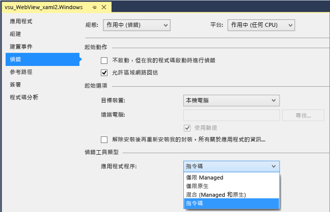
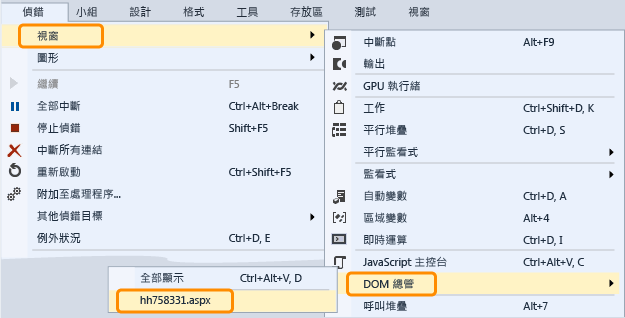

# 偵錯 WebView 控制項
[!INCLUDE[vs2017banner](../code-quality/includes/vs2017banner.md)]

  
  
 若要在 Windows 執行階段應用程式中檢查及偵錯 `WebView` 控制項，您可以設定 Visual Studio 在您啟動應用程式時附加指令碼偵錯工具。  從 Visual Studio 2013 Update 2 開始，您有兩種方法可以使用偵錯工具與 `WebView` 控制項互動：  
  
-   開啟 `WebView` 執行個體的 \[DOM 總管\]，然後檢查 DOM 項目、調查 CSS 樣式問題，並測試動態呈現的樣式變更。  
  
-   選取 `WebView` 執行個體中顯示的網頁或 `iFrame` 作為 \[JavaScript Console\] 視窗中的目標，然後使用主控台命令與網頁互動。  主控台提供對於目前指令碼執行內容的存取。  
  
### 附加偵錯工具 \(C\#、Visual Basic、C\+\+\)  
  
1.  在 Visual Studio 中，將 `WebView` 控項項加入 Windows 執行階段元件。  
  
2.  在 \[方案總管\] 中，從專案的捷徑功能表選擇 \[屬性\]，即可開啟專案的屬性。  
  
3.  選擇 \[偵錯\]。  在 \[應用程式程序\] 清單中，選擇 \[指令碼\]。  
  
       
  
4.  \(選擇性\) 若為非 Express 版本的 Visual Studio，依序選擇 \[工具\]、\[選項\]、\[偵錯\]、\[Just\-In\-Time\]，然後停用指令碼的 Just\-In\-Time \(JIT\) 偵錯，以停用 JIT 偵錯。  
  
    > [!NOTE]
    >  藉由停用 JIT 偵錯，您可以隱藏在部分網頁上發生之未處理例外的對話方塊。  在 Visual Studio Express 中，一律停用 JIT 偵錯。  
  
5.  按 F5 開始偵錯作業。  
  
### 使用 \[DOM 總管\] 檢查及偵錯 WebView 控制項  
  
1.  \(C\#、Visual Basic、C\+\+\) 將指令碼偵錯工具附加到應用程式。  請參閱第一節裡的指示。  
  
2.  如果您尚未這麼做，請將 `WebView` 控制項加入到應用程式，然後按 F5 開始偵錯。  
  
3.  巡覽到包含 `Webview` 控制項的頁面。  
  
4.  依序選擇 \[偵錯\]、\[視窗\]、\[DOM 總管\]，再選擇您要檢查的 `WebView` URL，即可開啟 `WebView` 控制項的 \[DOM 總管\] 視窗。  
  
       
  
     與 `WebView` 相關的 \[DOM 總管\] 會顯示為 Visual Studio 中的新索引標籤。  
  
5.  檢視並修改動態 DOM 項目和 CSS 樣式，如 [使用 DOM 總管偵錯 CSS 樣式](../debugger/debug-css-styles-using-dom-explorer.md) 中所述。  
  
### 使用 \[JavaScript 主控台\] 視窗檢查及偵錯 WebView 控制項  
  
1.  \(C\#、Visual  Basic、C\+\+\)  將指令碼偵錯工具附加到應用程式。  請參閱第一節裡的指示。  
  
2.  如果您尚未這麼做，請將  `WebView` 控制項加入到應用程式，然後按 F5 開始偵錯。  
  
3.  依序選擇 \[偵錯\]、\[視窗\]、\[JavaScript 主控台\]，開啟 `WebView` 控制項的 \[JavaScript 主控台\] 視窗。  
  
     隨即顯示 \[JavaScript 主控台\] 視窗。  
  
4.  巡覽到包含 `Webview` 控制項的頁面。  
  
5.  在 \[主控台\] 視窗中，選取 \[目標\] 清單的 `WebView` 控制項所顯示的網頁或 `iFrame`。  
  
       
  
    > [!NOTE]
    >  使用主控台，您可以一次與單一 `WebView`、`iFrame`、共用連絡人或 Web 背景工作互動。  每個項目需要個別的 Web 平台主機 \(WWAHost.exe\) 執行個體。  您一次可以與一個主機互動。  
  
6.  檢視並修改應用程式中的變數，或使用主控台命令，如 [快速入門：偵錯 JavaScript](../debugger/quickstart-debug-javascript-using-the-console.md) 和 [JavaScript 主控台命令](../debugger/javascript-console-commands.md) 中所述。  
  
## 請參閱  
 [快速入門：偵錯 HTML 和 CSS](../debugger/quickstart-debug-html-and-css.md)