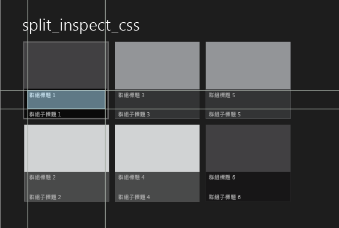
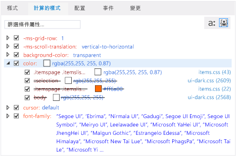

# 使用 DOM 總管偵錯 CSS 樣式
[!INCLUDE[vs2017banner](../code-quality/includes/vs2017banner.md)]

  
  
 當您偵錯 Windows 市集、Windows Phone 市集應用程式和使用 Visual Studio Tools for Apache Cordova 建立的應用程式時，可以檢視和變更所選 DOM 項目及其子項目的 CSS 規則。  
  
 \[DOM 總管\] 中的 \[樣式\] 和 \[計算\] 索引標籤會顯示套用到所選項目的 CSS 規則。 這些規則會根據 CSS 優先順序規則並依其精確性顯示。 索引標籤中選取器或樣式最上方的規則 \(最特殊的規則\) 最後才會套用至選取的項目，而選取器或樣式最下方的規則會最先套用。 套用規則時，這些規則會覆寫先前套用的規則。  
  
 \[樣式\]、\[計算\] 和 \[變更\] 索引標籤可提供不同的樣式資訊檢視。  
  
-   使用 \[**樣式**\] 索引標籤可檢視依 CSS 選取器名稱組織的規則，例如 `html, body`。 您也可以使用這個索引標籤啟用或停用特定樣式、手動編輯值，以及查看這些變更的立即結果。  
  
-   使用 \[**計算**\] 索引標籤可檢視樣式的計算值。 例如，如果您將大小設為 1em，則 Internet Explorer 計算出的值可能會是 16px。 這個索引標籤中的樣式會依樣式名稱組織，例如 `height`。 您也可以使用這個索引標籤啟用或停用特定樣式、手動編輯值，以及查看這些變更的立即結果。  
  
    > [!NOTE]
    >  在 Visual Studio 2013 Update 2 中，\[追蹤\] 索引標籤中提供的資訊已和 \[計算\] 索引標籤合併，而 \[追蹤\] 索引標籤則已移除。  
  
-   使用 \[變更\] 索引標籤 \(僅限 Windows 市集和 Windows Phone 市集應用程式\) 可識別及追蹤您在偵錯工作階段變更的 CSS 樣式。  
  
> [!TIP]
>  您在 \[樣式\] 和 \[追蹤\] 索引標籤中所做的樣式變更並非永久變更。 當您停止偵錯時，變更就會遺失。 若要在不停止再重新開始偵錯工具的情況下，變更原始程式碼並重新載入頁面，請使用 \[偵錯\] 工具列上的  按鈕 \(\[重新整理 Windows 應用程式\]\) 按鈕，重新整理您的應用程式 \(僅限 Windows 市集和 Windows Phone 市集應用程式\)。 如需詳細資訊，請參閱 [重新整理應用程式 \(JavaScript\)](../debugger/refresh-an-app-javascript.md)。  
  
## CSS 規則修正範例  
 這個範例將示範如何檢查 CSS 規則並對樣式問題進行偵錯。 在這個範例中，假設您想要在 [!INCLUDE[win8_appname_long](../debugger/includes/win8_appname_long_md.md)] 分割應用程式範本內，變更用來顯示群組標題的字型色彩。  
  
> [!NOTE]
>  此範例會示範 Windows 市集應用程式，但顯示的所有 \[DOM 總管\] 功能也適用於 Windows Phone 市集應用程式，以及 \(\[變更\] 索引標籤除外\) 使用 Visual Studio Tools for Apache Cordova 建立的應用程式。  
  
#### 檢視及變更 CSS 規則  
  
1.  使用 Visual Studio 的分割應用程式專案範本，建立採用 JavaScript 和 HTML 的 [!INCLUDE[win8_appname_long](../debugger/includes/win8_appname_long_md.md)] 應用程式。  
  
2.  在 \[**方案總管**\] 中，開啟 items.css  \(您可以在 \[pages\] 資料夾中找到 items.css\)。  
  
3.  將下列 CSS 程式碼：  
  
    ```css  
    .itemspage .itemslist .item { -ms-grid-columns: 1fr; -ms-grid-rows: 1fr 90px; display: -ms-grid; height: 250px; width: 250px; }  
    ```  
  
     取代為這個：  
  
    ```css  
    .itemspage .itemslist .item { -ms-grid-columns: 1fr; -ms-grid-rows: 1fr 90px; display: -ms-grid; height: 250px; width: 250px; color: #ff6a00; }  
    ```  
  
     這樣會新增一個樣式，該樣式會為清單中的每個項目指定色彩 \#ff6a00 \(橙色\)。 CSS 選取器 `.itemspage .itemslist .item` 表示 items.html 中 DIV 項目的一組類別名稱，會在即時 DOM 中做為巢狀項目出現。`item` DIV 項目 \(Element\) 會指定清單項目 \(Item\)。  
  
4.  在 \[**偵錯**\] 工具列上，選取下拉式清單中的 \[**模擬器**\] \(\[**本機電腦**\] 為預設值\)。  
  
       
  
5.  請按 F5 以偵錯模式執行應用程式。  
  
     當應用程式完成載入時，查看清單項目的標題，例如 \[**群組標題: 1**\]。 色彩並未變更，因此嘗試將橙色套用至標題無效。 我們將使用 DOM 總管中的 CSS 索引標籤找出哪裡出錯並且修正。  
  
    > [!TIP]
    >  應用程式出現在模擬器中之後，將模擬器放置在 Visual Studio 視窗旁邊，如此就能立即看見進行選取和變更 CSS 樣式的結果。  
  
6.  切換至 Visual Studio，然後按一下 \[DOM 總管\] 中的 \[**選取項目**\] \(或按 Ctrl\+B\)。 這樣會變更選取模式，讓您按一下就能選取項目，並且將應用程式放置到前景。 按一下，這個模式就會還原。 這是 \[**選取項目**\] 按鈕。  
  
    > [!TIP]
    >  您也可以直接在 DOM 總管中選取 HTML 項目。 如需選取項目的詳細資訊，請參閱 [快速入門：偵錯 HTML 和 CSS](../debugger/quickstart-debug-html-and-css.md)。  
  
7.  在模擬器首頁的左面板中，將滑鼠游標暫留在清單中第一個項目的標題 \(\[**群組標題：1**\]\) 上。 標題會醒目提示，如下所示：  
  
       
  
    > [!NOTE]
    >  Windows Phone 模擬器僅部分支援藉由滑鼠游標停留來醒目提示項目。  
  
8.  按一下含外框的標題。 DOM 總管會自動選取對應的 HTML 項目，該項目看起來類似這樣。  
  
    ```html  
    <h4 class="item-title">Group Title: 1</h4>  
    ```  
  
     當您在 DOM 總管中選取 H4 項目時，DOM 總管索引標籤現在會顯示與 H4 項目相關聯的規則。 \[**計算**\] 索引標籤會在這裡顯示，並且開啟 `color` 屬性：  
  
       
  
     這個檢視提供有關與 `color` 樣式關聯之規則的實用資訊，如下所述：  
  
    -   我們在 items.css 中修改的 CSS 選取器 `.itemspage .itemslist .item` 不會在最後的樣式計算中使用，而會以刪除線文字顯示。 出現在其他位置的幾個 `color` 樣式也不會使用。  
  
        > [!TIP]
        >  若是較長的選取器名稱，則會在工具提示中顯示完整名稱。  
  
    -   最終計算的 CSS 值 `rgba(255, 255, 255, 0.87)` 是針對下列 CSS 選取器明確設定：`.itemspage .itemslist .item .item-overlay .item-title`，該選取器也是在 items.css 中定義。  
  
        > [!TIP]
        >  現在，我們已經知道設定標題色彩的位置，也知道可以進行變更的位置。 不過，在其餘步驟中，我們將示範如何在不重新整理應用程式的情況下，於 DOM 總管中測試變更。  
  
9. 清除第一個出現的 `color` 樣式的核取方塊，該樣式用於 `.itemspage .itemslist .item .item-overlay .item-title` 選取器。 現在，在模擬器中您會看到項目標題的色彩全都變成橙色，就如我們所預期，而且我們在 CSS 中修改的選取器 `.itemspage .itemslist .item` 不再遭到覆寫，也就是不再套用刪除線文字。 清除核取方塊之後的 \[計算\] 索引標籤如下。  
  
       
  
10. 選取 \[變更\] 索引標籤。  
  
     使用 \[**變更**\] 索引標籤可識別及追蹤您在偵錯工作階段所做的樣式變更。 下圖顯示 \[**變更**\] 索引標籤中的 `.itemspage .itemslist .item .item-overlay .item-title` 選取器，它現在已被覆寫。  
  
       
  
11. 您也可以在 \[**樣式**\] 索引標籤中手動編輯 CSS 樣式值，然後立即查看結果。  
  
12. 選取 \[**樣式**\] 索引標籤。  
  
13. 開啟 `.itemspage .itemslist .item .item-overlay .item-title` 樣式選取器。  
  
14. 選取第一個出現的 `color` 樣式，然後按兩下屬性值 `rgb(255, 255, 255, 0.87)`。  
  
15. 使用鍵盤修改這個值。 將它變更為 `rgb(255, 255, 0, 0.87)`，然後按 Enter。 模擬器中項目標題的色彩會全部變更為黃色。  
  
16. 若要變更來源 CSS 檔，請按一下 \[**樣式**\] 索引標籤上的 \[**items.css**\] 連結。 這樣會開啟 items.css，您可以在其中變更應用程式程式碼中 `color` 樣式的值。 若要在不停止即重新開始偵錯工具的情況下，重新整理應用程式，請按一下 \[偵錯\] 工具列上的  \(\[重新整理 Windows\] 應用程式\)。  
  
## 請參閱  
 [快速入門：偵錯 HTML 和 CSS](../debugger/quickstart-debug-html-and-css.md)   
 [使用 DOM 總管偵錯配置](../debugger/debug-layout-using-dom-explorer.md)   
 [檢視 DOM 事件接聽程式](../debugger/view-dom-event-listeners.md)   
 [產品支援和協助工具](http://go.microsoft.com/fwlink/?LinkId=253502)