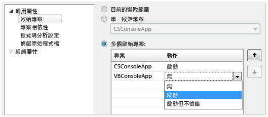
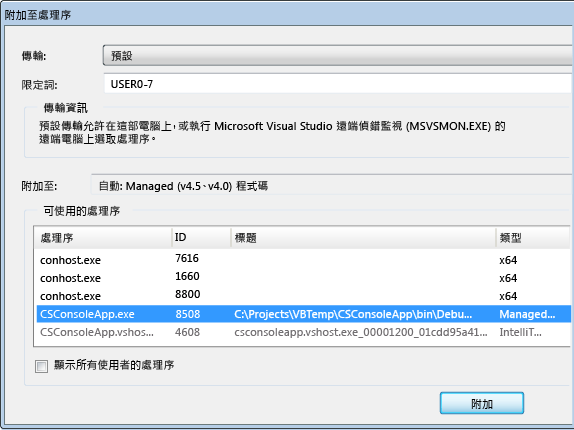
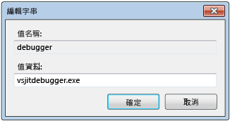
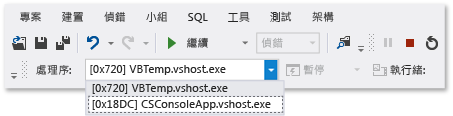
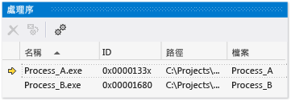

# 在 Visual Studio 中偵錯一個或多個處理序
[!INCLUDE[vs2017banner](../code-quality/includes/vs2017banner.md)]

以下說明如何開始偵錯處理序、在處理序之間切換、中斷和繼續執行、逐步執行來源、停止偵錯，以及結束處理序或中斷處理序連結。  
  
##   內容  
 [設定多個處理序的執行行為](#BKMK_Configure_the_execution_behavior_of_multiple_processes)  
  
 [尋找原始程式檔和符號 (.pdb) 檔](#BKMK_Find_the_source_and_symbol___pdb__files)  
  
 [在 VS 方案中啟動多個處理序、附加至處理序、在偵錯工具中自動啟動處理序](#BKMK_Start_multiple_processes_in_a_VS_solution__attach_to_a_process__automatically_start_a_process_in_the_debugger)  
  
 [切換處理序、中斷和繼續執行、逐步執行來源](#BKMK_Switch_processes__break_and_continue_execution__step_through_source)  
  
 [停止偵錯、結束處理序或中斷處理序連結](#BKMK_Stop_debugging__terminate_or_detach_from_processes)  
  
##   設定多個處理序的執行行為  
 根據預設，當偵錯工具中有多個處理序正在執行時，中斷、逐步執行或停止偵錯工具命令通常會影響所有處理序。  例如，當一個處理序在中斷點暫止時，所有其他處理序的執行也會暫止。  您可以變更這項預設行為，以便更充分掌控執行命令的目標。  
  
1.  在 \[**偵錯**\] 功能表上選擇 \[**選項和設定**\]。  
  
2.  在 \[**偵錯**\]、\[**一般**\] 頁面上，清除 \[**如果其中一個處理序中斷，就中斷所有處理序**\] 核取方塊。  
  
  [內容](#BKMK_Contents)  
  
##   尋找原始程式檔和符號 \(.pdb\) 檔  
 若要巡覽處理序的原始程式碼，偵錯工具需要存取處理序的原始程式檔和符號檔。  請參閱 [指定符號 \(.pdb\) 和原始程式檔](../debugger/specify-symbol-dot-pdb-and-source-files-in-the-visual-studio-debugger.md)。  
  
 如果您無法存取處理序的檔案，可以使用 \[反組譯碼\] 視窗進行巡覽。  請參閱 [如何：使用反組譯碼視窗](../debugger/how-to-use-the-disassembly-window.md)  
  
  [內容](#BKMK_Contents)  
  
##   在 VS 方案中啟動多個處理序、附加至處理序、在偵錯工具中自動啟動處理序  
  
-   [在 Visual Studio 方案中開始偵錯多個處理序](#BKMK_Start_debugging_multiple_processes_in_a_Visual_Studio_solution) • [變更啟始專案](#BKMK_Change_the_startup_project) • [在方案中啟動特定專案](#BKMK_Start_a_specific_project_in_a_solution) • [在方案中啟動多個專案](#BKMK_Start_multiple_projects_in_a_solution) • [附加至處理序](#BKMK_Attach_to_a_process) • [在偵錯工具中自動啟動處理序](#BKMK_Automatically_start_an_process_in_the_debugger)  
  
> [!NOTE]
>  偵錯工具不會自動附加至所偵錯處理序啟動的子處理序 \(即使子專案位於相同方案中\)。  若要偵錯子處理序：  
>   
>  -   在子處理序啟動之後附加至該子處理序。  
>   
>      \-或\-  
> -   將 Windows 設定為自動在偵錯工具的新執行個體中啟動子處理序。  
  
###   在 Visual Studio 方案中開始偵錯多個處理序  
 如果您的 Visual Studio 方案中有多個可以獨立執行的專案 \(在個別處理序中執行的專案\)，您就可以選取偵錯工具要啟動的專案。  
  
   
  
####   變更啟始專案  
 若要變更方案的啟始專案，請在 \[方案總管\] 中選取專案，然後從內容功能表選擇 \[**設定為啟始專案**\]。  
  
####   在方案中啟動特定專案  
 若要啟動方案中的某個專案，而不變更預設啟始專案，請在 \[方案總管\] 中選取專案，然後從內容功能表選擇 \[**偵錯**\]。  然後您就可以選擇 \[**開始新執行個體**\] 或 \[**逐步執行新執行個體**\]。  
  
  [在 VS 方案中啟動多個處理序、附加至處理序、在偵錯工具中自動啟動處理序](../debugger/debug-multiple-processes.md#BKMK_Start_multiple_processes_in_a_VS_solution__attach_to_a_process__automatically_start_a_process_in_the_debugger)  
  
  [內容](#BKMK_Contents)  
  
####   在方案中啟動多個專案  
  
1.  選取 \[方案總管\] 中的方案，然後選擇內容功能表中的 \[**屬性**\]。  
  
2.  在 \[**屬性**\] 對話方塊中，選取 \[**通用屬性**\]、\[**啟始專案**\]。  
  
3.  針對您要變更的每個專案，選擇 \[**啟動**\]、\[**啟動但不偵錯**\] 或 \[**無**\]。  
  
  [在 VS 方案中啟動多個處理序、附加至處理序、在偵錯工具中自動啟動處理序](../debugger/debug-multiple-processes.md#BKMK_Start_multiple_processes_in_a_VS_solution__attach_to_a_process__automatically_start_a_process_in_the_debugger)  
  
  [內容](#BKMK_Contents)  
  
###   附加至處理序  
 偵錯工具也可以「*附加*」\(Attach\) 至正在 Visual Studio 外部的處理序中執行的程式，包括在遠端裝置上執行的程式。  附加至程式之後，您就可以使用偵錯工具的執行命令、檢查程式狀態等等。  根據程式建置時是否包含偵錯資訊以及您是否能存取程式的原始程式碼，還有 Common Language Runtime JIT 編譯器是否會追蹤偵錯資訊，可能會對檢查程式狀態的能力有所限制。  
  
 如需詳細資訊，請參閱[附加至執行中處理序](../debugger/attach-to-running-processes-with-the-visual-studio-debugger.md)。  
  
 **附加至正在本機電腦上執行的處理序**  
  
 選擇 \[**偵錯**\]、\[**附加至處理序**\]。  在 \[**附加至處理序**\] 對話方塊中，選取 \[**可使用的處理序**\] 清單中的處理序，然後選擇 \[**附加**\]。  
  
   
  
  [內容](#BKMK_Contents)  
  
###   在偵錯工具中自動啟動處理序  
 有時候，您可能需要對其他處理序所啟動程式的啟始程式碼進行偵錯。  這類範例包括了服務和自訂安裝動作。  在這些案例中，您可以讓偵錯工具在應用程式啟動時啟動並自動附加。  
  
1.  啟動登錄編輯程式 \(**regedit.exe**\)。  
  
2.  巡覽至 **HKEY\_LOCAL\_MACHINE\\Software\\Microsoft\\Windows NT\\CurrentVersion\\Image File Execution Options** 資料夾。  
  
3.  選取要在偵錯工具中啟動之應用程式的資料夾。  
  
     如果應用程式的名稱未列為子資料夾，請選取 \[**Image File Execution Options**\]，然後選擇內容功能表上的 \[**新增**\]、\[**機碼**\]。  選取 \[新機碼\]，選擇捷徑功能表上的 \[**重新命名**\]，然後輸入應用程式的名稱。  
  
4.  在應用程式資料夾的內容功能表上，選擇 \[**新增**\]、\[**字串值**\]。  
  
5.  將新值名稱從 **New Value** 變更為 `debugger`。  
  
6.  在偵錯工具項目的內容功能表中，選擇 \[**修改**\]。  
  
7.  在 \[編輯字串\] 對話方塊的 \[**數值資料**\] 方塊中輸入 `vsjitdebugger.exe`。  
  
       
  
   
  
  [內容](#BKMK_Contents)  
  
##   切換處理序、中斷和繼續執行、逐步執行來源  
  
-   [切換處理序](#BKMK_Switch_between_processes) • [中斷、逐步執行和繼續命令](#BKMK_Break__step__and_continue_commands)  
  
###   切換處理序  
 進行偵錯時，您可以附加至多個處理序，但是無論在任何時間，偵錯工具一次只能有一個使用中處理序。  您可以在 \[偵錯位置\] 工具列或 \[**處理序**\] 視窗中設定使用中或*目前*的處理序。  若要在處理序之間切換，兩個處理序必須處於中斷模式。  
  
 **若要設定目前的處理序**  
  
-   在 \[偵錯位置\] 工具列上選擇 \[**處理序**\]，檢視 \[**處理序**\] 清單方塊。  選取您要指定為目前處理序的處理序。  
  
       
  
     如果看不到 \[**偵錯位置**\] 工具列，請選擇 \[**工具**\]、\[**自訂**\]。  在 \[**工具列**\] 索引標籤上，選擇 \[**偵錯位置**\]。  
  
-   開啟 \[**處理序**\] 視窗 \(快速鍵 **Ctrl\+Alt\+Z**\)，尋找您要設為目前處理序的處理序，並按兩下該處理序。  
  
       
  
     目前的處理序會以黃色箭號標記。  
  
 切換至專案會將該專案設為目前要偵錯的處理序。  您檢視的所有偵錯工具視窗都會顯示目前處理序的狀態，而且所有逐步執行命令只會影響目前處理序。  
  
  [切換處理序、中斷和繼續執行、逐步執行來源](../debugger/debug-multiple-processes.md#BKMK_Switch_processes__break_and_continue_execution__step_through_source)  
  
  [內容](#BKMK_Contents)  
  
###   中斷、逐步執行和繼續命令  
  
> [!NOTE]
>  根據預設，中斷、繼續和逐步執行偵錯工具命令會影響所有正在偵錯的處理序。  若要變更這個行為，請參閱[設定多個處理序的執行行為](#BKMK_Configure_the_execution_behavior_of_multiple_processes)  
  
||||  
|-|-|-|  
|**命令**|**如果其中一個處理序中斷，就中斷所有處理序**   已核取 \(預設值\)|**如果其中一個處理序中斷，就中斷所有處理序**   已清除|  
|\[**偵錯**\] 功能表：   -   **全部中斷**|所有處理序都會中斷。|所有處理序都會中斷。|  
|\[**偵錯**\] 功能表：   -   **繼續**|所有處理序都會繼續執行。|所有暫止的處理序都會繼續執行。|  
|\[**偵錯**\] 功能表：   -   **逐步執行** -   **不進入函式** -   **跳離函式**|當目前處理序逐步執行時，所有處理序仍會執行。   然後所有處理序都會中斷。|目前處理序會逐步執行。   暫止的處理序會繼續執行。   執行中的處理序會繼續執行。|  
|\[**偵錯**\] 功能表：   -   **逐步執行目前處理序** -   **不進入目前處理序** -   **跳離目前處理序**|N\/A|目前處理序會逐步執行。   其他處理序維持其現有的狀態 \(已暫止或執行中\)。|  
|來源視窗   -   **中斷點**|所有處理序都會中斷。|只要來源視窗處理序會中斷。|  
|來源視窗內容功能表：   -   **執行至游標處**   來源視窗必須在目前處理序中。|當來源視窗處理序執行至游標處然後中斷時，所有處理序仍會執行。   然後所有其他處理序都會中斷。|來源視窗處理序會執行至游標處。   其他處理序維持其現有的狀態 \(已暫止或執行中\)。|  
|\[**處理序**\] 視窗內容功能表：   -   **中斷處理序**|N\/A|選取的處理序會中斷。   其他處理序維持其現有的狀態 \(已暫止或執行中\)。|  
|\[**處理序**\] 視窗內容功能表：   -   **繼續處理序**|N\/A|選取的處理序會繼續執行。   其他處理序維持其現有的狀態 \(已暫止或執行中\)。|  
  
  [切換處理序、中斷和繼續執行、逐步執行來源](../debugger/debug-multiple-processes.md#BKMK_Switch_processes__break_and_continue_execution__step_through_source)  
  
  [內容](#BKMK_Contents)  
  
##   停止偵錯、結束處理序或中斷處理序連結  
  
-   [停止、結束及中斷連結命令](#BKMK_Stop__terminate__and_detach_commands)  
  
 根據預設，如果您在偵錯工具中有多個處理序為開啟狀態時選擇 \[**偵錯**\]、\[**停止偵錯**\]，則偵錯工具會根據處理序在偵錯工具中開啟的方式，將所有處理序結束或中斷連結：  
  
-   如果目前處理序是在偵錯工具中啟動，則會結束該處理序。  
  
-   如果您將偵錯工具附加至目前的處理序，則偵錯工具會與處理序中斷連結，並讓處理序繼續執行。  
  
 例如，如果您開始偵錯 Visual Studio 方案中的處理序，附加至另一個已在執行的處理序，然後選擇 \[**停止偵錯**\]，則偵錯工作階段會結束，在 Visual Studio 中啟動的處理序會結束，而您附加的處理序會保持執行。  您可以使用下列程序控制停止偵錯的方式。  
  
> [!NOTE]
>  \[**如果其中一個處理序中斷，就中斷所有處理序**\] 選項不會影響停止偵錯或結束處理序及中斷連結。  
  
 **若要變更停止偵錯影響個別處理序的方式**  
  
-   開啟 \[**處理序**\] 視窗 \(快速鍵 **Ctrl\+Alt\+Z**\)。  選取處理序，然後選取或清除 \[**偵錯停止時中斷連結**\] 核取方塊。  
  
###   停止、結束及中斷連結命令  
  
|||  
|-|-|  
|**命令**|**說明**|  
|\[**偵錯**\] 功能表：   -   **停止偵錯**|除非已透過 \[**處理序**\] 視窗的 \[**偵錯停止時中斷連結**\] 選項變更行為：   1.  偵錯工具所啟動的處理序將會結束。 2.  附加的處理序會與偵錯工具中斷連結。|  
|\[**偵錯**\] 功能表：   -   **全部結束**|所有處理序都會結束。|  
|\[**偵錯**\] 功能表：   -   **中斷所有連結**|偵錯工具會從所有處理序中斷連結。|  
|\[**處理序**\] 視窗內容功能表：   -   **中斷處理序連結**|偵錯工具會從選取的處理序中斷連結。   其他處理序維持其現有的狀態 \(已暫止或執行中\)。|  
|\[**處理序**\] 視窗內容功能表：   -   **結束處理序**|選取的處理序將會結束。   其他處理序維持其現有的狀態 \(已暫止或執行中\)。|  
|\[**處理序**\] 視窗內容功能表：   -   **偵錯停止時中斷連結**|切換所選取處理序的 \[**偵錯**\]、\[**停止偵錯**\] 行為：   -   已核取：偵錯工具會與處理序中斷連結。 -   已清除：處理序將會結束。|  
  
  [停止偵錯、結束處理序或中斷處理序連結](../debugger/debug-multiple-processes.md#BKMK_Stop_debugging__terminate_or_detach_from_processes)  
  
  [內容](#BKMK_Contents)  
  
## 請參閱  
 [指定符號 \(.pdb\) 和原始程式檔](../debugger/specify-symbol-dot-pdb-and-source-files-in-the-visual-studio-debugger.md)   
 [附加至執行中處理序](../debugger/attach-to-running-processes-with-the-visual-studio-debugger.md)   
 [使用偵錯工具巡覽程式碼](../debugger/navigating-through-code-with-the-debugger.md)   
 [Just\-In\-Time 偵錯](../debugger/just-in-time-debugging-in-visual-studio.md)   
 [偵錯多執行緒應用程式](../debugger/debug-multithreaded-applications-in-visual-studio.md)