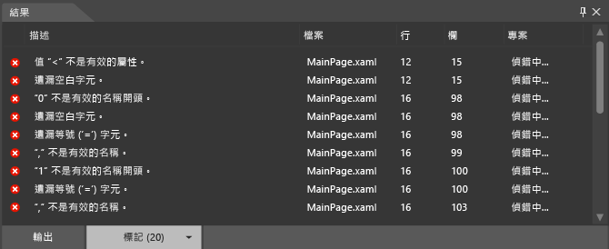

# 在 Blend 中偵錯 XAML
[!INCLUDE[vs2017banner](../code-quality/includes/vs2017banner.md)]

您可以使用 [!INCLUDE[blend_first](../debugger/includes/blend_first_md.md)] 中的工具為應用程式的 XAML 偵錯。  當您建置專案時，所有錯誤都會顯示在 \[**結果**\] 面板中。  只要按兩下錯誤，即可找到與該錯誤相關的標記。  如果需要更多工作空間，您可以按 F12 隱藏 \[**結果**\] 面板。  
  
## 語法錯誤  
 如果 XAML 或程式碼後置檔案不符合語言的格式規則，就會發生語法錯誤。  錯誤描述有助於您了解修正方法。  這份清單也會指出發生錯誤的檔案名稱與行號。  XAML 錯誤會顯示在 \[**結果**\] 面板的 \[**標記**\] 索引標籤中。  
  
> [!TIP]
>  XAML 是 XML 架構的標記語言，並且遵循 XML 語法規則。  
  
 常見的一些 XAML 語法錯誤原因如下：  
  
-   關鍵字拼錯或大小寫錯誤。  
  
-   屬性或文字字串周圍遺漏引號。  
  
-   XAML 元素遺漏結尾標。  
  
-   XAML 元素位於禁止的位置。  
  
 如需 XAML 語法的詳細資訊，請參閱[基本 XAML 語法指南](http://go.microsoft.com/fwlink/?LinkId=329942)。  
  
 此外，您也可以在 [!INCLUDE[blend_subs](../debugger/includes/blend_subs_md.md)] 中辨識並解決簡單的程式碼後置語法錯誤、編譯錯誤和執行階段錯誤。  但是，在 Visual Studio 中能夠較容易辨識並解決程式碼後置語法錯誤。  
  
### 偵錯範例 XAML 程式碼  
 下列範例會引導您在 [!INCLUDE[blend_subs](../debugger/includes/blend_subs_md.md)] 中完成簡單的 XAML 偵錯工作階段。  
  
##### 若要建立專案  
  
1.  在 [!INCLUDE[blend_subs](../debugger/includes/blend_subs_md.md)] 中，開啟 \[**檔案**\] 功能表，然後指向 \[**新增專案**\]。  
  
     專案類型清單隨即出現在 \[**新增專案**\] 對話方塊的左邊。  當您按一下專案類型時，與該類型有關聯的專案範本會顯示在右邊。  
  
2.  在專案類型清單中，按一下 \[**XAML \(Windows 市集\)**\]。  
  
3.  在專案範本清單中，按一下 \[ **空白應用程式**\]。  
  
4.  在 \[**名稱**\] 文字方塊中，輸入 `DebuggingSample`。  
  
5.  在 \[**位置**\] 文字方塊中，確認專案的位置。  
  
6.  按一下 \[**語言**\] 清單中的 \[**Visual C\#**\]，然後按一下 \[**確定**\] 建立專案。  
  
7.  以滑鼠右鍵按一下設計介面，然後按一下 \[**檢視原始檔**\] 以切換至 \[**分割**\] 檢視。  
  
8.  按下列程式碼右上角的 \[複製\] 連結以複製程式碼。  
  
    ```  
    <Grid HorizontalAlignment="Left" Height="222" VerticalAlignment="Top>  
         <Button content="Button" x:Mame="Home" HorizontalAlignment="Left" VerticalAlignment="Top"/>  
         <Button Content="Button" HorizontalAlignment="Left" VerticalAlignment="Top" Margin="0,38,0,0">  
         <Button Content="Button" HorizontalAlignment="Left" VerticalAlignment="Top" Margin="0,75,0,0"/>  
         <Button Content="Button" HorizontalAlignment="Left" VerticalAlignment="Top" Margin="0,112,0,0"/>  
         <Button Content="Button" HorizontalAlignment="Left" VerticalAlignment="Top Margin="0,149,0,0"/>  
    </Grid>  
  
    ```  
  
9. 尋找預設的 **Grid**，然後在開頭和結尾 **Grid** 標記之間貼上程式碼。  當您完成時，您的程式碼應該像這樣：  
  
    ```  
    <Grid Background="{ThemeResource ApplicationPageBackgroundThemeBrush}">  
         <Grid HorizontalAlignment="Left" Height="222" VerticalAlignment="Top>  
              <Button content="Button" x:Mame="Home" HorizontalAlignment="Left" VerticalAlignment="Top"/>  
              <Button Content="Button" HorizontalAlignment="Left" VerticalAlignment="Top" Margin="0,38,0,0">  
              <Button Content="Button" HorizontalAlignment="Left" VerticalAlignment="Top" Margin="0,75,0,0"/>  
              <Button Content="Button" HorizontalAlignment="Left" VerticalAlignment="Top" Margin="0,112,0,0"/>  
              <Button Content="Button" HorizontalAlignment="Left" VerticalAlignment="Top Margin="0,149,0,0"/>  
         </Grid>  
    </Grid>  
  
    ```  
  
10. 按 Ctrl\+Shift\+B 建置專案。  
  
 螢幕隨即出現錯誤訊息，告訴您無法建置專案，同時應用程式底部的 \[結果\] 面板也會列出發生的錯誤。  
  
   
  
### 解決 XAML 錯誤  
 偵測到 XAML 錯誤時，設計介面上會出現警示，說明您的專案包含無效的標記。  當您解決錯誤時，\[**結果**\] 面板中的錯誤清單也會隨即更新。  當您解決所有錯誤時，設計介面會再次出現並顯示應用程式畫面。  
  
##### 若要解決 XAML 錯誤  
  
1.  按兩下清單中的第一個錯誤。  這個錯誤的描述是「值 '\<' 不是有效的屬性」。當您按兩下錯誤時，指標隨即找到程式碼中對應的位置。  `Button` 前面的 `<` 為有效字元，並非錯誤訊息中建議的屬性。  如果查看前一行程式碼，您會注意到 `Top` 屬性的右引號不見了。  請輸入右引號。  請注意，\[**結果**\] 面板中的錯誤清單隨即更新以反映您的變更。  
  
2.  按兩下描述 \["'0' 不是有效的名稱開頭。\]，隨即看到問題出在 `Margin="0,149,0,0"` 的形式不正確。  但是，請注意 `Margin` 的色彩標示與程式碼中的其他 `Margin` 執行個體不符。  由於這個 `Margin="` 前方的名稱\/值組少了右引號 \(`VerticalAlignment="Top`\)，因此就被視為屬於前一個屬性的值，導致 0 被視為名稱\/值組的開頭。  請輸入 `Top` 的右引號。  \[**結果**\] 面板中的錯誤清單隨即更新以反映您的變更。  
  
3.  按兩下剩餘的錯誤 \[關閉的 XML 標籤 "Button" 不相符\]。指標隨即移至結尾 **Grid** 標記處 \(`</Grid>`\)，提示錯誤是發生在 `Grid` 物件內。  請注意，第二個 `Button` 物件少了結尾標記。  在您加入結尾 `/` 之後，\[**結果**\] 面板清單也隨即更新。  我們現在已經解決一開始出現的錯誤，但是又出現了兩個錯誤。  
  
4.  按兩下 \[無法識別或無法存取成員 "content"。\]，`content` 中的 `c` 應該是大寫才對。  請將小寫 "c" 改成大寫 "C"。  
  
5.  按兩下 \[屬性 "Mame" 不存在於 "http:\/\/schemas.microsoft.com\/winfx\/2006\/xaml" 命名空間。\]，"Mame" 中的 "M" 應該為 "N"。將 "M" 取代為 "N"。現在已經可以解析 XAML，應用程式也隨即顯示在設計介面上。  
  
       
  
     按 Ctrl\+Shift\+B 建置專案，確定不再發生其他任何錯誤。  
  
## Visual Studio 偵錯  
 您可以在 Visual Studio 中開啟 [!INCLUDE[blend_subs](../debugger/includes/blend_subs_md.md)] 專案，讓應用程式的程式碼偵錯更為容易。  若要在 Visual Studio 中開啟 [!INCLUDE[blend_subs](../debugger/includes/blend_subs_md.md)] 專案，請以滑鼠右鍵按一下 \[**專案**\] 面板中的專案，然後按一下 \[**在 Visual Studio 進行編輯**\]。  在 Visual Studio 中結束偵錯工作階段之後，請按 Ctrl\+Shift\+S 儲存所有變更，然後再切換回 [!INCLUDE[blend_subs](../debugger/includes/blend_subs_md.md)]。  此時會出現要您重新載入專案的提示畫面。  請按一下 \[**全部皆是**\] 繼續在 [!INCLUDE[blend_subs](../debugger/includes/blend_subs_md.md)] 中處理專案。  
  
 如需應用程式偵錯的詳細資訊，請參閱[在 Visual Studio 中偵錯 Windows 市集應用程式](http://go.microsoft.com/fwlink/?LinkId=329944)。  
  
## 取得協助  
 如需對 [!INCLUDE[blend_subs](../debugger/includes/blend_subs_md.md)] 應用程式進行偵錯的詳細說明，可以搜尋 [Windows 市集應用程式社群論壇](http://go.microsoft.com/fwlink/?LinkId=280308)，找出與您問題相關的文章或張貼問題。