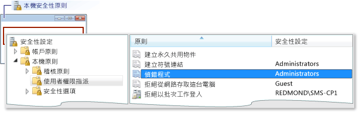
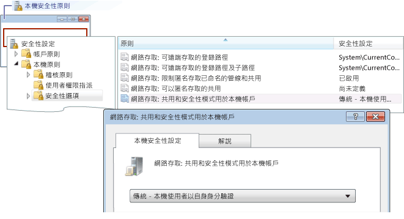

# 錯誤：工作群組遠端登入失敗
[!INCLUDE[vs2017banner](../code-quality/includes/vs2017banner.md)]

這個錯誤為：  
  
 登入失敗：不明的使用者名稱或錯誤密碼  
  
 **原因**  
  
 當您從工作群組上的電腦進行偵錯並嘗試連接遠端機器時，就可能會發生這個錯誤。  可能的原因包括：  
  
-   遠端機器上沒有符合名稱和密碼的帳戶。  
  
-   如果 Visual Studio 電腦和遠端電腦都位於工作群組中，則發生這個錯誤的原因，可能是因為遠端電腦上的預設 \[**本機安全性原則**\] 設定。  \[**本機安全性原則**\] 的預設設定是 \[**僅適用於來賓 \- 本機使用者以 Guest 驗證**\]。  若要在此設定上偵錯，您必須將遠端機器上的設定變更為 \[**一般 \- 本機使用者自我驗證**\]。  
  
> [!NOTE]
>  您必須是系統管理員，才能進行下列工作。  
  
### 若要開啟本機安全性原則視窗  
  
1.  啟動 **secpol.msc** Microsoft Management Console 嵌入式管理單元。  在 Windows \[搜尋\]、Windows \[執行\] 方塊或在 \[命令提示字元\] 中輸入 secpol.msc。  
  
### 若要加入使用者權限指派  
  
1.  Open the Loca  
  
2.  開啟 \[**本機安全性原則**\] 視窗。  
  
3.  展開 \[**本機原則**\] 資料夾。  
  
4.  按一下 \[**使用者權限指派**\]。  
  
5.  在 \[**原則**\] 欄中，按兩下 \[**偵錯程式**\] 檢視在 \[**本機安全性原則設定值**\] 對話方塊中的目前本機群組原則指派。  
  
       
  
6.  若要加入新使用者，請按一下 \[**新增使用者或群組**\] 按鈕。  
  
### 若要變更共用和安全性模式  
  
1.  開啟 \[**本機安全性原則**\] 視窗。  
  
2.  展開 \[**本機原則**\] 資料夾。  
  
3.  按一下 \[**安全性選項**\]。  
  
4.  在 \[**原則**\] 欄中按兩下 \[**網路存取：共用和安全性模式用於本機帳戶**\]。  
  
5.  在 \[**網路存取：共用和安全性模式用於本機帳戶**\] 對話方塊中，將值變更為 \[**一般 \- 本機使用者自我驗證**\]，然後按一下 \[**套用**\] 按鈕。  
  
       
  
## 請參閱  
 [遠端偵錯錯誤和疑難排解](../debugger/remote-debugging-errors-and-troubleshooting.md)   
 [遠端偵錯](../debugger/remote-debugging.md)