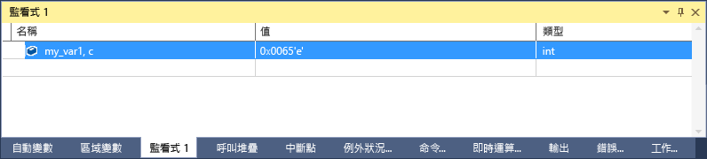

# C++ 中的格式規範
[!INCLUDE[vs2017banner](../code-quality/includes/vs2017banner.md)]

您可以使用格式規範變更在 \[監看式\] 視窗中顯示值的格式。  
  
 您也可以在 \[即時運算\] 視窗、\[命令\] 視窗，甚至來源視窗中使用格式規範。 如果暫停在這些視窗中的某個運算式上，結果則會顯示在 DataTip \(資料提示方塊\)。 DataTip 顯示會反映格式規範。  
  
> [!NOTE]
>  Visual Studio 原生偵錯工具變更成新的偵錯引擎。 這項變更包括加入一些新的格式規範，以及移除一些舊的格式規範。 當您使用 C\+\+\/CLI 執行 Interop \(混合原生和 Managed\) 偵錯時仍會使用較舊的偵錯工具。 本主題的下列章節說明每個偵錯引擎的格式規範。  
>   
>  -   [格式規範](#BKMK_Visual_Studio_2012_format_specifiers) 描述新偵錯引擎中的格式規範。  
> -   [使用 C++/CLI 的 Interop 偵錯格式規範](#BKMK_Format_specifiers_for_interop_debugging_and_C___edit_and_continue) 描述舊偵錯引擎中的格式規範。  
  
## 使用格式規範  
 如果您有下列程式碼：  
  
```cpp  
int main() { int my_var1 = 0x0065; int my_var2 = 0x0066; int my_var3 = 0x0067; }  
```  
  
 將 `my_var1` 變數加入 \[監看式\] 視窗 \(偵錯時，**偵錯 \/ Windows \/ 監看式 \/ 監看式 1**\) 並將顯示設定為十六進位 \(在 \[監看式\] 視窗中，以滑鼠右鍵按一下變數，然後選取 \[十六進位顯示\]\)。 現在監看式視窗顯示它包含了值 0x0065。 若希望數值以字元顯示，而非整數，請在 \[名稱\] 欄位中變數名稱後面，加入字元格式規範 **, c**。 \[值\] 資料行現在出現時會帶有 **101 'e'**。  
  
   
  
##  <a name="BKMK_Visual_Studio_2012_format_specifiers"></a> 格式規範  
 下表顯示可在 Visual Studio 中使用的格式規範。 使用 C\+\+\/CLI 的 Interop 偵錯不支援粗體的規範。  
  
|規範|格式|原始的監看值|顯示的值|  
|--------|--------|------------|----------|  
|d|十進位整數|0x00000066|102|  
|o|不帶正負號的八進位整數|0x00000066|000000000146|  
|x<br /><br /> **h**|十六進位整數|102|0xcccccccc|  
|X<br /><br /> **H**|十六進位整數|102|0xCCCCCCCC|  
|c|單一字元|0x0065, c|101 'e'|  
|s|const char\* 字串|\<位置\> “hello world”|"hello world"|  
|**sb**|const char\* 字串|\<位置\> “hello world”|hello world|  
|s8|const char\* 字串|\<位置\> “hello world”|"hello world"|  
|**s8b**|const char\* 字串|\<位置\> “hello world”|"hello world"|  
|su|const wchar\_t\* const<br /><br /> char16\_t\* 字串|\<位置\> L”hello world”|L"hello world"<br /><br /> u"hello world"|  
|sub|const wchar\_t\* const<br /><br /> char16\_t\* 字串|\<位置\> L”hello world”|hello world|  
|bstr|BSTR 字串|\<位置\> L”hello world”|L”hello world”|  
|**s32**|UTF\-32 字串|\<位置\> U”hello world”|U”hello world”|  
|**s32b**|Utf\-32 字串 \(沒有引號\)|\<位置\> U”hello world”|hello world|  
|**en**|enum|Saturday\(6\)|星期六|  
|**hv**|指標類型：指出檢查中的指標值是陣列堆積配置的結果，例如 `new int[3]`。|\<位置\>{\<第一個成員\>}|\<位置\> {\<第一個成員\>, \<第二個成員\>, ...}|  
|**na**|隱藏物件指標的記憶體位址。|\<位置\>，{成員\=值...}|{成員\=值...}|  
|**nd**|只顯示基底類別資訊，忽略衍生類別|`(Shape*) square` 包含基底類別和衍生類別資訊|只顯示基底類別資訊|  
|hr|HRESULT 或 Win32 錯誤碼。 \(偵錯工具現在可自動將 HRESULT 解碼，因此這個規範並不需要用於這些狀況中\)。|S\_OK|S\_OK|  
|wc|Window 類別旗標|0x0010|WC\_DEFAULTCHAR|  
|wm|Windows 訊息編號|16|WM\_CLOSE|  
|\!|未經處理格式，忽略任何資料類型檢視自訂|\<自訂的表示\>|4|  
  
> [!NOTE]
>  當 **hv** 格式規範出現時，偵錯工具會嘗試判斷緩衝區的長度並顯示適當的項目數目。 因為偵錯工具不一定能一直找到陣列確切的緩衝區大小，所以您應該盡可能使用大小規範 `(pBuffer,[bufferSize])`。**hv** 格式規範是針對緩衝區大小非隨時可用的案例。  
  
###  <a name="BKMK_Size_specifiers_for_pointers_as_arrays_in_Visual_Studio_2012"></a> 做為陣列的指標大小規範  
 如果想要將檢視的物件指標做為陣列，可以使用整數或運算式來指定陣列項目的數量：  
  
|規範|格式|原始的監看值|顯示的值|  
|--------|--------|------------|----------|  
|n|十進位或**十六進位**整數|pBuffer,\[32\]<br /><br /> pBuffer,**\[0x20\]**|顯示 `pBuffer` 為 32 個項目的陣列。|  
|**\[exp\]**|判斷值為整數的有效 C\+\+ 運算式。|pBuffer,\[bufferSize\]|PBuffer 顯示為 `bufferSize` 項目的陣列。|  
|**expand\(n\)**|判斷值為整數的有效 C\+\+ 運算式|pBuffer，expand\(2\)|顯示 `pBuffer` 的第三個項目|  
  
##  <a name="BKMK_Format_specifiers_for_interop_debugging_and_C___edit_and_continue"></a> 使用 C\+\+\/CLI 的 Interop 偵錯格式規範  
 偵錯原生和 C\+\+\/CLI 程式碼僅支援**粗體**的規範。  
  
|規範|格式|原始的監看值|顯示的值|  
|--------|--------|------------|----------|  
|**d,i**|帶正負號的十進位整數|0xF000F065|\-268373915|  
|**u**|不帶正負號的十進位整數|0x0065|101|  
|o|不帶正負號的八進位整數|0xF065|0170145|  
|x,X|十六進位整數|61541|0x0000f065|  
|**l,h**|長整數或短整數前置詞，用於：d、i、u、o、x、X|00406042|0x0c22|  
|**f**|帶正負號的浮點數|\(3.\/2.\), f|1.500000|  
|**e**|帶正負號的科學記號表示法|\(3.0\/2.0\)|1.500000e\+000|  
|**g**g|帶正負號的浮點數或帶正負號的科學記號表示法 \(兩者中較短者\)|\(3.0\/2.0\)|1.5|  
|c|單一字元|\<位置\>|101 'e'|  
|s|const char\*|\<位置\>|"hello world"|  
|su|const wchar\_t\*<br /><br /> const char16\_t\*|\<位置\>|L"hello world"|  
|sub|const wchar\_t\*<br /><br /> const char16\_t\*|\<位置\>|hello world|  
|s8|const char\*|\<位置\>|"hello world"|  
|hr|HRESULT 或 Win32 錯誤碼。 \(偵錯工具現在可自動將 HRESULT 解碼，因此這個規範並不需要用於這些狀況中\)。|S\_OK|S\_OK|  
|wc|Window 類別旗標。|0x00000040,|WC\_DEFAULTCHAR|  
|wm|Windows 訊息編號|0x0010|WM\_CLOSE|  
|\!|未經處理格式，忽略任何資料類型檢視自訂|\<自訂的表示\>|4|  
  
###  <a name="BKMK_Format_specifiers_memory_locations_in_interop_debugging_and_C___edit_and_continue"></a> 使用 C\+\+\/CLI 的 Interop 偵錯中記憶體位置的格式規範  
 下表包含了用於記憶體位置的格式化符號。 您可將記憶體位置規範用於評估結果為位置的任何數值或運算式。  
  
|符號|格式|原始的監看值|顯示的值|  
|--------|--------|------------|----------|  
|**ma**|64 個 ASCII 字元|0x0012ffac|0x0012ffac .4...0...".0W&.......1W&.0.:W..1...."..1.JO&.1.2.."..1...0y....1|  
|**m**|十六進位表示的 16 個位元組，後面跟著 16 個 ASCII 字元|0x0012ffac|0x0012ffac B3 34 CB 00 84 30 94 80 FF 22 8A 30 57 26 00 00 .4...0...".0W&..|  
|**mb**|十六進位表示的 16 個位元組，後面跟著 16 個 ASCII 字元|0x0012ffac|0x0012ffac B3 34 CB 00 84 30 94 80 FF 22 8A 30 57 26 00 00 .4...0...".0W&..|  
|**mw**|8 個字組|0x0012ffac|0x0012ffac 34B3 00CB 3084 8094 22FF 308A 2657 0000|  
|**md**|4 個 Doubleword|0x0012ffac|0x0012ffac 00CB34B3 80943084 308A22FF 00002657|  
|**mq**|2 個 Quadword|0x0012ffac|0x0012ffac 7ffdf00000000000 5f441a790012fdd4|  
|**mu**|2 個位元組的字元 \(Unicode\)|0x0012ffac|0x0012ffac 8478 77f4 ffff ffff 0000 0000 0000 0000|  
  
###  <a name="BKMK_Size_specifier_for_pointers_as_arrays_in_interop_debugging_and_C___edit_and_continue"></a> 在使用 C\+\+\/CLI 的 Interop 偵錯中做為陣列之指標的大小規範  
 如果想要將檢視的物件指標做為陣列，可以使用整數來指定陣列項目的數量：  
  
|規範|格式|運算式|顯示的值|  
|--------|--------|---------|----------|  
|n|十進位整數|pBuffer\[32\]|顯示 `pBuffer` 為 32 個項目的陣列。|