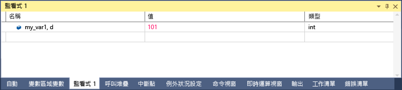

# C# 中的格式規範
[!INCLUDE[vs2017banner](../code-quality/includes/vs2017banner.md)]

您可以使用格式規範變更在**監看式**視窗中顯示值的格式。 您也可以在 \[即時運算\] 視窗、\[命令\] 視窗，甚至來源視窗中使用格式規範。 如果暫停在這些視窗中的某個運算式上，結果則會顯示在 DataTip \(資料提示方塊\)。 DataTip \(資料提示方塊\) 會反映 DataTip 顯示中的格式規範。  
  
 如要使用格式規範，請輸入運算式且後面加上逗號。 在逗號後面加上適當的規範。  
  
## 使用格式規範  
 如果您有下列程式碼：  
  
```  
{ int my_var1 = 0x0065; int my_var2 = 0x0066; int my_var3 = 0x0067; }  
```  
  
 將 `my_var1` 變數加入監看式視窗 \(偵錯時，**偵錯 \/ Windows \/ 監看式 \/ 監看式 1**\) 並將顯示設定為十六進位 \(在**監看式**視窗中，以滑鼠右鍵按一下變數，然後選取 \[十六進位顯示\]\)。 現在**監看式**視窗顯示它包含了值 0x0065。 若希望以十進位整數、非十六進位整數表示這個值，請在 \[名稱\] 欄位的變數名稱後面，加入十進位格式規範：**, d**。 \[值\] 欄位現在會顯示十進位值 101  
  
   
  
## 格式規範  
 下表說明偵錯工具可辨識的 C\# 格式規範。  
  
|規範|格式|原始的監看值|顯示|  
|--------|--------|------------|--------|  
|ac|強制評估運算式。 在隱含評估屬性和隱含函式呼叫關閉時，這就會很有用。 請參閱[副作用和運算式](../Topic/Side%20Effects%20and%20Expressions.md)。|訊息「使用者已關閉隱含函式評估」|\<value\>|  
|d|十進位整數|0x0065|101|  
|動態|使用動態檢視顯示指定的物件|顯示物件所有成員，包括動態檢視|只顯示動態檢視|  
|h|十六進位整數|61541|0x0000F065|  
|nq|沒有引號的字串|"My String"|My String|  
|隱藏|顯示所有公用及非公用成員|顯示公用成員|顯示所有成員|  
|raw|以項目在原始項目節點中出現的形式顯示該項目。 只有在 Proxy 物件上有效。|Dictionary\<T\>|Dictionary\<T\> 未經處理的檢視|  
|結果|搭配實作 IEnumerable 或 IEnumerable\<T\> 類型的變數使用，結果通常是查詢運算式。 只顯示包含查詢結果的成員。|顯示所有成員。|顯示符合查詢條件的成員。|  
  
## 請參閱  
 [監看式及快速監看式視窗](../debugger/watch-and-quickwatch-windows.md)   
 [變數視窗](../Topic/Variable%20Windows.md)