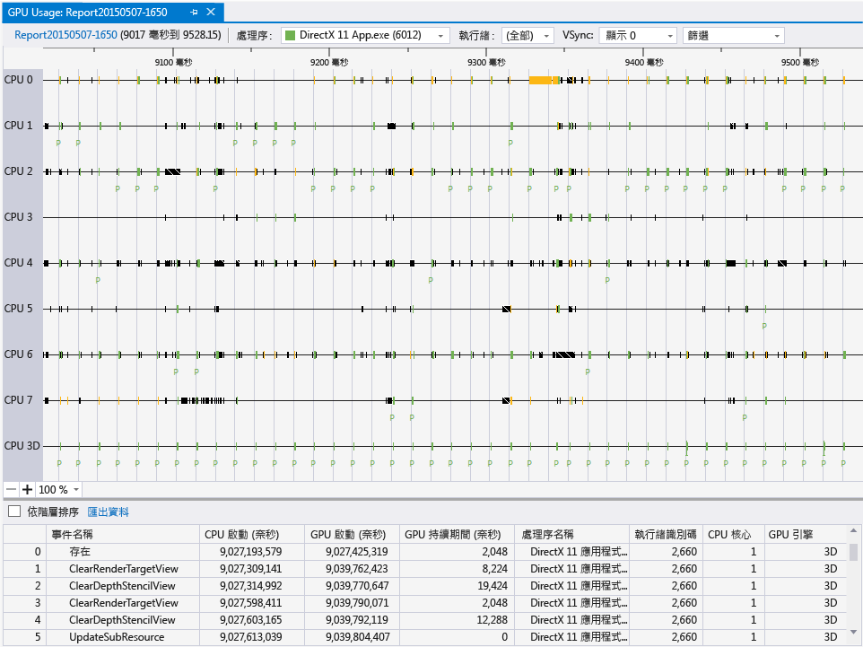
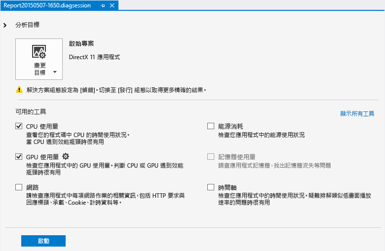
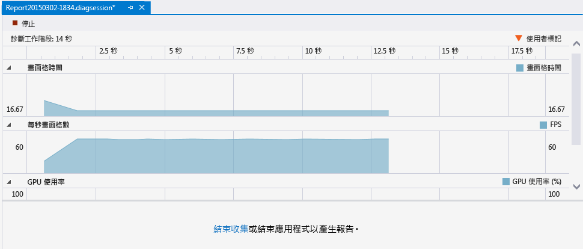
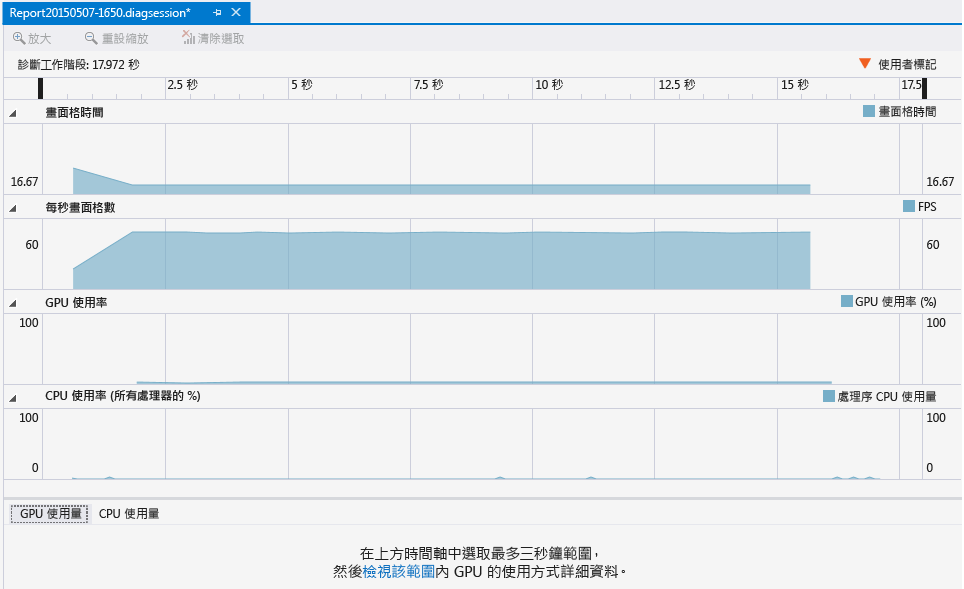
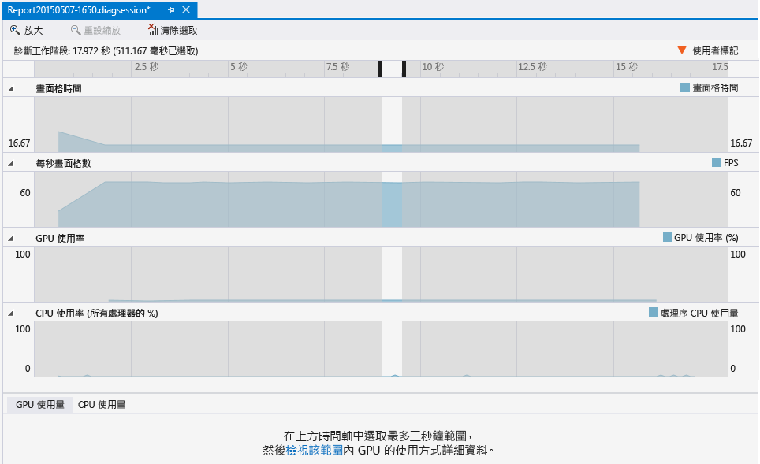
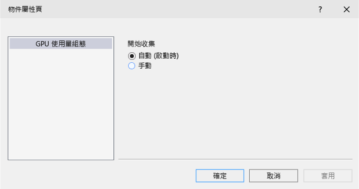

# GPU 使用量
[!INCLUDE[vs2017banner](../code-quality/includes/vs2017banner.md)]

使用「Visual Studio 效能及診斷中樞」中的「GPU 使用量」工具，適當地了解 Direct3D 應用程式的高階硬體使用率。  您可以使用它來判斷您應用程式的效能是 CPU\-bound 還是 GPU\-bound，並深入了解如何更有效地使用平台的硬體。  GPU 使用量支援使用 Direct3D 12、Direct3D 11 和 Direct3D 10 的應用程式；它不支援其他圖形 API \(例如 Direct2D 或 OpenGL\)。  
  
 這是 \[GPU 使用量報告\] 視窗：  
  
   
  
## 需求  
 下列是圖形診斷需求以外的 GPU 使用量工具使用需求。  
  
-   支援所需計時檢測的 GPU 和驅動程式。  
  
    > [!NOTE]
    >  如需所支援硬體和驅動程式的詳細資訊，請參閱本文件結尾的[硬體和驅動程式支援](#hwsupport)。  
  
 如需圖形診斷需求的詳細資訊，請參閱[快速入門](../debugger/getting-started-with-visual-studio-graphics-diagnostics.md)。  
  
## 使用 GPU 使用量工具  
 使用 GPU 使用量工具執行應用程式時，Visual Studio 會建立一個診斷工作階段，可即時繪製應用程式轉譯效能和 GPU 使用率高階資訊的圖形。  
  
#### 啟動 GPU 使用量工具：  
  
1.  在主功能表中，依序選擇 \[偵錯\] 和 \[效能及診斷\] \(鍵盤：按 Alt\+F2\)。  
  
2.  在 \[效能及診斷\] 中樞中，核取 \[GPU 使用量\] 旁邊的方塊。  選擇性地核取您感興趣之其他工具旁邊的方塊。  您可以同時執行數個效能與診斷工具，以取得更完整的應用程式效能。  
  
       
  
    > [!NOTE]
    >  並非所有效能及診斷工具都可以同時使用。  
  
3.  選擇 \[效能及診斷\] 中樞底部的藍色 \[開始\] 按鈕，以使用您選取的工具執行應用程式。  
  
 即時顯示的高階資訊包括畫面格計時、畫面播放速率和 GPU 使用率。  所有這些資訊都是單獨繪製圖形，但使用共同的時間刻度，如此您可以輕鬆地產生它們的關聯。  
  
 \[畫面格時間 \(毫秒\)\] 和 \[每秒畫面格數 \(FPS\)\] 圖形包含兩個紅色水平線，代表每秒 60 和 30 個畫面格數的效能目標。  在 \[畫面格時間\] 圖形中，您的應用程式在圖形低於該線時超出效能目標，而在圖形高於該線時則錯過它。  在 \[每秒畫面格數\] 圖形中，則相反；您的應用程式在圖形高於該線時超出效能目標，而在圖形低於該線時則錯過它。  這些圖形主要是用來取得您應用程式效能的高階想法，以及識別您可能想要調查的速度變慢 \(例如，畫面播放速率突然下降或 GPU 使用率暴增\)。  
  
 使用 GPU 使用量工具執行應用程式時，診斷工作階段也會收集對 GPU 執行之圖形事件的詳細資訊。  這項資訊用來產生應用程式如何利用硬體的更精細報告。  因為需要一些時間才能從所收集的資訊產生這份報告，所以只有在診斷工作階段完成資訊收集之後才能使用它。  
  
 如果想要更近地查看效能或使用率問題，請停止收集效能資訊，以產生報告。  
  
#### 產生和檢視 GPU 使用量報告：  
  
1.  在 \[診斷工作階段\] 視窗的下半部，選擇 \[停止收集\] 連結，或按左上角的 \[停止\]。  
  
       
  
2.  在報告的上半部，選取其中一個圖形中的一個區段，以顯示您想要調查的問題。  您的選取項目最多可以有 3 秒的時間；會向起始處截斷較長的區段。  
  
       
  
3.  在報告的下半部，選擇 \[...按一下這裡以檢視該範圍的 GPU 使用量詳細資料\] 訊息中的 \[檢視詳細資料\] 連結，以檢視您選取項目的詳細時間軸。  
  
       
  
 這會開啟包含報告的新索引標籤式文件。  \[GPU 使用量\] 報告可協助您查看何時在 CPU 上啟動圖形事件、它何時到達 GPU，以及 GPU 執行它所需的時間。  這項資訊可協助您找出瓶頸以及提高程式碼中平行處理的機會。  
  
## 使用 GPU 使用量報告  
 \[GPU 使用量\] 報告的上半部會顯示 CPU 處理活動、GPU 轉譯活動和 GPU 複製活動的時間軸。  這些時間軸會除以代表顯示器 vsync 的淺灰色分隔號；長條的頻率符合從中收集 GPU 使用量資料之其中一個顯示器的重新整理頻率 \(使用 \[顯示器\] 下拉式清單進行選取\)。  因為顯示器的重新整理頻率可能高於應用程式的效能目標，所以 vsync 與您想要應用程式達到的畫面播放速率之間不可能有 1 對 1 關聯性。  若要符合應用程式必須完成所有處理的效能目標，請執行轉譯，並且依目標畫面播放速率進行 Present\(\) 呼叫，但是除非在 Present\(\) 後面進行下一個 vsync，否則不會顯示所轉譯的畫面格。  
  
 下半部顯示在報告時間週期期間發生的圖形事件清單。  
  
 以下是 \[GPU 使用量報告\] 視窗：  
  
   
  
 選取報告下半部中的其中一個事件，即會在相關時間軸中的對應事件上放上標記，通常，CPU 執行緒上的一個事件代表 API 呼叫，其中一個 GPU 時間軸上的另一個事件則代表 GPU 完成工作的時間。  同樣地，選取時間軸中的其中一個事件會反白顯示報告下半部中的對應事件。縮小報告上半部的時間軸時，只會顯示最耗時的事件。  若要查看持續時間較短的事件，請使用 Ctrl \+ 指標裝置上的滾輪或上方面板左下角中的縮放控制項來放大時間軸。  您也可以拖曳時間軸面板的內容，以在所記錄的事件之間移動。  
  
 為了協助您找到所尋找的項目，您可以根據處理序名稱、執行緒 ID 和事件名稱來篩選 GPU 使用量報告；此外，您還可以選擇哪個顯示器的重新整理頻率決定 vysnc 線，而且，如果您的應用程式使用 ID3DUserDefinedAnnotation 介面來群組轉譯命令，則可以依階層方式排序事件。  
  
 以下是詳細資料：  
  
|篩選控制項|描述|  
|-----------|--------|  
|**處理序**|您感興趣的處理序名稱。  在診斷工作階段期間使用 GPU 的所有處理序都包含在此下拉式清單中。  與此下拉式清單中處理序相關聯的色彩就是下面時間軸中執行緒活動的色彩。|  
|**執行緒**|您感興趣的執行緒 ID。  在多執行緒應用程式中，這可協助您找出您感興趣之處理序的特定執行緒。  在每個時間軸中會反白顯示與所選取執行緒相關聯的事件。|  
|**顯示**|顯示其重新整理頻率的顯示器數目 **Note:**  有些驅動程式可以設定成以單一大型虛擬顯示器形式來呈現多個實體顯示器。  您可能只會看到列出一個顯示器，即使電腦連接多部顯示器也是一樣。|  
|**篩選**|您感興趣的關鍵字。  報告下半部中的事件僅會包括符合整個或局部關鍵字的事件。  您可以指定用分號 \(;\) 分隔的多個關鍵字。|  
|**階層排序**|指出保留還是略過透過使用者標記所定義之事件階層的核取方塊。|  
  
 \[GPU 使用量\] 報告下半部中的事件清單會顯示每個事件的詳細資料。  
  
|資料行|描述|  
|---------|--------|  
|**事件名稱**|圖形事件的名稱。  事件通常會對應到 CPU 執行緒時間軸中的一個事件以及 GPU 時間軸上的一個事件。   如果 GPU 使用量無法決定事件的名稱，則事件名稱可能是「未歸屬」。  如需詳細資訊，請參閱此表格下方的附註。|  
|**CPU 啟動 \(奈秒\)**|透過呼叫 Direct3D API 對 CPU 起始事件的時間。  時間的測量單位是奈秒，相對於應用程式的啟動時間。|  
|**GPU 啟動 \(奈秒\)**|對 GPU 起始事件的時間。  時間的測量單位是奈秒，相對於應用程式的啟動時間。|  
|**GPU 持續期間 \(奈秒\)**|在 GPU 上完成事件所需的時間 \(奈秒\)。|  
|**處理序名稱**|事件的來源應用程式名稱。|  
|**執行緒 ID**|事件的來源執行緒 ID。|  
  
> [!IMPORTANT]
>  事件屬性需要 Windows 8.1。  此外，如果您的 GPU 或驅動程式不支援所需的檢測功能，則所有事件都會顯示為「未歸屬」。  如果您遇到這個問題，請務必更新您的 GPU 驅動程式，然後重試。  如需詳細資訊，請參閱下面的[硬體和驅動程式支援](#hwsupport)。  
  
## GPU 使用量設定  
 您可以設定 GPU 使用量工具延後收集程式碼剖析資訊，而不是在應用程式啟動時立即開始收集資訊。  因為程式碼剖析資訊的大小可能很大，所以這適用於您知道應用程式效能變慢之後不再出現時。  
  
#### 從啟動應用程式延後程式碼剖析：  
  
1.  在主功能表中，依序選擇 \[偵錯\] 和 \[效能及診斷\] \(鍵盤：按 Alt\+F2\)。  
  
2.  在 \[效能及診斷\] 中樞中，遵循 \[GPU 使用量\] 旁邊的 \[設定\] 連結。  
  
3.  在 \[GPU 程式碼剖析組態\] 的 \[一般\] 屬性頁面上，清除 \[在啟動應用程式時開始程式碼剖析\] 核取方塊延後程式碼剖析。  
  
       
  
> [!IMPORTANT]
>  Direct3D 12 應用程式目前不支援延後程式碼剖析。  
  
 如果使用這項設定延後收集程式碼剖析資訊，則使用 GPU 使用量工具執行您的應用程式時，\[GPU 使用量工具\] 視窗下半部中的額外連結會變成可用。  若要開始收集程式碼剖析資訊，請選擇 \[開始收集其他詳細 GPU 使用量資料\] 訊息中的 \[開始\] 連結。  
  
##   硬體和驅動程式支援  
 下列是支援的 GPU 硬體和驅動程式：  
  
|Vendor|GPU 描述|需要驅動程式版本|  
|------------|------------|--------------|  
|Intel®|第四代 Intel® 核心處理器 \(‘Haswell’\)   -   Intel® HD 圖形 \(GT1\) -   Intel® HD 圖形 4200 \(GT2\) -   Intel® HD 圖形 4400 \(GT2\) -   Intel® HD 圖形 4600 \(GT2\) -   Intel® HD 圖形 P4600 \(GT2\) -   Intel® HD 圖形 P4700 \(GT2\) -   Intel® HD 圖形 5000 \(GT3\) -   Intel® Iris™ 圖形 5100 \(GT3\) -   Intel® Iris™ Pro 圖形 5200 \(GT3e\)|\-\- \(使用最新驅動程式\)|  
|AMD®|自 AMD Radeon™ HD 7000 系列之後的大部分項目 \(排除 AMD Radeon™ HD 7350\-7670\)   具備 Graphics Core Next \(GCN\) 架構的 AMD Radeon™ GPU、AMD FirePro™ GPU 和 AMD FirePro GPU 加速器。   具備 Graphics Core Next \(GCN\) 架構的 AMD® E 系列和 AMD A 系列加速處理單位 \(APU\) \(‘Kaveri’、‘Kabini’、‘Temash’、‘Beema’、‘Mullins’\)|14.7 RC3 或更高版本|  
|NVIDIA®|自 NVIDIA® GeForce® 400 系列之後的大部分項目。   具備 Fermi™、Kepler™ 或 Maxwell™ 架構的 NVIDIA® GeForce® GPU、NVIDIA Quadro® GPU 和 NVIDIA® Tesla™ GPU 加速器。|343.37 或更高版本|  
  
 目前不支援多 GPU 組態 \(例如 NVIDIA® SLI™ 和 AMD Crossfire™\)。  支援混合式圖形安裝程式 \(例如 NVIDIA® Optimus™ 和 AMD Enduro™\)。  
  
## 請參閱  
  
-   [使用 DirectX 工具解決遊戲棘手圖形問題 \(影片\)](http://channel9.msdn.com/Events/GDC/GDC-2015/Solve-the-Tough-Graphics-Problems-with-your-Game-Using-DirectX-Tools)  
  
-   [Visual Studio 中的 GPU 使用量工具 \(影片\)](http://channel9.msdn.com/Events/Visual-Studio/Connect-event-2014/715)  
  
-   [Visual Studio 2013 Update 4 CTP1 中的 GPU 使用量工具 \(部落格\)](http://blogs.msdn.com/b/vcblog/archive/2014/09/05/gpu-usage-tool-in-visual-studio-2013-update-4-ctp1.aspx)  
  
-   [Visual Studio 中 DirectX 的 GPU 使用量 \(部落格\)](http://blogs.msdn.com/b/ianhu/archive/2014/12/16/gpu-usage-for-directx-in-visual-studio.aspx)