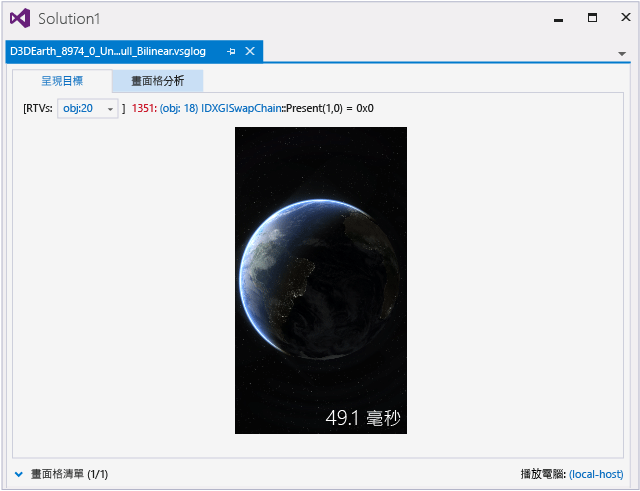
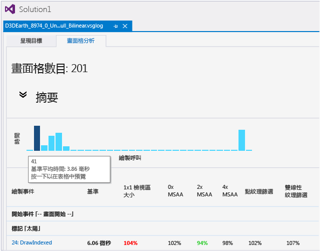
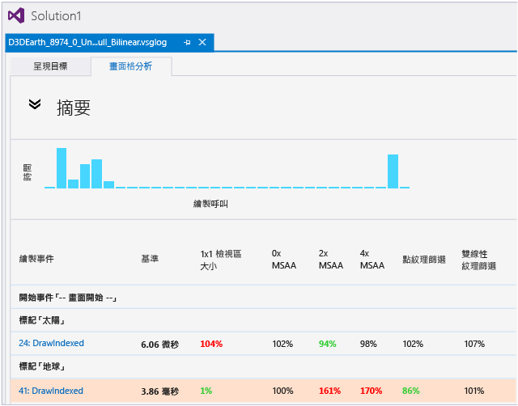
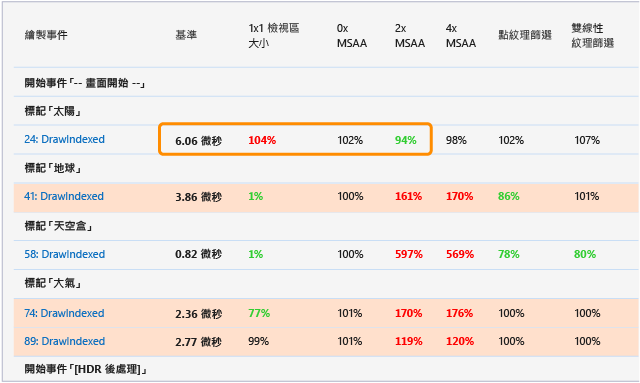
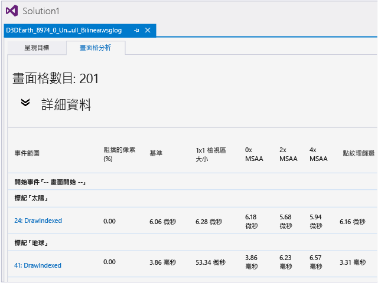
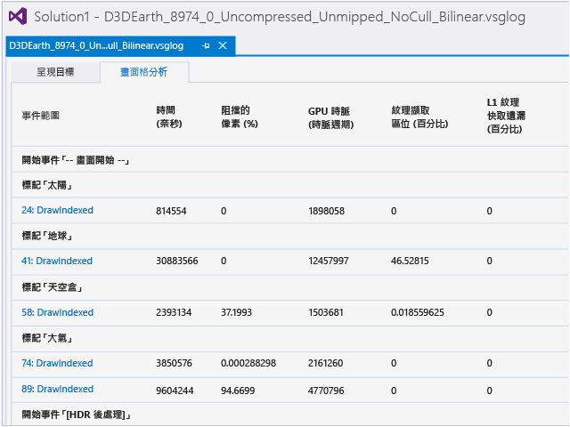

# 圖形框架分析
[!INCLUDE[vs2017banner](../code-quality/includes/vs2017banner.md)]

使用 Visual Studio 圖形分析器中的圖形畫面格分析，分析和最佳化 Direct3D 遊戲或應用程式的轉譯效能。  
  
> [!IMPORTANT]
>  針對所支援平台 \(包括 Windows 10\) 上使用 Direct3D 11 的應用程式，圖形分析器支援畫面格分析。  使用 Direct3D 12 的應用程式目前不支援畫面格分析。  
  
## 畫面格分析  
 畫面格分析會使用圖形記錄檔中，基於診斷而擷取的相同資訊，但是會使些資訊彙總呈現效能。  效能資訊不是在擷取期間記錄至記錄檔中；而是稍後在畫面格分析期間，透過在播放畫面格時計算事件時間以及收集統計資料，以產生效能資訊。  此方式比在擷取期間記錄效能資訊有更多優點。  
  
-   畫面格分析可以透過多次播放相同的畫面格，來求得結果的平均值，確保取得符合統計需求的效能摘要。  
  
-   畫面格分析可以產生下列項目的效能資訊：硬體組態，以及未擷取其中之資訊的裝置。  
  
-   畫面格分析可以從先前擷取的資訊 \(例如，最佳化 GPU 驅動程式時，或是公開其他偵錯功能\)，產生新的效能摘要。  
  
 除了這些優點之外，畫面格分析也可以變更播放期間的畫面格呈現方式，以顯示那些變更可能會如何影響應用程式呈現資訊的相關資訊。  您可以使用此資訊決定可能的最佳化策略，而不需要全部加以實作，然後自行擷取和比較所有結果。  
  
 雖然畫面格分析主要是協助您達到更快的呈現效能，但是同樣地也可協助您針對指定效能目標達到更佳的視覺品質，或減少 GPU 耗電。  
  
 若要查看畫面格分析可以為您的應用程式做什麼的示範，可以觀看 Channel 9 上的 [Visual Studio 圖形畫面格分析](http://channel9.msdn.com/Shows/C9-GoingNative/GoingNative-25-Offline-Analysis-Graphics-Tool)影片。  
  
## 使用畫面格分析  
 在您使用畫面格分析之前，必須從執行中的應用程式擷取圖形資訊，就像使用任何其他圖形分析器工具一樣。  然後，在圖形記錄文件 \(.vsglog\) 視窗中，選擇 \[畫面格分析\] 索引標籤。  
  
   
  
 分析完成之後，會顯示結果。  \[畫面格分析\] 索引標籤上方會顯示時間軸和摘要表格。  下方會顯示詳細資料表格。  如果在播放期間產生錯誤或警告，則會在時間軸上方彙總它們；從此時開始，您可以跟著連結來深入了解錯誤和警告。  
  
### 解譯結果  
 透過解譯每個變異的結果，您可以推斷關於應用程式的呈現效能與行為的實用資訊。  如需轉譯變異的詳細資訊，請參閱本文稍後的[變異](#Variants)。  
  
 部分結果直接指出變異對呈現效能的影響：  
  
-   如果雙線性紋理篩選變異已顯示效能提高，則在應用程式中使用雙線性紋理篩選會顯示類似的效能提高。  
  
-   如果 1x1 檢視區變異已顯示效能提高，則減少您應用程式中的呈現目標大小會改善其呈現效能。  
  
-   如果 BC 紋理壓縮變異已顯示效能提高，則在您的應用程式中使用 BC 紋理壓縮會顯示類似的效能提高。  
  
-   如果 2xMSAA 變異具有與 0xMSAA 變異幾乎相同的效能，則您可以在應用程式中啟用 2xMSAA 以改善其呈現品質，而且不需要任何效能成本。  
  
 其他結果可能會具有關於應用程式效能的更深入、更微妙含意：  
  
-   如果 1x1 檢視區變異顯示極大的效能提高，則您應用程式耗用的填充率可能高於可用的填充率。  如果此變異未顯示效能提高，則應用程式可能處理太多端點。  
  
-   如果 16bpp 呈現目標格式變異顯示效能大幅提高，則您的應用程式可能耗用太多記憶體頻寬。  
  
-   如果二分之一\/四分之一紋理維度變異顯示重大效能提高，則您的紋理可能佔用太多記憶體、耗用太多頻寬，或無效率地使用紋理快取。  如果此變異未顯示效能變更，則您可能使用較大且較精細的紋理，而且沒有花費效能成本。  
  
 硬體計數器可用時，您可以使用它們來收集應用程式的呈現效能為何不佳的極詳細資訊。  所有功能層級 9.2 及以上的裝置都可支援深度阻擋查詢 \(\[pixels occluded\] 計數器\) 和時間戳記。  可能還有其他硬體計數器可用，視 GPU 製造商是否在其驅動程式中實作硬體計數器並將其公開而定。  您可以使用這些計數器，確認摘要表格中所顯示結果的精確原因，例如，您可以檢查深度測試所阻擋像素的百分比，判斷過度繪製是否為因素。  
  
### 時間軸和摘要表格  
 預設會顯示 \[時間軸\] 和 \[摘要\] 表格，並摺疊其他區段。  
  
#### 時間軸  
 時間軸會顯示彼此相對之繪製呼叫計時的概觀。  因為較大的長條對應較長的繪製時間，所以您可以使用它來快速找出畫面格中最耗費資源的繪製呼叫。  擷取的畫面格包含極大數目的繪製呼叫時，會將多個繪製呼叫合併為一個長條，且長條的長度為其繪製呼叫的總和。  
  
   
  
 您可以將指標放在某個長條上方，以查看該長條所對應的繪製呼叫事件。  選取長條時，會讓事件清單與該事件同步。  
  
#### 資料表  
 時間軸下方數字的表格，會針對與應用程式的預設呈現相關的每個繪製呼叫，顯示每個呈現變異的相對效能。  每個資料行都會顯示不同的呈現變異，而且每個資料列都代表可以在最左邊資料行中識別的不同繪製呼叫；您可以從這裡取得 \[圖形事件清單\] 視窗中事件的連結。  
  
   
  
 \[摘要\] 表格最左邊的第二個資料行顯示應用程式的基準呈現時間，也就是應用程式的預設呈現完成繪製呼叫所需的時間長度。  其餘資料行會以 \[基準\] 的百分比，顯示每個呈現變異的相對效能，這樣可以更容易看到效能是否獲得改善。  大於 100% 的百分比，所需的時間會多於 \[基準\] \(即效能下降\)，而小於 100% 的百分比，所需的時間較少 \(即效能上升\)。  
  
 \[基準\] 的絕對計時值和呈現變異的相對計時值，實際上都表示多次執行 \(預設為 5\) 的平均值。  此平均計算有助於確保計時資料可靠且一致。  您可以將指標放在表格的每個儲存格上方，以檢查產生該繪製呼叫和呈現變異的結果時，所觀察到的最小、最大、平均和中位數計時值。  也會顯示基準計時值。  
  
#### 「熱門」繪製呼叫  
 為了使人注意到耗用較大比例的整體呈現時間的繪製呼叫，或是因為可避免的原因而異常緩慢的繪製呼叫，會在 \[基準\] 計時比畫面格中所有繪製呼叫的平均 \[基準\] 計時高於一個標準差時，將含有這些「熱門」繪製呼叫的資料列加上紅色陰影。  
  
   
  
#### 統計顯著性  
 為了使人注意到具有最高關聯性的呈現變異，畫面格分析會判斷每個呈現變異的統計顯著性，並將最顯著的呈現變異顯示為粗體。  它會將可改善效能的呈現變異顯示為綠色，並將可讓效能下降的呈現變異顯示為紅色。  它會將沒有統計顯著性的結果顯示為標準類型。  
  
   
  
 為了判斷統計關聯性，畫面格分析會使用[學生 t 檢驗](http://www.wikipedia.org/wiki/Student%27s_t-test)。  
  
### 詳細資料表  
 \[摘要\] 表格下方是預設會摺疊的 \[詳細資料\] 表格。  \[詳細資料\] 表格的內容取決於播放電腦的硬體平台。  如需所支援硬體平台的詳細資訊，請參閱[硬體支援](#HardwareSupport)。  
  
#### 不支援硬體計數器的平台  
 大部分的平台都未完整支援硬體 GPU 計數器，包括 Intel、AMD 和 nVidia 目前提供的所有 GPU。  沒有要收集的硬體計數器時，只會顯示一個 \[詳細資料\] 表格，而此表格包含所有變異的平均絕對計時。  
  
   
  
#### 支援硬體計數器的平台  
 在支援硬體 GPU 計數器的平台上 \(例如，nVidia T40 SOC 和所有 Qualcomm SOC\)，會顯示數個 \[詳細資料\] 表格，即一個變異一個 \[詳細資料\] 表格。  會針對每個呈現變異收集每個可用硬體計數器，並將其顯示在其專屬 \[詳細資料\] 表格中。  
  
   
  
 硬體計數器資訊為每個繪製呼叫的特定硬體平台行為，提供非常詳細的檢視，這有助於極精確地識別效能瓶頸的原因。  
  
> [!NOTE]
>  不同的硬體平台支援不同的計數器，因此沒有標準。  計數器和其代表的項目完全是取決於每個 GPU 製造商。  
  
### 標記區域和事件  
 畫面格分析支援使用者定義的事件標記和事件群組。  它們會顯示在 \[摘要\] 表格和 \[詳細資料\] 表格中。  
  
 您可以使用 ID3DUserDefinedAnnotation API 或舊版 D3DPERF\_ 系列的 API 來建立標記和群組。  使用 D3DPERF\_ API 系列時，您可以為每個標記和群組指派色彩，使畫面格分析在含有事件標記或事件群組開始\/結束標記和其內容的資料列中，會顯示為色帶的色彩。  此功能可以協助您快速識別重要的呈現事件或事件群組。  
  
### 警告和錯誤  
 有時候，畫面格分析完成時會發生警告或錯誤，這些警告或錯誤的摘要在 \[時間軸\] 上方，詳細資料在 \[畫面格分析\] 索引標籤底部。  
  
 通常，警告和錯誤僅供參考，不需要任何介入。  
  
 警告一般指出缺乏硬體支援但可以克服，或收集不到硬體計數器，或是特定效能資料可能不可靠 \(例如，因應措施對其造成嚴重影響時\)。  
  
 錯誤通常會指出畫面格分析實作有 Bug、驅動程式有 Bug、缺乏硬體支援且無法解決，或是應用程式嘗試執行播放不支援的項目。  
  
### 重試  
 如果 GPU 在畫面格分析期間經歷電源狀態轉換，則必須重試受影響的分析階段，因為 GPU 時脈速度已變更，並因而產生無效的相對計時結果。  
  
 畫面格分析限制重試次數為 10 次。  如果您的平台具有主動電源管理或時間閘控，則可能會導致畫面格分析失敗並報告錯誤，原因是超出重試限制。  將平台的電源管理和時脈速度節流重設為較不主動 \(平台啟用時\)，也許可以解決此問題。  
  
##   硬體支援  
  
### 時間戳記和阻擋查詢  
 所有支援畫面格分析的平台都支援時間戳記。  在支援功能層級 9.2 或更高層級的平台上，可支援深度阻擋查詢 \(Pixels Occluded 計數器的必要項目\)。  
  
> [!NOTE]
>  雖然支援畫面格分析的所有平台上，皆可支援時間戳記，但各平台的時間戳記準確度和一致性各不相同。  
  
### GPU 計數器  
 GPU 硬體計數器支援會因硬體而異。  
  
 因為 Intel、AMD 或 nVidia 目前提供的電腦 GPU 無法可靠地支援 GPU 硬體計數器，所以畫面格分析不會收集其計數器。  不過，畫面格分析確實會從這些 GPU 收集能夠可靠支援它們的硬體計數器：  
  
-   Qualcomm SOC \(全部支援 Windows Phone\)  
  
-   nVidia T40 \(Tegra4\)。  
  
 支援畫面格分析的其他平台都不會收集 GPU 硬體計數器。  
  
> [!NOTE]
>  因為 GPU 硬體計數器是硬體資源，所以可能需要好幾個階段來為每個呈現變異收集一組完整的硬體計數器。  因此不會指定收集 GPU 計數器的順序。  
  
### Windows Phone  
 只有 Windows Phone 8.1 一開始就隨附的 Windows Phone 話筒才支援時間戳記、阻擋查詢和 GPU 硬體計數器。  畫面格分析需要它們，才能播放圖形記錄檔。  Windows Phone 8 一開始就隨附的 Windows Phone 話筒不支援畫面格分析，即使話筒更新為 Windows Phone 8.1 也一樣。  
  
## 不支援的情節  
 畫面格分析的特定使用方式不受支援，或只是不好的主意。  
  
### WARP  
 畫面格分析的目的是用來分析和改善實際硬體的呈現效能。  不禁止在 WARP 裝置上執行畫面格分析 \(Windows Phone 模擬器是在 WARP 上執行\)，但是通常不值得進行，原因是在高端 CPU 上執行的 WARP 會比功能最少的現代 GPU 慢，而且 WARP 效能可能會因為它在其上執行的特定 CPU 而大幅不同。  
  
### 下層裝置上的高功能層級擷取播放  
 在圖形分析器中，如果您播放的圖形記錄檔所使用的功能層級高於播放電腦所支援的功能層級，則會自動回到 WARP。  在畫面格分析中，則明確地不會回到 WARP，且會產生錯誤；WARP 適用於檢查 Direct3D 應用程式的正確性，但不適用於檢查其效能。  
  
> [!NOTE]
>  但是記住功能層級問題仍然十分重要，這使您可以在不同的硬體組態和裝置上，擷取和播放圖形記錄檔。  例如，您可以擷取 Windows Phone 上的圖形資訊，並在桌上型電腦上予以播放，反之亦然。  在這兩種情況下，只要記錄檔未包含 API 或未使用播放電腦不支援的功能層級，就可以播放圖形記錄。  
  
### Direct3D 10 和以下版本  
 只有 Direct3D 11 API 才支援畫面格分析。  如果您的應用程式呼叫 Direct3D 10 API，則畫面格分析將無法辨識或分析它們，即使其他圖形分析器工具可以辨識到和使用它們也是一樣。  如果您的應用程式同時使用 Direct3D 11 和 Direct3D 10 API，則只會分析 Direct3D 11 呼叫。  
  
> [!NOTE]
>  這只適用於您正在使用的 Direct3D API 呼叫，而非功能層級。  只要使用的是 Direct3D 11、Direct3D 11.1 或 Direct3D 11.2 API，就可以使用任何您要的功能層級，而且畫面格分析也能夠運作。  
  
##   變異  
 畫面格分析對畫面格在播放期間的呈現方式，所進行的每項變更稱為*「變異」*\(variant\)。  畫面格分析所檢查的變異，會對應至常見且相當簡單的變更，而您使用這些變更就可以改善應用程式的呈現效能或視覺品質，例如，減少紋理大小、使用紋理壓縮，或啟用不同類型的消除鋸齒。  變異會覆寫您應用程式的一般呈現內容和參數。  摘要如下：  
  
|變異|描述|  
|--------|--------|  
|**1x1 檢視區大小**|將所有呈現目標上的檢視區維度減少為 1x1 個像素。   如需詳細資訊，請參閱 [1x1 Viewport 大小變異](../debugger/1x1-viewport-size-variant.md)。|  
|**0x MSAA**|停用所有呈現目標上的多重取樣消除鋸齒 \(MSAA\)。   如需詳細資訊，請參閱 [0x\/2x\/4x MSAA 變異](../debugger/0x-2x-4x-msaa-variants.md)。|  
|**2x MSAA**|啟用所有呈現目標上的 2x 多重取樣消除鋸齒 \(MSAA\)。   如需詳細資訊，請參閱 [0x\/2x\/4x MSAA 變異](../debugger/0x-2x-4x-msaa-variants.md)。|  
|**4x MSAA**|啟用所有呈現目標上的 4x 多重取樣消除鋸齒 \(MSAA\)。   如需詳細資訊，請參閱 [0x\/2x\/4x MSAA 變異](../debugger/0x-2x-4x-msaa-variants.md)。|  
|**點紋理篩選**|將所有適當紋理樣本的篩選模式都設定為 `DXD11_FILTER_MIN_MAG_MIP_POINT` \(點紋理篩選\)。   如需詳細資訊，請參閱[點、雙線性、三線性和各向異性紋理篩選變異](../debugger/point-bilinear-trilinear-and-anisotropic-texture-filtering-variants.md)。|  
|**雙線性紋理篩選**|將所有適當紋理樣本的篩選模式都設定為 `DXD11_FILTER_MIN_MAG_LINEAR_MIP_POINT` \(雙線性紋理篩選\)。   如需詳細資訊，請參閱[點、雙線性、三線性和各向異性紋理篩選變異](../debugger/point-bilinear-trilinear-and-anisotropic-texture-filtering-variants.md)。|  
|**三線性紋理篩選**|將所有適當紋理樣本的篩選模式都設定為 `DXD11_FILTER_MIN_MAG_MIP_LINEAR` \(三線性紋理篩選\)。   如需詳細資訊，請參閱[點、雙線性、三線性和各向異性紋理篩選變異](../debugger/point-bilinear-trilinear-and-anisotropic-texture-filtering-variants.md)。|  
|**非等向性紋理篩選**|將所有適當紋理樣本的篩選模式都設定為 `DXD11_FILTER_ANISOTROPIC`，並將 `MaxAnisotropy` 設定為 `16` \(16x 非等向性紋理篩選\)。   如需詳細資訊，請參閱[點、雙線性、三線性和各向異性紋理篩選變異](../debugger/point-bilinear-trilinear-and-anisotropic-texture-filtering-variants.md)。|  
|**16bpp 呈現目標格式**|將所有呈現目標和背景緩衝區的像素格式設定為 `DXGI_FORMAT_B5G6R5_UNORM` \(16bpp、565 格式\)。   如需詳細資訊，請參閱 [16bpp 呈現目標格式變異](../debugger/16bpp-render-target-format-variant.md)。|  
|**MIP 對應產生**|在非呈現目標的所有紋理上啟用 MIP 對應。   如需詳細資訊，請參閱 [Mip\-map 產生變異](../debugger/mip-map-generation-variant.md)。|  
|**二分之一紋理維度**|將非呈現目標之所有紋理上的紋理維度，減少為其在每個維度中之原始大小的一半。  例如，256x128 紋理會減少為 128x64 個材質。   如需詳細資訊，請參閱[半\/四分之一紋理維度變異](../debugger/half-quarter-texture-dimensions-variant.md)。|  
|**四分之一紋理維度**|將非呈現目標之所有紋理上的紋理維度減少為其在每個維度中之原始大小的四分之一。  例如，256x128 紋理會減少為 64x32 個材質。   如需詳細資訊，請參閱[半\/四分之一紋理維度變異](../debugger/half-quarter-texture-dimensions-variant.md)。|  
|**BC 紋理壓縮**|在具有 B8G8R8X8、B8G8R8A8 或 R8G8B8A8 像素格式變異的所有紋理上啟用區塊壓縮。  B8G8R8X8 格式變異是使用 BC1 進行壓縮；B8G8R8A8 和 R8G8B8A8 格式變異則是使用 BC3 進行壓縮。   如需詳細資訊，請參閱 [BC 紋理壓縮變異](../debugger/bc-texture-compression-variant.md)。|  
  
 大部分變異的結果都是規定好的：「將紋理大小減少為一半會加快 25%」或「啟用 2x MSAA 只會慢 2%」。  其他變異可能需要更多解譯，例如，如果將檢視區維度變更為 1x1 的變異顯示較大的效能提高，則可能表示呈現的瓶頸是低填充率；或者，如果效能未明顯變更，則可能表示呈現的瓶頸是端點處理。