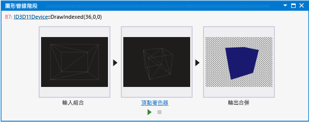
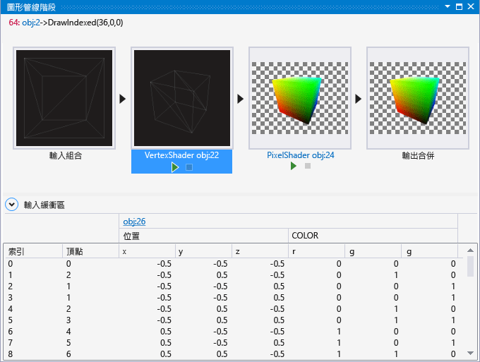

# 圖形管線階段
[!INCLUDE[vs2017banner](../code-quality/includes/vs2017banner.md)]

\[圖形管線階段\] 視窗可協助您了解如何透過 Direct3D 圖形管線各階段轉換個別繪製呼叫。  
  
 這是 \[管線階段\] 視窗：  
  
   
  
## 了解圖形管線階段視窗  
 \[管線階段\] 視窗會針對每個繪製呼叫分別視覺化圖形管線各階段的結果。  一般來說，會隱藏管線中間各階段的結果，因此很難分辨轉譯問題的開始位置。  透過分別視覺化每個階段，\[管線階段\] 視窗即可輕鬆地得出問題的開始位置；例如，您可以輕鬆地得知頂點著色器階段何時非預期地導致物件繪出螢幕外。  
  
 找出發生問題的階段之後，即可使用其他圖形分析器工具來檢查資料的解譯或轉換方式。  出現在管線階段的轉譯問題，通常與下列項目有關：不正確的頂點格式描述項、有錯誤的著色器程式，或是設定錯誤的狀態。  
  
### 相關圖形物件連結  
 有時需要一些額外內容，才能判定為什麼繪製呼叫會以特定方式與圖形管線互動。  為了更容易找到這項額外內容，\[圖形管線階段\] 視窗連結至一個或多個提供額外內容的物件，而額外內容與圖形管線中發生的事情有關。  
  
-   在 Direct3D 12 中，此物件通常是命令清單。  
  
-   在 Direct3D 11 中，此物件通常是圖形裝置內容。  
  
 這些連結是位於 \[圖形管線階段\] 視窗左上角之目前圖形事件簽章的一部分。  請遵循下列任何連結，檢查物件的其他詳細資料。  
  
### 檢視及偵錯著色器程式碼  
 您可以檢查和偵錯頂點、輪廓、網域、幾何和像素著色器的程式碼，方法是使用 \[管線階段\] 視窗中其各自階段底部的控制項。  
  
##### 檢視著色器的原始程式碼  
  
-   在 \[圖形管線階段\] 視窗中，找出與您要檢查之著色器對應的著色器階段。  然後，遵循預覽影像下方的著色器階段標題連結；例如，遵循 \[頂點著色器 obj:30\] 連結檢視頂點著色器原始程式碼。  
  
    > [!TIP]
    >  物件編號 \[obj:30\] 可在整個圖形分析器介面中識別此著色器 \(例如在物件資料表和像素歷史記錄視窗中\)。  
  
##### 偵錯著色器  
  
-   在 \[圖形管線階段\] 視窗中，找出與您要偵錯之著色器對應的著色器階段。  然後，選擇預覽影像下方的 \[開始偵錯\]。  這個 HLSL 偵錯工具進入點預設為對應階段的第一個著色器引動過程，也就是著色器在這個繪製呼叫期間所處理的第一個像素、頂點或基本項目。  特定像素或頂點的這個著色器引動過程可以透過 \[圖形像素歷史記錄\] 進行存取。  
  
### 管線階段  
 \[管線階段\] 視窗只會視覺化在繪製呼叫期間作用的管線階段。  圖形管線的每個階段都會轉換上一個階段的輸入，並將結果傳遞給下一個階段。  第一個階段 \(輸入組合語言\) 採用您應用程式的索引和頂點資料做為輸入；最後一個階段 \(輸出合併\) 會合併新轉譯的像素與畫面格緩衝區或轉譯目標的目前內容做為輸出，以產生最後在螢幕上看到的影像。  
  
> [!NOTE]
>  \[圖形管線階段\] 視窗中不支援計算著色器。  
  
 **輸入組合語言**  
 \[輸入組合語言\] 會讀取應用程式所指定的索引和頂點資料，並針對圖形硬體將其組合。  
  
 在 \[管線階段\] 視窗中，\[輸入組合語言\] 輸出會視覺化為線框模型。  若要進一步查看結果，請選取 \[圖形管線階段\] 視窗中的 \[輸入組合語言\]，以使用模型編輯器透過完整 3D 方式檢視所組合的頂點。  
  
> [!NOTE]
>  如果 `POSITION` 語意不存在於輸入組合語言的輸出中，\[輸入組合語言\] 階段就不會顯示任何內容。  
  
 **頂點著色器**  
 頂點著色器階段會處理頂點，通常是藉由執行轉換、面板設定和光源設定之類的作業來處理。  頂點著色器所產生的頂點數目會與它們採用為輸入的頂點數目相同。  
  
 在 \[管線階段\] 視窗中，\[頂點著色器\] 輸出會視覺化為線框點陣影像。  若要進一步查看結果，請選取 \[圖形管線階段\] 視窗中的 \[頂點著色器\]，以使用影像編輯器檢視所處理的頂點。  
  
> [!NOTE]
>  如果 `POSITION` 或 `SV_POSITION` 語意未出現在頂點著色器輸出中，\[頂點著色器\] 階段就不會顯示任何內容。  
  
 **輪廓著色器** \(僅限 Direct3D 11 和 Direct3D 12\)  
 輪廓著色器階段會處理可定義低階表面 \(例如線條、三角形或方形\) 的控制點。  而輸出結果是，它會產生傳遞給固定函式鑲嵌式階段的較高階幾何修補和修補常數。  
  
 在 \[管線階段\] 視窗中，不會視覺化輪廓著色器階段。  
  
 **鑲嵌階段** \(僅限 Direct3D 11 和 Direct3D 12\)  
 鑲嵌階段是一個固定函式 \(不可程式化\) 硬體單元，可預先處理輪廓著色器輸出所代表的網域。  而輸出結果是，它會建立網域的取樣模式以及一組連接這些樣本的較小基本項目 \(點、線條、三角形\)。  
  
 在 \[管線階段\] 視窗中，不會視覺化鑲嵌階段。  
  
 **網域著色器** \(僅限 Direct3D 11 和 Direct3D 12\)  
 網域著色器階段會處理來自輪廓著色器的較高階幾何修補，以及來自鑲嵌階段的鑲嵌式因素。  鑲嵌式因素可以包含鑲嵌輸入因素和輸出因素。  而輸出結果是，它會根據鑲嵌因素計算輸出修補上某個點的頂點位置。  
  
 在 \[管線階段\] 視窗中，不會視覺化網域著色器階段。  
  
 **幾何著色器**  
 幾何著色器階段會處理整個基本項目 \(點、線條或三角形\) 以及邊緣相鄰基本項目的選擇性頂點資料。  與頂點著色器不同，幾何著色器所產生的基本項目數可以多於或少於它們採用為輸入的基本項目數。  
  
 在 \[管線階段\] 視窗中，幾何著色器輸出會視覺化為線框點陣影像。  若要進一步查看結果，請選取 \[圖形管線階段\] 視窗中的 \[幾何著色器\]，以使用影像編輯器檢視所處理的基本項目。  
  
 **資料流輸出階段**  
 資料流輸出階段可以在點陣化之前解譯轉換過的基本項目並將它們寫入記憶體；從該處，資料可以重新循環為稍早階段的輸入或可由 CPU 讀回。  
  
 在 \[管線階段\] 視窗中，不會視覺化資料流輸出階段。  
  
 **轉譯器階段**  
 轉譯器階段是一個固定函式 \(不可程式化\) 硬體單元，可透過執行掃描線轉換，以將向量基本項目 \(點、線條、三角形\) 轉換為點陣影像。  在點陣化期間，頂點會轉換成同質剪輯空間並進行剪輯。  而輸出結果是，會對應像素著色器，而且每個頂點屬性都會內插到基本項目，並供像素著色器使用。  
  
 在 \[管線階段\] 視窗中，不會視覺化轉譯器階段。  
  
 **像素著色器**  
 像素著色器階段會處理點陣化基本項目以及內插頂點資料來產生每個像素值 \(例如色彩和深度\)。  
  
 在 \[管線階段\] 視窗中，像素著色器輸出會視覺化為全彩點陣影像。  若要進一步查看結果，請選取 \[圖形管線階段\] 視窗中的 \[像素著色器\]，以使用影像編輯器檢視所處理的基本項目。  
  
 **輸出合併**  
 輸出合併階段會合併新轉譯的像素與其對應緩衝區的現有內容 \(色彩、深度和樣板\) 的效果，以在這些緩衝區中產生新值。  
  
 在 \[管線階段\] 視窗中，輸出合併輸出會視覺化為全彩點陣影像。  若要進一步查看結果，請選取 \[圖形管線階段\] 視窗中的 \[輸出合併\]，檢視所合併的畫面格緩衝區。  
  
### 頂點著色器預覽  
 在 \[圖形管線階段\] 視窗中選取頂點著色器階段時，會顯示 \[輸入緩衝區\] 面板。  在這裡，您將找到下列頂點清單的詳細資料：透過輸入組合語言組合之後提供給頂點著色器的頂點。  
  
   
  
 若要檢視頂點著色器階段的結果，請選擇 \[頂點著色器\] 階段縮圖，以檢視由頂點著色器轉換後之網狀的完整大小點陣化線框。  
  
   
  
## 請參閱  
 [逐步解說：因端點著色而遺漏的物件](../debugger/walkthrough-missing-objects-due-to-vertex-shading.md)   
 [逐步解說：偵錯因著色而產生的顯示錯誤](../debugger/walkthrough-debugging-rendering-errors-due-to-shading.md)