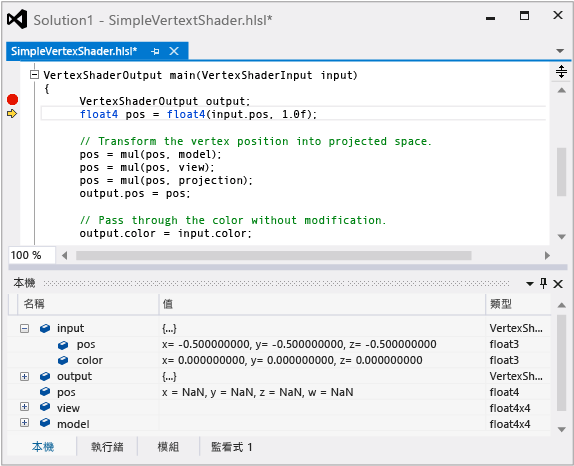

# HLSL 著色器偵錯工具
[!INCLUDE[vs2017banner](../code-quality/includes/vs2017banner.md)]

Visual Studio 圖形分析器中的 HLSL 偵錯工具可協助您了解 HLSL 著色器程式碼在應用程式的真實狀況下的運作方式。  
  
 這是 HLSL 偵錯工具：  
  
   
  
## 了解 HLSL 偵錯工具  
 HLSL 偵錯工具可以協助您了解出現在著色器程式碼的問題。  在 [!INCLUDE[vsprvs](../code-quality/includes/vsprvs_md.md)] 中偵錯 HLSL 程式碼類似於偵錯以其他語言 \(例如：C\+\+、C\# 或 Visual Basic\) 撰寫的程式碼。  您可以檢查變數內容、設定中斷點、逐步執行程式碼，以及向上查核呼叫堆疊，就像偵錯其他語言時可以執行的功能一樣。  
  
 不過，由於 GPU 可以藉由同時在數百個執行緒上執行著色器程式碼以達到高效能，所以 HLSL 偵錯工具是設計成搭配其他圖形分析器工具一起運作，以協助您了解其意義的方式呈現所有資訊。  圖形分析器會使用圖形記錄中錄製到的資訊重新建立擷取的畫面格，HLSL 偵錯工具則未在其執行著色器程式碼時即時監視 GPU 執行。  由於圖形記錄包含足以重新建立輸出之任何部分的資訊，而且圖形分析會提供可協助您找出發生錯誤之確切像素與事件的工具，因此 HLSL 偵錯工具只需要模擬您所要的實際著色器執行緒。  這表示可在 CPU 模擬著色器的工作，其中內部工作處於完整檢視。  這可以賦予 HLSL 偵錯工具類似 CPU 的偵錯經驗。  
  
 不過，目前會以下列方式限制 HLSL 偵錯工具：  
  
-   HLSL 偵錯工具不支援編輯後繼續，但是您可以變更著色器，然後重新產生畫面格以查看結果。  
  
-   同時偵錯應用程式和其著色器程式碼是不可能的。  不過，您可以在它們之間選擇。  
  
-   您可以將變數和暫存器加入至監看式視窗，不過不支援運算式。  
  
 不過，HLSL 偵錯工具提供比原本可能更接近 CPU 樣式的較佳偵錯經驗。  
  
## HLSL 著色器編輯及套用  
 HLSL 著色器偵錯工具不會像 CPU 偵錯工具那樣支援 \[編輯後繼續\]，因為 GPU 執行模型不允許復原著色器狀態。  但是 HLSL 偵錯工具可支援 \[編輯並套用\]，此功能可讓您編輯 HLSL 原始程式檔，然後選擇 \[套用\]，以重新產生畫面格查看變更的效果。  修改過的著色器程式碼會儲存在不同的檔案中，以保持專案原有 HLSL 原始程式檔的完整性，但是如果您滿意您的變更，可以選擇 \[複製到\]，以將變更複製到您的專案。  使用這項功能，您可以快速地逐一查看含有錯誤的著色器程式碼，而不需要 HLSL 偵錯工作流程中成本高昂的重建和擷取步驟。  
  
## HLSL 反組譯碼  
 HLSL 著色器偵錯工具在 HLSL 原始程式碼清單右邊提供 HLSL 著色器組件清單。  
  
## 偵錯 HLSL 程式碼  
 您可以從 \[管線階段\] 或 \[像素歷史記錄\] 視窗存取 HLSL 偵錯工具。  
  
#### 從圖形管線階段視窗啟動 HLSL 偵錯工具  
  
1.  在 \[**圖形管線階段**\] 視窗中，找出與您要偵錯之著色器相關的管線階段。  
  
2.  在管線階段的標題下方選擇 \[**開始偵錯**\]，此時會顯示為一個小綠色箭號。  
  
    > [!NOTE]
    >  這個 HLSL 偵錯工具進入點只能偵錯對應階段的第一個著色器執行緒，也就是第一個端點或是第一個處理的像素。  您可以使用 \[像素歷史記錄\] 來存取這些著色器階段的其他執行緒。  
  
#### 從圖形像素歷史記錄啟動 HLSL 偵錯工具  
  
1.  在 \[圖形像素歷史記錄\] 視窗中，展開與您要偵錯之著色器相關的繪製呼叫。  每個繪製呼叫可能會對應到多個基本類型。  
  
2.  在繪製呼叫詳細資料中，展開在其著色器程式碼中產生色彩比重建議 Bug 的基本類型。  如果有多個基本類型建議 Bug，請選擇建議的第一個基本類型，以避免可能會使問題的診斷更加困難的錯誤累積。  
  
3.  在原始詳細資料中，選擇偵錯 \[**端點著色器**\] 或 \[**像素著色器**\]。  當您懷疑像素著色器是正確的，但是因為端點著色器傳遞無效的常數給它而使其產生無效的色彩比重時，請偵錯端點著色器。  否則，請偵錯像素著色器。  
  
     在所選擇著色器的右方，選擇 \[**開始偵錯**\]，此時會顯示為一個小綠色箭號。  
  
    > [!NOTE]
    >  這個進入點會進入 HLSL 偵錯工具中偵錯任何對應至所選擇繪製呼叫、基本類型和像素的像素著色器執行緒，或進入至藉由所選擇繪製呼叫、基本類型和像素產生插補的端點著色器執行緒。  在端點著色器的情況下，您可以展開端點著色器詳細資料以進一步限定對特定端點的進入點。  
  
 如需如何使用 HLSL 偵錯工具來偵錯著色器錯誤的範例，請參閱[圖形診斷範例](../debugger/graphics-diagnostics-examples.md)或＜請參閱＞一節中連結的逐步解說。  
  
## 請參閱  
 [逐步解說：因端點著色而遺漏的物件](../debugger/walkthrough-missing-objects-due-to-vertex-shading.md)   
 [逐步解說：偵錯因著色而產生的顯示錯誤](../debugger/walkthrough-debugging-rendering-errors-due-to-shading.md)   
 [逐步解說：使用圖形診斷來偵錯計算著色器](../debugger/walkthrough-using-graphics-diagnostics-to-debug-a-compute-shader.md)