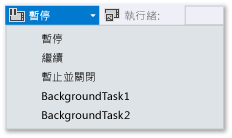
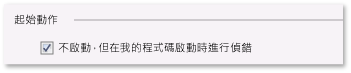

# 如何在 Visual Studio 中為 Windows 市集應用程式觸發、暫停和繼續事件，以及讓事件成為背景事件
[!INCLUDE[vs2017banner](../code-quality/includes/vs2017banner.md)]

不在偵錯模式時，由 Windows **處理程序生命週期管理** \(PLM\) 控制您應用程式的執行狀態：啟動、暫停、繼續和終止應用程式，以便回應使用者動作和裝置的狀態。 而處於偵錯模式時，Windows 會停用這些啟用事件。 本主題說明如何在偵錯工具中引發這些事件。  
  
 本主題也將說明如何對**背景工作**偵錯。 背景工作可讓您在背景處理序中執行某些作業 \(即使您的應用程式並未執行也無妨\)。 您可以使用偵錯工具，將您的應用程式置於偵錯模式，接著無須啟動 UI，就能啟動背景工作並對其偵錯。  
  
 如需處理程序生命週期管理和背景工作的詳細資訊，請參閱[Launching, resuming, and multitasking](http://msdn.microsoft.com/zh-tw/04307b1b-05af-46a6-b639-3f35e297f71b)。  
  
##   本主題內容  
 [觸發處理程序生命週期管理事件](#BKMK_Trigger_Process_Lifecycle_Management_events)  
  
 [觸發背景工作](#BKMK_Trigger_background_tasks)  
  
-   [從標準偵錯工作階段中觸發背景工作](#BKMK_Trigger_a_background_task_event_from_a_standard_debug_session)  
  
-   [在應用程式未執行時觸發背景工作](#BKMK_Trigger_a_background_task_when_the_app_is_not_running)  
  
 [從已安裝的應用程式觸發處理程序生命週期管理事件和背景工作](#BKMK_Trigger_Process_Lifetime_Management_events_and_background_tasks_from_an_installed_app)  
  
 [診斷背景工作啟用錯誤](#BKMK_Diagnosing_background_task_activation_errors)  
  
##   觸發處理程序生命週期管理事件  
 當使用者切換離開您的應用程式，或當 Windows 進入低電力狀態時，Windows 就會暫停您的應用程式。 您可以回應 `Suspending` 事件，將相關的應用程式和使用者資料儲存至永久儲存區，以便釋放資源。 當應用程式從「**暫停**」狀態繼續時，它會進入「**執行中**」狀態，並從上次暫停的地方繼續進行。 您可以回應 `Resuming` 事件，還原或重新整理應用程式狀態，以便回收資源。  
  
 Windows 會在記憶體中盡可能保留暫停的應用程式，但如果沒有足夠的資源得以在記憶體中保留這些應用程式，Windows 會終止它們。 使用者也可以明確關閉您的應用程式。 沒有特定事件用來指出使用者已關閉應用程式。  
  
 在 Visual Studio 偵錯工具中，您可以手動暫停、繼續和終止您的應用程式，以便對處理生命週期事件進行偵錯。 若要對處理生命週期事件進行偵錯：  
  
1.  在您要偵錯的事件之處理常式中設定中斷點。  
  
2.  按 **F5** 開始偵錯作業。  
  
3.  在 \[**偵錯位置**\] 工具列上，選擇您要引發的事件：  
  
       
  
     請注意，\[**暫停和終止**\] 會關閉應用程式並結束偵錯工作階段。  
  
##   觸發背景工作  
 任何應用程式都可以登錄背景工作，以回應特定的系統事件 \(即使應用程式並未執行\)。 背景工作不能執行直接更新 UI 的程式碼，但它們可以透過動態磚更新、徽章更新和快顯通知，對使用者顯示資訊。 如需詳細資訊，請參閱[Supporting your app with background tasks](http://msdn.microsoft.com/zh-tw/4c7bb148-eb1f-4640-865e-41f627a46e8e)。  
  
 您可以從偵錯工具觸發事件，啟動應用程式的背景工作。  
  
> [!NOTE]
>  偵錯工具只能觸發不含資料的事件，例如指出裝置狀態變更的事件。 若是需要使用者輸入或其他資料的背景工作，則必須手動觸發。  
  
 觸發背景工作事件的最實際方法，就是在您的應用程式未執行時觸發。 不過，也支援在標準偵錯工作階段中觸發事件。  
  
###   從標準偵錯工作階段中觸發背景工作  
  
1.  在您要偵錯的背景工作程式碼中設定中斷點。  
  
2.  按 **F5** 開始偵錯作業。  
  
3.  從 \[**偵錯位置**\] 工具列的事件清單中，選擇您想要啟動的背景工作。  
  
       
  
###   在應用程式未執行時觸發背景工作  
  
1.  在您要偵錯的背景工作程式碼中設定中斷點。  
  
2.  開啟啟始專案的偵錯屬性頁。 在 \[方案總管\] 中選取專案。 在 \[**偵錯**\] 功能表上，選擇 \[**屬性**\]。  
  
     若是 C\+\+ 專案，您可能必須展開 \[**組態屬性**\]，然後選擇 \[**偵錯**\]。  
  
3.  執行下列任一步驟：  
  
    -   若是 Visual C\# 和 Visual Basic 專案，請選擇 \[**不啟動，但在我的程式碼啟動時進行偵錯**\]。  
  
           
  
    -   若是 JavaScript 和 Visual C\+\+ 專案，請從 \[**啟動應用程式**\] 清單中選擇 \[**否**\]。  
  
           
  
4.  按 **F5** 將應用程式置入偵錯模式。 請注意，\[**偵錯位置**\] 工具列的 \[**處理**\] 清單會顯示應用程式封裝名稱，表示您正處於偵錯模式。  
  
       
  
5.  從 \[**偵錯位置**\] 工具列的事件清單中，選擇您想要啟動的背景工作。  
  
       
  
##   從已安裝的應用程式觸發處理程序生命週期管理事件和背景工作  
 您可以使用 \[偵錯已安裝的應用程式\] 對話方塊，載入已安裝在偵錯工具中的應用程式。 例如，您可以偵錯從 Windows 市集安裝的應用程式，或者當您有應用程式的原始程式檔，卻沒有應用程式的 Visual Studio 專案時，也可以偵錯應用程式。 \[偵錯已安裝的應用程式\] 對話方塊可讓您在 Visual Studio 電腦或遠端裝置以偵錯模式啟動應用程式，或是將應用程式設定成以偵錯模式執行而不啟動。 如需詳細資訊，請參閱**如何啟動偵錯工作階段**之 [JavaScript](../debugger/start-a-debugging-session-for-store-apps-in-visual-studio-javascript.md#BKMK_Start_an_installed_app_in_the_debugger) 或 [Visual C\+\+、Visual C\# 和 Visual Basic](../debugger/start-a-debugging-session-for-a-store-app-in-visual-studio-vb-csharp-cpp-and-xaml.md#BKMK_Start_an_installed_app_in_the_debugger) 版本中的**在偵錯工具中啟動已安裝的應用程式**一節。  
  
 將應用程式載入至偵錯工具後，您就能使用上述任何程序。  
  
##   診斷背景工作啟用錯誤  
 Windows 事件檢視器中背景基礎結構的診斷記錄包含詳細資訊，您可以用來診斷和疑難排解背景工作錯誤。 若要檢視記錄檔：  
  
1.  開啟 \[事件檢視器\] 應用程式。  
  
2.  在 \[**動作**\] 窗格中，選擇 \[**檢視**\]，並確定已勾選 \[**顯示分析與偵錯記錄檔**\]。  
  
3.  在 \[**事件檢視器 \(本機\)**\] 樹狀目錄中，依序展開 \[**應用程式及服務記錄檔**\]、\[**Microsoft**\]、\[**Windows**\] 以及 \[**BackgroundTasksInfrastructure**\] 節點。  
  
4.  選擇 \[**診斷**\] 記錄檔。  
  
## 請參閱  
 [使用 Visual Studio 測試市集應用程式](../test/testing-store-apps-with-visual-studio.md)   
 [在 Visual Studio 中偵錯應用程式](../debugger/debug-store-apps-in-visual-studio.md)   
 [Application lifecycle](http://msdn.microsoft.com/zh-tw/53cdc987-c547-49d1-a5a4-fd3f96b2259d)   
 [Launching, resuming, and multitasking](http://msdn.microsoft.com/zh-tw/04307b1b-05af-46a6-b639-3f35e297f71b)