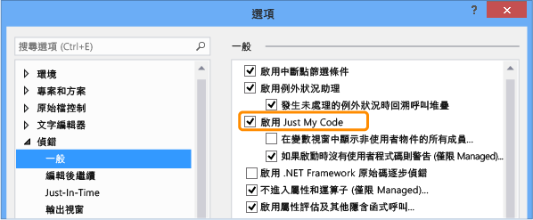

# Just My Code
[!INCLUDE[vs2017banner](../code-quality/includes/vs2017banner.md)]

使用 .NET Framework 語言的開發人員皆熟悉 Just My Code 偵錯工具功能，此功能於系統、架構以及其他非使用者呼叫逐步執行，並在 \[呼叫堆疊\] 視窗中摺疊這些呼叫。  Just My Code 已延伸到 JavaScript 和 C\+\+ 語言。  本主題描述在 .NET Framework 專案、原生 C\+\+ 專案以及 JavaScript 專案中使用 Just My Code 的細節。  
  
##  <a name="BKMK_Contents"></a> 內容  
 [啟用或停用 Just My Code](#BKMK_Enable_or_disable_Just_My_Code)  
  
 [.NET Framework Just My Code](#BKMK__NET_Framework_Just_My_Code)  
  
 [C++ Just My Code](#BKMK_C___Just_My_Code)  
  
 [JavaScript Just My Code](#BKMK_JavaScript_Just_My_Code)  
  
##  <a name="BKMK_Enable_or_disable_Just_My_Code"></a> 啟用或停用 Just My Code  
 若要啟用或停用 Just My Code，請選取 \[偵錯\] 功能表上的 \[選項和設定\]。  在 \[偵錯\] \/ \[概觀\] 節點中，選取或清除 \[啟用 Just My Code\]。  
  
   
  
> [!NOTE]
>  \[啟用 Just My Code\] 設定是套用至所有語言之 Visual Studio 專案的全域設定。  
  
###  <a name="BKMK_Override_call_stack_filtering"></a> 覆寫呼叫堆疊篩選  
 在呼叫堆疊的顯示中，例如在 \[呼叫堆疊\] 和 \[工作\] 視窗中，Just My Code 會將非使用者程式碼摺疊至標記為 `[External Code]` 標註的框架中。  若要檢視摺疊的框架，請在呼叫堆疊的顯示之內容功能表上選取 \[顯示外部程式碼\]。  
  
> [!NOTE]
>  會儲存 \[顯示外部程式碼\] 設定至目前使用者的分析工具。  它會套用至使用者所開啟的所有語言之專案。  
  
  [內容](#BKMK_Contents)  
  
##  <a name="BKMK__NET_Framework_Just_My_Code"></a> .NET Framework Just My Code  
 [使用者和非使用者程式碼](#BKMK_NET_User_and_non_user_code) **&#124;** [逐步執行行為](#BKMK_NET_Stepping_behavior) **&#124;** [中斷點行為](#BKMK_NET_Breakpoint_behavior) **&#124;** [例外狀況行為](#BKMK_NET_Exception_behavior)  
  
###  <a name="BKMK_NET_User_and_non_user_code"></a> 使用者和非使用者程式碼  
 為了區別使用者程式碼與非使用者程式碼，Just My Code 會查看已開啟的專案、符號 \(.pdb\) 檔案和程式最佳化。  
  
1.  如果從已開啟的 Visual Studio 專案建立二進位檔，一律會將它視為使用者程式碼。  
  
2.  在最佳化此二進位檔時，或當 .pdb 檔無法使用時，偵錯工具會將程式碼視為非使用者程式碼。  
  
 還有三個屬性也會影響偵錯工具如何判斷 My Code：  
  
-   <xref:System.Diagnostics.DebuggerNonUserCodeAttribute> 會告知偵錯工具它所套用的程式碼並不是 My Code。  
  
-   <xref:System.Diagnostics.DebuggerHiddenAttribute> 會對偵錯工具隱藏程式碼，即使 Just My Code 已關閉。  
  
-   <xref:System.Diagnostics.DebuggerStepThroughAttribute> 會告知偵錯工具應逐步執行 \(Step Through\) 它所套用的程式碼，而非逐步執行 \(Step Into\) 程式碼。  
  
 其他程式碼可視為使用者程式碼。  
  
  [內容](#BKMK_Contents) **&#124;** [.NET Framework Just My Code](#BKMK__NET_Framework_Just_My_Code)  
  
###  <a name="BKMK_NET_Stepping_behavior"></a> 逐步執行行為  
 當您對非使用者程式碼 \[逐步執行\] \(快速鍵：F11\) 時，偵錯工具會逐步執行程式碼至下一個使用者陳述式。  當您使用 \[跳離函式\] \(快速鍵：SHIFT \+ F11\) 時，偵錯工具會執行至下一行使用者程式碼。  如果沒有發現使用者程式碼，則在應用程式結束、叫用中斷點或發生例外狀況之前，都會繼續執行。  
  
  [內容](#BKMK_Contents) **&#124;** [.NET Framework Just My Code](#BKMK__NET_Framework_Just_My_Code)  
  
###  <a name="BKMK_NET_Breakpoint_behavior"></a> 中斷點行為  
 當 Just My Code 啟用時，您可以選擇 \[全部中斷\] \(快速鍵：CTRL \+ ALT \+ Break\) ，在沒有使用者程式碼要顯示的位置停止執行。  發生這種情況時，就會顯示 \[沒有來源\] 視窗。  如果您接著選取 \[逐步執行\] 命令，偵錯工具會將您帶到下一行使用者程式碼。  
  
  [內容](#BKMK_Contents) **&#124;** [.NET Framework Just My Code](#BKMK__NET_Framework_Just_My_Code)  
  
###  <a name="BKMK_NET_Exception_behavior"></a> 例外狀況行為  
 如果未處理的例外狀況發生在非使用者程式碼，偵錯工具就會在產生例外狀況的該行使用者程式碼中斷。  
  
 假如第一個可能發生的例外狀況已未此例外狀況所啟用，就會以綠色反白顯示使用者程式碼行。  呼叫堆疊會顯示標記為 \[外部程式碼\] 的標註框架。  
  
  [內容](#BKMK_Contents) **&#124;** [.NET Framework Just My Code](#BKMK__NET_Framework_Just_My_Code)  
  
##  <a name="BKMK_C___Just_My_Code"></a> C\+\+ Just My Code  
 [使用者和非使用者程式碼](#BKMK_CPP_User_and_non_user_code) **&#124;** [逐步執行行為](#BKMK_CPP_Stepping_behavior) **&#124;** [例外狀況行為](#BKMK_CPP_Exception_behavior) **&#124;** [自訂逐步偵錯行為](#BKMK_CPP_Customize_stepping_behavior) **&#124;** [自訂呼叫堆疊行為](#BKMK_CPP_Customize_call_stack_behavior)  
  
###  <a name="BKMK_CPP_User_and_non_user_code"></a> 使用者和非使用者程式碼  
 因為逐步執行行為獨立於呼叫堆疊行為，所以 C\+\+ Just My Code 不同於 .NET Framework 和 JavaScript Just My Code。  
  
 **呼叫堆疊**  
  
 根據預設，此偵錯工具在呼叫堆疊視窗會將這些函式視為非使用者程式碼：  
  
-   在其符號檔中已移除來源資訊之函式。  
  
-   符號檔表示沒有與堆疊框架對應的原始程式檔之函式。  
  
-   在 `%VsInstallDirectory%\Common7\Packages\Debugger\Visualizers` 資料夾 `*.natjmc` 檔案中所指定的函式。  
  
 **逐步執行**  
  
 根據預設，只有在 `%VsInstallDirectory%\Common7\Packages\Debugger\Visualizers` 資料夾的 `*.natstepfilter` 檔案中指定的函式可視為非使用者程式碼。  
  
 您可以建立自己的 `.natstepfilter` 和 `.natjmc` 來自訂 `%USERPROFILE%\My Documents\Visual Studio 2015\Visualizers` 中的 \[逐步執行\] 和 \[呼叫堆疊\] 視窗行為。  
  
  [內容](#BKMK_Contents) **&#124;** [C++ Just My Code](#BKMK_C___Just_My_Code)  
  
###  <a name="BKMK_CPP_Stepping_behavior"></a> 逐步執行行為  
 從使用者程式碼到非使用者程式碼作 \[逐步執行\] \(鍵盤快速鍵：F11\) 時，偵錯工具將不進入該程式區段，逐步執行程式碼 \(Step Over\) 至下一行使用者程式碼。  當您使用 \[跳離函式\] \(快速鍵：SHIFT \+ F11\) 時，偵錯工具會執行至下一行使用者程式碼。  如果沒有發現使用者程式碼，則在應用程式結束、叫用中斷點或發生例外狀況之前，都會繼續執行。  
  
 如果偵錯工具在非使用者程式碼內中斷 \(例如，如果有個 \[全部中斷\] 命令於非使用者程式碼停止\)，則在非使用者程式碼繼續逐步執行。  
  
  [內容](#BKMK_Contents) **&#124;** [C++ Just My Code](#BKMK_C___Just_My_Code)  
  
###  <a name="BKMK_CPP_Exception_behavior"></a> 例外狀況行為  
 當偵錯工具遇到例外狀況時，無論是在使用者或是在非使用者程式碼內，一遇到例外狀況偵錯工具就會停止。  會忽略 \[例外狀況\] 對話方塊的 \[使用者未處理\] 選項。  
  
  [內容](#BKMK_Contents) **&#124;** [C++ Just My Code](#BKMK_C___Just_My_Code)  
  
###  <a name="BKMK_CPP_Customize_stepping_behavior"></a> 自訂逐步偵錯行為  
 您可以指定函式不進入某程式區段逐步執行 \(Step Over\)，方法是將其列出，做為 `*.natstepfilter` 檔案中的非使用者程式碼。  
  
-   若要為 Visual Studio 電腦上所有使用者指定非使用者程式碼，請將 .  natstepfilter 檔案加入 `%VsInstallDirectory%\Common7\Packages\Debugger\Visualizers` 資料夾。  
  
-   若要為個別使用者指定非使用者程式碼，請將 .  natstepfilter 檔案加入 `%USERPROFILE%\My Documents\Visual Studio 2015\Visualizers` 資料夾。  
  
 。  natstepfilter 檔案是 XML 檔案，具有如下語法：  
  
```xml  
<?xml version="1.0" encoding="utf-8"?>  
<StepFilter xmlns="http://schemas.microsoft.com/vstudio/debugger/natstepfilter/2010">  
    <Function>  
        <Name>FunctionSpec</Name>  
        <Action>StepAction</Action>  
    </Function>  
    <Function>  
        <Name>FunctionSpec</Name>  
        <Module>ModuleSpec</Module>  
        <Action>StepAction</Action>  
    </Function>  
</StepFilter>  
  
```  
  
|項目|描述|  
|--------|--------|  
|函式|必要項。  指定一個或多個函式做為非使用者函式。|  
|`Name`|必要項。  指定要比對的完整函式名稱之 ECMA\-262 格式化規則運算式。  例如:<br /><br /> `<Name>MyNS::MyClass.*</Name>`<br /><br /> 告知偵錯工具在 `MyNS::MyClass` 中的所有方法要視為非使用者程式碼。  該比對會區分大小寫。|  
|`Module`|選擇項。  指定包含此函式的模組之完整路徑的 ECMA\-262 格式化規則運算式。  該比對不區分大小寫。|  
|`Action`|必要項。  區分大小寫值的其中之一：<br /><br /> -   `NoStepInto`  – 告知偵錯工具不進入符合的函式。<br />-   `StepInto`  – 告知偵錯工具要進入符合的函式逐步執行，覆寫符合的函式之其他 `NoStepInto`。|  
  
  [內容](#BKMK_Contents) **&#124;** [C++ Just My Code](#BKMK_C___Just_My_Code)  
  
###  <a name="BKMK_CPP_Customize_call_stack_behavior"></a> 自訂呼叫堆疊行為  
 您可以在 `*.natjmc` 檔案指定模組、原始程式檔和函式，將它們指定為在呼叫堆疊中視為非使用者程式碼。  
  
-   若要為 Visual Studio 電腦上所有使用者指定非使用者程式碼，請將 .  natjmc 檔案加入 `%VsInstallDirectory%\Common7\Packages\Debugger\Visualizers` 資料夾。  
  
-   若要為個別使用者指定非使用者程式碼，請將 .  natjmc 檔案加入 `%USERPROFILE%\My Documents\Visual Studio 2015\Visualizers` 資料夾。  
  
 。  natjmc 檔案是 XML 檔案，具有如下語法：  
  
```xml  
<?xml version="1.0" encoding="utf-8"?>  
<NonUserCode xmlns="http://schemas.microsoft.com/vstudio/debugger/jmc/2015">  
  
  <!-- Modules -->  
  <Module Name="ModuleSpec" />  
  <Module Name="ModuleSpec" Company="CompanyName" />  
  
  <!-- Files -->  
  <File Name="FileSpec"/>  
  
  <!-- Functions -->  
  <Function Name="FunctionSpec" />  
  <Function Name="FunctionSpec" Module ="ModuleSpec" />  
  <Function Name="FunctionSpec" Module ="ModuleSpec" ExceptionImplementation="true" />  
  
</NonUserCode>  
  
```  
  
 **模組項目屬性**  
  
|屬性|描述|  
|--------|--------|  
|`Name`|必要項。  該模組的完整路徑。  您可以使用 Windows 萬用字元 `?` \(零或一個字元\) 和 `*` \(零或多個字元\)。  例如：<br /><br /> `<Module Name=”?:\3rdParty\UtilLibs\*” />`<br /><br /> 告知偵錯工具將所有磁碟機上 `\3rdParty\UtilLibs` 中的所有模組視為外部程式碼。|  
|`Company`|選擇項。  發行內嵌於可執行檔之模組的公司名稱。  您可以使用這個屬性使模組意義清楚。|  
  
 **檔案項目屬性**  
  
|屬性|描述|  
|--------|--------|  
|`Name`|必要項。  要視為外部程式碼的原始程式檔之完整路徑。  在指定路徑時，您可以使用 Windows 萬用字元 `?` 和 `*`。|  
  
 **Function 項目屬性**  
  
|屬性|描述|  
|--------|--------|  
|`Name`|必要項。  要視為外部程式碼的函式之完整名稱。|  
|`Module`|選擇項。  包含此函式的模組名稱或完整路徑。  您可以使用這個屬性使具有相同名稱的函式意義清楚。|  
|`ExceptionImplementation`|當設定為 `true` 時，此呼叫堆疊會顯示擲回例外狀況的函式，而不是這個函式。|  
  
  [內容](#BKMK_Contents) **&#124;** [C++ Just My Code](#BKMK_C___Just_My_Code)  
  
##  <a name="BKMK_JavaScript_Just_My_Code"></a> JavaScript Just My Code  
 [使用者和非使用者程式碼](#BKMK_JS_User_and_non_user_code) **&#124;** [逐步執行行為](#BKMK_JS_Stepping_behavior) **&#124;** [中斷點行為](#BKMK_JS_Breakpoint_behavior) **&#124;** [例外狀況行為](#BKMK_JS_Exception_behavior) **&#124;** [自訂 Just My Code](#BKMK_JS_Customize_Just_My_Code)  
  
###  <a name="BKMK_JS_User_and_non_user_code"></a> 使用者和非使用者程式碼  
 **程式碼分類**  
  
 JavaScript Just My Code 將程式碼分類為下列類別其中一類，來控制逐步執行和呼叫堆疊顯示：  
  
|||  
|-|-|  
|**MyCode**|您所擁有並控制的使用者程式碼。|  
|**LibraryCode**|來自您正常使用且應用程式為正確運作所依賴的程式庫之非使用者程式碼 \(例如 WinJS 或 jQuery\)。|  
|**UnrelatedCode**|可在應用程式執行的非使用者程式碼，不過您並不擁有該程式碼，而且您的應用程式之正確運作並不依賴它 \(例如，顯示廣告的廣告SDK\)。  在 Windows 市集專案中，也會將從 HTTP 或 HTTPS URI 載入至您應用程式的所有程式碼視為 UnrelatedCode。|  
  
 JavaScript 偵錯工具會自動將這些程式碼類型分類：  
  
-   藉由傳遞字串給主機所提供的 `eval` 函式來執行的指令碼之分類為 **MyCode**。  
  
-   藉由傳遞字串給 `Function` 建構函式來執行的指令碼之分類為 **LibraryCode**。  
  
-   Framework 參考所包含的指令碼 \(例如 WinJS 或 Azure SDK\) 之分類為 **LibraryCode**。  
  
-   藉由傳遞字串給 `setTimeout`、`setImmediate` 或 `setInterval` 函式來執行的指令碼之分類為 **UnrelatedCode**。  
  
-   `%VSInstallDirectory%\JavaScript\JustMyCode\mycode.default.wwa.json` 為所有 Visual Studio JavaScript 專案指定其他使用者和非使用者程式碼。  
  
 您可以修改預設分類，並將名為 `mycode.json` 的 .json 檔案加入專案根資料夾，來分類特定檔案和 URL。  
  
 所有的其他程式碼之分類為 **MyCode**。  
  
  [內容](#BKMK_Contents) **&#124;** [JavaScript Just My Code](#BKMK_JavaScript_Just_My_Code)  
  
###  <a name="BKMK_JS_Stepping_behavior"></a> 逐步執行行為  
  
-   如果函式不是使用者 \(**MyCode**\) 程式碼，\[逐步執行\] \(快速鍵：F11\) 之行為會如同 \[不進入函式\] \(快速鍵：F10\) 一樣。  
  
-   如果步驟在非使用者 \(**LibraryCode** 或 **UnrelatedCode**\) 程式碼開始，則逐步執行的行為暫時會如同 Just My Code 未啟用的情況一樣。  一旦您倒退回使用者程式碼，Just My Code 逐步執行隨即重新啟用。  
  
-   當使用者程式碼中的步驟造成離開目前執行內容 \(例如在事件處理常式的最後一行執行步驟\)，偵錯工具將於下一個已執行的使用者程式碼行停止。  例如，如果回呼於 **LibraryCode** 程式碼執行，則偵錯工具會繼續執行，直到下一行使用者程式碼執行為止。  
  
-   \[跳離函式\] \(快速鍵：SHIFT \+ F11\) 於下一行使用者程式碼停止。  如果沒有發現使用者程式碼，則在應用程式結束、叫用中斷點或發生例外狀況之前，都會繼續執行。  
  
  [內容](#BKMK_Contents) **&#124;** [JavaScript Just My Code](#BKMK_JavaScript_Just_My_Code)  
  
###  <a name="BKMK_JS_Breakpoint_behavior"></a> 中斷點行為  
  
-   不論該程式碼的分類為何，永遠叫用已設定在任何程式碼的中斷點。  
  
-   如果 `debugger` 關鍵字出現在：  
  
    -   **LibraryCode** 程式碼，則偵錯工具一定中斷。  
  
    -   **UnrelatedCode** 程式碼，則偵錯工具不會停止。  
  
  [內容](#BKMK_Contents) **&#124;** [JavaScript Just My Code](#BKMK_JavaScript_Just_My_Code)  
  
###  <a name="BKMK_JS_Exception_behavior"></a> 例外狀況行為  
 假如未處理的例外狀況發生在：  
  
-   **MyCode** 或 **LibraryCode** 程式碼，則偵錯工具一定中斷。  
  
-   **UnrelatedCode** 程式碼，且 **MyCode** 或 **LibraryCode** 程式碼位於呼叫堆疊，則偵錯工具會中斷。  
  
 如果為了 \[例外狀況\] 對話方塊中的例外狀況啟用第一個可能發生的例外狀況，而且在 **LibraryCode** 程式碼或 **UnrelatedCode** 程式碼中擲回例外狀況：  
  
-   如果已經處理此例外狀況，則偵錯工具不會中斷。  
  
-   如果例外狀況未經處理，則偵錯工具會中斷。  
  
  [內容](#BKMK_Contents) **&#124;** [JavaScript Just My Code](#BKMK_JavaScript_Just_My_Code)  
  
###  <a name="BKMK_JS_Customize_Just_My_Code"></a> 自訂 Just My Code  
 若要為單一 Visual Studio 專案分類使用者程式碼和非使用者程式碼，請將名為 `mycode.json` 的 .json 檔案加入此專案的根資料夾。  
  
 會依這個順序執行分類：  
  
1.  預設分類  
  
2.  在 `%VSInstallDirectory%\JavaScript\JustMyCode\mycode.default.wwa.json` 檔案的分類  
  
3.  在目前專案的 `mycode. json` 檔案之分類。  
  
 每個分類步驟都會覆寫先前的步驟。  .json 檔案不需要列出所有索引鍵值組，因此 **MyCode**、**Libraries** 和 **Unrelated** 值可以是空陣列。  
  
 My Code .json 檔案中使用這種語法：  
  
```json  
{  
    "Eval" : "Classification",  
    "Function" : "Classification",  
    "ScriptBlock" : "Classification",  
    "MyCode" : [  
        "UrlOrFileSpec”,  
        . . .  
        "UrlOrFileSpec”  
    ],  
    "Libraries" : [  
        "UrlOrFileSpec”,  
        . .  
        "UrlOrFileSpec”  
    ],  
    "Unrelated" : [  
        "UrlOrFileSpec”,  
        . . .  
        "UrlOrFileSpec”  
    ]  
}  
  
```  
  
 **Eval、Function 和 ScriptBlock**  
  
 **Eval**、**Function** 和 **ScriptBlock** 索引鍵值組會判斷要如何分類動態產生的程式碼。  
  
|||  
|-|-|  
|**Eval**|藉由傳遞字串給主機所提供的 `eval` 函式來執行的指令碼。  根據預設， Eval 指令碼之分類為 **MyCode**。|  
|**函式**|藉由傳遞字串給 `Function` 建構函式來執行的指令碼。  根據預設，Function 指令碼之分類為 **LibraryCode**。|  
|**ScriptBlock**|由傳遞字串給 `setTimeout`、`setImmediate` 或 `setInterval` 函式所執行的指令碼。  根據預設，ScriptBlock 指令碼之分類為 **UnrelatedCode**。|  
  
 您可以變更此值為這些關鍵字之一：  
  
-   `MyCode`  將此指令碼分類為 **MyCode**。  
  
-   `Library`  將此指令碼分類為 **LibraryCode**。  
  
-   `Unrelated`  將此指令碼分類為 **UnrelatedCode**。  
  
 **MyCode、Libraries 和 Unrelated**  
  
 **MyCode**、**Libraries** 和 **Unrelated** 索引鍵值組會指定您在分類中要包含的 URL 或檔案：  
  
|||  
|-|-|  
|**MyCode**|分類為 **MyCode** 的 URL 陣列或檔案陣列。|  
|**程式庫**|分類為 **LibraryCode** 的 URL 陣列或檔案陣列。|  
|**Unrelated**|分類為 **UnrelatedCode** 的 URL 陣列或檔案陣列。|  
  
 這個 URL 或檔案字串可以包含一或多個 `*` 字元，這會比對零或多個字元。  `*` 相當於 `.*` 規則運算式。  
  
  [內容](#BKMK_Contents) **&#124;** [JavaScript Just My Code](#BKMK_JavaScript_Just_My_Code)