# 在 Visual Studio 中進行偵錯時對應呼叫堆疊上的方法
[!INCLUDE[vs2017banner](../code-quality/includes/vs2017banner.md)]

在偵錯時建立 Code Map 以視覺方式追蹤呼叫堆疊。  您可以在對應圖上做筆記，追蹤程式碼的執行狀況，以便專注於尋找 Bug。  
  
 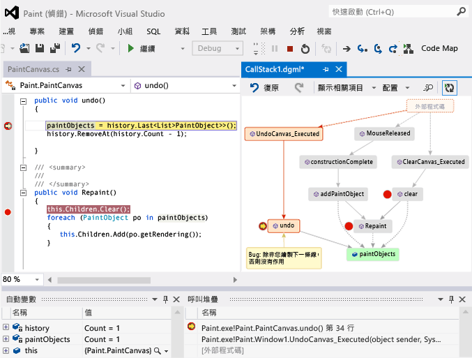  
  
 您需要下列項目：  
  
-   [Visual Studio Enterprise](https://www.visualstudio.com/downloads/download-visual-studio-vs)  
  
-   可以偵錯的程式碼，例如 Visual C\# .NET、Visual Basic .NET、C\+\+、JavaScript 或 X\+\+  
  
 請參閱：[影片：使用 Code Map 偵錯工具整合功能以視覺化方式進行偵錯 \(Channel 9\)](http://go.microsoft.com/fwlink/?LinkId=293418) • [對應呼叫堆疊](#MapStack) • [做有關程式碼的筆記](#MakeNotes) • [以下一個呼叫堆疊更新對應圖](#UpdateMap) • [將相關程式碼加入至對應圖](#AddRelatedCode) • [使用對應圖尋找 Bug](#FindBugs) • [問與答](#QA)  
  
 如需您在處理 Code Map 時可使用的命令及動作的詳細資訊，請參閱[瀏覽和重新排列 Code Map](../modeling/browse-and-rearrange-code-maps.md)。  
  
##   對應呼叫堆疊  
  
1.  開始偵錯。  \(鍵盤：**F5**\)  
  
2.  當應用程式進入中斷模式或是您逐步執行函式之後，請選擇 \[Code Map\]。  \(鍵盤：**Ctrl** \+ **Shift** \+ **\`**\)  
  
       
  
     目前的呼叫堆疊會在新的 Code Map 上顯示為橙色：  
  
     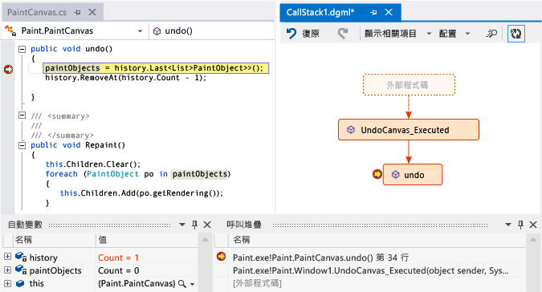  
  
     當您繼續偵錯時，對應會自動更新。  請參閱[以下一個呼叫堆疊更新對應圖](#UpdateMap)。  
  
##   做有關程式碼的筆記  
 加入註解以追蹤程式碼中發生的狀況。  若要在註解中加入新的一行，請按 **Shift \+ Return**。  
  
 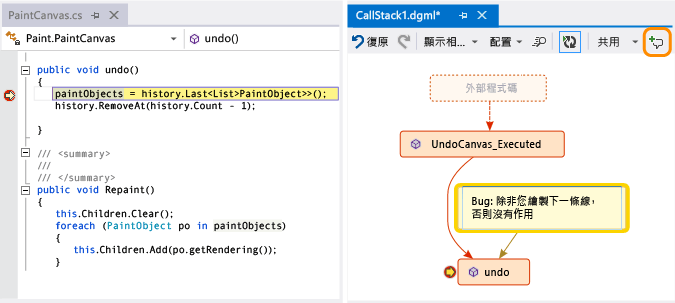  
  
##   以下一個呼叫堆疊更新對應圖  
 執行應用程式到下一個中斷點或逐步執行函式。  對應圖中就會加入新的呼叫堆疊。  
  
 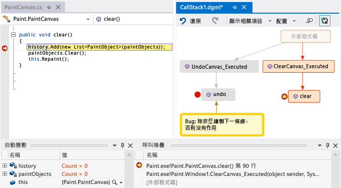  
  
##   將相關程式碼加入至對應圖  
 現在您已經有了對應圖，下一步要做什麼？  如果您是使用 Visual C\# .NET 或 Visual Basic .NET，請加入項目 \(例如欄位、屬性及其他方法\) 以追蹤程式碼中發生的情況。  
  
 按兩下某個方法以查看它的程式碼定義，或使用方法的捷徑功能表  \(鍵盤：在對應圖上選取該方法並按下 **F12**\)  
  
 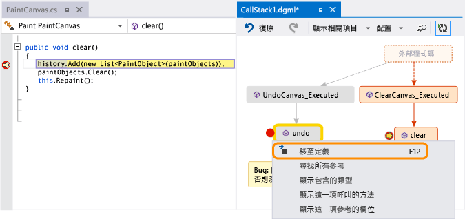  
  
 在對應圖上加入您要追蹤的項目。  
  
 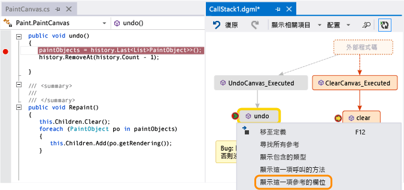  
  
> [!NOTE]
>  根據預設，將項目加入對應圖也會加入父群組節點，例如類別、命名空間和組件。  雖然這很有用，不過您可以使用對應圖工具列上的 \[包含父系\] 按鈕關閉這項功能，或在加入項目時按 **CTRL** 鍵，以簡化對應圖。  
  
 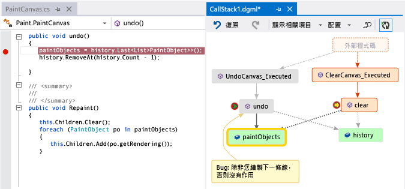  
  
 您可以在這裡輕鬆查看哪些方法使用相同的欄位。  最新加入的項目會以綠色顯示。  
  
 繼續建置對應圖來查看更多程式碼。  
  
 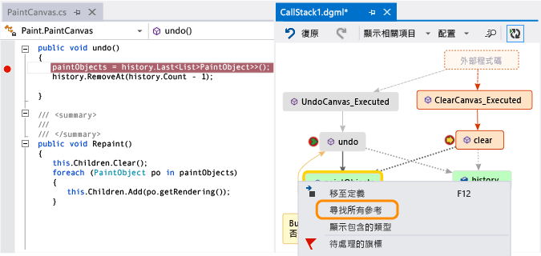  
  
 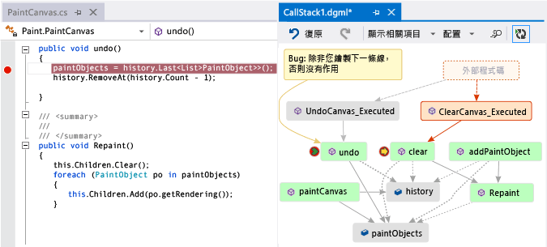  
  
##   使用對應圖尋找 Bug  
 視覺化程式碼可協助您更快速找到 Bug。  例如，假設您正在調查繪圖程式中的 Bug。  當您繪製一條線並嘗試復原時，卻沒有發生任何動作，直到您繪製另一條線為止。  
  
 因此您在 `clear`、`undo` 和 `Repaint` 方法中設定中斷點、開始偵錯，並建置一個如下所示的對應圖：  
  
 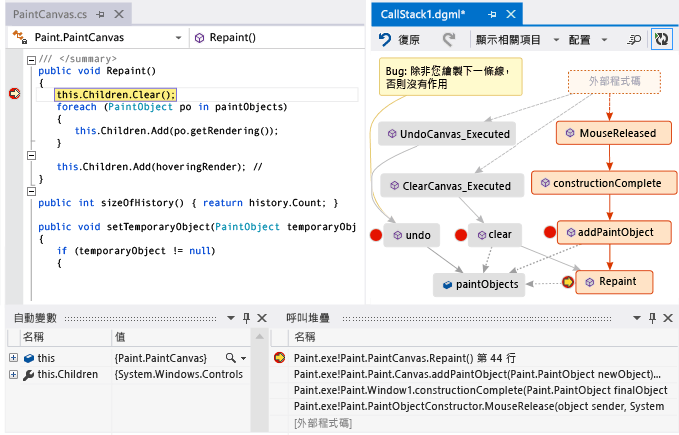  
  
 您會注意到對應圖上的所有使用者手勢都呼叫 `Repaint`，除了 `undo` 之外。  這或許可以解釋 `undo` 不會立即執行的原因。  
  
 在修正 Bug 並繼續執行程式之後，對應圖會加入從 `undo` 到 `Repaint` 的新呼叫：  
  
   
  
##   問與答  
  
-   **並非所有呼叫都會出現在對應圖上。  為什麼?**  
  
     根據預設，只有您的程式碼會出現在對應圖上。  若要查看外部程式碼，請在 \[呼叫堆疊\] 視窗中開啟程式碼：  
  
       
  
     或關閉 Visual Studio 偵錯選項中的 \[啟用 Just My Code\]：  
  
       
  
-   **變更對應圖是否會影響程式碼？**  
  
     變更對應圖完全不會影響程式碼。  請放心地重新命名、移動或移除對應圖上的任何項目。  
  
-   **「圖表可能是根據舊版程式碼建立的」這個訊息是什麼意思？**  
  
     從您上次更新對應圖之後，程式碼可能已經變更。  例如，對應圖上的某個呼叫可能已經不再存在於程式碼中。  關閉訊息，然後先嘗試重建方案後再更新對應圖。  
  
-   **要如何控制對應圖的版面配置？**  
  
     開啟位於對應圖工具列上的 \[**版面配置**\] 功能表：  
  
    -   變更預設的版面配置。  
  
    -   若要停止自動重新整理對應圖，請關閉 \[偵錯時自動配置\]。  
  
    -   若要在加入項目時盡可能減少重新整理對應圖，請關閉 \[**累加配置**\]。  
  
-   **我是否可以和其他人共用對應圖？**  
  
     您可以匯出對應圖，傳送給其他人 \(如果您有 Microsoft Outlook\)，也可以將它儲存到方案中，以便將它簽入 Team Foundation 版本控制。  
  
     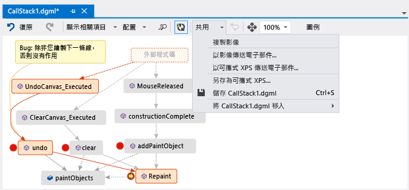  
  
-   **如何讓對應圖停止自動加入新的呼叫堆疊？**  
  
     選擇對應圖工具列上的 。  若要手動將目前的呼叫堆疊加入至對應圖，請按下 **Ctrl** \+ **Shift** \+ **\`**。  
  
     在偵錯時，對應圖會繼續反白顯示對應圖上現有的呼叫堆疊。  
  
-   **項目圖示和箭號是什麼意思？**  
  
     若要取得某個項目的詳細資訊，請將滑鼠指標移至項目上方並查看項目的工具提示。  您也可以查看 \[**圖例**\] 來了解每個圖示的意義。  
  
     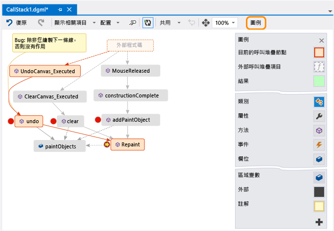  
  
 請參閱：[對應呼叫堆疊](#MapStack) • [做有關程式碼的筆記](#MakeNotes) • [以下一個呼叫堆疊更新對應圖](#UpdateMap) • [將相關程式碼加入至對應圖](#AddRelatedCode) • [使用對應圖尋找 Bug](#FindBugs)  
  
## 請參閱  
 [對應方案之間的相依性](../modeling/map-dependencies-across-your-solutions.md)   
 [使用 Code Map 偵錯您的應用程式](../modeling/use-code-maps-to-debug-your-applications.md)   
 [使用 Code Map 分析器尋找潛在問題](../modeling/find-potential-problems-using-code-map-analyzers.md)   
 [瀏覽和重新排列 Code Map](../modeling/browse-and-rearrange-code-maps.md)