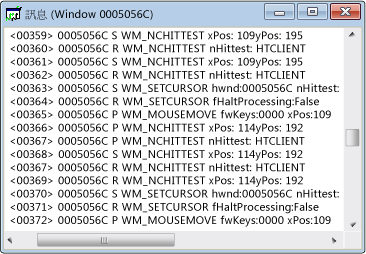

# Messages View
[!INCLUDE[vs2017banner](../code-quality/includes/vs2017banner.md)]

每個視窗都有關聯的訊息資料流。  \[訊息\] 檢視視窗會顯示這個訊息資料流，  其中會顯示視窗控制代碼、訊息碼及訊息。  您也可以為執行緒或處理序建立 \[訊息\] 檢視。  這麼做可讓您檢視傳送給特定處理序或執行緒所擁有之所有視窗的訊息，特別適用於擷取視窗初始化訊息。  
  
 一般的 \[訊息\] 檢視視窗顯示如下。  請注意，第一欄包含視窗控制代碼，而第二欄包含訊息碼 \(相關說明請參閱[訊息碼](../debugger/message-codes.md)\)。  解碼的訊息參數和傳回值會顯示於右側。  
  
   
Spy\+\+ 訊息檢視  
  
## 程序  
  
#### 若要開啟視窗、處理序或執行緒的訊息檢視  
  
1.  將焦點移至[視窗檢視](../debugger/windows-view.md)、[處理序檢視](../debugger/processes-view.md)或[執行緒檢視](../debugger/threads-view.md)視窗。  
  
2.  尋找您要檢查其訊息之項目的節點，並選取該節點。  
  
3.  選擇 \[**Spy**\] 功能表中的 \[**記錄檔訊息**\]。  
  
     [訊息選項對話方塊](../debugger/message-options-dialog-box.md)隨即開啟。  
  
4.  選取您要顯示之訊息的選項。  
  
5.  按 \[**確定**\] 開始記錄訊息。  
  
     \[訊息\] 檢視視窗隨即開啟，並且 \[**訊息**\] 功能表會加入至 \[Spy\+\+\] 工具列。  視所選取的選項而定，訊息會開始資料流處理至作用中的 \[訊息\] 檢視視窗。  
  
6.  當您有足夠的訊息時，選擇 \[**訊息**\] 功能表中的 \[**停止記錄**\]。  
  
## 本章節內容  
 [控制訊息檢視](../debugger/how-to-control-messages-view.md)  
 說明如何管理 \[訊息\] 檢視。  
  
 [從尋找視窗開啟訊息檢視](_asug_choosing_message_options)  
 說明如何從 \[尋找視窗\] 對話方塊開啟 \[訊息\] 檢視。  
  
 [在 &#91;訊息檢視&#93; 中搜尋訊息](../Topic/How%20to:%20Search%20for%20a%20Message%20in%20Messages%20View.md)  
 說明如何在 \[訊息\] 檢視中尋找特定的訊息。  
  
 [啟動與停止訊息記錄顯示](../debugger/how-to-start-and-stop-the-message-log-display.md)  
 說明如何啟動與停止訊息記錄。  
  
 [訊息代碼](../debugger/message-codes.md)  
 定義 \[訊息\] 檢視中所列訊息的代碼。  
  
 [顯示訊息屬性](../debugger/how-to-display-message-properties.md)  
 如何顯示訊息的詳細資訊。  
  
## 相關章節  
 [Spy\+\+ 檢視](../debugger/spy-increment-views.md)  
 說明視窗、訊息、處理序和執行緒的 Spy\+\+ 樹狀檢視。  
  
 [使用 Spy\+\+](../debugger/using-spy-increment.md)  
 介紹 Spy\+\+ 工具並說明如何使用此工具。  
  
 [訊息選項對話方塊](../debugger/message-options-dialog-box.md)  
 用來選取要列在作用中 \[訊息\] 檢視中的訊息。  
  
 [訊息搜尋對話方塊](../debugger/message-search-dialog-box.md)  
 用來尋找 \[訊息\] 檢視中特定訊息的節點。  
  
 [訊息屬性對話方塊](../debugger/message-properties-dialog-box.md)  
 用來顯示 \[訊息\] 檢視中所選取訊息的屬性。  
  
 [Spy\+\+ 參考](../debugger/spy-increment-reference.md)  
 包含描述每個 Spy\+\+ 功能表和對話方塊的章節。