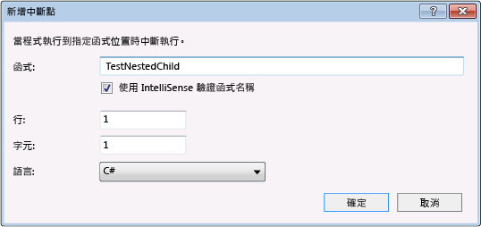

# 使用偵錯工具巡覽程式碼
[!INCLUDE[vs2017banner](../code-quality/includes/vs2017banner.md)]

在偵錯工具中移動程式碼的方式有很多種：您可以逐步執行或越過方法、執行至中斷點或指定的位置，並指定您是否要限制對自己的程式碼偵錯，或包含符號以偵錯外部程式碼。  
  
##  <a name="BKMK_Step_into__over__or_out_of_the_code"></a> 逐步執行、不進入或跳離程式碼  
 最常見的一種偵錯程序是「*逐步執行*」\(Stepping\)。 逐步執行就是一次執行一行程式碼。 當您停止執行，例如偵錯工具執行到中斷點時，您可以使用三種 \[**偵錯**\] 功能表命令逐步執行程式碼：  
  
|功能表命令|鍵盤快速鍵|描述|  
|-----------|-----------|--------|  
|**逐步執行**|**F11**|如果下一行程式碼中有函式呼叫，\[**逐步執行**\] 只執行呼叫本身，並在函式內的第一行程式碼中止。 否則，\[**逐步執行**\] 會執行下一個陳述式。|  
|**不進入函式**|**F10**|如果程式碼行包含函式呼叫，\[**不進入函式**\] 會執行被呼叫的函式，然後在呼叫函式內的第一行程式碼中止。 否則，\[**逐步執行**\] 會執行下一個陳述式。|  
|**跳離函式**|**Shift\+F11**|\[**跳離函式**\] 會繼續執行程式碼直到函式返回，然後在呼叫函式中的返回點上中斷。|  
  
-   \[**逐步執行**\] 會在巢狀函式呼叫中逐步執行最深的巢狀函式。 如果您在類似 `Func1(Func2())` 的呼叫中使用 \[逐步執行\]，偵錯工具就會逐步執行函式 `Func2`。  
  
-   偵錯工具實際上逐步執行程式碼陳述式，而不是實際程式碼行。 例如 `if` 子句可撰寫在一行上：  
  
    ```c#  
    int x = 42;  
    string s = "Not answered";  
    if( int x == 42) s = "Answered!";  
    ```  
  
    ```vb  
    Dim x As Integet = 42  
    Dim s As String = "Not answered"  
    If x = 42 Then s = "Answered!"  
    ```  
  
     當您逐步執行至這一行時，偵錯工具會將條件視為一個步驟並將結果視為另一個步驟 \(在此範例中，條件是 true\)。  
  
 若要在逐步執行函式時以視覺方式追蹤呼叫堆疊，請參閱 [進行偵錯時對應呼叫堆疊上的方法](../debugger/map-methods-on-the-call-stack-while-debugging-in-visual-studio.md)。  
  
##  <a name="BKMK_Break_into_code_by_using_breakpoints_or_Break_All"></a> 藉由使用中斷點或全部中斷來中斷程式碼  
 當您使用 VS 偵錯工具偵錯應用程式時，應用程式可能為執行中或在中斷模式中。  
  
 偵錯工具會在執行到達中斷點或出現例外狀況時，立即中斷應用程式執行。 您也可以隨時手動中斷執行。  
  
 中斷點是用來通知偵錯工具暫時在應用程式的某一點暫停執行的訊號。 當執行暫止於中斷點時，程式將處於中斷模式下。 進入中斷模式並不會停止或結束程式的執行，隨時都可以繼續執行。  
  
 大部分偵錯工具的功能 \(例如在 \[區域變數\] 視窗中檢視變數值，或在 \[監看式\] 視窗中評估運算式\) 只適用於中斷模式。 應用程式的所有項目依然存在 \(例如函式、變數及物件都會留在記憶體中\)，不過這些項目的移動和活動都會暫停。 在中斷模式下，您可以檢查項目的位置和狀態，以尋找違規或錯誤。 您也可以在中斷模式中調整應用程式。  
  
 您可以根據一些條件設定中斷點暫停執行。 請參閱 [使用中斷點](../debugger/using-breakpoints.md)。 本節說明中斷程式碼的兩種基本方法。  
  
1.  **在程式碼中設定中斷點**  
  
     若要在程式碼中設定簡單的中斷點，請在 Visual Studio 編輯器中開啟原始程式檔。 將游標放在您要中斷的程式碼行，然後選擇 \[**中斷點**\]、內容功能表上的 \[**插入中斷點**\] \(鍵盤：**F9**\)。 偵錯工具會在執行該行之前中斷執行。  
  
       
  
     Visual Studio 的中斷點提供一組豐富的其他功能，例如條件式中斷點和追蹤點。 請參閱 [使用中斷點](../debugger/using-breakpoints.md)。  
  
2.  **手動中斷程式碼**  
  
     若要中斷執行中應用程式的下一行程式碼，請選擇 \[**偵錯**\]、\[**全部中斷**\] \(鍵盤：**Ctrl\+Alt\+Break**\)。  
  
-   如果在啟用 Just My Code 選項的情況下偵錯，會在專案的下一行程式碼中斷。 請參閱 [將逐步執行限制於 Just My Code](#BKMK_Restrict_stepping_to_Just_My_Code)。  
  
-   如果您正在偵錯多個程式，根據預設，中斷點或 \[全部中斷\] 命令就會影響正在偵錯的所有程式。 請參閱 [設定多個處理序的執行行為](../debugger/debug-multiple-processes.md#BKMK_Configure_the_execution_behavior_of_multiple_processes)。  
  
-   如果您在執行沒有對應原始程式檔或符號檔 \(.pdb\) 的程式碼時中斷，偵錯工具會顯示 \[找不到原始程式檔\] 或 \[找不到符號\] 頁面，協助您找出適當的檔案。 請參閱 [指定符號 \(.pdb\) 和原始程式檔](../debugger/specify-symbol-dot-pdb-and-source-files-in-the-visual-studio-debugger.md)。  
  
     如果您無法存取支援檔案，您仍然可以在 \[反組譯碼\] 視窗中偵錯組譯碼指令。  
  
##  <a name="BKMK_Run_to_a_specified_location_or_function"></a> 執行至指定的位置或函式  
 有時您會希望執行到程式碼中的某一點，然後暫止執行。 如果您在想要中斷的位置上已設定中斷點，未啟動偵錯時請選擇 \[**偵錯**\]、\[**開始偵錯**\]，否則選擇 \[**偵錯**\]、\[**繼續**\]  \(在兩種情形中，**F5** 都是快速鍵\)。 偵錯工具會在程式碼執行的下一個中斷點停止。 選擇 \[**偵錯**\]、\[**繼續**\]，直到您到達您想要的中斷點。  
  
 您也可以執行到您在程式碼編輯器中放置游標的位置，或執行至指定的函式。  
  
 **執行至游標位置**  
  
 若要執行至游標位置，請將游標置於來源視窗中的一行可執行的程式碼。 在編輯器的內容功能表上，選擇 \[**執行至游標處**\]。  
  
 **執行至呼叫堆疊上的函式**  
  
 在 \[**呼叫堆疊**\] 視窗中，選取函式，然後選擇內容功能表上的 \[**執行至游標處**\]。 若要以視覺方式追蹤呼叫堆疊，請參閱 [進行偵錯時對應呼叫堆疊上的方法](../debugger/map-methods-on-the-call-stack-while-debugging-in-visual-studio.md)。  
  
 **執行至名稱所指定的函式**  
  
 您可以命令偵錯工具執行應用程式直至指定的函式。 您可以依名稱來指定函式，或是在呼叫堆疊中選擇函式。  
  
 若要依名稱指定函式，選擇 \[**偵錯**\]、\[**新增中斷點**\]、\[**在函式中斷**\]，然後輸入函式名稱和其他識別資訊。  
  
   
  
 如果函式已多載或在多個命名空間中，您可以在 \[**選擇中斷點**\] 對話方塊中選擇想要的函式。  
  
   
  
##  <a name="BKMK_Set_the_next_statement_to_execute"></a> 設定下一個要執行的陳述式  
 在中斷並進入偵錯工具之後，您可以移動執行點，設定下一個要執行的程式碼陳述式。 來源或 \[反組譯碼\] 視窗邊界中的黃色箭頭，將會標記出下一個要執行的陳述式之位置。 您可以移動這個箭頭以略過一部分的程式碼或是返回先前執行的行。 可以在某些情形中使用這項功能，例如略過包含已知錯誤的程式碼區段。  
  
   
  
 若要設定下一個要執行的陳述式，請使用下列其中一項程序：  
  
-   在來源視窗中，將黃色箭頭拖曳至想要設定下一個陳述式的位置 \(在相同的原始程式檔中\)  
  
-   在來源視窗中，將游標放在下一個要執行的程式行，然後選擇內容功能表上的 \[**設定下一個陳述式**\]。  
  
-   在 \[反組譯碼\] 視窗中，將游標放在下一行要執行的組譯碼指令，然後選擇內容功能表上的 \[**設定下一個陳述式**\]。  
  
> [!CAUTION]
>  設定下一個陳述式會導致程式計數器直接跳至新的位置。 使用這個命令時請務必要注意：  
>   
>  -   不會執行舊與新執行點之間的指令  
> -   如果將執行點向後移，並不會復原中間的指令  
> -   將下一個陳述式移至其他函式或範圍通常會造成呼叫堆疊損毀，導致執行階段錯誤或例外狀況。 如果嘗試將下一個陳述式移至其他範圍，偵錯工具會開啟警告對話方塊，讓您有機會取消作業。 在 Visual Basic，您無法將下一個陳述式移至其他範圍或函式  
> -   在原生 C\+\+ 中，如果啟用執行階段檢查，設定下一個陳述式會導致在執行到方法結尾時擲回例外狀況  
> -   啟用 \[編輯後繼續\] 時，如果您進行了 \[編輯後繼續\] 無法立即重新對應的編輯作業，\[**設定下一個陳述式**\] 就會失敗。 舉例來說，如果您編輯了 catch 區塊內的程式碼，就會發生這種情況。 當發生這種情況時，您將會看到一則錯誤訊息，說明不支援此作業。  
  
> [!NOTE]
>  在 Managed 程式碼中，您無法在下列情況中移動下一個陳述式：  
>   
>  -   下一個陳述式是在與目前陳述式不同的方法中  
> -   使用 Just\-In\-Time 偵錯啟動偵錯。  
> -   呼叫堆疊回溯進行中  
> -   擲回 System.StackOverflowException 或 System.Threading.ThreadAbortException 例外狀況  
  
 應用程式正在執行時，不能設定下一個陳述式。 若要設定下一個陳述式，偵錯工具必須處於中斷模式下。  
  
##  <a name="BKMK_Restrict_stepping_to_Just_My_Code"></a> 將逐步執行限制於 Just My Code  
 有時候在偵錯時，您可能只想查看自己所撰寫的程式碼，並且忽略像是系統呼叫等其他程式碼。 您可以使用 Just My Code 偵錯來達到目的。 Just My Code 會隱藏非使用者的程式碼，使此程式碼不會出現在偵錯工具視窗中。 在逐步執行時，偵錯工具會逐步執行任何非使用者的程式碼，但是不會中途停止。 請參閱[Just My Code](../debugger/just-my-code.md)  
  
> [!NOTE]
>  裝置專案不支援 Just My Code。  
  
##  <a name="BKMK_Step_into_system_calls"></a> 逐步執行系統呼叫  
 如果您已載入系統程式碼的偵錯符號，而且沒有啟用 Just My Code，您就可以逐步執行系統呼叫，就像逐步執行其他任何呼叫一樣。  
  
 若要存取 Microsoft 符號檔，請參閱 [指定符號 \(.pdb\) 和原始程式檔](../debugger/specify-symbol-dot-pdb-and-source-files-in-the-visual-studio-debugger.md) 主題中的 [使用符號伺服器尋找不在本機電腦上的符號檔](../debugger/specify-symbol-dot-pdb-and-source-files-in-the-visual-studio-debugger.md#BKMK_Use_symbol_servers_to_find_symbol_files_not_on_your_local_machine)。  
  
 若要在偵錯時載入特定系統元件的符號：  
  
1.  開啟 \[模組\] 視窗 \(鍵盤：**Ctrl\+Alt\+U**\)。  
  
2.  選取您要載入其符號的模組。  
  
     您可以透過查看 \[**符號狀態**\] 欄來判斷哪些模組已經載入符號。  
  
3.  選擇內容功能表上的 \[**載入符號**\]。  
  
##  <a name="BKMK_Step_into_properties_and_operators_in_managed_code"></a> 逐步執行 Managed 程式碼中的屬性及運算子  
 偵錯工具預設為不進入 Managed 程式碼中的屬性及運算子。 在大部分情況下，這會產生比較令人滿意的偵錯經驗。 若要啟用逐步執行屬性或運算子，請選擇 \[**偵錯**\]、\[**選項和設定**\]。 在 \[**偵錯**\]、\[**一般**\] 頁面上，清除 \[**不進入屬性和運算子 \(僅限 Managed\)**\] 核取方塊。