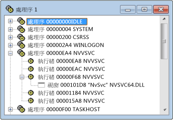

# Processes View
[!INCLUDE[vs2017banner](../code-quality/includes/vs2017banner.md)]

\[處理序\] 檢視會顯示系統上所有作用中處理序的樹狀結構，  其中會顯示處理序 ID 和模組名稱。  如果您要檢查特定系統處理序，而該處理序通常對應至執行程式，請使用 \[處理序\] 檢視。  處理序可以透過模組名稱來識別，或是指定「系統處理序」。  
  
 Microsoft Windows 支援多個處理序。  每個處理序可以有一個或多個執行緒，並且每個執行緒可以有一個或多個相關聯的最上層視窗。  每個最上層視窗可以擁有一系列視窗。  加號 \(\+\) 代表層級為摺疊。  摺疊的檢視是由一個處理序一行所組成。  按一下加號 \(\+\) 即可展開該層。  
  
 如果您要檢查特定系統處理序，而該處理序通常對應至執行程式，請使用 \[處理序\] 檢視。  處理序可以透過模組名稱來識別，或是指定「系統處理序」。 若要尋找處理序，請摺疊樹狀結構並搜尋清單。  
  
## 程序  
  
#### 若要開啟處理序檢視  
  
1.  選擇 \[**Spy**\] 功能表中的 \[**處理序**\]。  
  
   
Spy\+\+ 處理序檢視  
  
 上圖顯示 \[處理序\] 檢視，其中處理序和執行緒節點已展開。  
  
### 本章節內容  
 [在 &#91;處理序檢視&#93; 中搜尋處理序](../debugger/how-to-search-for-a-process-in-processes-view.md)  
 說明如何在 \[處理序\] 檢視中尋找特定的處理序。  
  
 [顯示處理序屬性](../debugger/how-to-display-process-properties.md)  
 說明如何顯示訊息的詳細資訊。  
  
### 相關章節  
 [Spy\+\+ 檢視](../debugger/spy-increment-views.md)  
 說明視窗、訊息、處理序和執行緒的 Spy\+\+ 樹狀檢視。  
  
 [使用 Spy\+\+](../debugger/using-spy-increment.md)  
 介紹 Spy\+\+ 工具並說明如何使用此工具。  
  
 [處理序搜尋對話方塊](../debugger/process-search-dialog-box.md)  
 用來尋找 \[處理序\] 檢視中特定處理序的節點。  
  
 [處理序屬性對話方塊](../debugger/process-properties-dialog-box.md)  
 顯示 \[處理序\] 檢視中所選取處理序的屬性。  
  
 [Spy\+\+ 參考](../debugger/spy-increment-reference.md)  
 包含描述每個 Spy\+\+ 功能表和對話方塊的章節。