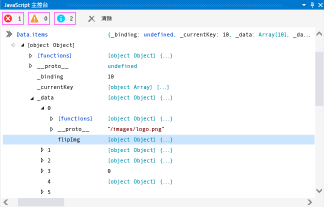
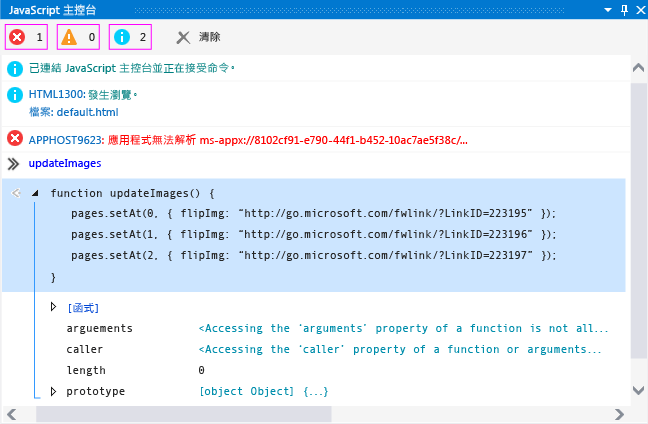

# 快速入門：使用主控台偵錯 JavaScript
[!INCLUDE[vs2017banner](../code-quality/includes/vs2017banner.md)]

  
  
 您可以使用 \[JavaScript 主控台\] 視窗進行互動，並且為使用 JavaScript 建置的市集 App 偵錯。 這些功能支援 [!INCLUDE[win8_appname_long](../debugger/includes/win8_appname_long_md.md)] App、Windows Phone 市集 App 和使用 Visual Studio Tools for Apache Cordova 所建立的 App。 如需主控台命令參考，請參閱 [JavaScript 主控台命令](../debugger/javascript-console-commands.md)。  
  
 \[JavaScript 主控台\] 視窗可讓您：  
  
-   將物件、值和訊息從您的 App 傳送至主控台視窗。  
  
-   在執行中的 App 中檢視和修改本機和全域變數的值。  
  
-   檢視物件視覺化檢視。  
  
-   執行在目前的指令碼內容中執行的 JavaScript 程式碼。  
  
-   檢視 JavaScript 錯誤和例外狀況，以及文件物件模型 \(DOM\) 和 Windows 執行階段例外狀況。  
  
-   執行其他工作，例如清除畫面。 如需命令的完整清單，請參閱 [JavaScript 主控台命令](../debugger/javascript-console-commands.md)。  
  
 本主題內容：  
  
-   [使用 JavaScript 主控台視窗進行偵錯](#InteractiveConsole)  
  
-   [互動式偵錯和中斷模式](#InteractiveDebuggingBreakMode)  
  
-   [JavaScript 主控台視窗中的單行模式和多行模式](#SinglelineMultilineMode)  
  
-   [切換指令碼執行內容](#Switching)  
  
> [!TIP]
>  如果 \[JavaScript 主控台\] 視窗已關閉，請選擇 \[偵錯\] \> \[視窗\] \> \[JavaScript 主控台\] 以重新開啟。 只有在指令碼偵錯工作階段期間，才會出現此視窗。  
  
 使用 \[JavaScript 主控台\] 視窗，您可以與 App 互動，而不需要停止和重新啟動偵錯工具。 如需詳細資訊，請參閱 [重新整理應用程式 \(JavaScript\)](../debugger/refresh-an-app-javascript.md)。 如需其他 JavaScript 偵錯功能 \(例如使用 \[DOM 總管\] 以及設定中斷點\) 的詳細資訊，請參閱 [快速入門：偵錯 HTML 和 CSS](../debugger/quickstart-debug-html-and-css.md) 和 [在 Visual Studio 中偵錯應用程式](../debugger/debug-store-apps-in-visual-studio.md)。  
  
##  <a name="InteractiveConsole"></a> 使用 JavaScript 主控台視窗進行偵錯  
 下列步驟會建立 `FlipView` App，並顯示如何以互動方式為 JavaScript 程式碼錯誤偵錯。  
  
> [!CAUTION]
>  此範例應用程式是 Windows 市集 App。 不過，此處所述的主控台功能也適用於使用 Apache Cordova Visual Studio Tools 所建立的 App。  
  
#### 在 FlipView App 中為 JavaScript 程式碼偵錯  
  
1.  在 Visual Studio 中選擇 \[檔案\] \> \[新增專案\] 以建立新方案。  
  
2.  依序選擇 \[JavaScript\] \> \[市集應用程式\]、\[Windows 應用程式\] 或 \[Windows Phone 應用程式\]，然後選擇 \[空白應用程式\]。  
  
3.  輸入專案的名稱，例如 `FlipViewApp`，然後選擇 \[確定\] 建立應用程式。  
  
4.  在 default.html 的 BODY 元素中，將現有的 HTML 程式碼取代為以下程式碼：  
  
    ```html  
    <div id="flipTemplate" data-win-control="WinJS.Binding.Template" style="display:none"> <div class="fixedItem" >  </div> </div> <div id="fView" data-win-control="WinJS.UI.FlipView" data-win-options="{ itemDataSource: Data.items.dataSource, itemTemplate: flipTemplate }"> </div>  
    ```  
  
5.  開啟 default.css 並為 `#fView` 選取器新增 CSS：  
  
    ```css  
    #fView { background-color:#0094ff; height: 500px; margin: 25px; }  
    ```  
  
6.  開啟 default.js，並將程式碼取代為下列 JavaScript 程式碼：  
  
    ```javascript  
    (function () { "use strict"; var app = WinJS.Application; var activation = Windows.ApplicationModel.Activation; var myData = []; for (var x = 0; x < 4; x++) { myData[x] = { flipImg: "/images/logo.png" } }; var pages = new WinJS.Binding.List(myData, { proxy: true }); app.onactivated = function (args) { if (args.detail.kind === activation.ActivationKind.launch) { if (args.detail.previousExecutionState !== activation.ApplicationExecutionState.terminated) { // TODO: . . . } else { // TODO: . . . } args.setPromise(WinJS.UI.processAll()); updateImages(); } }; function updateImages() { pages.push(0, { flipImg: "http://go.microsoft.com/fwlink/?LinkID=223195" }); pages.push(1, { flipImg: "http://go.microsoft.com/fwlink/?LinkID=223196" }); pages.push(2, { flipImg: "http://go.microsoft.com/fwlink/?LinkID=223197" }); }; app.oncheckpoint = function (args) { }; app.start(); var publicMembers = { items: pages }; WinJS.Namespace.define("Data", publicMembers); })();  
    ```  
  
7.  如果尚未選取偵錯目標，請在 \[偵錯\] 工具列上，從 \[裝置\] 按鈕旁邊的下拉式清單中選擇 \[模擬器\] 或 \[Emulator 8.1 WVGA 4 英吋 512MB\] \(針對 Windows Phone\)：  
  
       
  
8.  按 F5 以啟動偵錯工具。  
  
     App 便會執行，但影像會遺失。 \[JavaScript 主控台\] 視窗中的 APPHOST 錯誤指出影像遺失。  
  
9. 使用在模擬器或 Phone 模擬器中執行的 `FlipView` App 時，在主控台視窗輸入提示下 \("\>\>" 符號旁邊\) 輸入 `Data.items`，然後按下 Enter。  
  
     `items` 物件的視覺化檢視便會出現在主控台視窗中。 這表示 `items` 物件已具現化，且可在目前的指令碼內容中使用。 在主控台視窗中，您可以按一下物件的每個節點以檢視屬性值 \(或使用方向鍵\)。 這表示 `items._data` 物件已具現化，且可在目前的指令碼內容中使用。 預設影像 \(logo.png\) 仍存在於物件中，但遺失影像與預期影像顛倒。  
  
       
  
     也請注意，`items._data` 物件中的項目數會比預期多很多。  
  
10. 在提示字元中輸入 `Data.items.push` 並按下 Enter。 主控台視窗便會顯示在 [!INCLUDE[winjs_long](../debugger/includes/winjs_long_md.md)] 專案檔中實作之 `push` 函式的視覺化檢視。 在此 App 中，我們將使用 `push` 加入正確的項目。 使用 IntelliSense 進行一些調查之後，就會發現我們應該使用 `setAt` 取代預設影像。  
  
11. 若要在不停止偵錯工作階段的情況下以互動方式修正這個問題，請開啟 default.js，然後從 `updateImages` 函式選取以下程式碼：  
  
    ```javascript  
    pages.push(0, { flipImg: "http://go.microsoft.com/fwlink/?LinkID=223195" }); pages.push(1, { flipImg: "http://go.microsoft.com/fwlink/?LinkID=223196" }); pages.push(2, { flipImg: "http://go.microsoft.com/fwlink/?LinkID=223197" });  
    ```  
  
     複製此程式碼，並將其貼入 JavaScript 主控台輸入提示字元中。  
  
    > [!TIP]
    >  當您將多行程式碼貼入 JavaScript 主控台輸入提示字元中時，主控台輸入提示會自動切換到多行模式。 您可以按 Ctrl\+Alt\+M 以開啟和關閉多行模式。 若要在多行模式下執行指令碼，請按 Ctrl\+Enter 或選擇視窗右下角的箭頭符號。 如需詳細資訊，請參閱 [JavaScript 主控台視窗中的單行模式和多行模式](#SinglelineMultilineMode)。  
  
12. 更正提示中的 `push` 函式呼叫，將 `pages.push` 取代為 `Data.items.setAt`。 正確的程式碼應該如下所示：  
  
    ```javascript  
    Data.items.setAt(0, { flipImg: "http://go.microsoft.com/fwlink/?LinkID=223195" }); Data.items.setAt(1, { flipImg: "http://go.microsoft.com/fwlink/?LinkID=223196" }); Data.items.setAt(2, { flipImg: "http://go.microsoft.com/fwlink/?LinkID=223197" });  
    ```  
  
    > [!TIP]
    >  如果您想要使用 `pages` 物件而非 `Data.items`，您必須設定程式碼中的中斷點以保留範圍內的 `pages` 物件。  
  
13. 選擇綠色箭頭符號以執行指令碼。  
  
14. 按 Ctrl\+Alt\+M，將主控台輸入提示字元切換至單行模式，然後選擇 \[清除輸入\] \(紅色 "X"\) 以刪除輸入提示字元中的程式碼。  
  
15. 在提示字元中輸入 `Data.items.length = 3`，然後按 Enter。 這會從資料中移除多餘的項目。  
  
16. 再次檢查模擬器或 Phone 模擬器，您將會看到正確的影像位於正確 `FlipView` 頁面上。  
  
17. 在 \[DOM 總管\] 中，您可以看到更新的 DIV 項目，而且您可以巡覽至樹狀子目錄，以尋找預期的 IMG 項目。  
  
18. 依序選擇 \[偵錯\] \> \[停止偵錯\] 或按 Shift\+F5 停止偵錯，接著修正原始程式碼。  
  
     如需包含更正後範例程式碼的完整 default.html 頁面，請參閱 [偵錯 HTML、CSS 和 JavaScript 範例程式碼](../debugger/debug-html-css-and-javascript-sample-code.md)。  
  
##  <a name="InteractiveDebuggingBreakMode"></a> 互動式偵錯和中斷模式  
 您可以在使用 JavaScript 偵錯工具 \(如 \[JavaScript 主控台\] 視窗\) 的同時，使用中斷點並逐步執行程式碼。 在偵錯工具中執行的程式遇到中斷點時，偵錯工具會暫時停止執行程式。 當執行暫停時，您的程式會從執行模式切換到中斷模式。 您可以隨時繼續執行。  
  
 當程式處於中斷模式時，您可以使用 \[JavaScript 主控台\] 視窗執行目前的指令碼執行內容中有效的指令碼和命令。 在此程序中，您將使用您先前建立的 `FlipView` App 的修正後版本，示範如何使用中斷模式。  
  
#### 設定中斷點並為 App 偵錯  
  
1.  在您先前建立的 `FlipView` App 的 default.html 檔案中，開啟 `updateImages()` 函式的捷徑功能表，然後選擇 \[中斷點\] \> \[插入中斷點\]。  
  
2.  在 \[偵錯\] 工具列上 \[開始偵錯\] 按鈕旁邊的下拉式清單中，選擇 \[本機電腦\] 或 \[Emulator 8.1 WVGA 4 inch 512MB\]。  
  
3.  選擇 \[偵錯\] \> \[開始偵錯\]，或按 F5。  
  
     當執行程序到達 `updateImages()` 函式時，App 會進入中斷模式，而程式執行的目前所在行會以黃色反白顯示。  
  
       
  
     您可以變更變數的值以立即影響程式狀態，而不需要結束目前的偵錯工作階段。  
  
4.  在提示字元中輸入 `updateImages` 並按 Enter。 該函式的視覺化檢視便會出現在主控台視窗中。  
  
5.  在主控台視窗中選取該函式，以顯示函式實作。  
  
     下圖會顯示目前的主控台視窗。  
  
       
  
6.  將函式的一行從輸出視窗複製到輸入提示中，並將索引值變更為 3：  
  
    ```javascript  
    pages.setAt(3, { flipImg: "http://go.microsoft.com/fwlink/?LinkID=223197" });  
    ```  
  
7.  按下 Enter 以執行該行程式碼。  
  
     如果您想要逐步執行逐行程式碼，請按下 F11，或按 F5 鍵繼續執行程式。  
  
8.  按 F5 繼續執行程式。`FlipView` App 便會出現，而且現在全部四個頁面都會顯示其中一個非預設影像。  
  
     若要切換回 Visual Studio，請按 F12 或 Alt\+Tab。  
  
##  <a name="SinglelineMultilineMode"></a> JavaScript 主控台視窗中的單行模式和多行模式  
 \[JavaScript 主控台\] 視窗的輸入提示同時支援單行模式和多行模式。 本主題中的互動式偵錯程序提供使用這兩種模式的範例。 您可以按 Ctrl\+Alt\+ M，在兩種模式之間切換。  
  
 單行模式提供輸入歷程記錄。 您可以使用向上鍵和向下鍵巡覽輸入歷程記錄。 當您執行指令碼時，單行模式會清除輸入提示。 若要在單行模式下執行指令碼，請按 Enter。  
  
 當您執行指令碼時，多行模式不會清除輸入提示。 當您從多行模式切換至單行模式時，可以按下 \[清除輸入\] \(紅色的 "X"\) 以清除輸入行。 若要在多行模式下執行指令碼，請按 Ctrl\+Enter 或選擇視窗右下角的箭頭符號。  
  
##  <a name="Switching"></a> 切換指令碼執行內容  
 \[JavaScript 主控台\] 視窗可讓您一次與一個單一執行內容 \(表示 Web 平台主機 \(WWAHost.exe\) 的單一執行個體\) 互動。 在某些情況下，您的 App 可能會啟動主機的另一個執行個體，例如當您使用 `iframe`、共用合約、Web 背景工作或 `WebView` 控制項時。 如果主機的另一個執行個體正在執行，您可以在 \[目標\] 清單中選取執行內容，以便在執行 App 的同時，選取不同的執行內容。  
  
 下圖顯示 \[JavaScript 主控台\] 視窗中的 \[目標\] 清單。  
  
   
  
 您也可以使用 `cd` 命令來切換執行內容，但是必須知道另一個執行內容的名稱，而且您使用的參考必須在範圍內。 \[目標\] 清單提供更好的方式讓您存取其他執行內容。  
  
##  <a name="BrowserSupport"></a> 瀏覽器和平台支援  
 下列平台支援 \[JavaScript 主控台\] 視窗：  
  
-   使用 JavaScript 和 HTML 的 [!INCLUDE[win8_appname_long](../debugger/includes/win8_appname_long_md.md)] 和 Windows Phone 市集 App  
  
-   在 [!INCLUDE[win81](../debugger/includes/win81_md.md)] 上執行的 Internet Explorer 11  
  
-   在 [!INCLUDE[win8](../debugger/includes/win8_md.md)] 上執行的 Internet Explorer 10  
  
## 請參閱  
 [在 Visual Studio 中偵錯應用程式](../debugger/debug-store-apps-in-visual-studio.md)   
 [JavaScript 主控台命令](../debugger/javascript-console-commands.md)   
 [重新整理應用程式 \(JavaScript\)](../debugger/refresh-an-app-javascript.md)   
 [鍵盤快速鍵](../debugger/keyboard-shortcuts-html-and-javascript.md)   
 [偵錯 HTML、CSS 和 JavaScript 範例程式碼](../debugger/debug-html-css-and-javascript-sample-code.md)   
 [快速入門：偵錯 HTML 和 CSS](../debugger/quickstart-debug-html-and-css.md)   
 [偵錯 WebView 控制項](../debugger/debug-a-webview-control.md)   
 [產品支援和協助工具](http://msdn.microsoft.com/library/tzbxw1af\(VS.120\).aspx)