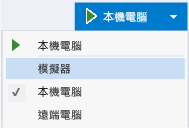

# 重新整理應用程式 (JavaScript)
[!INCLUDE[vs2017banner](../code-quality/includes/vs2017banner.md)]

  
  
 您可以在偵錯期間變更程式碼內容，然後選擇 \[偵錯\] 工具列上的 \[重新整理 Windows 應用程式\] 按鈕，重新整理使用 JavaScript 的市集應用程式。  選擇此按鈕隨即會重新載入應用程式，而不需要停止並重新開始偵錯工具。  重新整理功能可讓您修改 HTML、CSS 和 JavaScript 程式碼，並且快速查看結果。  Windows 市集和 Windows Phone 市集應用程式都支援此功能。  
  
 重新整理不會維護您的應用程式狀態，也不會將下列變更反映給應用程式：  
  
-   封裝資訊清單檔案變更，包括對封裝資訊清單中指定之影像的變更。  
  
-   參考變更 \(例如新增或移除 SDK 參考\)，或者對 Windows 執行階段元件 \(.winmd 檔案\) 的變更。  
  
-   資源變更，例如對 .resjson 檔案中字串的變更。  
  
-   專案檔案變更，該變更導致路徑名稱變更、新增專案檔案或刪除檔案。  
  
-   專案和項目屬性變更，例如對選取之偵錯裝置的變更，或對檔案之封裝動作的變更 \(在 \[屬性\] 視窗中\)。  
  
> [!IMPORTANT]
>  當您變更參考、封裝資訊清單或進行前述清單中指定的其他變更時，必須停止然後重新啟動偵錯工具才能更新 HTML、CSS 和 JavaScript 原始程式檔。  
  
### 若要重新整理應用程式  
  
1.  在 Visual Studio 中，使用巡覽應用程式專案範本建立新的專案。  
  
     這可以是 Windows 市集應用程式、Windows Phone 市集應用程式或通用應用程式。  
  
2.  在 Visual Studio 中開啟範本，並選取偵錯目標。  
  
     如果 Windows Phone 專案是您目前的啟始專案，請選取偵錯目標的 Windows Phone 模擬器。  否則，請選取 \[模擬器\] 或 \[本機電腦\]。  
  
       
  
3.  請按 F5 以偵錯模式執行應用程式。  
  
4.  切換至 Visual Studio。  \(按 F12。\)  
  
5.  在 \[方案總管\] 中，於 \[頁面\] \> \[首頁\] 資料夾中，開啟 home.html。  
  
6.  變更頁面標題文字  
  
    ```html  
    Welcome to yourAppName!  
    ```  
  
     為其他項目，如下所示：  
  
    ```html  
    Hello!  
    ```  
  
7.  按一下 \[**重新整理 Windows 應用程式**\] 按鈕，如下所示： \(或按 F4\)。  
  
8.  切換至應用程式。  應用程式隨即重新載入而不重新啟動偵錯工具，且會顯示新的頁面標題。  
  
## 請參閱  
 [快速入門：偵錯 HTML 和 CSS](../debugger/quickstart-debug-html-and-css.md)