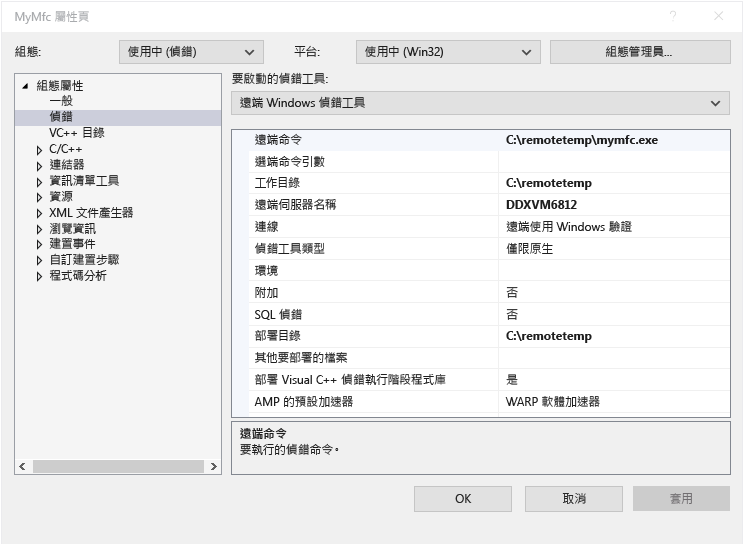
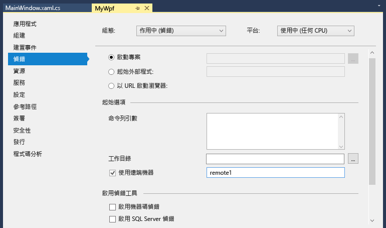

# 遠端偵錯
[!INCLUDE[vs2017banner](../code-quality/includes/vs2017banner.md)]

您可以偵錯已部署在不同電腦的 Visual Studio 應用程式。  若要這樣做，您可以使用 Visual Studio 遠端偵錯工具。  
  
 這裡的資訊適用於 Windows 桌面應用程式和 ASP.NET 應用程式。  如需遠端偵錯 Windows 市集應用程式和 Azure App 的詳細資訊，請參閱 [在 Windows 市集和 Azure App 上的遠端偵錯](#bkmk_winstoreAzure)。  
  
## 下載及安裝遠端工具  
 您可以在 [Remote Tools for Visual Studio 2015](https://www.microsoft.com/en-us/download/details.aspx?id=48155) 下載適用於偵錯的遠端工具。 您可以選擇 x86、x64 和 ARM 版本的工具。 當您完成下載可執行檔時，請遵循指示，在遠端電腦上安裝應用程式。  
  
 您可以在 [Remote Tools for Visual Studio 2015 Update 1](https://www.microsoft.com/en-us/download/details.aspx?id=49986&44F86079-8679-400C-BFF2-9CA5F2BCBDFC=1) 下載 Update 1 版的遠端工具。  
  
> [!IMPORTANT]
>  您必須安裝與 Visual Studio 安裝版本相符的遠端工具版本。 不支援不相符的版本。 此外，您必須安裝與要偵錯之應用程式具有相同架構的遠端工具。 換句話說，如果您想要偵錯 64 位元應用程式，就必須安裝 64 位元版本的遠端工具。  
  
 如果遠端電腦上已安裝 Visual Studio 2015 Community、Professional 或 Enterprise，則遠端偵錯工具 \(**msvsmon.exe**\) 即已經安裝，您可以從其目錄啟動：  
  
 **\<Visual Studio 安裝目錄\>\\Common7\\IDE\\Remote Debugger\\\(x64, x86, Appx\)\\msvsmon.exe**  
  
 不過，只有當您下載並安裝這些工具，而且稍後可能需要用於設定時 \(特別是如果您想要遠端偵錯工具當做服務執行時\)，才會安裝 \[遠端偵錯工具組態精靈\] \(**rdbgwiz.exe**\)。 如需詳細資訊，請參閱以下的 [設定遠端偵錯工具當做服務](#bkmk_configureService)。  
  
## 支援的作業系統  
 遠端電腦必須執行下列作業系統的其中一個：  
  
-   Windows 10  
  
-   Windows 8 或 8.1  
  
-   Windows 7 Service Pack 1  
  
-   Windows Server 2012 或 Windows Server 2012 R2  
  
-   Windows Server 2008 Service Pack 2、Windows Server 2008 R2 Service Pack 1  
  
## 支援的硬體組態  
  
-   1.6 GHz 或更快的處理器  
  
-   1 GB RAM \(如果在虛擬機器上執行，便需要 1.5 GB\)  
  
-   1 GB 可用硬碟空間  
  
-   5400 RPM 硬碟  
  
-   可使用 DirectX 9 且可在 1024 x 768 或更高顯示解析度執行的視訊卡  
  
## 網路組態  
 遠端電腦和 Visual Studio 電腦必須透過網路、工作群組或家用群組等連接，或直接透過乙太網路纜線連接。 不支援透過網際網路偵錯。  
  
## 設定遠端偵錯工具  
 您必須在遠端電腦上擁有系統管理權限  
  
1.  尋找遠端偵錯工具應用程式。 您可以在 \[開始\] 功能表尋找 \[遠端偵錯工具\]。  
  
2.  當您第一次啟動遠端工具 \(或在設定之前\)，\[遠端偵錯組態\] 對話方塊隨即出現。  
  
       
  
3.  如果沒有安裝 Windows 服務應用程式開發介面 \(只有在 Windows Server 2008 R2 上才會發生這種情況\)，請選擇 \[安裝\] 按鈕。  
  
4.  選取您想要在遠端工具上使用的網路類型。 必須至少選取一種網路類型。 如果此電腦經由網域連線，您就必須選擇第一個項目。 如果此電腦經由工作群組或家用群組連線，您就需要視情況選擇第二個或第三個項目。  
  
5.  選擇 \[設定遠端偵錯\] 以設定防火牆並啟動工具。  
  
6.  設定完成時，\[遠端偵錯工具\] 視窗隨即出現。  
  
       
  
 您可以在視窗上按一下 \[檔案\] \/ \[結束\] 來停止 \[遠端偵錯工具\]。 您可以從 \[開始\] 功能表或從命令列將其重新啟動：  
  
 **\<Visual Studio 安裝目錄\>\\Common7\\IDE\\Remote Debugger\\\<x86、x64 或 Appx\\msvsmon.exe**。  
  
## 設定遠端偵錯工具  
 在您第一次啟動遠端偵錯工具後，可以變更其組態的某些部分。  
  
-   若要讓其他使用者能夠連線到遠端偵錯工具，請選擇 \[工具\] \/ \[權限\]。 您必須具有系統管理員權限才能授與或拒絕使用權限。  
  
-   若要變更驗證模式或連接埠號碼，或指定遠端工具的逾時值：請選擇 \[工具\] \/ \[選項\]。  
  
     如需預設使用的連接埠號碼清單，請參閱 [遠端偵錯工具連接埠指派](../debugger/remote-debugger-port-assignments.md)。  
  
> [!WARNING]
>  您可以選擇在 \[非驗證\] 模式下執行遠端工具，但非常不建議您使用這個模式。 在這個模式下執行時，不具網路安全性。 只有在確定網路沒有面臨惡意或攻擊流量的風險時，才能選擇非驗證模式。  
  
##   設定遠端偵錯工具當做服務  
 在 ASP.NET 和其他伺服器環境中偵錯時，您需要以服務方式執行遠端偵錯工具。  
  
1.  尋找 \[遠端偵錯工具組態精靈\] \(rdbgwiz.exe\)。 \(這是和 \[遠端偵錯工具\] 不同的應用程式\)。 僅當您安裝遠端工具時，才可使用。 它不會隨 Visual Studio 一同安裝。  
  
2.  開始執行 \[組態精靈\]。 當第一頁出現時，按一下 \[下一步\]。  
  
3.  核取 \[以服務方式執行 Visual Studio 2015 遠端偵錯工具\] 核取方塊。  
  
4.  加入使用者帳戶的名稱和密碼。  
  
     您可能需要將 \[以服務方式登入\] 使用者權利加入此帳戶。 \(在 \[開始\] 頁面或視窗 \(或在命令提示字元輸入 **secpol**\) 尋找 \[本機安全性原則\] \(secpol.msc\)。 視窗出現時，請按兩下 \[使用者權限指派\]，然後在右窗格中尋找 \[以服務方式登入\]。 對它按兩下。 將使用者帳戶加入 \[屬性\] 視窗，然後按一下 \[確定\]。\) 按一下 \[下一步\]。  
  
5.  選取您要遠端工具與之通訊的網路類型。 必須至少選取一種網路類型。 如果此電腦經由網域連線，您就必須選擇第一個項目。 如果此電腦經由工作群組或家用群組連線，您就必須選擇第二個或第三個項目。 按一下 \[下一步\]。  
  
6.  如果可以啟動服務，您就會看到 \[您已順利完成 Visual Studio 遠端偵錯工具組態精靈\]。 如果無法啟動服務，您就會看到 \[無法完成 Visual Studio 遠端偵錯工具組態精靈\]。 此頁面也會提供啟動服務所需遵循的一些祕訣。  
  
7.  按一下 \[完成\]。  
  
 此時 \[遠端偵錯工具\] 會以服務方式執行。 您可以前往 \[控制台\] \/ \[服務\]，然後尋找 \[Visual Studio 2015 遠端偵錯工具\]。  
  
 您可以從 \[控制台\] \/ \[服務\] 停止和啟動遠端偵錯工具服務。  
  
## 以不同的使用者帳戶來執行遠端偵錯工具  
 您使用 Visual Studio 的電腦使用者帳戶和執行遠端偵錯工具的使用者帳戶可以不同，但您必須將不同的使用者帳戶加入遠端偵錯工具的權限。  
  
-   您可以從命令列使用 **\/allow \<使用者名稱\>** parameter: **msvsmon \/allow \<使用者名稱@電腦\>** 啟動遠端偵錯工具。  
  
-   您可以將使用者加入遠端偵錯工具的權限 \(在遠端偵錯工具視窗：\[工具\] \/ \[權限\]\)。  
  
## 遠端偵錯 Visual C\+\+ 專案  
 在下列程序中，名稱和專案路徑是 C:\\remotetemp\\MyMfc，遠端電腦的名稱是 **remote1**。  
  
1.  建立名為 **mymfc** 的 MFC 應用程式。  
  
2.  在應用程式某處設定容易達到的中斷點，例如在 **MainFrm.cpp** 其中 `CMainFrame::OnCreate` 的開頭。  
  
3.  在 Visual Studio，在 \[專案\] 功能表選取 \[屬性\]。 開啟 \[偵錯\] 索引標籤。  
  
4.  將 \[要啟動的偵錯工具\] 設為 \[遠端 Windows 偵錯工具\]。  
  
       
  
5.  對屬性進行下列變更：  
  
    |||  
    |-|-|  
    |**設定**|**值**|  
    |遠端命令|C:\\remotetemp\\mymfc.exe|  
    |工作目錄|C:\\remotetemp|  
    |遠端伺服器名稱|remote1|  
    |連線|遠端使用 Windows 驗證|  
    |偵錯工具類型|僅限原生|  
    |部署目錄|C:\\remotetemp.|  
    |其他要部署的檔案|C:\\data\\mymfcdata.txt.|  
  
6.  在工具列上，開啟 \[方案組態\] 下拉式功能表，然後選擇 \[組態管理員\]。  
  
7.  在 \[偵錯\] 組態中，選取 \[部署\] 核取方塊。  
  
       
  
8.  開始偵錯 \(\[偵錯\] \/ \[開始偵錯\]，或 **F5**\)。  
  
9. 可執行檔會自動部署到遠端電腦。  
  
10. 在 Visual Studio 的電腦上，您應該會看到執行過程在中斷點停止。  
  
    > [!TIP]
    >  或者，您可以另外執行一個步驟來部署檔案。 在**方案總管**中，以滑鼠右鍵按一下 \[mymfc\] 節點，然後選擇 \[部署\]。  
  
 如果您有應用程式所使用的非程式碼檔案，您需要將它們包含在 Visual Studio 專案。 建立其他檔案的專案資料夾 \(在**方案總管**中，按一下 \[新增\] \/ \[新資料夾\]。\) 然後將檔案加入資料夾 \(在**方案總管**中，按一下 \[加入\] \/ \[現有的項目\]，然後選取檔案。\)。 在每個檔案的 \[屬性\] 頁面上，設定 \[複製到輸出目錄\] 為 \[一律複製\]。  
  
## 遠端偵錯 Visual C\# 或 Visual Basic 專案  
 偵錯工具無法將 Visual C\# 或 Visual Basic 傳統型應用程式部署到遠端電腦，但您還是可以對其遠端偵錯，如下所示。 下列程序假設您想要在名為 **remote1** 的電腦上進行偵錯。  
  
1.  建立名為 **MyWpf** 的 WPF 專案。  
  
2.  在程式碼某處設定容易達到的中斷點。 例如，您可能會在按鈕處理常式中設定中斷點。  
  
3.  在 \[專案\] 功能表上，選擇 \[屬性\]。  
  
4.  在 \[屬性\] 頁面上，選擇 \[偵錯\] 索引標籤。  
  
       
  
5.  確認 \[工作目錄\] 文字方塊為空白。  
  
6.  選擇 \[使用遠端電腦\]，並在文字方塊中輸入 **remote1**。  
  
7.  請確定未選取 \[啟用原生程式碼偵錯\]。  
  
8.  建置專案。  
  
9. 在遠端電腦上建立資料夾，其路徑與 Visual Studio 電腦上的**偵錯**資料夾相同：**\<來源路徑\>\\MyWPF\\MyWPF\\bin\\Debug**。  
  
10. 從 Visual Studio 電腦複製您剛才建置的可執行檔到遠端電腦上新建立的資料夾。  
  
    > [!CAUTION]
    >  在此步驟之前，請勿對程式碼進行變更或重建。 您複製到遠端電腦的可執行檔必須完全符合您的本機來源和符號。  
  
11. 在 Visual Studio 中，開始偵錯 \(\[偵錯\] \/ \[開始偵錯\]，或 **F5**\)。  
  
12. 請檢查中斷點。 您應該會看到中斷點為作用中。 如果沒有，則應用程式的符號尚未載入。 如需載入符號和如何進行疑難排解的相關資訊，請參閱[了解符號檔和 Visual Studio 的符號設定](http://blogs.msdn.com/b/visualstudioalm/archive/2015/01/05/understanding-symbol-files-and-visual-studio-s-symbol-settings.aspx)。  
  
13. 您應該會看到 WPF 應用程式主視窗已在遠端電腦上開啟。 執行會導致叫用中斷點的動作。  
  
14. 在 Visual Studio 的電腦上，您應該會看到執行過程在中斷點停止。  
  
 如果您有應用程式所使用的非程式碼檔案，您需要將它們包含在 Visual Studio 專案。 建立其他檔案的專案資料夾 \(在**方案總管**中，按一下 \[新增\] \/ \[新資料夾\]。\) 然後將檔案加入資料夾 \(在**方案總管**中，按一下 \[加入\] \/ \[現有的項目\]，然後選取檔案。\)。 在每個檔案的 \[屬性\] 頁面上，設定 \[複製到輸出目錄\] 為 \[一律複製\]。  
  
## 遠端偵錯 ASP.NET 應用程式  
 ASP.NET 應用程式部署到執行 IIS 的遠端電腦有不同的步驟，視作業系統和 IIS 的版本而定。 對於安裝 IIS 8 \(或更新版本\) 的 Windows 8 或更新版本或 Windows Server 2012 作業系統的遠端電腦，請參閱[發行至 IIS](https://docs.asp.net/en/latest/publishing/iis.html)。  
  
 對於安裝 IIS 7.5 的 Windows 7 或 Windows Server 2008 作業系統的遠端電腦，請參閱 [在執行 IIS 7.5 的遠端電腦上遠端偵錯 ASP.NET](../debugger/remote-debugging-aspnet-on-a-remote-iis-7-5-computer.md)。  
  
## 設定遠端符號偵錯  
 您應該能夠使用您在 Visual Studio 電腦產生的符號偵錯程式碼。 當您使用本機符號時，遠端偵錯工具的效能會更好。 如果您必須使用遠端符號，就必須告訴 \[遠端偵錯監視\] 在遠端電腦上尋找符號。  
  
 從 Visual Studio 2013 Update 2 開始，您可以使用下列的 msvsmon 命令列參數，以便在 Managed 程式碼中使用遠端符號：`Msvsmon / /FallbackLoadRemoteManagedPdbs`  
  
 如需詳細資訊，請參閱遠端偵錯的說明 \(在 \[遠端偵錯工具\] 視窗中按 **F1**，或按一下 \[協助\] \/ \[使用量\]\)。 如需詳細資訊，請參閱 [Visual Studio 2012 和 2013 中的 .NET 遠端符號載入變更](http://blogs.msdn.com/b/visualstudioalm/archive/2013/10/16/net-remote-symbol-loading-changes-in-visual-studio-2012-and-2013.aspx)  
  
##   在 Windows 市集和 Azure App 上的遠端偵錯  
 如需遠端偵錯 Windows 市集應用程式的詳細資訊，請參閱[在遠端裝置上，從 Visual Studio 偵錯及測試 Windows 市集應用程式](http://msdn.microsoft.com/library/windows/apps/hh441469.aspx)。  
  
 如需在 Azure 上偵錯資訊，請參閱其中一個主題：  
  
-   [在 Visual Studio 中偵錯雲端服務或虛擬機器](http://msdn.microsoft.com/library/azure/ff683670.aspx)  
  
-   [在 Visual Studio 偵錯 .NET 後端](http://blogs.msdn.com/b/azuremobile/archive/2014/03/14/debugging-net-backend-in-visual-studio.aspx)  
  
-   Azure 網站上的遠端偵錯簡介 \([第 1 部](http://azure.microsoft.com/blog/2014/05/06/introduction-to-remote-debugging-on-azure-web-sites/)、[第 2 部](http://azure.microsoft.com/blog/2014/05/07/introduction-to-remote-debugging-azure-web-sites-part-2-inside-remote-debugging/)、[第 3 部](http://azure.microsoft.com/blog/2014/05/08/introduction-to-remote-debugging-on-azure-web-sites-part-3-multi-instance-environment-and-git/)\)。  
  
## 請參閱  
 [Visual Studio 偵錯](../debugger/debugging-in-visual-studio.md)   
 [設定 Windows 防火牆進行遠端偵錯](../debugger/configure-the-windows-firewall-for-remote-debugging.md)   
 [遠端偵錯工具連接埠指派](../debugger/remote-debugger-port-assignments.md)   
 [在執行 IIS 7.5 的遠端電腦上遠端偵錯 ASP.NET](../debugger/remote-debugging-aspnet-on-a-remote-iis-7-5-computer.md)   
 [遠端偵錯錯誤和疑難排解](../debugger/remote-debugging-errors-and-troubleshooting.md)