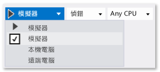

# 在模擬器中執行 Windows 市集應用程式
[!INCLUDE[vs2017banner](../code-quality/includes/vs2017banner.md)]

Windows 市集應用程式適用的 Visual Studio 模擬器則是桌面應用程式，可以模擬 Windows 市集應用程式。 您可以在開發電腦上執行應用程式，並模擬常見的觸控和旋轉事件。 您也可以選擇要模擬的實體螢幕大小和解析度，以及模擬網路連接屬性。  
  
 模擬器為您提供設計、開發、偵錯與測試 Windows 市集應用程式的環境。 不過，在您將應用程式發行至 Windows 市集之前，請先在實際裝置上測試您的應用程式。  
  
 Windows 市集應用程式適用的 Visual Studio 模擬器無法在本機電腦的隔離環境中執行。 因此，發生在模擬器中的錯誤，例如無法修復的全系統錯誤，也會影響到整部電腦。  
  
 如需 Windows Phone 資訊，請參閱 [在模擬器中執行 Windows Phone 應用程式](../debugger/run-windows-phone-apps-in-the-emulator.md)。  
  
> [!IMPORTANT]
>  Visual Studio 2015 模擬器不包含 \[地理位置\] 按鈕。 這是因為 Windows 10 模擬器不包含地理位置模擬。 如果您需要執行這類模擬，您可以在 Windows 8.1 或舊版作業系統上使用 Visual Studio 2013 模擬器。  
  
##   將模擬器設定為目標  
 若要在模擬器中執行 Windows 市集應用程式，請在偵錯工具 \[**標準**\] 工具列上，從 \[**開始偵錯**\] 按鈕旁邊的下拉式清單中選取 \[**模擬器**\]。  
  
   
  
##   選擇互動模式  
 您可以選擇下列互動模式  
  
-    滑鼠模式：將互動模式設定為滑鼠手勢。 滑鼠動作包括按一下、按兩下和拖曳。  
  
-    啟動觸控模擬：將互動模式設定為單指觸控手勢。 單指事件包括點選，拖曳和撥動。  
  
      單一目標圖示表示模擬器中的事件位置。 使用滑鼠可以定位指標。  
  
      按下滑鼠左鍵可啟用觸控模式。 例如，按一下左鍵可以模擬點選，按住左鍵可以模擬拖曳或撥動。  
  
## 縮小和放大  
 將互動模式設定為兩指的縮小和放大手勢。  
  
-     
  
     雙目標圖示表示裝置螢幕上的兩指位置。  
  
    -   移動滑鼠可以將圖示定位至裝置螢幕上的物件。  
  
    -   向前或向後轉動滑鼠滾輪，可以變更您縮小或放大前的兩指模擬距離。  
  
-   -     
  
         按住左鍵並向後旋轉滾輪 \(朝向您的方向\) 可以拉近 \(縮小\)。  
  
    -   按住左鍵並向前旋轉滾輪 \(遠離您的方向\) 可以拉遠 \(放大\)。  
  
## 物件旋轉  
 \[觸控模擬旋轉\] 按鈕將互動模式設定為運用兩指的旋轉手勢。  
  
-   -   移動滑鼠可以將圖示定位至裝置螢幕上的物件。  
  
    -   向前或向後轉動滑鼠滾輪，可以變更您旋轉物件前的兩指模擬方向。  
  
-   -   按住左鍵並向後旋轉滾輪 \(朝向您的方向\) 可以逆時針旋轉物件。 在旋轉滑鼠滾輪時，這兩個目標圖示的其中一個會沿著另一個圖示旋轉，指出旋轉的相對大小。  
  
    -   按住左鍵並向前旋轉滑鼠滾輪 \(遠離您的方向\) 可以順時針旋轉物件。  
  
##   啟用或停用最上層顯示模式  
 您可以將模擬器視窗設定為永遠在其他視窗的最上層。 \[切換最上層的視窗\] 按鈕可啟用或停用模擬器視窗的 \[最上層顯示\] 模式。  
  
##   變更裝置方向  
 將模擬器往任意方向旋轉 90 度，即可在縱向或橫向之間切換裝置方向。  
  
> [!NOTE]
>  模擬器不接受專案的 [DisplayProperties.AutoRotationPreferences](http://go.microsoft.com/fwlink/?LinkId=249460) 屬性。 例如，如果您的專案將方向設定為 `Landscape`，接著您將模擬器旋轉為縱向方向，則模擬器顯示影像也會據以旋轉並調整大小。 在實際裝置上測試這些設定。  
  
> [!NOTE]
>  如果因為旋轉模擬器而使得模擬器的某一邊大於所顯示螢幕的同一邊，模擬器會自動調整大小以便符合螢幕。 如果再次旋轉模擬器，模擬器不會重新調整回其原始大小。  
  
##   變更模擬的螢幕大小和解析度  
 若要變更模擬的螢幕大小與解析度，請從調色盤上選擇 \[變更解析度\] 按鈕，並從清單中選擇新的大小與解析度。  
  
 螢幕大小和解析度列示為*螢幕寬度英吋，像素 X 像素高度*。 請注意，螢幕大小和解析度都是模擬的。 模擬器上的位置座標會轉換為已選取裝置大小和解析度的座標。  
  
> [!NOTE]
>  您可以將點陣圖影像的已調整版本儲存在您的應用程式中，Windows 會載入目前比例的正確影像。 如需詳細資訊，請參閱[回應式設計 101](https://msdn.microsoft.com/en-us/library/windows/apps/dn958435.aspx)。 不過，如果您變更了模擬器解析度，因此 Windows 選擇了不同的影像來符合解析度，則您必須停止並重新開始偵錯工作階段，才能檢視新影像。  
  
##   擷取應用程式的螢幕擷取畫面以提交至 Windows 市集  
 當您提交應用程式至 Windows 應用程式市集時，必須包含該應用程式的螢幕擷取畫面。  
  
> [!NOTE]
>  螢幕擷取畫面會以模擬器的目前解析度儲存。 若要變更解析度，請選擇 \[**變更解析度**\] 按鈕。  
  
-   若要從模擬器建立您的應用程式的螢幕擷取畫面，請選擇 \[**擷取螢幕擷取畫面到剪貼簿**\] 按鈕。  
  
-   若要設定螢幕擷取畫面的所在位置，請選擇 \[螢幕擷取畫面設定\] 按鈕，並從捷徑功能表中選擇位置。  
  
       
  
##   模擬網路連接屬性  
 您可以藉由維護網路連接成本或數據傳輸方案狀態變更的感知，並讓您的應用程式使用此資訊來避免因為漫遊或超出指定的資料傳輸限制而產生額外費用，協助應用程式使用者管理計量付費網路連接的費用。[Windows.Networking.Connectivity](https://msdn.microsoft.com/en-us/library/windows/apps/windows.networking.connectivity.aspx) API 可讓您回應簽署的 [NetworkStatusChanged](https://msdn.microsoft.com/en-us/library/windows/apps/windows.networking.connectivity.networkinformation.networkstatuschanged.aspx) 和 [TriggerType](https://msdn.microsoft.com/en-us/library/windows/apps/windows.applicationmodel.background.systemtrigger.triggertype.aspx) 事件。 請參閱[快速入門：管理計量付費網路費用限制](http://msdn.microsoft.com/library/windows/apps/Hh750310.aspx)。  
  
 若要偵錯或測試您的網路成本感知程式碼，模擬器可以模擬透過 [GetInternetConnectionProfile](https://msdn.microsoft.com/en-us/library/windows/apps/windows.networking.connectivity.networkinformation.getinternetconnectionprofile.aspx) 傳回的 [ConnectionProfile](https://msdn.microsoft.com/en-us/library/windows/apps/windows.networking.connectivity.connectionprofile.aspx) 物件所公開之網路屬性。  
  
 若要模擬網路屬性：  
  
1.  在模擬器工具列上，選擇 \[變更網路屬性\] 按鈕。  
  
2.  在 \[設定網路屬性\] 對話方塊中，選取 \[使用模擬的網路屬性\]。  
  
     清除核取方塊移除模擬，並返回目前連接介面的網路屬性。  
  
3.  為模擬的網路輸入 \[**設定檔名稱**\]。 建議您使用不重複的名稱，以便在 [ConnectionProfile](https://msdn.microsoft.com/en-us/library/windows/apps/windows.networking.connectivity.connectionprofile.aspx) 物件的 [ProfileName](https://msdn.microsoft.com/en-us/library/windows/apps/windows.networking.connectivity.connectionprofile.profilename.aspx) 屬性中，能識別此模擬。  
  
4.  從 \[網路成本類型\] 清單中，為設定檔選取 [NetworkCostType](https://msdn.microsoft.com/en-us/library/windows/apps/windows.networking.connectivity.networkcosttype.aspx) 值。  
  
5.  從 \[資料限制狀態旗標\] 清單中，可以將 [ApproachingDataLimit](https://msdn.microsoft.com/en-us/library/windows/apps/windows.networking.connectivity.connectioncost.approachingdatalimit.aspx) 屬性或 [OverDataLimit](https://msdn.microsoft.com/en-us/library/windows/apps/windows.networking.connectivity.connectioncost.overdatalimit.aspx) 屬性設定為 true，也可以選擇 \[低於資料限制\]，將兩個值皆設定為 false。  
  
6.  從 \[漫遊狀態\] 清單，設定 [Roaming](https://msdn.microsoft.com/en-us/library/windows/apps/windows.networking.connectivity.connectioncost.roaming.aspx) 屬性。  
  
7.  選擇 \[設定屬性\]，透過觸發前景 [NetworkStatusChanged](https://msdn.microsoft.com/en-us/library/windows/apps/windows.networking.connectivity.networkinformation.networkstatuschanged.aspx) 事件和 **NetworkStateChange** 類型的背景 [SystemTrigger](https://msdn.microsoft.com/en-us/library/windows/apps/windows.applicationmodel.background.systemtrigger.aspx) 來模擬網路屬性。  
  
 **管理網路連接的詳細資訊**  
  
 [快速入門：管理計量付費網路費用限制](http://msdn.microsoft.com/library/windows/apps/Hh750310.aspx)  
  
 [網路資訊範例](http://code.msdn.microsoft.com/windowsapps/Network-Information-Sample-63aaa201)  
  
 [分析能源利用](../profiling/analyze-energy-use-in-store-apps.md)  
  
 [Windows.Networking.Connectivity](https://msdn.microsoft.com/en-us/library/windows/apps/windows.networking.connectivity.aspx)  
  
 [如何使用背景工作回應系統事件](http://msdn.microsoft.com/zh-tw/f7c86e86-a7ae-4abb-a923-76b03337a80a)  
  
 [如何在 Windows 市集應用程式中觸發暫停、繼續和背景事件](http://msdn.microsoft.com/library/windows/apps/hh974425.aspx)  
  
##   使用鍵盤巡覽模擬器  
 您可以按 **CTRL\+ALT\+向上鍵**將焦點從模擬器視窗切換至模擬器工具列，來巡覽模擬器工具列。 使用**向上鍵**和**向下鍵**可以在工具列按鈕之間移動。  
  
 您可以按 **CTRL\+ALT\+F4** 來關閉模擬器。  
  
## 請參閱  
 [從 Visual Studio 執行應用程式](../debugger/run-store-apps-from-visual-studio.md)