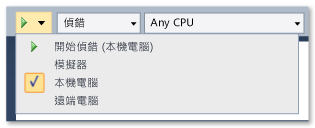
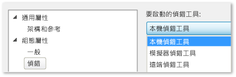

# 在本機電腦上執行 Windows 市集應用程式
[!INCLUDE[vs2017banner](../code-quality/includes/vs2017banner.md)]

  
  
 若要偵錯、測試或執行 Windows 市集應用程式的效能分析，您可以在裝載 Visual Studio 的相同電腦上執行應用程式。  如果裝置上的顯示器具有觸控功能，則可以執行應用程式的完整功能；否則，只能使用滑鼠和鍵盤手勢。  
  
##   本主題內容  
 您將學習：  
  
 [如何在本機電腦上執行](#BKMK_How_to_run_on_a_local_machine)  
  
 [如何在單一監視器上切換 Windows 市集應用程式與 Visual Studio](#BKMK_How_to_switch_between_a_Windows_Store_app_and_Visual_Studio_on_a_single_monitor)  
  
##   如何在本機電腦上執行  
 若要在本機電腦上執行應用程式，請在偵錯工具 \[標準\] 工具列上，從 \[開始偵錯\] 按鈕旁邊的下拉式清單中選取 \[本機電腦\]。  
  
   
  
 如果您看不到 \[標準\] 工具列，請按一下 \[檢視\] 功能表，並指向 \[工具列\]，然後按一下 \[標準\]。  
  
 您在下拉式清單中選擇的項目會持續保留在專案屬性檔案中，並成為預設執行目標。  
  
 您也可以直接在專案屬性檔案中設定執行目標。  在 \[方案總管\] 中，於專案名稱上按一下滑鼠右鍵，然後選擇 \[屬性\]。  然後，執行下列其中一項：  
  
-   在 C\# 和 Visual Basic 專案中，按一下 \[偵錯\]，然後從 \[目標裝置\] 下拉式清單中選取 \[本機電腦\]。  
  
       
  
-   在 C\+\+ 和 JavaScript 專案中，展開 \[組態屬性\] 節點，並按一下 \[偵錯\]，然後從 \[要啟動的偵錯工具\] 清單中選取 \[本機偵錯工具\]。  
  
       
  
##   如何在單一監視器上切換 Windows 市集應用程式與 Visual Studio  
 **從執行中的 Windows 市集應用程式執行個體切換至 Visual Studio**  
  
 如果您在本機電腦上執行 Windows 市集應用程式，而且只使用單一監視器，則可能會想要切換回 Visual Studio，同時讓應用程式繼續執行。  例如，應用程式可能處於中斷點無法到達的狀態 \(例如，等待某個事件，或陷入冗長或無止盡的迴圈中\)。  若要返回 Visual Studio，請按 ALT \+ TAB。