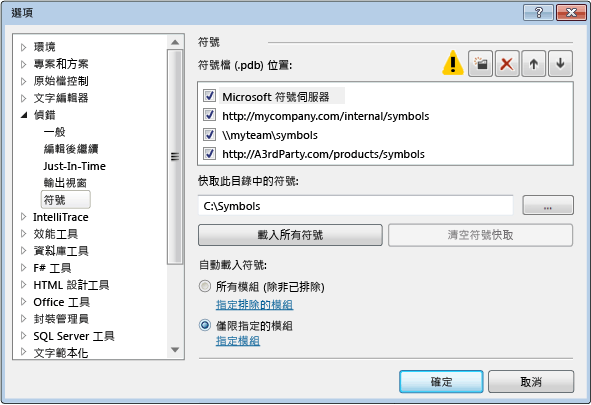
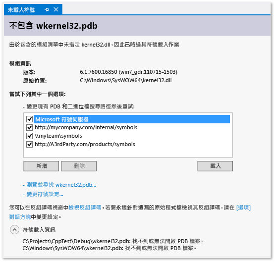

# 在 Visual Studio Debugger 中指定符號 (.pdb) 和原始程式檔
[!INCLUDE[vs2017banner](../code-quality/includes/vs2017banner.md)]

程式資料庫 \(.pdb\) 檔案也稱為符號檔，可將您在原始程式檔中為類別、方法和其他程式碼建立的識別項對應至專案之編譯的可執行檔中使用的識別項。 .pdb 檔案也會將原始程式碼中的陳述式對應至可執行檔中的執行指令。 偵錯工具會使用這項資訊判斷兩項重要資訊：Visual Studio IDE 中顯示的原始程式檔和行號，以及當您設定中斷點時，要在可執行檔中停止的位置。 符號檔也包含原始程式檔的原始位置，以及選擇性地包含可從中擷取原始程式檔的來源伺服器位置。  
  
 當您在 Visual Studio IDE 中對專案進行偵錯時，偵錯工具知道程式碼 .pdb 和原始程式檔的預設位置。 如果您要對專案原始程式碼之外的程式碼進行偵錯 \(例如，您的專案呼叫的 Windows 或協力廠商程式碼\)，就必須指定 .pdb \(以及選擇性地指定外部程式碼的原始程式檔\) 的位置，而且這些檔案必須完全符合可執行檔的組建。  
  
 在 Visual Studio 2012 之前，當您對遠端裝置上的 managed 程式碼進行偵錯時，您需要將符號檔案放在遠端電腦上。 然而現在的情況已經有所改變。 所有符號檔必須位於本機電腦上，或位於 \[工具\] \/ \[選項\] \/ \[偵錯\] \/ \[符號\] 頁面上指定的位置。  
  
##   偵錯工具在哪裡搜尋 .pdb 檔案  
  
1.  DLL 或可執行檔內部指定的位置  
  
     \(根據預設，如果您在電腦上建立了 DLL 或可執行檔，連結器就會將相關聯之 .pdb 檔案的完整路徑和檔案名稱放置在該 DLL 或可執行檔內。 偵錯工具會先查看符號檔是否在 DLL 或可執行檔內部指定的位置。 這種方式很有用，讓您始終有符號可供電腦上編譯的程式碼使用\)。  
  
2.  可能和 DLL 或可執行檔存在相同資料夾中的 .pdb 檔案。  
  
3.  任何本機符號快取資料夾。  
  
4.  任何在像是 Microsoft 符號伺服器 \(如果啟用\) 等位置指定的網路、網際網路或本機符號伺服器和位置。  
  
###   符號檔為何需要與可執行檔完全相符？  
 偵錯工具只會載入與可執行檔建置時所建立的 .pdb 檔案完全相同之可執行檔的 .pdb 檔案 \(也就是說，.pdb 必須是原始 .pdb 檔案或該檔案的複本\)。 由於編譯器除了會針對建立正確且有效率的程式碼這項主要工作最佳化之外，還會針對加快編譯速度最佳化，因此即使程式碼本身不變，可執行檔的實際配置也可能變更。 如需詳細資訊，請參閱 [Why does Visual Studio require debugger symbol files to exactly match the binary files that they were built with?](https://blogs.msdn.microsoft.com/jimgries/2007/07/06/why-does-visual-studio-require-debugger-symbol-files-to-exactly-match-the-binary-files-that-they-were-built-with/) \(Visual Studio 為何要求偵錯工具的符號檔必須完全符合當初建置這些符號檔時所使用的二進位檔？\)。  
  
###   指定符號位置和載入行為  
 當您在 VS IDE 中對專案進行偵錯時，偵錯工具會自動載入位於專案目錄中的符號檔。 您可以在 \[工具\] \/ \[選項\] \/ \[偵錯\] \/ \[符號\] 中，為 Microsoft、Windows 或協力廠商元件指定替代的搜尋路徑和符號伺服器。您也可以指定您想要偵錯工具自動載入符號的特定模組。 然後您就可以在主動進行偵錯時，手動變更這些設定。  
  
1.  在 Visual Studio 中開啟 \[工具\] \/ \[選項\] \/ \[偵錯\] \/ \[符號\] 頁面。  
  
       
  
2.  選擇此資料夾  圖示。 可編輯的文字隨即出現在 \[**符號檔 \(.pdb\) 位置**\] 方塊中。  
  
3.  輸入符號伺服器或符號位置的 URL 或目錄路徑。 陳述式完成可幫助您找出正確的格式。  
  
4.  若要改善符號載入效能，在 \[**快取此目錄中的符號**\] 方塊中，輸入符號伺服器可以從中複製符號的本機目錄路徑，或是符號可以複製到其中的本機目錄路徑。  
  
    > [!NOTE]
    >  請不要將符號快取放到受保護的資料夾 \(例如 C:\\Windows 資料夾或它的其中一個子資料夾\)。 請改用可讀寫的資料夾。  
  
 **指定符號載入行為**  
  
 您可以指定要在開始偵錯時，從 \[**符號檔 \(.pdb\) 位置**\] 方塊位置自動載入的檔案。 專案目錄中的符號檔會一律載入。  
  
1.  選擇 \[**所有模組 \(除非已排除\)**\] 會載入所有模組的全部符號，除了您在選擇 \[**指定排除的模組**\] 連結時選擇的模組。  
  
2.  選擇 \[**僅限指定的模組**\] 選項，然後選擇 \[**指定模組**\] 列出您要自動載入符號檔的模組。 其他模組的符號檔則會加以忽略。  
  
 **指定其他符號選項**  
  
 您也可以在 \[工具\] \/ \[選項\] \/ \[偵錯\] \/ \[符號\] 頁面設定下列選項︰  
  
 **如果啟動時沒有符號，就提出警告 \(僅限機器碼\)**  
  
 如果選取這個選項，即可在您嘗試偵錯一個偵錯工具沒有符號資訊的程式時，顯示警告對話方塊。  
  
 **載入 DLL 匯出**  
  
 選取此選項將會載入 DLL 匯出表。 如果您使用 Windows 訊息、Windows 程序 \(WindowProc\)、COM 物件、封送處理 \(Marshaling\) 或是沒有其符號的任何 DLL，則 DLL 匯出表的符號資訊就會很有用。 讀取 DLL 匯出資訊會產生一些額外負荷， 因此，這項功能預設為關閉。  
  
 若您想知道 DLL 匯出表中可使用的符號，請使用 `dumpbin /exports`。 這些符號適用於任何 32 位元系統 DLL。 讀取 `dumpbin /exports` 輸出時，您可以看到確實的函式名稱，包含非英數字元。 這對設定函式的中斷點來說很有幫助。 DLL 匯出表中的函式名稱在偵錯工具中的其他位置可能會顯示為已被截斷。 這些呼叫都按呼叫順序列出，目前的函式 \(巢狀最深處\) 列在頂端。 如需詳細資訊，請參閱 [dumpbin \/exports](/visual-cpp/build/reference/dash-exports)。  
  
###   使用符號伺服器尋找不在本機電腦上的符號檔  
 [!INCLUDE[vsprvs](../code-quality/includes/vsprvs_md.md)] 可以從實作 symsrv 通訊協定的符號伺服器下載偵錯符號檔。[Visual Studio Team Foundation Server](../Topic/Index%20and%20publish%20symbol%20data.md) 和 [Debugging Tools for Windows](http://msdn.microsoft.com/library/windows/hardware/ff551063\(v=VS.85\).aspx) 是可以實作符號伺服器的兩項工具。 在 VS \[**選項**\] 對話方塊中指定要使用的符號伺服器。  
  
 您可以使用的符號伺服器包括：  
  
 **Microsoft 公用符號伺服器**  
  
 若要偵錯發生在系統 DLL 或協力廠商程式庫呼叫期間的損毀，通常會需要系統 .pdb 檔案，這些檔案包含 Windows DLL、EXE 和裝置驅動程式的符號。 您可以從 Microsoft 公用符號伺服器取得這些符號。 Microsoft 公用符號伺服器會為 Windows 作業系統以及 MDAC、IIS、ISA 和 [!INCLUDE[dnprdnshort](../code-quality/includes/dnprdnshort_md.md)] 提供符號。  
  
 若要使用 Microsoft 符號伺服器，請選擇 \[**偵錯**\] 功能表上的 \[**選項和設定**\]，然後選擇 \[**符號**\]。 選取 \[**Microsoft 符號伺服器**\]。  
  
 **內部網路或本機電腦上的符號伺服器**  
  
 您的小組或公司可以為自己的產品建立符號伺服器，以及做為外部來源符號的快取。 您的電腦上可能有符號伺服器。 您可以在 VS \[**選項對話方塊**\] 的 \[**偵錯**\] \/ \[**符號**\] 頁面上，以 URL 或路徑形式輸入符號伺服器的位置。  
  
 **協力廠商符號伺服器**  
  
 Windows 應用程式和程式庫的協力廠商提供者可提供對網際網路上符號伺服器的存取。 您也可以在 \[**偵錯**\] \/ \[**符號**\] 頁面上輸入這些符號伺服器的 URL。  
  
> [!NOTE]
>  如果您使用 Microsoft 公用符號伺服器以外的其他符號伺服器，請確定該符號伺服器和其路徑值得信任。 由於符號檔可能包含任意可執行程式碼，因此可能會讓您面臨安全性威脅。  
  
###   在偵錯時尋找並載入符號  
 只要偵錯工具處於中斷模式，您就可以載入偵錯工具選項先前所排除或編譯器找不到之模組的符號。 您可以從 \[呼叫堆疊\]、\[模組\]、\[區域變數\]、\[自動變數\] 和所有 \[監看式\] 視窗的捷徑功能表中載入符號。 如果偵錯工具在未提供符號或原始程式檔的程式碼中發生中斷，則會出現文件視窗。 您可以在這裡找到有關遺漏檔案的資訊，並採取動作找出和載入這些檔案。  
  
 **透過 \[未載入符號\] 文件頁面尋找符號**  
  
 有一些方式可讓偵錯工具中斷未提供符號的程式碼：  
  
1.  逐步執行程式碼。  
  
2.  從中斷點或例外狀況中斷程式碼。  
  
3.  切換至不同的執行緒。  
  
4.  按兩下 \[呼叫堆疊\] 視窗中的框架以變更堆疊框架。  
  
 當上述其中一個事件發生時，偵錯工具就會顯示 \[**未載入符號**\] 頁面，協助您尋找和載入必要的符號。  
  
   
  
-   若要變更搜尋路徑，請選擇未選取的路徑，或選擇 \[**新增**\] 並輸入新的路徑。 選擇 \[**載入**\] 可再次搜尋路徑，並且在找到符號檔時將它載入。  
  
-   選擇 \[瀏覽並尋找\<可執行檔名稱\>...\]，以覆寫任何符號選項，並重試搜尋路徑。 若找到符號檔就會將它載入，否則就會顯示 \[檔案總管\]，讓您手動選取符號檔。  
  
-   選擇 \[**變更符號設定…**\] 會顯示 VS \[選項\] 對話方塊的 \[**偵錯**\] \/ \[**符號**\] 頁面。  
  
-   選擇 \[**檢視反組譯碼**\]，會在新視窗中顯示反組譯碼一次。  
  
-   若要在找不到原始程式檔或符號檔時一律顯示反組譯碼，請選擇 \[**選項對話方塊**\] 連結，然後同時選取 \[**啟用位址層級偵錯**\] 和 \[**找不到原始碼時則顯示反組譯碼**\]。  
  
       
  
 **從捷徑功能表變更符號選項**  
  
 當您處於中斷模式時，可以尋找並載入 \[呼叫堆疊\]、\[模組\]、\[區域變數\]、\[自動變數\] 和所有 \[監看式\] 視窗中所顯示項目的符號。 選取視窗中的項目，開啟捷徑功能表，然後選擇下列其中一個選項：  
  
|選項|描述|  
|--------|--------|  
|**載入符號**|嘗試從 \[**選項**\] 對話方塊的 \[**偵錯**\] \/ \[**符號**\] 頁面上所指定的位置載入符號。 如果找不到符號檔，\[檔案總管\] 便會啟動，讓您能夠指定要搜尋的新位置。|  
|**符號載入資訊**|提供資訊，顯示所載入符號檔的位置或是偵錯工具找不到檔案時所搜尋的位置。|  
|**符號設定...**|開啟 VS \[**選項**\] 對話方塊的 \[**偵錯**\] \/ \[**符號**\] 頁面。|  
|**永遠自動載入**|將符號檔加入至偵錯工具自動載入的檔案清單。|  
  
###   設定符號檔的編譯器選項  
 當您從 VS IDE 建置專案並使用標準 \[**偵錯**\] 組建組態時，C\+\+ 和 Managed 編譯器會為您的程式碼建立適當的符號檔。 您也可以在命令列上設定編譯器選項，以便建立符號檔。  
  
 **C\+\+ 選項**  
  
 程式資料庫 \(.pdb\) 檔會保留偵錯和專案狀態資訊，以便您的程式進行偵錯組態的累加連結 \(Incremental Link\)。 當您使用 [\/ZI 或 \/Zi](/visual-cpp/build/reference/z7-zi-zi-debug-information-format) 建置時，會建立 .pdb 檔 \(適用於 C\/C\+\+\)。  
  
 在 [!INCLUDE[vcprvc](../debugger/includes/vcprvc_md.md)] 中，[\/Fd](/visual-cpp/build/reference/fd-program-database-file-name) 選項會為編譯器所建立的 .pdb 檔命名。 當您使用精靈在 [!INCLUDE[vsprvs](../code-quality/includes/vsprvs_md.md)] 中建立專案時，就會設定 **\/Fd** 選項以建立名為 *project*.pdb 的 .pdb 檔案。  
  
 如果您在使用 Makefile 建置 C\/C\+\+ 應用程式時，指定了 **\/ZI** 或 **\/Zi**，但沒有指定 **\/Fd**，那麼您在最後會得到兩個 .pdb 檔：  
  
-   VC*x*.pdb，其中 *x* 代表 Visual C\+\+ 的版本，例如 VC11.pdb。 這個檔案會儲存各個 OBJ 檔的所有偵錯資訊，且其所在位置與專案 Makefile 的目錄位置相同。  
  
-   project.pdb：這個檔案會儲存 .exe 檔的所有偵錯資訊。 若是 C\/C\+\+，偵錯資訊會位於 \\debug 子目錄中。  
  
 每次建立 OBJ 檔時，C\/C\+\+ 編譯器會將偵錯資訊合併到 VC*x*.pdb。 插入的資訊包括類型資訊，但是不包括符號資訊 \(例如，函式定義\)。 因此，即使每個原始程式檔都包含了常見的標頭檔 \(例如 \<windows.h\>\)，這些標頭檔的 typedef 也只會儲存一次，而不會出現在每個 OBJ 檔。  
  
 連結器會建立包含專案 EXE 檔之偵錯資訊的 project.pdb。 這個 project.pdb 包含了完整的偵錯資訊，包括函式原型，而不僅是在 VC*x*.pdb 找到的類型資訊。 這兩種 .pdb 檔都允許累加式更新。 連結器也會將路徑嵌入其建立的 .exe 或 .dll 檔中的 .pdb 檔。  
  
 [!INCLUDE[vsprvs](../code-quality/includes/vsprvs_md.md)] 偵錯工具會使用 EXE 或 DLL 檔中的 .pdb 檔路徑找出 project.pdb 檔。 如果偵錯工具在該位置找不到 .pdb 檔案，或是路徑無效 \(例如，專案已移至另一部電腦\)，偵錯工具就會搜尋包含 EXE 的路徑，也就是 \[**選項**\] 對話方塊 \(\[**偵錯**\] 資料夾，\[**符號**\] 節點\) 中指定的符號路徑。 偵錯工具不會載入與進行偵錯之可執行檔不相符的 .pdb 檔。 如果偵錯工具找不到 .pdb 檔案，\[**尋找符號**\] 對話方塊即會出現，可讓您搜尋符號或將額外的位置加入搜尋路徑。  
  
 **.NET Framework 選項**  
  
 程式資料庫 \(.pdb\) 檔會保留偵錯和專案狀態資訊，以便您的程式進行偵錯組態的累加連結 \(Incremental Link\)。 當您利用 **\/debug** 進行建置時，會建立一個 .pdb 檔。 您可以使用 **\/debug:full** 或 **\/debug:pdbonly** 建置應用程式。 使用 **\/debug:full** 建置會產生可偵錯的程式碼。 使用 **\/debug:pdbonly** 進行建置則會產生 .pdb 檔案，但是不會產生 `DebuggableAttribute` 通知 JIT 編譯器有可用的偵錯資訊。 如果您要為發行組建 \(Release Build\) 產生 .pdb 檔案，但不希望是可偵錯的，請使用 **\/debug:pdbonly**。 如需詳細資訊，請參閱 [\/debug \(Emit Debugging Information\)](/dotnet/csharp/language-reference/compiler-options/debug-compiler-option)或 [\/debug](/dotnet/visual-basic/reference/command-line-compiler/debug)。  
  
 [!INCLUDE[vsprvs](../code-quality/includes/vsprvs_md.md)] 偵錯工具會使用 EXE 或 DLL 檔中的 .pdb 檔路徑找出 project.pdb 檔。 如果偵錯工具在該位置找不到 .pdb 檔，或是路徑無效，偵錯工具就會搜尋包含 EXE 的路徑，然後再搜尋 \[**選項**\] 對話方塊中指定的符號路徑。 此路徑通常是 \[**符號**\] 節點中的 \[**偵錯**\] 資料夾。 偵錯工具不會載入與進行偵錯之可執行檔不相符的 .pdb 檔。 如果偵錯工具找不到 .pdb 檔案，\[**尋找符號**\] 對話方塊即會出現，可讓您搜尋符號或將額外的位置加入搜尋路徑。  
  
 **Web 應用程式**  
  
 應用程式的組態檔 \(Web.config\) 必須設為偵錯模式。 偵錯模式會導致 ASP.NET 產生動態產生之檔案的符號，並使偵錯工具附加到 ASP.NET 應用程式。 如果您已從 Web 專案範本建立專案，則 VS 會在開始偵錯時自動設定這個項目。  
  
##   尋找原始程式檔  
  
###   偵錯工具在哪裡搜尋原始程式檔  
 偵錯工具會在下列位置尋找原始程式檔：  
  
1.  啟動偵錯工具的 Visual Studio 執行個體 IDE 中開啟的檔案。  
  
2.  已在 Visual Studio 執行個體中開啟之方案裡的檔案。  
  
3.  方案屬性的 \[**通用屬性**\] \/ \[**偵錯原始程式檔**\] 頁面中指定的目錄。 \(在方案總管中選取方案節點、按一下滑鼠右鍵，然後選取 \[屬性\]。 \)  
  
4.  模組之 .pdb 的來源資訊。 這可以是模組建置時原始程式檔的位置，也可以是呼叫來源伺服器的命令。  
  
###   使用未載入來源\/未載入符號頁面尋找並載入原始程式檔  
 當偵錯工具在未提供原始程式檔的位置中斷執行時，它就會顯示 \[**未載入來源**\] 或 \[**未載入符號**\] 頁面，幫助您尋找原始程式檔。 當偵錯工具找不到可執行檔的符號檔 \(.pdb\) 以完成搜尋時，\[**未載入符號**\] 就會出現。 \[未載入符號\] 頁面會提供搜尋檔案的選項。 如果在您執行其中一個選項後找到 .pdb，而且偵錯工具能夠使用符號檔中的資訊擷取原始程式檔，則會顯示來源。 否則會出現描述問題的 \[**未載入來源**\] 頁面。 這個頁面會顯示選項連結，讓您能夠執行可能解決問題的動作。  
  
###   將原始程式檔搜尋路徑加入至方案  
 您可以指定要搜尋原始程式檔的網路或本機目錄。  
  
1.  在 \[方案總管\] 中選取方案，然後從捷徑功能表選擇 \[**屬性**\]。  
  
2.  在 \[**通用屬性**\] 節點下，選擇 \[**偵錯原始程式檔**\]。  
  
3.  按一下此資料夾  圖示。 可編輯的文字會出現在 \[**包含原始程式碼的目錄**\] 清單中。  
  
4.  加入您要搜尋的路徑。  
  
 請注意，只會搜尋指定的目錄。 您必須自行加入要搜尋的所有子目錄項目。  
  
###   使用來源伺服器  
 當本機電腦上沒有原始程式碼，或者 .pdb 檔不符合原始程式碼時，您都可以使用來源伺服器協助偵錯應用程式。 來源伺服器會接受對檔案的要求，並傳回實際的檔案。 來源伺服器藉由名為 srcsrv.dll 的 DLL 檔案執行。 來源伺服器會讀取應用程式的 .pdb 檔，該檔含有原始程式碼儲存機制的指標，以及用來從儲存機制擷取原始程式碼的命令。 只要在名為 srcsrv.ini 的檔案中列出允許的命令，並將該檔置於與 srcsrv.dll 和 devenv.exe 相同的目錄中，就能限制可以從應用程式的 .pdb 檔執行何種命令。  
  
> [!IMPORTANT]
>  應用程式的 .pdb 檔中可以內嵌任意命令，因此在 srcsrv.ini 檔案中務必只加入您要執行的命令。 嘗試執行 srcsvr.ini 檔案中未包含的任何命令，都會讓確認對話方塊出現。 如需詳細資訊，請參閱[安全性警告：偵錯工具必須執行未受信任的命令](../debugger/security-warning-debugger-must-execute-untrusted-command.md)。 由於不會對命令參數進行任何驗證，因此請謹慎使用受信任的命令。 例如，如果您信任 cmd.exe，惡意的使用者便可能指定會使命令具危險性的參數。  
  
 **若要啟用來源伺服器**  
  
1.  確定您使用上一節所描述的安全性措施來進行編譯。  
  
2.  在 \[**工具**\] 功能表上選擇 \[**選項**\]。  
  
     \[**選項**\] 對話方塊隨即出現。  
  
3.  在 \[**偵錯**\] 節點中選擇 \[**一般**\]。  
  
4.  選取 \[**啟用來源伺服器支援**\] 核取方塊。  
  
       
  
5.  \(選擇性\) 選擇您想要的子選項。  
  
     請注意，\[**允許部分信任組件的來源伺服器 \(僅限 Managed\)**\] 和 \[**永遠執行未受信任的來源伺服器命令而不須提示**\] 都可能提高上面所討論的安全性風險。  
  
## 請參閱  
 [Visual Studio 2012 和 2013 中的 .NET 遠端符號載入變更](http://blogs.msdn.com/b/visualstudioalm/archive/2013/10/16/net-remote-symbol-loading-changes-in-visual-studio-2012-and-2013.aspx)