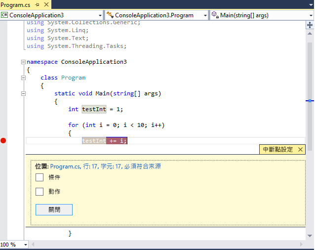
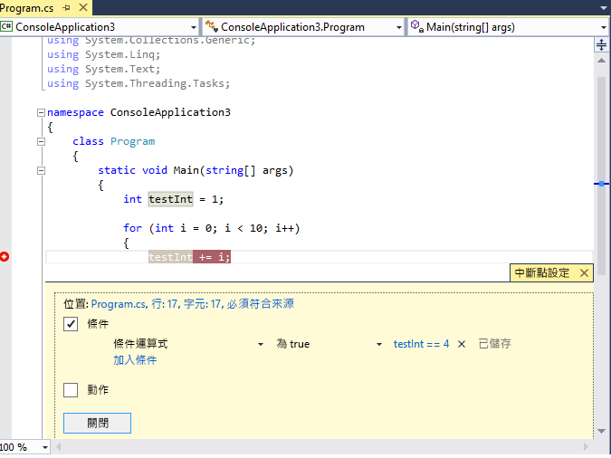
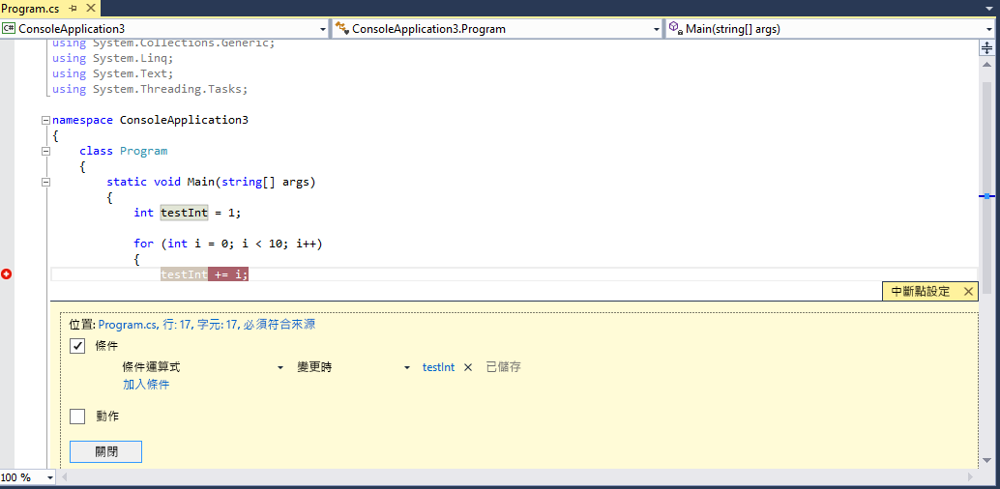
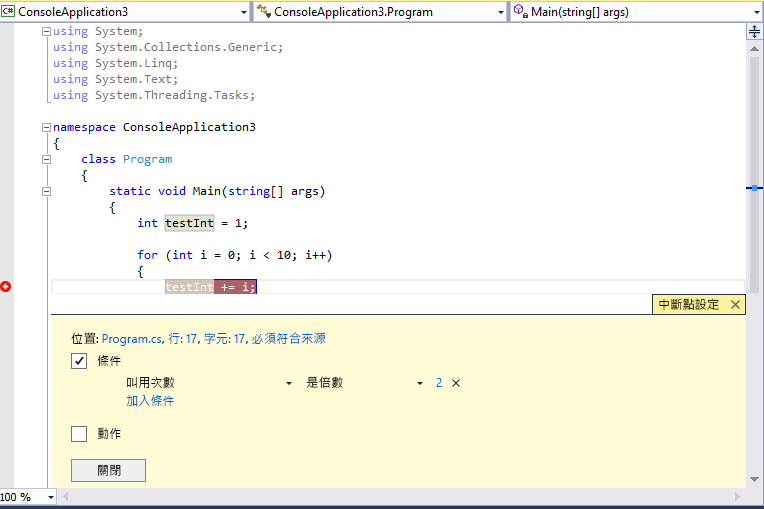

# 使用中斷點
[!INCLUDE[vs2017banner](../code-quality/includes/vs2017banner.md)]

當您想要停止偵錯工具執行時，或許是為了要查看程式碼變數的狀態，或查看呼叫堆疊，此時您可以設定中斷點。 它們是開發人員工具箱中最重要的偵錯技術之一。  
  
##  <a name="BKMK_Overview"></a> 在原始程式碼中設定函式中斷點  
 您可以在原始程式碼檔案左邊界按一下，或將游標放在程式碼行，再按 F9，設定在原始程式碼中的函式中斷點。 中斷點會在左邊界中顯示為一個紅點，且該行程式碼也會標上色彩：  
  
   
  
 當您在偵錯工具中執行此程式碼時，每當該行程式碼執行之前叫用了中斷點，便會停止執行。 原始程式碼行的色彩為黃色：  
  
   
  
 此時 `testInt` 的值仍然是 1。  
  
 您可以查看此應用程式的目前狀態，包括變數值和此呼叫堆疊。 如需呼叫堆疊的詳細資訊，請參閱[如何：使用呼叫堆疊視窗](../debugger/how-to-use-the-call-stack-window.md)。  
  
 您可以在任何可執行程式碼行上設定中斷點。 例如，在上面的 C\# 程式碼中，您可以在變數宣告、`for` 迴圈或在 `for` 迴圈內部的任何程式碼設定中斷點，但是您無法在命名空間或類別宣告或方法簽章上設定中斷點。  
  
##  <a name="BKMK_Set_a_breakpoint_in_a_source_file"></a> 設定其他種類的中斷點  
 您也可以在呼叫堆疊中、在 \[反組譯碼\] 視窗中，以及在原生 C\+\+ 程式碼中，以資料條件或記憶體位址設定中斷點。  
  
## 在 \[呼叫堆疊\] 視窗中設定中斷點  
 您可以藉由在 \[呼叫堆疊\] 視窗中設定中斷點，在進行呼叫的函式返回的指令或程式行位置中斷執行。 如需呼叫堆疊的詳細資訊，請參閱[如何：使用呼叫堆疊視窗](../debugger/how-to-use-the-call-stack-window.md)。 此偵錯工具必須已停止執行。  
  
1.  開始偵錯此應用程式，並等候執行停止 \(例如，在中斷點處\)。 開啟 \[呼叫堆疊\] 視窗 \(\[偵錯\] \/ \[Windows\] \/ \[呼叫堆疊\]，或 **CTRL \+ ALT \+ C**\)。  
  
2.  以滑鼠右鍵按一下呼叫函式，然後選取 \[中斷點\] \/ \[插入中斷點\]，或只使用快速鍵 **F9**。  
  
3.  中斷點符號會出現在函式呼叫名稱旁邊、呼叫堆疊的左邊界中。  
  
 在 \[中斷點\] 視窗中，此呼叫堆疊中斷點會顯示為位址，伴隨著對應於函式中下一個可執行指令的記憶體位置。 偵錯工具會在指令處中斷執行。  
  
 若要在程式碼執行期間以視覺化方式追蹤中斷點，請參閱[進行偵錯時對應呼叫堆疊上的方法](../debugger/map-methods-on-the-call-stack-while-debugging-in-visual-studio.md)。  
  
## 在 \[反組譯碼\] 視窗中設定中斷點  
 若要在組譯碼指令處設定中斷點，偵錯工具必須處於中斷模式。  
  
1.  開始偵錯此應用程式，並等候執行停止 \(例如，在中斷點處\)。 開啟 \[反組譯碼\] 視窗 \(\[偵錯\] \/ \[Windows\] \/ \[反組譯碼\]，或 **Ctrl \+ Alt \+ D**\)。  
  
2.  在想要中斷的指令之左邊界按一下，或將游標移至此指令，然後按下 **F9**。  
  
## 設定資料中斷點 \(僅限原生 C\+\+\)  
 當儲存在特定記憶體位址的值變更時，資料中斷點會中斷執行。 如果值已讀取但未變更，則不會中斷執行。 若要設定資料中斷點，偵錯工具必須處於中斷模式。  
  
1.  開始偵錯應用程式，並等候直到已到達中斷點為止。 在 \[偵錯\] 功能表上，選擇 \[新增中斷點\] \/ \[資料中斷點\] \(或開啟 \[中斷點\] 視窗，然後選擇 \[新增\] \/ \[資料中斷點\]。  
  
2.  在 \[位址\] 方塊中，輸入記憶體位址或計算結果為記憶體位址的運算式。 例如，輸入當變數 `avar` 的內容變更時要中斷的 `&avar`。  
  
3.  在 \[位元組計數\] 下拉式清單中，選取想要偵錯工具監看的位元組數量。 例如，如果選取 **4**，則偵錯工具將從 `&avar` 開始監看四個位元組，並且在任何這些位元組的值變更時中斷。  
  
 請記住，資料中斷點的使用取決於特定記憶體位址是否適用。  
  
-   偵錯工作階段之間的變數位址會有所不同。 在每個偵錯工作階段的結尾會自動停用資料中斷點。  
  
-   如果您對區域變數設定資料中斷點，則此中斷點在函式結束時會保持啟用狀態，但是此記憶體位址不再適用，而且該中斷點的行為無法預期。 如果對區域變數設定資料中斷點，您應該在函式結束前移除或停用中斷點。  
  
 下列情況不適用資料中斷點：  
  
-   未進行偵錯的處理序寫入記憶體位置  
  
-   記憶體位置在兩個或多個處理序之間共用  
  
-   記憶體位置已在核心內更新。 例如，如果記憶體已傳遞至 32 位元的 Windows `ReadFile` 函式，記憶體將會從核心模式進行更新，而偵錯工具將不會在記憶體寫入時中斷。  
  
## 以記憶體位址設定中斷點 \(僅限原生 C\+\+\)  
 您也可以使用物件位址，在特定類別執行個體呼叫的方法上設定中斷點。  以下為範例：  
  
 例如，指定具有位址的類型 `my_class` 物件位址，您可以在從該執行個體呼叫的名為  `my_method` 的方法上設定函式中斷點。  
  
1.  在已具現化類別的執行個體後的某處設定中斷點。  
  
2.  尋找執行個體的位址 \(我們稱它為 `0xcccccccc`\)。  
  
3.  按一下　\[偵錯\] \/ \[新增中斷點\] \/ \[函式中斷點\] \(或**ALT \+ F9 和 ALT \+ B**\)。  
  
4.  在 \[函式名稱\] 方塊中加入下列文字：  
  
    ```cpp  
    ((my_class *) 0xcccccccc)->my_method  
    ```  
  
##  <a name="BKMK_Specify_advanced_properties_of_a_breakpoint_"></a> 管理中斷點  
 您可以使用 \[中斷點\] 視窗 \(\[偵錯\] \/ \[Windows\] \/ \[中斷點\]，或 **CTRL \+ ALT \+ B**\) 查看已在方案中設定的所有中斷點：  
  
   
  
 \[中斷點\] 視窗可讓您集中管理所有中斷點，這點在非常重視中斷點的大型方案或複雜的偵錯情節中非常有用。 如果您需要儲存或共用一組中斷點的狀態和位置，只能從 \[中斷點\] 視窗儲存和匯入中斷點。  
  
##  <a name="BKMK_Specify_a_breakpoint_condition_using_a_code_expression"></a> 進階中斷點  
  
## 中斷點條件  
 您可以設定條件來控制中斷點執行的時機和位置。  
  
1.  以滑鼠右鍵按一下中斷點，或將滑鼠停留在中斷點，然後選擇設定圖示。  
  
2.  在內容功能表中，選取 \[條件\]。 這會開啟 \[中斷點設定\] 視窗：  
  
   
  
 當您核取 \[條件\] 方塊後，此視窗隨即展開以顯示不同種類的條件。  
  
 **條件運算式**：當您選取 \[條件運算式\] 後，您就可以選擇兩個條件：\[為 True\] 和 \[變更時\]。 如果想要在滿足運算式時中斷，請選擇 \[為 true\]，如果想要在運算式的值變更時中斷，請選擇 \[變更時\]。  
  
 在下列範例中，我們設定此中斷點僅當 `testInt` 的值為 **4** 的時候才叫用：  
  
   
  
 在下列範例中，我們設定此中斷點僅當 `testInt` 的值變更時才叫用：  
  
   
  
 \[變更時\] 欄位的行為會隨不同的程式設計語言而異。 如果針對機器碼選擇 \[變更時\]，偵錯工具不會將第一次條件評估視為變更，因此不會在第一次評估時叫用中斷點。 如果針對 Managed 程式碼選擇 \[變更時\]，則會在選取 \[變更時\] 之後的第一次評估時叫用中斷點。  
  
 如果使用無效的語法設定中斷點條件，警告訊息便會出現。 如果使用有效的語法，但是無效的語意指定中斷點條件，在第一次叫用中斷點時，則會出現警告訊息。 在任一情況下，當叫用無效的中斷點時，偵錯工具便會中斷執行。 只有在條件是有效的並且判斷值為 `false` 時，才會略過中斷點。  
  
 這個條件可以是偵錯工具所能辨識的任何有效運算式。 如需有效運算式的詳細資訊，請參閱[偵錯工具中的運算式](../debugger/expressions-in-the-debugger.md)。  
  
## 在中斷點條件中使用物件 ID \(C\# 和 F\#\)  
 有時候您可能需要觀察特定物件的行為，例如，您可能想要了解為什麼在集合中多次插入物件。 在 C\# 和 F\# 中，您可以針對[參考類型](/dotnet/csharp/language-reference/keywords/reference-types)的特定執行個體建立物件 ID，並在中斷點條件中使用它們。 物件 ID 是由 Common Language Runtime \(CLR\) 偵錯服務所產生並與物件相關聯。  若要建立物件 ID，請執行下列動作：  
  
1.  當物件已建立一段時間之後，於程式碼中設定中斷點。  
  
2.  開始偵錯，當執行到中斷點停止時，找到 \[區域變數\] 視窗中的中斷點，並按一下滑鼠右鍵，然後選取 \[設定物件 ID\]。  
  
     您應該會看到 \[區域變數\] 視窗中顯示 **$** 加上一個數字。 這就是物件 ID。  
  
3.  在您要調查的位置加入新的條件中斷點 \(例如，要將物件加入集合時\)。  
  
4.  使用 \[條件運算式\] 欄位中的物件 ID。 例如，如果變數 `item` 參考要加入集合的物件，您會放置 **item \=\= $n**，其中 **n** 是物件 ID 號碼。  
  
     要將該物件加入集合時，執行會在該處中斷。  
  
 如果您稍後想要刪除物件 ID，則可以在 \[區域變數\] 視窗中於變數上按一下滑鼠右鍵，然後選取 \[刪除物件 ID\]。  
  
 請注意，物件 ID 會建立弱式參考，且不會防止物件被記憶體回收。 它們僅針對目前的偵錯工作階段才有效。  
  
## 叫用次數  
 如果您懷疑程式碼中的某個迴圈在經過特定數目的反覆項目之後開始出現行為異常，您可以設定中斷點，在遇到相關聯的程式碼行指定的次數之後停止執行，而不需強迫重複按 **F5** 到達反覆項目層級。  
  
 在 \[中斷點設定\] 視窗中，將此條件設為 \[叫用次數\]。 然後指定反覆項目的數目。 在下列範例中，我們設定此中斷點在每隔一個反覆項目上叫用：  
  
   
  
## 篩選  
 您可以限制只在指定的裝置上或指定的處理序和執行緒中引發中斷點。  
  
 在 \[中斷點設定\] 視窗中，將此條件設為 \[篩選條件\]。 輸入一或多個下列運算式。  
  
-   MachineName \= "名稱"  
  
-   ProcessId \= 值  
  
-   ProcessName \="名稱"  
  
-   ThreadId \= 值  
  
-   ThreadName \= "名稱"  
  
 將字串值置於雙引號中。 您可以使用這些來結合子句：`&` \(AND\)、`||` \(OR\)、`!` \(NOT\) 和括號。  
  
##  <a name="BKMK_Print_to_the_Output_window_with_tracepoints"></a> 中斷點動作和追蹤點  
 追蹤點是將訊息列印至 \[輸出\] 視窗的中斷點。 追蹤點在程式語言中的行為可以像是暫存追蹤陳述式。  
  
 在 \[中斷點設定\] 視窗中，核取 \[動作\] 方塊。 選擇 \[動作\] 群組中的 \[將訊息記錄到輸出視窗\]。 您可以列印泛型字串，例如「這是測試」。 若要包含變數或運算式的值，請將它置於大括號中。  
  
 若要在叫用追蹤點時中斷執行，請清除 \[繼續執行\] 核取方塊。 若已核取 \[繼續執行\] 時，則不會暫止執行。 在這兩種情況下，都會列印訊息。  
  
 您可以在 \[訊息\] 中使用下列特殊關鍵字。  
  
|||  
|-|-|  
|**$ADDRESS**|目前指令|  
|**$CALLER**|呼叫函式名稱|  
|**$CALLSTACK**|呼叫堆疊|  
|**$FUNCTION**|目前的函式名稱|  
|**$PID**|處理序 ID|  
|**$PNAME**|處理序名稱|  
|**$TID**|執行緒 ID|  
|**$TNAME**|執行緒名稱|  
|**$TICK**||  
|**$TNAME**||  
  
##  <a name="BKMK_Set_a_breakpoint_at_a_function_return_in_the_Call_Stack_window"></a> 中斷點標籤  
 中斷點標籤僅在 \[中斷點\] 視窗中用來排序和篩選中斷點清單。 若要將標籤加入至中斷點，請選擇中斷點列，然後選擇內容功能表上的 \[標籤\]。  
  
## 匯出和匯入中斷點  
 您可以將中斷點匯出至 XML 檔案，方法是以滑鼠右鍵按一下此中斷點，然後選取 \[匯出\]。 根據預設，該檔案會儲存在此方案目錄中。 若要匯入中斷點，請開啟 \[中斷點\] 視窗 \(**CTRL \+ ALT \+ B**\)，然後在工具列上按一下向右的箭頭 \(工具提示為 \[從檔案匯入中斷點\]\)。  
  
## 進行中斷點疑難排解  
  
### 我刪除了中斷點，但再次啟動偵錯時繼續叫用此中斷點  
 如果您在偵錯時刪除了中斷點，則在某些情況下，您會在下次啟動偵錯時再次叫用此中斷點。 若要停止叫用此中斷點，請確定所有中斷點的執行個體都已從 \[中斷點\] 視窗中移除。  
  
### 偵錯工具找不到中斷點原始程式檔的正確版本  
 如果原始程式檔已變更，且來源不再符合您要偵錯的程式碼，則即使原始程式檔存在，偵錯工具可能仍會尋找對應中斷點的原始程式檔。  
  
1.  如果您要 Visual Studio 顯示不符合您要偵錯之版本的原始程式碼，請選擇 \[偵錯\] \/ \[選項和設定\]。 在 \[偵錯\] \/ \[一般\] 頁面上，清除 \[原始程式檔必須完全符合原始版本\] 選項。  
  
2.  您也可以將中斷點繫結至原始程式檔。 選取中斷點，並選擇內容功能表上的 \[條件\]。 在 \[中斷點設定\] 視窗中核取 \[允許原始程式碼與原始版本不同\]。  
  
### 中斷點在 DLL 中無法運作  
 在偵錯工具尚未載入有關程式碼所在模組的偵錯資訊之前，您無法在原始程式檔中設定中斷點。 問題徵兆可能包含 \[無法設定中斷點\] 這類訊息。 警告中斷點圖像 \(Glyph\) 會出現在中斷點的位置。 不過，這些警告中斷點在程式碼載入時會成為實際的中斷點。 如需載入符號的詳細資訊，請參閱[指定符號 \(.pdb\) 和原始程式檔](../debugger/specify-symbol-dot-pdb-and-source-files-in-the-visual-studio-debugger.md)。  
  
## 請參閱  
 [使用偵錯工具巡覽程式碼](../debugger/navigating-through-code-with-the-debugger.md)