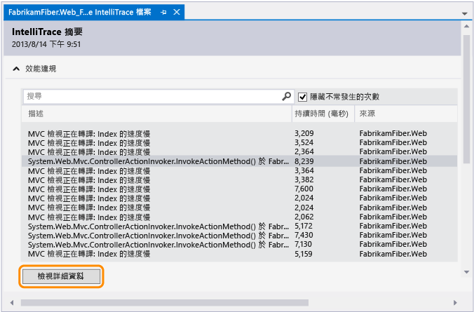
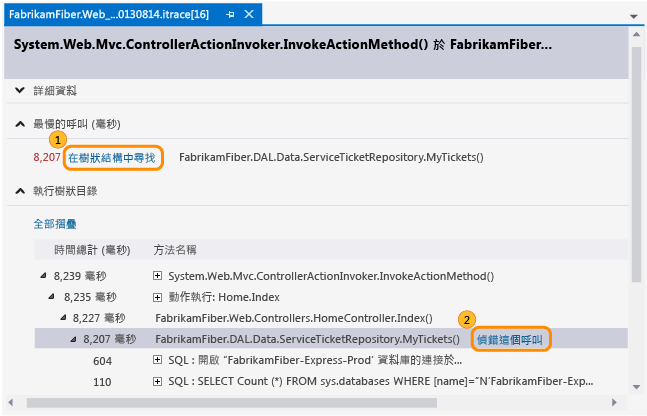
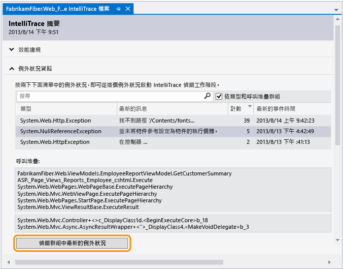
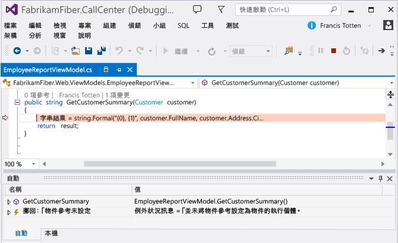
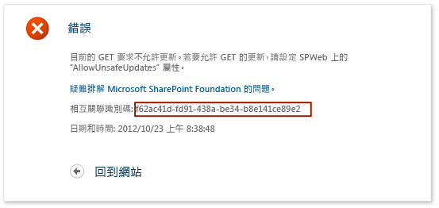
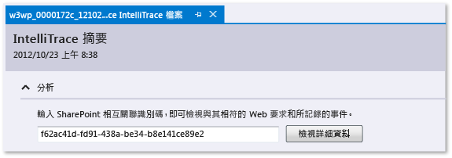
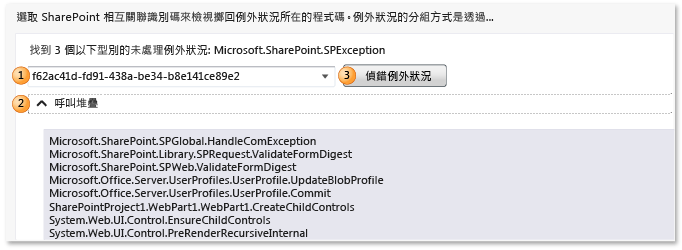

# 使用儲存的 IntelliTrace 資料
[!INCLUDE[vs2017banner](../code-quality/includes/vs2017banner.md)]

當您從 IntelliTrace \(.iTrace\) 記錄檔開始進行偵錯時，請移至您的應用程式執行中的特定點。 這個檔案可能會包含 IntelliTrace 在 App 執行時所記錄的效能事件、例外狀況、執行緒、測試步驟、模組及其他系統資訊。  
  
 請確定您已符合下列條件：  
  
-   配對應用程式程式碼的原始程式檔和符號檔 \(.pdb\)。 否則，Visual Studio 無法解析來源位置並會顯示「找不到符號」的訊息。 請參閱[指定符號 \(.pdb\) 和原始程式檔](../debugger/specify-symbol-dot-pdb-and-source-files-in-the-visual-studio-debugger.md)和[於部署後診斷問題](../debugger/diagnose-problems-after-deployment.md)。  
  
-   在開發電腦或另一部要開啟 .iTrace 檔案的電腦上已安裝 Visual Studio Enterprise \(但不能是 Professional 或 Community 版本\)  
  
-   來自下列其中一個來源的 .iTrace 檔案：  
  
    |**來源**|**請參閱**|  
    |------------|-------------|  
    |在 Visual Studio Enterprise \(但不是 Professional 或 Community 版本\) 中的 IntelliTrace 工作階段|[IntelliTrace 功能](../debugger/intellitrace-features.md)|  
    |Microsoft Test Manager 中的測試工作階段。 這會將 .iTrace 檔案附加至 Team Foundation Server 工作項目。|[在手動測試中收集更多診斷資料](/devops-test-docs/test/collect-more-diagnostic-data-in-manual-tests)|  
    |如果是在部署中執行的 ASP.NET Web App 和 SharePoint 應用程式，則來源為 Microsoft Monitoring Agent \(獨立執行或搭配 System Center 2012 R2 Operations Manager 運作\)|-   [於部署後診斷問題](../debugger/diagnose-problems-after-deployment.md) -   [System Center 2012 R2 Operations Manager 的新功能](http://technet.microsoft.com/library/dn249700.aspx)|  
  
##   請您指定選項。  
  
-   [開啟 IntelliTrace 記錄檔](#Open)  
  
-   [了解 IntelliTrace 記錄檔](#Understand)  
  
-   [從 IntelliTrace 記錄檔開始偵錯](#StartDebugging)  
  
##   開啟 IntelliTrace 記錄檔  
 在安裝了 Visual Studio Enterprise 的電腦上，開啟 .iTrace 檔案。  
  
-   在 Visual Studio 外部按兩下 .iTrace 檔案，或從 Visual Studio 內開啟該檔案。  
  
     \-或\-  
  
-   如果 .iTrace 檔案是附加至 Team Foundation Server 工作項目，請在工作項目中依照下列步驟執行：  
  
    -   在 \[所有連結\] 下方找出 .iTrace 檔案。 開啟該檔案。  
  
         \-或\-  
  
    -   在 \[重新產生步驟\] 底下，選擇 \[IntelliTrace\] 連結。  
  
> [!TIP]
>  如果您在偵錯期間關閉了 IntelliTrace 檔案，您可以輕易地重新開啟它。 移至 \[偵錯\] 功能表，選擇 \[IntelliTrace\]、\[顯示記錄檔摘要\]。 您也可以選取 \[IntelliTrace\] 視窗中的 \[顯示記錄檔摘要\]。 只有在使用 IntelliTrace 偵錯時，才能使用這個選項。  
  
##   了解 IntelliTrace 記錄檔  
 .iTrace 檔案中的下列某些區段，只有在您從特定來源 \(例如，從 Test Manager 或 SharePoint 應用程式\) 收集資料時才會出現。  
  
|**區段**|**包含**|**資料收集來源**|  
|------------|------------|----------------|  
|[效能違規](#Performance)|具有超過所設定臨界值之函式呼叫的效能事件|如果是裝載於 IIS 上的 ASP.NET Web App，則來源為 Microsoft Monitoring Agent \(獨立執行或搭配 System Center 2012 R2 Operations Manager 運作\)|  
|[例外狀況資料](#ExceptionData)|例外狀況，其中包含每個例外狀況的完整呼叫堆疊|所有來源|  
|[分析](#Analysis)|僅適用於 SharePoint 2010 和 SharePoint 2013 應用程式。 診斷 IntelliTrace 和 SharePoint 事件，例如偵錯工具事件、ULS 事件、未處理的例外狀況，以及 Microsoft Monitoring Agent 所記錄的其他資料。|Microsoft Monitoring Agent \(獨立執行或搭配 System Center 2012 R2 Operations Manager 運作\)。|  
|[系統資訊](#SystemInfo)|主機系統的設定和規格|所有來源|  
|[執行緒清單](#ThreadsList)|在收集期間執行的執行緒|所有來源|  
|[測試資料](#TestData)|測試工作階段的測試步驟和結果|測試管理員|  
|[模組](#Modules)|目標處理序所載入的模組，以載入的順序排列顯示。|所有來源|  
  
 這裡有一些秘訣可幫助您尋找每個區段中的資訊：  
  
-   選擇資料行標頭來排序資料。  
  
-   使用搜尋方塊來篩選資料。 純文字搜尋適用於所有資料行 \(除了時間資料行以外\)。 您也可以每個資料行使用一個篩選條件，將要篩選的搜尋範圍限定在某特定資料行。 輸入不含空格的資料行名稱、冒號 \(**:**\) 和搜尋值。 後面要接著輸入分號 \(**;**\)，才能加入另一個資料行和搜尋值。  
  
     例如，若要在 \[Description\] 資料行中尋找含有 "slow" 這個字的效能事件，請輸入：  
  
     `Description:slow`  
  
##   從 IntelliTrace 記錄檔開始偵錯  
  
###   效能違規  
 檢閱針對您的 App 所記錄的效能事件。 您可以隱藏不常發生的事件。  
  
##### 從效能事件開始偵錯  
  
1.  在 \[效能違規\] 下，檢閱所記錄的效能事件、它們的總執行時間和其他事件資訊。 然後更深入發掘在特定的效能事件期間所呼叫的方法。  
  
       
  
     您也可以直接按兩下事件。  
  
2.  在事件頁面上，檢閱這些呼叫的執行時間。 在執行樹狀結構中尋找速度緩慢的呼叫。  
  
     當您有多個呼叫 \(不論是巢狀或其他形式\) 時，最慢的呼叫會顯示在其專有的區段中。  
  
3.  展開該呼叫，以檢閱該時間點所記錄的所有巢狀呼叫和參數值。  
  
     \(鍵盤：若要顯示或隱藏巢狀呼叫，請分別按下**向右鍵**或**向左鍵**。 若要顯示和隱藏巢狀呼叫的參數值，請按**空格鍵**\)  
  
     從該呼叫開始偵錯。  
  
       
  
     您也可以直接按兩下該呼叫或按 **Enter** 鍵。  
  
     如果該方法是位於您的應用程式程式碼中，Visual Studio 就會移至該方法。  
  
       
  
     現在您可以檢閱其他記錄值、呼叫堆疊、逐步執行程式碼，或使用 \[IntelliTrace\] 視窗[在「時間」中向後或向前移動至其他方法](../debugger/intellitrace.md) \(這些方法是在此效能事件期間呼叫的\)。  
  
###   例外狀況資料  
 檢閱針對您的 App 所記錄的擲回之例外狀況。 您可以將具有相同類型和呼叫堆疊的例外狀況群組在一起，這樣就可以只看到最新的例外狀況。  
  
##### 從例外狀況開始偵錯  
  
1.  在 \[例外狀況資料\] 下，檢閱記錄的例外狀況事件、其類型、訊息，以及發生例外狀況的時間。 若要更深入發掘程式碼，請從例外狀況群組中最近發生的事件開始偵錯。  
  
       
  
     您也可以直接按兩下事件。 如果事件沒有組成群組，請選取 \[偵錯這個事件\]。  
  
     如果例外狀況是發生在您的應用程式程式碼中，Visual Studio 會移至發生例外狀況的位置。  
  
       
  
     現在您可以檢閱其他記錄值、呼叫堆疊，或使用 \[IntelliTrace\] 視窗[在「時間」中向後或向前移動至其他記錄的事件](../debugger/intellitrace.md)、相關程式碼以及在這些時間點上記錄的值。  
  
    |**資料行**|**顯示的內容**|  
    |-------------|---------------|  
    |**類型**|例外狀況的 .NET 類型|  
    |如果是組成群組的例外狀況，則為 \[最新的訊息\]；如果是沒有組成群組的例外狀況，則為 \[訊息\]|例外狀況所提供的訊息|  
    |如果是組成群組的例外狀況，則為 \[計數\]|例外狀況的擲回次數|  
    |如果是沒有組成群組的例外狀況，則為 \[執行緒 ID\]|擲回例外狀況之執行緒的 ID|  
    |\[最新的事件時間\] 或 \[事件時間\]|擲回例外狀況時所記錄的時間戳記|  
    |**呼叫堆疊**|例外狀況的呼叫堆疊。   若要查看呼叫堆疊，請選取清單中的某個例外狀況。 呼叫堆疊會顯示在例外狀況清單的下方。|  
  
###   分析  
 藉由使用 SharePoint 相互關聯識別碼或檢閱 Microsoft Monitoring Agent 所找到的任何未處理的例外狀況，來診斷 SharePoint 2010 和 SharePoint 2013 應用程式的問題。  
  
-   使用 SharePoint 相互關聯識別碼來尋找其相符的 Web 要求和事件。 請選擇某個事件，然後在事件發生的位置和時間點上開始偵錯。  
  
-   如果 Microsoft Monitoring Agent 找到未處理的例外狀況，請選擇某個例外狀況，然後在例外狀況發生的位置和時間點上開始偵錯。  
  
##### 使用 SharePoint 相互關聯識別碼開始偵錯  
  
1.  從來源複製 SharePoint 相互關聯識別碼。  
  
     例如：  
  
       
  
2.  開啟 .iTrace 檔案，然後移至 \[分析\] 並輸入 SharePoint 相互關聯識別碼，以檢閱相符的 Web 要求和所記錄的事件。  
  
       
  
3.  在 \[要求事件\] 下方，檢查事件。 事件會依其發生順序從最上方開始顯示。  
  
    1.  選擇要查看其詳細資料的事件。  
  
    2.  選擇 \[開始偵錯\] 以開始在發生事件的位置點上進行偵錯。  
  
       
  
 您可以一併查看下面這些類型的 SharePoint 事件和 IntelliTrace 事件：  
  
-   **使用者設定檔事件**  
  
     這些事件會在 SharePoint 載入使用者設定檔時，以及在讀取或變更使用者設定檔屬性時發生。  
  
-   **統一登入系統 \(ULS\) 事件**  
  
     Microsoft Monitoring Agent 會記錄 SharePoint ULS 事件的子集以及下面這些欄位：  
  
    |**IntelliTrace 欄位**|**SharePoint ULS 欄位**|  
    |-------------------------|---------------------------|  
    |**ID**|**事件 ID**|  
    |**層級**|**層級**|  
    |**分類 ID**|**分類 ID**|  
    |**分類**|**分類**|  
    |**區域**|**產品**|  
    |**輸出**|**訊息**|  
    |**相互關聯識別碼**|**相互關聯識別碼**|  
  
##### 從未處理的例外狀況開始偵錯  
  
1.  選取例外狀況的 SharePoint 相互關聯識別碼。 例外狀況是依類型和呼叫堆疊來分組的。  
  
2.  \(選擇性\) 展開 \[呼叫堆疊\] 以查看例外狀況群組的呼叫堆疊。  
  
3.  選擇 \[偵錯例外狀況\] 開始在發生例外狀況的位置及時間點上進行偵錯。  
  
       
  
 如需逐步解說，請參閱[逐步解說：使用 IntelliTrace 偵錯 SharePoint 應用程式](../Topic/Walkthrough:%20Debugging%20a%20SharePoint%20Application%20by%20Using%20IntelliTrace.md)。 如需了解代理程式所記錄的資料種類，請參閱[IntelliTrace 功能](../debugger/intellitrace-features.md)。  
  
###   執行緒清單  
 檢查在目標處理序中執行的已記錄執行緒。 您可以從所選取之執行緒中的第一個有效 IntelliTrace 事件開始進行偵錯。  
  
##### 若要從特定執行緒開始偵錯  
  
1.  在 \[執行緒清單\] 底下，選擇執行緒。  
  
2.  在 \[執行緒清單\] 下方，選取 \[開始偵錯\]。 您也可以按兩下執行緒。  
  
     若要從 App 的開頭處開始偵錯，請按兩下 \[主執行緒\]。 請參閱[IntelliTrace 功能](../debugger/intellitrace-features.md)。  
  
 使用者建立的執行緒資料，可能會比伺服器針對 IIS 裝載的 Web App 所建立及管理的執行緒還要有用。  
  
|**資料行**|**顯示的內容**|  
|-------------|---------------|  
|**ID**|執行緒 ID 編號|  
|**名稱**|執行緒名稱。 未命名的執行緒會顯示為「\<沒有名稱\>」。|  
|**開始時間**|執行緒的建立時間|  
|**結束時間**|執行緒的完成時間|  
  
###   測試資料  
 檢查 Test Manager 在測試您的 App 時所記錄的 IntelliTrace 資料。  
  
##### 從特定測試步驟開始偵錯  
  
1.  展開 \[測試步驟格線\]。 選取某個測試步驟。  
  
2.  在 \[測試步驟格線\] 下方，選取 \[開始偵錯\]。 您也可以按兩下測試步驟。  
  
     這會從所選取測試步驟之後的第一個有效的 IntelliTrace 事件開始偵錯。  
  
     當測試資料存在時，IntelliTrace 會嘗試解析用於執行測試回合的相關 Team Foundation Server 組建。 如果找到該組建，就會自動解析 App 的相關符號。  
  
|**欄位**|**顯示的內容**|  
|------------|---------------|  
|**測試工作階段**|所記錄的測試工作階段， 通常只有一個。 如果測試資料是使用手動探勘測試所建立的，則這份清單是空的。|  
|**測試案例**|來自所選取測試工作階段的測試案例。 如果測試資料是使用手動探勘測試所建立的，則這份清單是空的。|  
|**測試步驟格線**|所記錄的測試步驟，具有成功或失敗的測試結果|  
  
###   系統資訊  
 這個區段會顯示有關裝載 App 之系統的詳細資訊，例如硬體、作業系統，以及和環境與處理序有關的特定資訊。  
  
###   模組  
 這個區段會顯示目標處理序所載入的模組。 模組會依載入的順序排列顯示。  
  
|**資料行**|**顯示的內容**|  
|-------------|---------------|  
|**模組名稱**|模組檔案名稱|  
|**模組路徑**|載入模組的磁碟位置|  
|**模組 ID**|版本特定且提供給相符符號 \(PDB\) 檔案之模組的唯一識別項。 請參閱[Finding symbol \(.pdb\) files and source files](http://msdn.microsoft.com/zh-tw/05384c85-d264-4e18-abaa-aa482ab25470)。|  
  
### 哪裡可以取得詳細資訊？  
 [使用 IntelliTrace 獨立收集器](../debugger/using-the-intellitrace-stand-alone-collector.md)  
  
 [IntelliTrace 功能](../debugger/intellitrace-features.md)  
  
 [在手動測試中收集更多診斷資料](/devops-test-docs/test/collect-more-diagnostic-data-in-manual-tests)  
  
 [使用 IntelliTrace](../debugger/intellitrace.md)  
  
#### 論壇  
 [Visual Studio 偵錯工具](http://go.microsoft.com/fwlink/?LinkId=262263)  
  
#### 指引  
 [使用 Visual Studio 2012 測試持續傳遞 – 第 6 章：測試工具箱](http://go.microsoft.com/fwlink/?LinkID=255203)