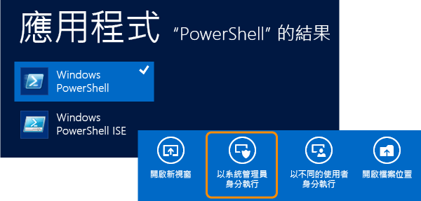
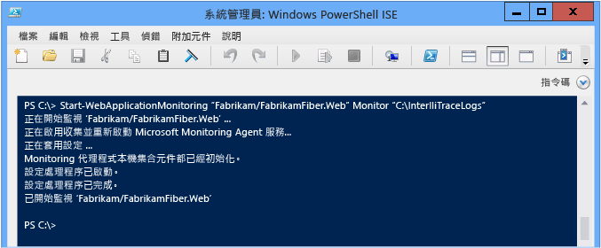
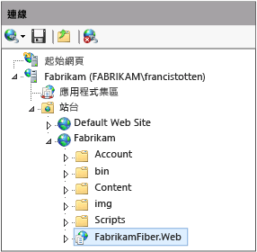
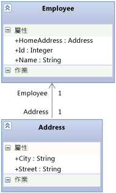

# 使用 Microsoft Monitoring Agent
[!INCLUDE[vs2017banner](../code-quality/includes/vs2017banner.md)]

您可以使用 **Microsoft Monitoring Agent**，在本機監視裝載 IIS 的 ASP.NET Web 應用程式和 SharePoint 2010 或 2013 應用程式是否發生錯誤、效能問題或其他問題。 您可以將來自代理程式的診斷事件儲存至 IntelliTrace 記錄檔 \(.iTrace\)。 接著，您可以在 Visual Studio Enterprise \(但不能在 Professional 或 Community 版本\) 中開啟記錄檔，以偵錯所有 Visual Studio 診斷工具的問題。 您也可以透過 **Trace** 模式執行代理程式，即可收集 IntelliTrace 診斷資料和方法資料。 Microsoft Monitoring Agent 可以與 [Application Insights](http://www.visualstudio.com/get-started/find-performance-problems-vs.aspx) 和 [System Center Operation Manager](http://technet.microsoft.com/library/hh205987.aspx) 整合。 Microsoft Monitoring Agent 在安裝時確實會變更目標系統的環境。  
  
> [!NOTE]
>  您也可以使用 **IntelliTrace 獨立收集器**收集遠端機器上 Web、SharePoint、WPF 和 Windows Form 應用程式的 IntelliTrace 診斷和方法資料，而不需要變更目標環境。 獨立收集器對效能的影響，大於以 **Monitor** 模式執行 Microsoft Monitoring Agent。 請參閱 [使用 IntelliTrace 獨立收集器](../debugger/using-the-intellitrace-stand-alone-collector.md)。  
  
 如果您使用 System Center 2012，請搭配使用 Microsoft Monitoring Agent 與 Operations Manager 來取得問題警示，並建立連結至已儲存 IntelliTrace 記錄檔的 Team Foundation Server 工作項目。 接著，您可以將這些工作項目指派給其他人，以進一步偵錯。 請參閱[整合 Operations Manager 與開發程序](http://technet.microsoft.com/library/jj614609.aspx)和[使用 Microsoft Monitoring Agent 監視](http://technet.microsoft.com/en-us/library/dn465153.aspx)。  
  
 開始之前，請確認您的來源和符號和已建置及部署的程式碼相符。 這可協助您在開始偵錯和瀏覽 IntelliTrace 記錄檔中的診斷事件時，直接跳到應用程式程式碼。[設定組建](../debugger/diagnose-problems-after-deployment.md)，讓 Visual Studio 可以自動尋找並開啟和已部署的程式碼相符的來源。  
  
1.  [步驟 1：設定 Microsoft Monitoring Agent](#SetUpMonitoring)  
  
2.  [步驟 2：開始監視應用程式](#MonitorEvents)  
  
3.  [步驟 3：儲存記錄的事件](#SaveEvents)  
  
##  <a name="SetUpMonitoring"></a> 步驟 1：設定 Microsoft Monitoring Agent  
 在網頁伺服器上設定獨立代理程式，以執行本機監視，而不需要變更應用程式。 如果您使用 System Center 2012，請參閱[安裝 Microsoft Monitoring Agent](http://technet.microsoft.com/library/dn465156.aspx)。  
  
###  <a name="SetUpStandaloneMMA"></a> 設定獨立代理程式  
  
1.  請確認：  
  
    -   網頁伺服器執行 [Internet Information Services \(IIS\) 的支援版本](http://technet.microsoft.com/en-us/library/dn465154.aspx)。  
  
    -   您的網頁伺服器具有 .NET Framework 3.5、4 或 4.5。  
  
    -   您的網頁伺服器正在執行 Windows PowerShell 3.0 或更新版本。[問：如果我有 Windows PowerShell 2.0，該如何處理？](#PowerShell2)  
  
    -   您具有網頁伺服器的系統管理員權限，可以執行 PowerShell 命令，以及在開始監視時回收應用程式集區。  
  
    -   您已經解除安裝任何舊版的 Microsoft Monitoring Agent。  
  
2.  將免費的 [Microsoft Monitoring Agent](http://go.microsoft.com/fwlink/?LinkId=320384) \(32 位元版本的 **MMASetup\-i386.exe** 或 64 位元版本的 **MMASetup\-AMD64.exe**\) 從 Microsoft 下載中心下載至網頁伺服器。  
  
3.  執行所下載的可執行檔，以啟動安裝精靈。  
  
4.  在 Web 伺服器上建立安全目錄以儲存 IntelliTrace 記錄檔 \(例如，**C:\\IntelliTraceLogs**\)。  
  
     請務必在開始監視之前建立這個目錄。 若要避免讓應用程式變慢，請選擇本機高速磁碟上不是非常活躍的位置。  
  
    > [!IMPORTANT]
    >  IntelliTrace 記錄檔可能包含個人和機密資料。 限制這個目錄，只供必須使用檔案的識別使用。 請檢查您公司的隱私權原則。  
  
5.  若要執行詳細的函式層級監視，或是監視 SharePoint 應用程式，請將 IntelliTrace 記錄檔目錄的讀取和寫入權限授與裝載 Web 應用程式或 SharePoint 應用程式的應用程式集區。[問：如何設定應用程式集區的權限？](#FullPermissionsITLog)  
  
### 問與答  
  
####  <a name="PowerShell2"></a> 問：如果我有 Windows PowerShell 2.0，該如何處理？  
 **答：**強烈建議您使用 PowerShell 3.0。 否則，每次執行 PowerShell 時，您都必須匯入 Microsoft Monitoring Agent PowerShell Cmdlet。 您也無法存取可下載的說明內容。  
  
1.  以系統管理員身分開啟 **Windows PowerShell** 或 **Windows PowerShell ISE** 命令提示字元視窗。  
  
2.  從預設安裝位置匯入 Microsoft Monitoring Agent PowerShell 模組：  
  
     **PS C:\>Import\-Module "C:\\Program Files\\Microsoft Monitoring Agent\\Agent\\PowerShell\\Microsoft.MonitoringAgent.PowerShell\\Microsoft.MonitoringAgent.PowerShell.dll"**  
  
3.  [造訪 TechNet](http://technet.microsoft.com/systemcenter/default) 以取得最新的說明內容。  
  
####  <a name="FullPermissionsITLog"></a> 問：如何設定應用程式集區的權限？  
 **答：**使用 Windows **icacls** 命令，或使用 Windows 檔案總管 \(或檔案總管\)。 例如：  
  
-   使用 Windows **icacls** 命令設定權限：  
  
    -   針對 **DefaultAppPool** 應用程式集區中的 Web 應用程式：  
  
         `icacls "C:\IntelliTraceLogs" /grant "IIS APPPOOL\DefaultAppPool":RX`  
  
    -   針對 **SharePoint \- 80** 應用程式集區中的 SharePoint 應用程式：  
  
         `icacls "C:\IntelliTraceLogs" /grant "IIS APPPOOL\SharePoint - 80":RX`  
  
     \-或\-  
  
-   使用 Windows 檔案總管 \(或檔案總管\) 設定權限：  
  
    1.  開啟 IntelliTrace 記錄檔目錄的 \[屬性\]。  
  
    2.  在 \[安全性\] 索引標籤上，依序選擇 \[編輯\] 和 \[新增\]。  
  
    3.  確認 \[內建安全性主體\] 出現在 \[選擇這個物件類型\] 方塊中。 如果未出現，請選擇 \[物件類型\]，以將它加入。  
  
    4.  請確認您的本機電腦出現在 \[從這個位置\] 方塊中。 如果未出現，請選擇 \[位置\] 變更它。  
  
    5.  在 \[輸入要選取的物件名稱\] 方塊中，加入 Web 應用程式或 SharePoint 應用程式的應用程式集區。  
  
    6.  選擇 \[檢查名稱\] 來解析名稱。 選擇 \[**確定**\]。  
  
    7.  確認應用程式集區具有 \[讀取和執行\] 權限。  
  
##  <a name="MonitorEvents"></a> 步驟 2：開始監視應用程式  
 請使用 Windows PowerShell [Start\-WebApplicationMonitoring](http://go.microsoft.com/fwlink/?LinkID=313686) 命令，以開始監視應用程式。 如果您使用 System Center 2012，請參閱[使用 Microsoft Monitoring Agent 監視 Web 應用程式](http://technet.microsoft.com/library/dn465157.aspx)。  
  
1.  在 Web 伺服器上，以系統管理員身分開啟 **Windows PowerShell** 或 **Windows PowerShell ISE** 命令提示字元視窗。  
  
       
  
2.  執行 [Start\-WebApplicationMonitoring](http://go.microsoft.com/fwlink/?LinkID=313686) 命令，以開始監視應用程式。 這將會重新啟動網頁伺服器上的所有 Web 應用程式。  
  
     以下是簡短的語法：  
  
     **Start\-WebApplicationMonitoring** *"\<appName\>"* *\<monitoringMode\>* *"\<outputPath\>"* *\<UInt32\>* *"\<collectionPlanPathAndFileName\>"*  
  
     以下是僅使用 Web 應用程式名稱和輕量型 **Monitor** 模式的範例：  
  
     **PS C:\\\>Start\-WebApplicationMonitoring "Fabrikam\\FabrikamFiber.Web" Monitor "C:\\IntelliTraceLogs"**  
  
     以下是使用 IIS 路徑和輕量型 **Monitor** 模式的範例：  
  
     **PS C:\\\>Start\-WebApplicationMonitoring "IIS:\\sites\\Fabrikam\\FabrikamFiber.Web" Monitor "C:\\IntelliTraceLogs"**  
  
     開始監視之後，您可能會在應用程式重新啟動時看到 Microsoft Monitoring Agent 暫停。  
  
       
  
    |||  
    |-|-|  
    |*"\<appName\>"*|在 IIS 中指定網站和 Web 應用程式名稱的路徑。 如果您想要的話，也可以包括 IIS 路徑。<br /><br /> *"\<IISWebsiteName\>\\\<IISWebAppName\>"*<br /><br /> \-或\-<br /><br /> **"IIS:\\sites** *\\\<IISWebsiteName\>\\\<IISWebAppName\>"*<br /><br /> 您可以在 IIS 管理員中尋找這個路徑。 例如：<br /><br /> <br /><br /> 您也可以使用 [Get\-WebSite](http://technet.microsoft.com/library/ee807832.aspx) 和 [Get WebApplication](http://technet.microsoft.com/library/ee790554.aspx) 命令。|  
    |*\<monitoringMode\>*|指定監視模式：<br /><br /> <ul><li>**Monitor**：記錄例外狀況事件和效能事件的最少詳細資料。 這個模式使用預設收集計劃。</li><li>**Trace**：記錄函式層級詳細資料，或使用指定的收集計劃監視 SharePoint 2010 和 SharePoint 2013 應用程式。 這個模式可能會讓應用程式執行速度變慢。<br /><br /> <ul><li>[問：如何設定應用程式集區的權限？](#FullPermissionsITLog)</li><li>[問：如何取得大部分的資料，而不會讓應用程式變慢？](#Minimizing)</li></ul><br />     這個範例會記錄 SharePoint 網站上所裝載 SharePoint 應用程式的事件：<br /><br />     **Start\-WebApplicationMonitoring "FabrikamSharePointSite\\FabrikamSharePointApp" Trace "C:\\Program Files\\Microsoft Monitoring Agent\\Agent\\IntelliTraceCollector\\collection\_plan.ASP.NET.default.xml" "C:\\IntelliTraceLogs"**</li><li>**Custom**：使用指定的自訂收集計劃來記錄自訂詳細資料。 如果您在啟動監視之後編輯收集計劃，則必須重新啟動監視。</li></ul>|  
    |*"\<outputPath\>"*|指定儲存 IntelliTrace 記錄檔的完整目錄路徑。 請務必在開始監視之前建立這個目錄。|  
    |*\<UInt32\>*|指定 IntelliTrace 記錄檔的大小上限。 IntelliTrace 記錄檔的預設大小上限為 250 MB。<br /><br /> 記錄檔達到這個限制時，代理程式會覆寫最早的項目，以挪出空間供更多項目使用。 若要變更這個限制，請使用 **\-MaximumFileSizeInMegabytes** 選項，或編輯收集計劃中的 `MaximumLogFileSize` 屬性。|  
    |*"\<collectionPlanPathAndFileName\>"*|指定收集計劃的完整路徑或相對路徑和檔案名稱。 這個計劃是一個可進行代理程式設定的 .xml 檔案。<br /><br /> 這些計劃隨附於代理程式，並使用 Web 應用程式和 SharePoint 應用程式：<br /><br /> -   **collection\_plan.ASP.NET.default.xml**<br />     僅收集事件，例如例外狀況、效能事件、資料庫呼叫和網頁伺服器要求。<br />-   **collection\_plan.ASP.NET.trace.xml**<br />     收集函式層級呼叫以及預設收集計劃中的所有資料。 這個計劃適用於詳細分析，但可能會讓應用程式變慢。<br /><br /> 您可以在代理程式的子資料夾中找到這些計劃的當地語系化版本。 您也可以[自訂這些計劃，或建立自己的計劃](http://go.microsoft.com/fwlink/?LinkId=227871)，即可避免應用程式變慢。 請將任何自訂計劃與代理程式放在相同的安全位置。<br /><br /> [問：如何取得大部分的資料，而不會讓應用程式變慢？](#Minimizing)|  
  
     如需完整語法和其他範例的詳細資訊，請執行 **get\-help Start\-WebApplicationMonitoring –detailed** 命令或 **get\-help Start\-WebApplicationMonitoring –examples** 命令。  
  
3.  若要檢查所有受監視 Web 應用程式的狀態，請執行 [Get\-WebApplicationMonitoringStatus](http://go.microsoft.com/fwlink/?LinkID=313685) 命令。  
  
### 問與答  
  
####  <a name="Minimizing"></a> 問：如何取得大部分的資料，而不會讓應用程式變慢？  
 **答：**Microsoft Monitoring Agent 可以收集大量資料，並影響應用程式效能 \(視選擇要收集的資料和其收集方式而定\)。 以下是一些取得大部分資料而不會讓應用程式變慢的方法：  
  
-   針對 Web 應用程式和 SharePoint 應用程式，代理程式會為每個共用指定應用程式集區的應用程式記錄資料。 這可能會讓任何共用相同應用程式集區的應用程式變慢，即使您可以限制收集單一應用程式的模組也是一樣。 若要避免讓其他應用程式變慢，請在它自己的應用程式集區中裝載每個應用程式。  
  
-   檢閱代理程式在收集計劃中為其收集資料的事件。 編輯收集計劃，以停用不相關或您不感興趣的事件。 這可以改善啟動效能和執行階段效能。  
  
     若要停用事件，請將 `enabled` 項目的 `<DiagnosticEventSpecification>` 屬性設為 `false`：  
  
     `<DiagnosticEventSpecification enabled="false">`  
  
     如果 `enabled` 屬性不存在，表示已啟用事件。  
  
     例如：  
  
    -   針對未使用 Windows Workflow 的應用程式停用 Windows Workflow 事件。  
  
    -   停用可存取登錄但未顯示登錄設定問題之應用程式的登錄事件。  
  
-   檢閱代理程式在收集計劃中為其收集資料的模組。 編輯收集計劃，使其只包括您感興趣的模組。  
  
     這樣會減少代理程式在啟動和執行應用程式時所收集的方法呼叫資訊量與其他檢測資料量。 這項資料可協助您在偵錯和檢閱傳遞給函式呼叫的值以及從函式呼叫傳回的值時，逐步執行程式碼。  
  
    1.  開啟收集計劃。 尋找 `<ModuleList>` 項目。  
  
    2.  在 `<ModuleList>` 中，將 `isExclusionList` 屬性設為 `false`。  
  
    3.  使用 `<Name>` 項目，即可指定每個具有下列其中一個項目的模組：檔案名稱、包括其名稱中含有該字串之任何模組的字串值，或公開金鑰。  
  
     這個範例會建立只從 Fabrikam Fiber Web 應用程式的主要模組收集資料的清單：  
  
    ```xml  
    <ModuleList isExclusionList="false"> <Name>FabrikamFiber.Web.dll</Name> </ModuleList>  
  
    ```  
  
     若要從任何名稱中包括 "Fabrikam" 的模組中收集資料，請建立與下面類似的清單：  
  
    ```xml  
    <ModuleList isExclusionList="false"> <Name>Fabrikam</Name> </ModuleList>  
  
    ```  
  
     若要透過指定模組的公開金鑰語彙基元，以從模組中收集資料，請建立與下面類似的清單：  
  
    ```xml  
    <ModuleList isExclusionList="false"> <Name>PublicKeyToken:B77A5C561934E089</Name> <Name>PublicKeyToken:B03F5F7F11D50A3A</Name> <Name>PublicKeyToken:31BF3856AD364E35</Name> <Name>PublicKeyToken:89845DCD8080CC91</Name> <Name>PublicKeyToken:71E9BCE111E9429C</Name> </ModuleList>  
  
    ```  
  
     **問：為何不改為排除模組？**  
  
     **答：**根據預設，收集計劃會透過將 `isExclusionList` 屬性設為 `true` 來排除模組。 不過，收集到的資料還是可能來自不符合清單準則的模組或您可能不感興趣的模組，例如協力廠商或開放原始碼模組。  
  
#### 問：代理程式收集的值為何？  
 **答：**為了降低對效能的影響，代理程式只會收集下列值：  
  
-   傳遞給方法以及從方法傳回的基本資料類型  
  
-   傳遞給方法以及從方法傳回之最上層物件欄位中的基本資料類型  
  
 例如，假設您有接受整數 `AlterEmployee` 和 `id` 物件 `Employee` 的 `oldemployee` 方法簽章：  
  
 `public Employee AlterEmployee(int id, Employee oldemployee)`  
  
 `Employee` 類型具有下列屬性：`Id`、`Name` 和 `HomeAddress`。`Employee` 與 `Address` 類型之間具有關聯。  
  
   
  
 代理程式會記錄 `id` 方法所傳回 `Employee.Id`、`Employee.Name`、`Employee` 和 `AlterEmployee` 物件的值。 不過，代理程式不會記錄 `Address` 物件的資訊，不論此物件是否為 Null。 代理程式也不會記錄 `AlterEmployee` 方法中區域變數的資料，除非其他方法使用這些區域變數做為參數 \(此時將它們記錄為方法參數\)。  
  
##  <a name="SaveEvents"></a> 步驟 3：儲存記錄的事件  
 當您發現錯誤或效能問題時，請將記錄的事件儲存至 IntelliTrace 記錄檔。 代理程式只有在已記錄事件時才會建立記錄檔。 如果您使用 System Center 2012，請參閱[使用 Microsoft Monitoring Agent 監視 Web 應用程式](http://technet.microsoft.com/library/dn465157.aspx)。  
  
### 儲存記錄的事件，但仍繼續監視  
 如果您想要建立 IntelliTrace 記錄檔，但是不想要重新啟動應用程式或是停止監視，請遵循這些步驟。 即使伺服器或應用程式重新啟動，代理程式還是會繼續監視。  
  
1.  在網頁伺服器上，以系統管理員身分開啟 Windows PowerShell 命令提示字元視窗。  
  
2.  執行 [Checkpoint\-WebApplicationMonitoring](http://go.microsoft.com/fwlink/?LinkID=313684) 命令，以儲存 IntelliTrace 記錄檔的快照：  
  
     **Checkpoint\-WebApplicationMonitoring** *"\<IISWebsiteName\>\\\<IISWebAppName\>"*  
  
     \-或\-  
  
     **Checkpoint\-WebApplicationMonitoring "IIS:\\sites** *\\\<IISWebsiteName\>\\\<IISWebAppName\>"*  
  
     例如：  
  
     **PS C:\\\>Checkpoint\-WebApplicationMonitoring "Fabrikam\\FabrikamFiber.Web"**  
  
     \-或\-  
  
     **PS C:\\\>Checkpoint\-WebApplicationMonitoring "IIS:\\sites\\Fabrikam\\FabrikamFiber.Web"**  
  
     如需詳細資訊，請執行 **get\-help Checkpoint\-WebApplicationMonitoring –detailed** 命令或 **get\-help Checkpoint\-WebApplicationMonitoring –examples** 命令。  
  
3.  將記錄檔複製到安全的共用資料夾，然後從具有 Visual Studio Enterprise \(不具有 Professional 或 Community 版本\) 的電腦開啟記錄檔。  
  
    > [!IMPORTANT]
    >  當您共用 IntelliTrace 記錄檔時，請務必小心，因為它們可能包含個人和機密資料。 請確認可以存取這些記錄檔的人員都具有查看該資料的權限。 請檢查您公司的隱私權原則。  
  
 **下一步：** [在 Visual Studio Enterprise 中診斷記錄的事件](../debugger/diagnose-problems-after-deployment.md#InvestigateEvents)  
  
### 儲存記錄的事件並停止監視  
 如果您只想要在重現特定問題時取得診斷資訊，請遵循這些步驟。 這將會重新啟動網頁伺服器上的所有 Web 應用程式。  
  
1.  在網頁伺服器上，以系統管理員身分開啟 Windows PowerShell 命令提示字元視窗。  
  
2.  執行 [Stop\-WebApplicationMonitoring](http://go.microsoft.com/fwlink/?LinkID=313687) 命令，即可建立 IntelliTrace 記錄檔，並停止監視特定的 Web 應用程式：  
  
     **Stop\-WebApplicationMonitoring** *"\<IISWebsiteName\>\\\<IISWebAppName\>"*  
  
     \-或\-  
  
     **Stop\-WebApplicationMonitoring "IIS:\\sites** *\\\<IISWebsiteName\>\\\<IISWebAppName\>"*  
  
     或者，停止監視所有 Web 應用程式：  
  
     **Stop\-WebApplicationMonitoring \-All**  
  
     例如：  
  
     **PS C:\\\>Stop\-WebApplicationMonitoring "Fabrikam\\iFabrikamFiber.Web"**  
  
     \-或\-  
  
     **PS C:\\\>Stop\-WebApplicationMonitoring "IIS:\\sites\\Fabrikam\\FabrikamFiber.Web"**  
  
     如需詳細資訊，請執行 **get\-help Stop\-WebApplicationMonitoring –detailed** 命令或 **get\-help Stop\-WebApplicationMonitoring –examples** 命令。  
  
3.  將記錄檔複製到安全的共用資料夾，然後從具有 Visual Studio Enterprise 的電腦開啟記錄檔。  
  
 **下一步：** [在 Visual Studio Enterprise 中診斷記錄的事件](../debugger/diagnose-problems-after-deployment.md#InvestigateEvents)  
  
## 問與答  
  
### 問：哪裡可以取得詳細資訊？  
  
#### 部落格  
 [Microsoft Monitoring Agent 簡介](http://blogs.msdn.com/b/visualstudioalm/archive/2013/09/20/introducing-microsoft-monitoring-agent.aspx)  
  
 [最佳化實際伺服器上的 IntelliTrace 收集](http://go.microsoft.com/fwlink/?LinkId=255233)  
  
#### 論壇  
 [Visual Studio 的診斷功能](http://go.microsoft.com/fwlink/?LinkId=262263)