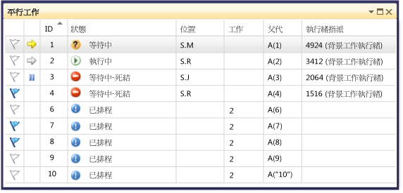
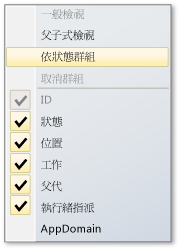
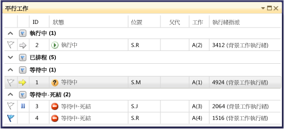
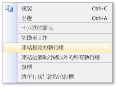

# 使用工作視窗
[!INCLUDE[vs2017banner](../code-quality/includes/vs2017banner.md)]

\[工作\] 視窗與 \[執行緒\] 視窗類似，差別在於前者顯示的是 <xref:System.Threading.Tasks.Task?displayProperty=fullName>、[task\_handle](../Topic/task_group%20Class.md) 或 [WinJS.Promise](http://msdn.microsoft.com/library/windows/apps/br211867.aspx) 物件的相關資訊，而非每個執行緒的相關資訊。  與執行緒一樣，工作代表可以並行執行的非同步作業，但是多項工作可能會在相同執行緒上執行。  如需詳細資訊，請參閱 [JavaScript 的非同步程式設計 \(Windows 市集應用程式\)](http://msdn.microsoft.com/library/windows/apps/hh700330.aspx)。  
  
 在 Managed 程式碼中，當您使用 物件或使用 <xref:System.Threading.Tasks.Task?displayProperty=fullName>await 和 **async** 關鍵字 \(在 Visual Basic 中為 **Await** 和 **Async**\) 時，可以使用 \[**工作**\] 視窗。  如需 Managed 程式碼格式之工作的詳細資訊，請參閱[Parallel Programming](../Topic/Parallel%20Programming%20in%20the%20.NET%20Framework.md)。  
  
 在機器碼中，您可以在操作**工作群組**、[平行演算法](/visual-cpp/parallel/concrt/task-parallelism-concurrency-runtime)、[非同步代理程式](/visual-cpp/parallel/concrt/parallel-algorithms)及[輕量型工作](/visual-cpp/parallel/concrt/asynchronous-agents)時使用 \[[工作](/visual-cpp/parallel/concrt/task-scheduler-concurrency-runtime)\] 視窗。  如需機器碼格式之工作的詳細資訊，請參閱[並行執行階段](/visual-cpp/parallel/concrt/concurrency-runtime)。  
  
 在 JavaScript 中，您可以在使用 promise .then 程式碼時使用 \[工作\] 視窗。  
  
 只要您進入偵錯工具，就可以使用 \[**工作**\] 視窗。  存取方式是按一下 \[**偵錯**\] 功能表上的 \[**視窗**\]，然後按一下 \[**工作**\]。  下圖顯示處於預設模式的 \[**工作**\] 視窗。  
  
   
  
> [!NOTE]
>  在 Managed 程式碼中，如果 Managed 執行緒處於睡眠或聯結狀態，則狀態為 <xref:System.Threading.Tasks.Task>、<xref:System.Threading.Tasks.TaskStatus> 或 <xref:System.Threading.Tasks.TaskStatus> 的 <xref:System.Threading.Tasks.TaskStatus> 可能不會在 \[工作\] 視窗中顯示。  
  
## 工作資料行資訊  
 \[**工作**\] 視窗中的資料行會顯示下列資訊。  
  
|資料行名稱|描述|  
|-----------|--------|  
|**旗標**|顯示已加上旗標的工作，並可讓您為工作加上或取消旗標。|  
|**圖示**|黃色箭號表示目前工作。  目前工作是目前執行緒上的最上方工作。   白色箭號表示最新的工作，即叫用偵錯工具時的最新工作。   暫停圖示表示已由使用者凍結的工作。  在清單中，於工作上按一下滑鼠右鍵，就可以凍結和解除凍結工作。|  
|**ID**|由系統提供給工作的號碼。  在機器碼中，這是工作的位址。|  
|**狀態**|工作的目前狀態 \(已排程、使用中、死結、等待中或已完成\)。  已排程工作是尚未執行的工作，因此，還沒有呼叫堆疊、指派的執行緒或相關資訊。   使用中工作是在進入偵錯工具之前正在執行程式碼的工作。   等待中工作是因等待事件發出信號、釋放鎖定或另一個工作完成而遭封鎖的工作。   死結工作是其執行緒與另一個執行緒產生死結的等待中工作。   將滑鼠游標停留在死結或等待中工作的 \[**狀態**\] 儲存格上方，就可以查看封鎖的詳細資訊。 **Warning:**  只有在遭到封鎖的工作是使用等待鏈結周遊 \(WCT\) 所支援的同步處理原始物件時，\[**工作**\] 視窗才會報告死結。  例如，如果遭死結的 <xref:System.Threading.Tasks.Task> 物件使用了 WCT，偵錯工具會報告 \[**等待中\-死結**\]。  如果遭死結的工作是由「並行執行階段」管理 \(即不使用 WCT\)，偵錯工具會報告 \[**等待中**\]。  如需 WCT 的詳細資訊，請參閱[等待鏈結周遊](http://msdn.microsoft.com/library/ms681622\(VS.85\).aspx)。|  
|**開始時間**|工作變成使用中的時間。|  
|**持續期間**|工作已處於使用中狀態的秒數。|  
|**完成時間**|工作已完成的時間。|  
|**位置**|在工作之呼叫堆疊中的目前位置。  將滑鼠游標停留在這個儲存格上方，就可以查看整個工作的呼叫堆疊。  已排程工作的這個資料行沒有值。|  
|**工作**|初始方法和任何在建立工作時未傳遞給工作的引數。|  
|**父代**|建立這個工作之工作的 ID。  如果空白，表示工作沒有父代。  這只適用於 Managed 程式。|  
|**執行緒指派**|正在執行工作之執行緒的 ID 和名稱。|  
|**傳回狀態**|工作完成時的狀態。  傳回狀態值包括 \[**成功**\]、\[**已取消**\] 和 \[**錯誤**\]。|  
|**AppDomain**|針對 Managed 程式碼，是正在執行工作的應用程式定義域。|  
|**task\_group**|針對機器碼，是已排程工作之 [task\_group](../Topic/task_group%20Class.md) 物件的位址。  針對非同步代理程式和輕量型工作，此欄會設為 0。|  
|流程|工作執行所在的處理序 ID。|  
|非同步狀態|對於 Managed 程式碼來說，是指工作狀態。  根據預設，這個資料行是隱藏狀態。  若要顯示這個資料行，請開啟其中一個資料行標頭的內容功能表。  選擇 \[**資料行**\]、\[**AsyncState**\]。|  
  
 在資料行標題上按一下滑鼠右鍵，然後選取想要的資料行，就可以將資料行加入至檢視   \(清除選取範圍，就可以移除資料行\)。 您也可以將資料行向左或向右拖曳，以重新排列資料行。  下圖顯示資料行捷徑功能表。  
  
   
  
## 排序工作  
 若要依據資料行準則排序工作，請按一下資料行標頭。  例如，按一下 \[**ID**\] 資料行標頭，就可以依據工作 ID：1,2,3,4,5 等排序工作。  若要反轉排序次序，請再按一下資料行標頭。  目前排序資料行和排序次序是透過資料行上的箭號來表示。  
  
## 群組工作  
 您可以根據清單檢視中的任何資料行，來群組工作。  例如，在 \[**狀態**\] 資料行標頭上按一下滑鼠右鍵，然後按一下 \[**依狀態群組**\]，就可以群組所有具有相同狀態的工作。  例如，您可以快速查看等待中工作，以將焦點放在它們遭到封鎖的原因。  您也可以摺疊偵錯工作階段期間不感興趣的群組。  同樣地，您也可以依據其他資料行來進行群組。  只要按一下群組標頭旁邊的按鈕，就可以為群組加上 \(取消\) 旗標。  下圖顯示處於群組模式的 \[**工作**\] 視窗。  
  
   
  
## 父子式檢視  
 \(此檢視僅適用於 Managed 程式碼\)。 在資料行標題上按一下滑鼠右鍵，然後按一下 \[**父子式檢視**\]，就可以將工作清單變更為階層式檢視，其中，每個子工作都是可以在其父代下方顯示或隱藏的子節點。  下圖顯示父子式檢視中的工作。  
  
   
  
## 為工作加上旗標  
 若您要將工作執行所在的執行緒加上旗標，選取工作清單項目，然後從內容功能表選擇 \[**旗標**\]，或是按一下第一個資料行中的旗標圖示，就可以加上旗標。  如果您為多項工作加上旗標，則可以依據旗標資料行進行排序，以將所有加上旗標的工作帶至頂端，讓您可以只將焦點放在這些資料行。  您也可以使用 \[**平行堆疊**\] 視窗，只檢視加上旗標的工作。  這可讓您篩選出不想要進行偵錯的工作。  在偵錯工作階段之間不會持續保留旗標。  
  
## 凍結和解除凍結工作  
 您可以凍結正在執行工作的執行緒，方法是在工作清單項目上按一下滑鼠右鍵，然後按一下 \[**凍結指派的執行緒**\]   \(如果工作已遭凍結，則命令是 \[**解除凍結指派的執行緒**\]\)。 當您凍結執行緒時，就不會在逐步執行目前中斷點後面的程式碼時執行該執行緒。  \[**凍結這個執行緒以外的所有執行緒**\] 命令則會凍結所有執行緒，但不含正在執行工作清單項目的執行緒。  
  
 下圖顯示每個工作的其他功能表項目。  
  
   
  
## 請參閱  
 [偵錯工具基礎](../debugger/debugger-basics.md)   
 [偵錯 Managed 程式碼](../debugger/debugging-managed-code.md)   
 [Parallel Programming](../Topic/Parallel%20Programming%20in%20the%20.NET%20Framework.md)   
 [並行執行階段](/visual-cpp/parallel/concrt/concurrency-runtime)   
 [使用平行堆疊視窗](../debugger/using-the-parallel-stacks-window.md)   
 [逐步解說：偵錯平行應用程式](../debugger/walkthrough-debugging-a-parallel-application.md)