# 逐步解說：偵錯平行應用程式
[!INCLUDE[vs2017banner](../code-quality/includes/vs2017banner.md)]

本逐步解說顯示如何使用 \[**平行工作**\] 和 \[**平行堆疊**\] 視窗來偵錯平行應用程式。  這些視窗協助您了解和確認使用[Task Parallel Library \(TPL\)](../Topic/Task%20Parallel%20Library%20\(TPL\).md)或[並行執行階段](/visual-cpp/parallel/concrt/concurrency-runtime)之程式碼的執行階段行為。  本逐步解說提供具有內建中斷點的範例程式碼。  在程式碼中斷之後，本逐步解說會顯示如何使用 \[**平行工作**\] 和 \[**平行堆疊**\] 視窗來檢查程式碼。  
  
 本逐步解說教導下列工作：  
  
-   如何在一個檢視中檢視所有執行緒的呼叫堆疊。  
  
-   如何檢視應用程式中建立之 `System.Threading.Tasks.Task` 執行個體的清單。  
  
-   如何檢視工作而非執行緒的實際呼叫堆疊。  
  
-   如何從 \[**平行工作**\] 和 \[**平行堆疊**\] 視窗巡覽至程式碼。  
  
-   視窗如何透過分組、縮放和其他相關功能來處理比例調整。  
  
## 必要條件  
 本逐步解說假設 \[**Just My Code**\] 已啟用。  按一下 \[**工具**\] 功能表上的 \[**選項**\]，展開 \[**偵錯**\] 節點，再選取 \[**一般**\]，然後選取 \[**啟用 Just My Code \(僅限 Managed\)**。  如果未設定這項功能，您仍然可以使用本逐步解說，但結果可能與插圖不同。  
  
## C\# 範例  
 如果您使用 C\# 範例，本逐步解說也會假設外部程式碼已隱藏。  若要切換是否顯示外部程式碼，請以滑鼠右鍵按一下 \[**呼叫堆疊**\] 視窗的 \[**名稱**\] 表格標題，然後選取或清除 \[**顯示外部程式碼**\]。  如果未設定這項功能，您仍然可以使用本逐步解說，但結果可能與插圖不同。  
  
## C\+\+ 範例  
 如果您使用 C\+\+ 範例，則可以忽略本主題中對於外部程式碼的引述。  外部程式碼只適用於 C\# 範例。  
  
## 插圖  
 本主題中的插圖是在執行 C\# 範例的四核心電腦上錄製。  雖然您可以使用其他組態來完成本逐步解說，但插圖可能與您電腦上所呈現的畫面不同。  
  
## 建立範例專案  
 本逐步解說中的範例程式碼適用於不執任何動作的應用程式。  目的只是要了解如何使用工具視窗來偵錯平行應用程式。  
  
#### 建立範例專案  
  
1.  在 Visual Studio 的 \[**檔案**\] 功能表上，指向 \[**新增**\]，然後按一下 \[**專案**\]。  
  
2.  在 \[**已安裝的範本**\] 窗格中，選取 \[Visual C\#\]、\[Visual Basic\] 或 \[Visual C\+\+\]。  至於 Managed 語言，請確定架構方塊中有顯示 [!INCLUDE[net_v40_short](../debugger/includes/net_v40_short_md.md)]。  
  
3.  選取 \[**主控台應用程式**\]，然後按一下 \[**確定**\]。  保留偵錯組態，這是預設值。  
  
4.  在專案中開啟 .cpp、.cs 或 .vb 程式碼檔案。  刪除其內容，建立空白程式碼檔案。  
  
5.  將所選擇語言的下列程式碼貼到空白程式碼檔案中。  
  
 [!code-cs[Debugger#1](../debugger/codesnippet/CSharp/walkthrough-debugging-a-parallel-application_1.cs)]
 [!code-cpp[Debugger#1](../debugger/codesnippet/CPP/walkthrough-debugging-a-parallel-application_1.cpp)]
 [!code-vb[Debugger#1](../debugger/codesnippet/VisualBasic/walkthrough-debugging-a-parallel-application_1.vb)]  
  
1.  在 \[**檔案**\] 功能表上按一下 \[**全部儲存**\]。  
  
2.  在 \[**建置**\] 功能表上，按一下 \[**重建方案**\]。  
  
     請注意，由於 `Debugger.Break` \(C\+\+ 範例中的 `DebugBreak`\) 的呼叫有四個，因此，您不需要插入中斷點，只要執行應用程式就會在偵錯工具中斷最多四次。  
  
## 使用平行堆疊視窗：執行緒檢視  
 按一下 \[**偵錯**\] 功能表上的 \[**開始偵錯**\]。  等待叫用第一個中斷點。  
  
#### 檢視單一執行緒的呼叫堆疊  
  
1.  在 \[**偵錯**\] 功能表上，指向 \[**視窗**\]，然後按一下 \[**執行緒**\]。  將 \[**執行緒**\] 視窗停駐在 Visual Studio 底部。  
  
2.  在 \[**偵錯**\] 功能表中，指向 \[**視窗**\]，然後按一下 \[**呼叫堆疊**\]。  將 \[**呼叫堆疊**\] 視窗停駐在 Visual Studio 底部。  
  
3.  按兩下 \[**執行緒**\] 視窗中的執行緒，使它成為目前執行緒。  目前執行緒具有黃色箭號。  當您變更目前執行緒時，它的呼叫堆疊會出現在 \[**呼叫堆疊**\] 視窗中。  
  
#### 檢查平行堆疊視窗  
  
1.  在 \[**偵錯**\] 功能表上，指向 \[**視窗**\]，然後按一下 \[**平行堆疊**\]。  確定左上角的方塊中已選取 \[**執行緒**\]。  
  
     透過使用 \[**平行堆疊**\] 視窗，您可以在一個檢視中同時檢視多個呼叫堆疊。  下圖顯示 \[**呼叫堆疊**\] 視窗上方的 \[**平行堆疊**\] 視窗。  
  
       
  
     主執行緒的呼叫堆疊會出現在一個方塊中，而其他四個執行緒的呼叫堆疊會一起出現在另一個方塊中。  四個執行緒形成一組是因為它們的堆疊框架共用相同的方法內容，也就是說，它們位於相同的方法中：`A`、`B` 和 `C`。  若要檢視共用相同方塊之執行緒的執行緒 ID 和名稱，請將滑鼠游標停留於標題上 \(\[**4 個執行緒**\]\)。  目前執行緒以粗體顯示，如下圖所示。  
  
       
  
     黃色箭號表示目前執行緒的作用中堆疊框架。  若要取得詳細資訊，請將滑鼠游標停留於箭頭上。  
  
     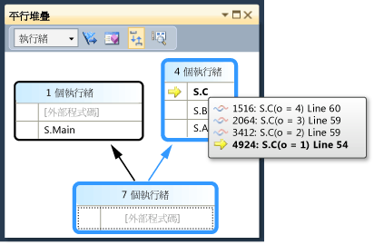  
  
     您可以在 \[**呼叫堆疊**\] 視窗中按一下滑鼠右鍵，以設定堆疊框架要顯示多少詳細資料 \(\[**模組名稱**\]、\[**參數型別**\]、\[**參數名稱**\]、\[**參數值**\]、\[**行號**\] 和 \[**位元組位移**\]\)。  
  
     方塊周圍的藍色醒目提示表示目前執行緒是該方塊的一部分。  工具提示中也以粗體堆疊框架來表示目前執行緒。  如果您在 \[執行緒\] 視窗中按兩下主執行緒，您可以觀察到 \[**平行堆疊**\] 視窗中的藍色醒目提示會隨之移動。  
  
       
  
#### 繼續執行至第二個中斷點為止  
  
1.  若要繼續執行至叫用第二個中斷點為止，請按一下 \[**偵錯**\] 功能表的 \[**繼續**\]。  下圖顯示第二個中斷點上的執行緒樹狀結構。  
  
     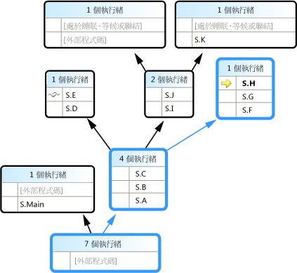  
  
     在第一個中斷點上，四個執行緒都是從 S.A 跳至 S.B，再跳至 S.C 方法。  這項資訊在 \[**平行堆疊**\] 視窗中仍然可見，但四個執行緒已更往前執行。  其中一個繼續執行至 S.D，再執行至 S.E。  另一個繼續執行至 S.F、S.G 和 S.H。  其他兩個繼續執行至 S.I 和 S.J，而在這裡，其中一個跳至 S.K，另一個繼續執行至非使用者外部程式碼。  
  
     您可以將滑鼠游標停留於方塊標題上，例如 \[**1 個執行緒**\] 或 \[**2 個執行緒**\]，以查看執行緒的執行緒 ID。  您可以將滑鼠游標停留於堆疊框架上，以查看執行緒 ID 和其他框架詳細資料。  藍色醒目提示表示目前執行緒，黃色箭號表示目前執行緒的作用中堆疊框架。  
  
     布條圖示 \(與藍色和紅色波浪狀線條重疊\) 表示非目前執行緒的作用中堆疊框架。  在 \[**呼叫堆疊**\] 視窗中，按兩下 S.B 來切換框架。  \[**平行堆疊**\] 視窗使用綠色弧形箭號圖示來表示目前執行緒的目前堆疊框架。  
  
     在 \[**執行緒**\] 視窗中，切換執行緒並觀察 \[**平行堆疊**\] 視窗中的檢視已更新。  
  
     您可以使用 \[**平行堆疊**\] 視窗中的捷徑功能表，切換至另一個執行緒，或切換至另一個執行緒的另一個框架。  例如，以滑鼠右鍵按一下 S.J，指向 \[**切換至框架**\]，然後按一下命令。  
  
     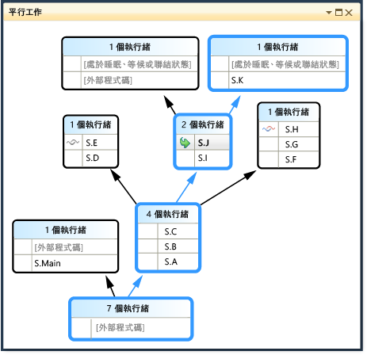  
  
     以滑鼠右鍵按一下 S.C，並指向 \[**切換至框架**\]。  其中一個命令有核取記號，表示目前執行緒的堆疊框架。  您可以切換至相同執行緒的該框架 \(只有綠色箭號會移動\)，也可以切換至另一個執行緒 \(藍色醒目提示也會移動\)。  下圖顯示子功能表。  
  
     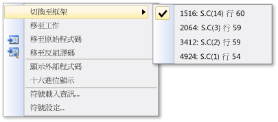  
  
     當方法內容只有與一個堆疊框架關聯時，方塊標題會顯示 \[**1 個執行緒**\]，您只要按兩下就可以切換至該框架。  如果您按兩下的方法內容有 1 個以上關聯的框架，則會自動出現功能表。  隨著您將滑鼠游標停留於方法內容上，請注意右邊的黑色三角形。  按一下該三角形也會顯示捷徑功能表。  
  
     對於具有許多執行緒的大型應用程式，您可能會想要只專注於其中一部分執行緒。  \[**平行堆疊**\] 視窗可以只顯示加上旗標之執行緒的呼叫堆疊。  在工具列上，按一下清單方塊旁邊的 \[**僅顯示有旗標的項目**\] 按鈕。  
  
       
  
     接下來，在 \[**執行緒**\] 視窗中，對每一個執行緒逐一加上旗標，以查看 \[**平行堆疊**\] 視窗中如何顯示它們的呼叫堆疊。  若要將執行緒加上旗標，請使用捷徑功能表或執行緒的第一個儲存格。  再按一次 \[**僅顯示有旗標的項目**\] 工具列按鈕，以顯示所有執行緒。  
  
#### 繼續執行至第三個中斷點為止  
  
1.  若要在遇到第三個中斷點之前繼續執行，請在 \[**偵錯**\] 功能表上，按一下 \[**繼續**\]。  
  
     當多個執行緒在相同方法中但方法不在呼叫堆疊的開頭時，方法會出現在不同方塊中。  位於目前中斷點的例子有 S.L，其中有三個執行緒，且分別出現在三個方塊中。  按兩下 S.L。  
  
     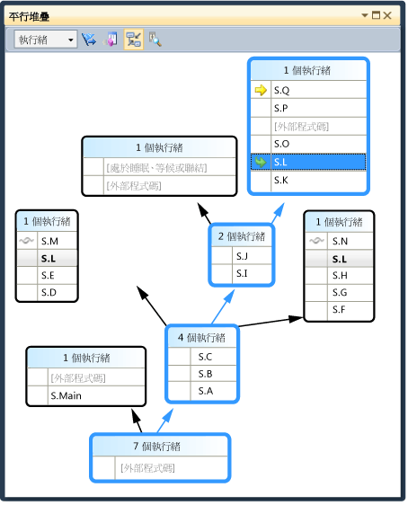  
  
     請注意，S.L 在其他兩個方塊中是粗體，所以您可以看到它出現在其他地方。  如果您要查看有哪些框架呼叫 S.L 和它呼叫哪些框架，請按一下工具列的 \[**切換方法檢視**\] 按鈕。  下圖顯示 \[**平行堆疊**\] 視窗的方法檢視。  
  
     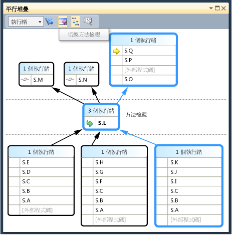  
  
     請注意圖表如何隨選取的方法而轉移，以及它在檢視中間如何放在自己的方塊中。  被呼叫端和呼叫端出現在上方和下方。  再按一次 \[**切換方法檢視**\] 按鈕以結束這個模式。  
  
     \[**平行堆疊**\] 視窗的捷徑功能表還有下列其他項目。  
  
    -   \[**十六進位顯示**\] 在十進位和十六進位之間切換工具提示中的數字。  
  
    -   \[**符號載入資訊**\] 和 \[**符號設定**\] 會開啟各自的對話方塊。  
  
    -   \[**移至原始程式碼**\] 和 \[**移至反組譯碼**\] 會在編輯器中巡覽至選取的方法。  
  
    -   \[**顯示外部程式碼**\] 會顯示所有框架，即使不在使用者程式碼中也一樣。  請試著使用它來查看圖表如何展開來容納其他框架 \(這些框架可能會因為您沒有它們的符號而呈現暗灰色\)。  
  
     當您具有大型圖表並逐步執行至下一個中斷點時，您可能會想要讓檢視自動捲動至目前執行緒的作用中堆疊框架，也就是最先叫用中斷點的執行緒。  在 \[**平行堆疊**\] 視窗中，確定工具列上的 \[**自動捲動到目前堆疊框架**\] 按鈕已啟用。  
  
     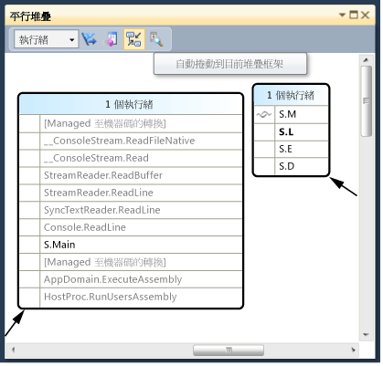  
  
2.  繼續之前，在 \[**平行堆疊**\] 視窗中一直捲動到最左邊和最下方。  
  
#### 繼續執行至第四個中斷點為止  
  
1.  若要繼續執行至叫用第四個中斷點為止，請按一下 \[**偵錯**\] 功能表的 \[**繼續**\]。  
  
     請注意檢視如何自動捲動至定位。  在 \[**執行緒**\] 視窗中切換執行緒，或在 \[**呼叫堆疊**\] 視窗中切換堆疊框架，並注意檢視如何總是自動捲動至正確的框架。  關閉 \[**自動捲動到目前工具框架**\] 選項並檢視差異。  
  
     \[**概觀**\] 也有助於在 \[**平行堆疊**\] 視窗中顯示大型圖表。  您可以在視窗右下角按一下捲軸之間的按鈕，以查看 \[**概觀**\]，如下圖所示。  
  
     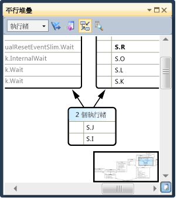  
  
     您可以移動矩形以快速將圖表到處移動。  
  
     另一種往任何方向移動圖表的方式是按一下圖表的空白區域，並拖曳至您要的位置。  
  
     若要放大和縮小圖表，請在移動滑鼠滾輪時按住 CTRL。  或者，按一下工具列的 \[縮放\] 按鈕，然後使用 \[縮放\] 工具。  
  
     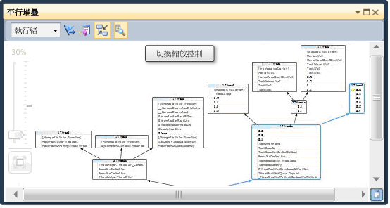  
  
     您也可以按一下 \[**工具**\] 功能表，再按一下 \[**選項**\]，然後選取或清除 \[**偵錯**\] 節點下的選項，以使用由上而下的方向來檢視堆疊，而非由下而上。  
  
2.  繼續之前，按一下 \[**偵錯**\] 功能表上的 \[**停止偵錯**\] 以結束執行。  
  
## 使用平行工作視窗和平行堆疊視窗的工作檢視  
 繼續之前，我們建議您完成先前的程序。  
  
#### 重新啟動應用程式直到叫用第一個中斷點為止  
  
1.  按一下 \[**偵錯**\] 功能表上的 \[**開始偵錯**\]，並等待叫用第一個中斷點。  
  
2.  在 \[**偵錯**\] 功能表上，指向 \[**視窗**\]，然後按一下 \[**執行緒**\]。  將 \[**執行緒**\] 視窗停駐在 Visual Studio 底部。  
  
3.  在 \[**偵錯**\] 功能表中，指向 \[**視窗**\]，然後按一下 \[**呼叫堆疊**\]。  將 \[**呼叫堆疊**\] 視窗停駐在 Visual Studio 底部。  
  
4.  按兩下 \[**執行緒**\] 視窗中的執行緒，使它成為目前執行緒。  目前執行緒具有黃色箭號。  當您變更目前執行緒時，其他視窗會隨之更新。  我們接下來檢查工作。  
  
5.  在 \[**偵錯**\] 功能表上，指向 \[**視窗**\]，然後按一下 \[**平行工作**\]。  下圖顯示 \[**平行工作**\] 視窗。  
  
       
  
     對於每一個執行中的工作，您可以讀取其 ID \(由名稱相同的屬性傳回\)、執行這個工作之執行緒的 ID 和名稱，以及它的位置 \(將滑鼠游標停留於工作上會顯示包含整個呼叫堆疊的工具提示\)。  另外，在 \[**工作**\] 資料行下，您可以查看傳入工作中的方法，也就是起點。  
  
     您可以排序任何資料行。  請注意表示排序資料行和方向的排序圖像。  您也可以將資料行向左或向右拖曳，以重新排列資料行。  
  
     黃色箭號表示目前工作。  您可以按兩下工作或使用捷徑功能表來切換工作。  當您切換工作時，基礎執行緒會變成目前執行緒，而其他視窗也會隨之更新。  
  
     當您手動在兩個工作之間切換時，黃色箭號會移動，但白色箭號仍然會顯示造成偵錯工具中斷的工作。  
  
#### 繼續執行至第二個中斷點為止  
  
1.  若要繼續執行至叫用第二個中斷點為止，請按一下 \[**偵錯**\] 功能表的 \[**繼續**\]。  
  
     先前 \[**狀態**\] 資料行將所有工作顯示為 \[執行中\]，但現在有兩項工作是 \[等待中\]。  工作可能會因為許多不同的原因而受阻。  在 \[**狀態**\] 資料行中，將滑鼠游標停留於等待中工作上，以了解受阻的原因。  例如，在下圖中，工作 3 正在等待工作 4。  
  
       
  
     工作 4 又在等待指派給工作 2 的執行緒所擁有的監視器。  
  
     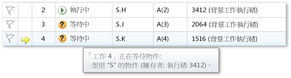  
  
     您可以按一下 \[**平行工作**\] 視窗的第一個資料行中的旗標，將工作加上旗標。  
  
     您可以使用旗標，在相同偵錯工作階段中的不同中斷點之間追蹤工作，或篩選在 \[**平行堆疊**\] 視窗中出現呼叫堆疊的工作。  
  
     您先前在使用 \[**平行堆疊**\] 視窗時，已檢視應用程式執行緒。  再次檢視 \[**平行堆疊**\] 視窗，但這次檢視應用程式工作。  作法是在左上方的方塊中選取 \[**工作**\]。  下圖顯示 \[工作檢視\]。  
  
       
  
     目前未執行工作的執行緒不會出現在 \[**平行堆疊**\] 視窗的 \[工作檢視\] 中。  另外，對於在執行工作的執行緒，某些與工作無關的堆疊框架則會從堆疊的上方和下方被過濾掉。  
  
     再次檢視 \[**平行工作**\] 視窗。  以滑鼠右鍵按一下任何資料行標頭，以查看資料行的捷徑功能表。  
  
     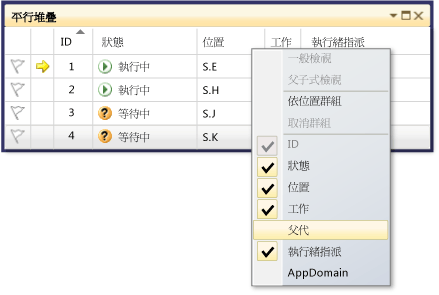  
  
     您可以使用捷徑功能表來加入或移除資料行。  例如，AppDomain 資料行未選取，所以不會出現在清單中。  按一下 \[**父代**\]。  這四項工作在 \[**父代**\] 資料行中都沒有顯示值。  
  
#### 繼續執行至第三個中斷點為止  
  
1.  若要在遇到第三個中斷點之前繼續執行，請在 \[**偵錯**\] 功能表上，按一下 \[**繼續**\]。  
  
     新工作 \(工作 5\) 現在正在執行，而工作 4 現在正在等待。  您可以在 \[**狀態**\] 視窗中將滑鼠游標停留於等待中工作上，以查看原因。  在 \[**父代**\] 資料行中，請注意工作 4 是工作 5 的父代。  
  
     若要更明確顯示父子式關聯性，請以滑鼠右鍵按一下 \[**父代**\] 資料行標頭，然後按一下 \[**父子式檢視**\]。  您應該會看到下圖。  
  
     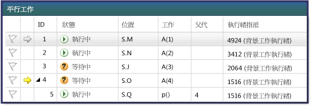  
  
     請注意工作 4 和工作 5 在相同執行緒上執行。  這項資訊不會出現在 \[**執行緒**\] 視窗中，在這裡看到這項資訊是 \[**平行工作**\] 視窗的另一項優點。  若要確認這一點，請檢視 \[**平行堆疊**\] 視窗。  確定您檢視的是 \[**工作**\]。  在 \[**平行工作**\] 視窗中按兩下工作 4 和工作 5，找出它們。  這樣做時，\[**平行堆疊**\] 視窗中的藍色醒目提示會隨之更新。  您也可以瀏覽 \[**平行堆疊**\] 視窗上的工具提示來尋找工作 4 和 5。  
  
     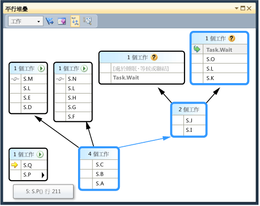  
  
     在 \[**平行堆疊**\] 視窗中，以滑鼠右鍵按一下 S.P，然後按一下 \[**移至執行緒**\]。  視窗會切換至 \[執行緒檢視\]，且檢視中會有對應的框架。  您可以在相同執行緒上同時查看這兩項工作。  
  
       
  
     相較於 \[**執行緒**\] 視窗，這是 \[**平行堆疊**\] 視窗的 \[工作檢視\] 的另一項優點。  
  
#### 繼續執行至第四個中斷點為止  
  
1.  若要在遇到第三個中斷點之前繼續執行，請在 \[**偵錯**\] 功能表上，按一下 \[**繼續**\]。  按一下 \[**ID**\] 資料行標頭，依 ID 排序。  您應該會看到下圖。  
  
     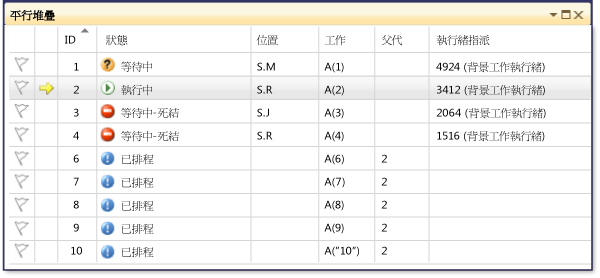  
  
     因為工作 5 已完成，所以不會再出現。  如果您的電腦上不是這樣，也沒有顯示死結，請按 F11 逐步執行一次。  
  
     工作 3 和工作 4 現在正在互相等待，已形成死結。  工作 2 還有 5 個新的子工作已經進入排程準備執行。  排程工作是指已在程式碼中啟動但尚未執行的工作。  因此，其 \[**位置**\] 和 \[**執行緒指派**\] 資料行都是空的。  
  
     再次檢視 \[**平行堆疊**\] 視窗。  每一個方塊的標題都有工具提示會顯示執行緒 ID 和名稱。  切換至 \[**平行堆疊**\] 視窗中的 \[工作檢視\]。  將滑鼠游標停留於標題上，以查看工作 ID 和名稱，以及工作的狀態，如下圖所示。  
  
     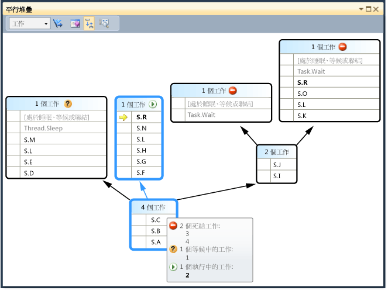  
  
     您可以依資料行將工作分組。  在 \[**平行工作**\] 視窗中，以滑鼠右鍵按一下 \[**狀態**\] 資料行標頭，然後按一下 \[**依狀態群組**\]。  下圖顯示依狀態分組的 \[**平行工作**\] 視窗。  
  
       
  
     您也可以依其他任何資料行進行分組。  將工作分組可讓您專注於一部分工作。  每一個可摺疊的群組都有一些組成該群組的項目。  您也可以按一下 \[**摺疊**\] 按鈕右邊的 \[**加上旗標**\] 按鈕，快速將群組中的所有項目加上旗標。  
  
     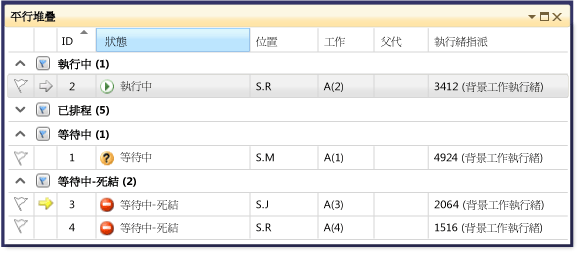  
  
     \[**平行工作**\] 視窗中最後一項要說明的功能，就是您以滑鼠右鍵按一下工作時所顯示的捷徑功能表。  
  
     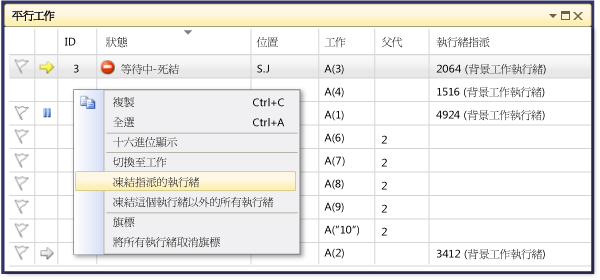  
  
     視工作的狀態而定，捷徑功能表會顯示不同的命令。  命令可能包括 \[**複製**\]、\[**全選**\]、\[**十六進位顯示**\]、\[**切換至工作**\]、\[**凍結指派的執行緒**\]、\[**凍結這個執行緒以外的所有執行緒**\]、\[**解除凍結指派的執行緒**\] 和 \[**加上旗標**\]。  
  
     您可以凍結一項或多項工作的基礎執行緒，也可以凍結指派的執行緒除外的所有執行緒。  凍結的執行緒在 \[**平行工作**\] 視窗中以藍色「*暫停*」\(Pause\) 圖示表示，就像在 \[**執行緒**\] 視窗中一樣。  
  
## 摘要  
 本逐步解說示範 \[**平行工作**\] 和 \[**平行堆疊**\] 偵錯工具視窗。  請在使用多執行緒程式碼的實際專案上使用這些視窗。  您可以檢查以 C\+\+、C\# 或 Visual Basic 撰寫的平行程式碼。  
  
## 請參閱  
 [Debugging Multithreaded Applications](../debugger/walkthrough-debugging-a-parallel-application.md)   
 [偵錯工具基礎](../debugger/debugger-basics.md)   
 [偵錯 Managed 程式碼](../debugger/debugging-managed-code.md)   
 [Parallel Programming](../Topic/Parallel%20Programming%20in%20the%20.NET%20Framework.md)   
 [並行執行階段](/visual-cpp/parallel/concrt/concurrency-runtime)   
 [使用平行堆疊視窗](../debugger/using-the-parallel-stacks-window.md)   
 [使用工作視窗](../debugger/using-the-tasks-window.md)