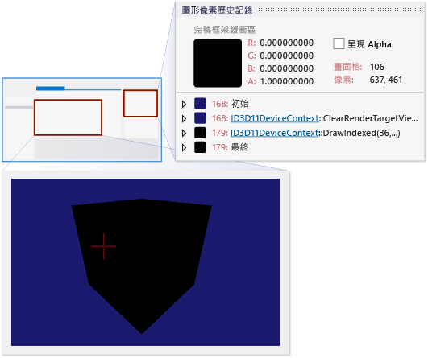

# 逐步解說：偵錯因著色而產生的顯示錯誤
[!INCLUDE[vs2017banner](../code-quality/includes/vs2017banner.md)]

本逐步解說示範如何使用 [!INCLUDE[vsprvs](../code-quality/includes/vsprvs_md.md)] 圖形診斷來調查因為著色器錯誤而著色不正確的物件。  
  
 本逐步解說示範如何：  
  
-   檢查圖形記錄文件來識別顯示問題的像素。  
  
-   使用 \[圖形像素歷史記錄\] 視窗更仔細地檢查像素狀態。  
  
-   使用 \[HLSL 偵錯工具\] 來檢查像素和端點著色器。  
  
## 情節  
 物件著色不正確通常是因為端點著色器將不正確或不完整的資訊傳遞給像素著色器。  
  
 在此情節中，您最近才將物件連同新的端點和像素著色器一併加入應用程式，以轉換該物件並賦予獨特外觀。 但在測試期間執行應用程式時，該物件卻呈現為純黑色。 透過使用圖形診斷，您可擷取圖形記錄問題，以偵錯應用程式。 在應用程式中，問題看起來如下：  
  
   
  
## 調查  
 透過使用圖形診斷工具，您可以載入圖形記錄文件，以檢查測試期間所擷取的畫面格。  
  
#### 檢查圖形記錄中的畫面格  
  
1.  在 [!INCLUDE[vsprvs](../code-quality/includes/vsprvs_md.md)] 中載入圖形記錄，其中包含表現出遺漏模型的畫面格。[!INCLUDE[vsprvs](../code-quality/includes/vsprvs_md.md)] 中隨即顯示新的圖形記錄文件視窗。 此視窗的上半部是所選取畫面格的轉譯目標輸出。 下半部是 \[畫面格清單\]，其以縮圖顯示每個擷取的畫面格。  
  
2.  在 \[畫面格清單\] 中，選取物件在其中沒有正確外觀的畫面格。 轉譯目標會更新以反映選取的畫面格。 在此情節中，圖形記錄文件視窗如下所示：  
  
       
  
 選取示範問題的畫面格之後，即可使用 \[圖形像素歷史記錄\] 視窗進行診斷。 \[圖形像素歷史記錄\] 視窗會依時間先後順序顯示可能影響特定像素及其著色器的基本圖形，以及這些基本圖形對轉譯目標的影響。  
  
#### 檢查像素  
  
1.  開啟 \[圖形像素歷史記錄\] 視窗。 在 \[圖形診斷\] 工具列上，選擇 \[像素歷史記錄\]。  
  
2.  選取要檢查的像素。 在圖形記錄文件視窗中，從著色不正確的物件選取其中一個像素：  
  
       
  
     \[圖形像素歷史記錄\] 視窗隨即更新，以反映選取的像素。 在此情節中，\[圖形像素歷史記錄\] 視窗如下所示：  
  
       
  
     請注意，像素著色器的結果是完全不透明的黑色 \(0, 0, 0, 1\)，而 \[輸出合併\] 已將此結果與像素的 \[上一個\] 色彩合併，使得 \[結果\] 也是完全不透明的黑色。  
  
 在您檢查著色不正確的像素，而發現像素著色器輸出不是所需的色彩之後，您可以使用 HLSL 偵錯工具來檢查像素著色器，並查明物件的色彩發生什麼狀況。 您可以使用 HLSL 偵錯工具在執行時檢查 HLSL 變數狀態、逐步執行 HLSL 程式碼，以及設定能協助您診斷問題的中斷點。  
  
#### 檢查像素著色器  
  
1.  開始偵錯像素著色器。 在 \[圖形像素歷史記錄\] 視窗中，於物件基本圖形下方的 \[像素著色器\] 旁，選擇 \[開始偵錯\] 按鈕。  
  
2.  在此情節中，由於像素著色器才從端點著色器傳遞色彩，因此很容易觀察到像素著色器不是問題的來源。  
  
3.  將指標放在 `input.color` 上。 請注意，其值是完全不透明的黑色 \(0, 0, 0, 1\)。  
  
       
  
     在此情節中，根據檢查結果所示，色彩不正確可能是因為端點著色器並未向像素著色器的作業提供正確的色彩資訊所致。  
  
 在您判斷端點著色器可能未提供正確資訊給像素著色器之後，下一個步驟就是檢查端點著色器。  
  
#### 檢查端點著色器  
  
1.  開始偵錯端點著色器。 在 \[圖形像素歷史記錄\] 視窗中，於物件基本圖形下方的 \[端點著色器\] 旁，選擇 \[開始偵錯\] 按鈕。  
  
2.  找出端點著色器的輸出結構，這是像素著色器的輸入。 在此情節中，此結構的名稱是 `output`。 檢查端點著色器程式碼並發現 `output` 結構的 `color` 成員已明確設定為完全不透明的黑色，這可能是因為某人的偵錯工作所造成。  
  
3.  確認絕不會從輸入結構複製 color 成員。 由於在傳回 `output` 結構之前，`output.color` 的值已設定為完全不透明的黑色，因此建議您確定 `output` 的值在上一行未正確初始化。 查看 `output.color` 的值時，逐步執行端點著色器程式碼，直到您到達將 `output.color` 設定為黑色的程式碼行。 請注意，`output.color` 的值在設定為黑色之前尚未初始化。 這會確認應修改將 `output.color` 設定為黑色的程式碼行，而不是予以刪除。  
  
       
  
 在您判斷轉譯問題的原因是端點著色器未提供正確色彩值給像素著色器之後，您可以使用這項資訊來修正問題。 在此情節中，若要修正問題，請變更端點著色器中的下列程式碼  
  
```  
output.color = float3(0.0f, 0.0f, 0.0f);  
```  
  
 設為  
  
```hlsl  
output.color = input.color;  
```  
  
 此程式碼才從物件的頂點傳遞未修改的端點色彩，更複雜的端點著色器可以在傳遞前修改色彩。 修正過的端點著色器程式碼應該會與以下相似：  
  
   
  
 修正程式碼之後，請重新建置並再次執行應用程式，以確認轉譯問題已解決。  
  
 