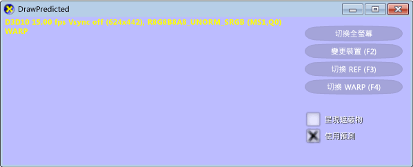
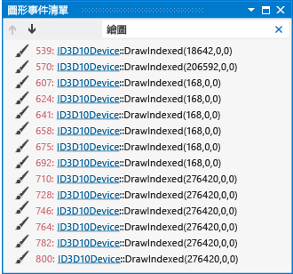
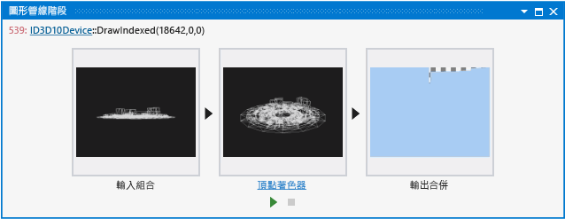
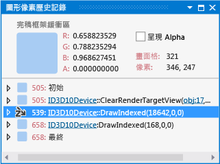
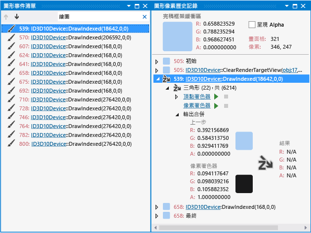
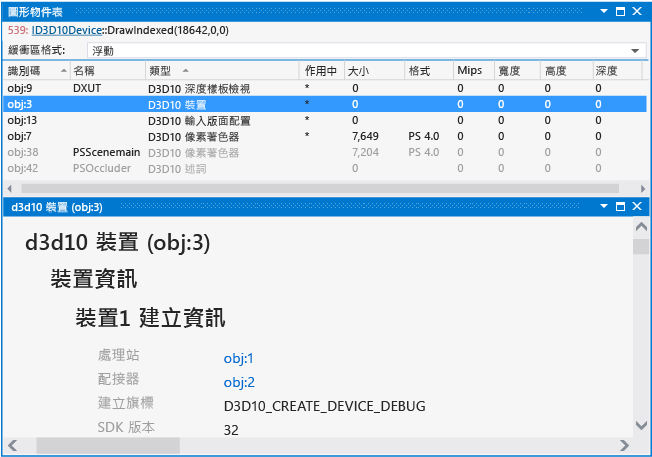
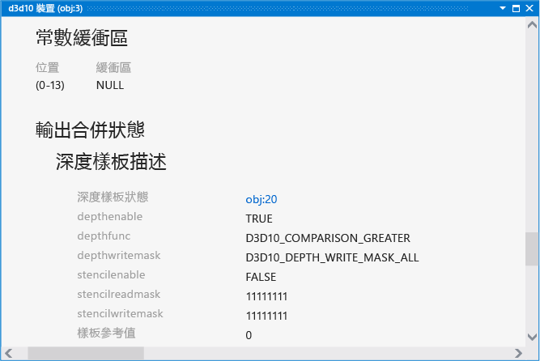

# 逐步解說：因裝置狀態而遺漏的物件
[!INCLUDE[vs2017banner](../code-quality/includes/vs2017banner.md)]

本逐步解說示範如何使用 [!INCLUDE[vsprvs](../code-quality/includes/vsprvs_md.md)] 圖形診斷來調查因為裝置狀態設定不正確而遺漏的物件。  
  
 本逐步解說示範如何：  
  
-   使用 \[圖形事件清單\] 找出潛在的問題來源。  
  
-   使用 \[圖形管線階段\] 視窗來檢查 `DrawIndexed` Direct3D API 呼叫的效果。  
  
-   使用 \[圖形像素歷史記錄\] 視窗更明確地找出問題。  
  
-   檢查裝置狀態以找出潛在問題或錯誤組態。  
  
## 情節  
 在 3D 應用程式中，物件可能不會如預期出現的其中一個原因是圖形裝置組態不正確，這造成物件在轉譯中遭到排除，例如，當捲繞順序導致三角形揀選錯誤時，或是當深度測試功能造成物件中的所有像素遭拒時。  
  
 在本逐步解說所述的情節中，您已到達 3D 應用程式開發的第一個里程碑，並準備開始進行第一次測試。 不過，當您執行應用程式時，只有使用者介面會轉譯至螢幕。 透過使用圖形診斷，您可以將問題擷取到圖形記錄檔，以便偵錯應用程式。 在應用程式中，問題看起來如下：  
  
   
  
 如需如何擷取圖形記錄檔中圖形問題的資訊，請參閱 [擷取圖形資訊](../debugger/capturing-graphics-information.md)。  
  
## 調查  
 透過使用圖形診斷工具，您可以載入圖形記錄檔，以檢查測試期間所擷取的畫面格。  
  
#### 檢查圖形記錄中的畫面格  
  
1.  在 [!INCLUDE[vsprvs](../code-quality/includes/vsprvs_md.md)] 中載入圖形記錄檔，其中包含表現出遺漏模型的畫面格。[!INCLUDE[vsprvs](../code-quality/includes/vsprvs_md.md)] 中會出現新的 \[圖形診斷\] 索引標籤。 此索引標籤的上半部是所選取畫面格的轉譯目標輸出。 下半部是 \[畫面格清單\]，其以縮圖顯示每個擷取的畫面格。  
  
2.  在 \[畫面格清單\] 中，選取示範未顯示模型的畫面格。 轉譯目標會更新以反映選取的畫面格。 在此情況下，圖形記錄索引標籤與下列類似：  
  
       
  
 選取示範問題的畫面格之後，即可使用 \[圖形事件清單\] 進行診斷。 \[圖形事件清單\] 包含每個用以轉譯使用中畫面格的 Direct3D API 呼叫，例如用以設定裝置狀態、建立和更新緩衝區，以及繪製出現在畫面格中之物件的 API 呼叫。 許多種類的呼叫很有趣，原因是通常 \(但並非一定\) 在應用程式正常運作時，轉譯目標中會有相對應的變更，例如 Draw、Dispatch、Copy 或 Clear 呼叫。 Draw 呼叫特別有趣，原因是每一個呼叫皆代表應用程式所轉譯的幾何 \(Dispatch 呼叫也可以轉譯幾何\)。  
  
#### 確定正在進行繪製呼叫  
  
1.  開啟 \[圖形事件清單\] 視窗。 在 \[圖形診斷\] 工具列上，選擇 \[事件清單\]。  
  
2.  檢查 \[圖形事件清單\] 視窗中的繪製呼叫。 若要進行簡化，請在 \[圖形事件清單\] 視窗右上角的 \[搜尋\] 方塊中輸入「Draw」。 這樣會篩選清單，使其只包含標題中具有 "Draw" 的事件。 在此情節中，您發現進行了幾次繪製呼叫：  
  
       
  
 在您確認正在進行繪製呼叫之後，您可以判斷哪一個呼叫對應至遺漏的幾何。 由於您知道遺漏的幾何沒有繪製到轉譯目標 \(在此例中\)，因此您可以使用 \[圖形管線階段\] 視窗來判斷哪個繪製呼叫對應至遺漏的幾何。 \[圖形管線階段\] 視窗顯示已傳送至每個繪製呼叫的幾何，不論其對轉譯目標的影響為何。 隨著您瀏覽繪製呼叫，管線階段會更新以顯示與該呼叫相關聯的幾何，且轉譯目標輸出也會在呼叫完成之後更新，以顯示轉譯目標的狀態。  
  
#### 尋找遺漏幾何的繪製呼叫  
  
1.  開啟 \[圖形管線階段\] 視窗。 在 \[圖形診斷\] 工具列上，選擇 \[管線階段\]。  
  
2.  在 \[圖形管線階段\] 視窗中查看遺漏的模型時，瀏覽每個繪製呼叫。**輸入組合語言**階段顯示未經處理的模型資料。**端點著色器**階段顯示轉換後的模型資料。**像素著色器**階段顯示像素著色器輸出。**輸出合併**階段顯示此繪製呼叫和所有先前的繪製呼叫的合併轉譯目標。  
  
3.  在到達對應至遺漏模型的繪製呼叫時停止。 在此情節中，\[圖形管線階段\] 視窗表示幾何已轉譯，但未在轉譯目標中出現：  
  
       
  
 在您確認應用程式轉譯了遺漏的幾何，而找到對應的繪製呼叫之後，您可以選取應顯示遺漏幾何之轉譯目標輸出的部分，然後使用 \[圖形像素歷史記錄\] 視窗查明排除像素的原因。 像素歷史記錄包含可能影響特定像素的每個繪製呼叫清單。 \[圖形像素歷史記錄\] 視窗中的每個繪製呼叫是以數字來識別，這個數字也會顯示在 \[圖形事件清單\] 視窗中。 這可以協助您確認像素應顯示遺漏的幾何，並查明排除像素的原因。  
  
#### 判斷排除像素的原因  
  
1.  開啟 \[圖形像素歷史記錄\] 視窗。 在 \[圖形診斷\] 工具列上，選擇 \[像素歷史記錄\]。  
  
2.  根據**像素著色器**縮圖，在應該含有遺漏幾何之一部分的 framebuffer 輸出中，選取一個像素。 在此情節中，像素著色器輸出涵蓋大部分轉譯目標；選取像素之後，\[圖形像素歷史記錄\] 視窗如下所示：  
  
       
  
3.  將您在 \[圖形事件清單\] 視窗中檢查的繪製呼叫數目，與在 \[圖形像素歷史記錄\] 視窗中檢查的繪製呼叫數目進行比對，以確認選取的轉譯目標像素包含幾何的一部分。 如果 \[圖形像素歷史記錄\] 視窗中沒有任何呼叫符合您所檢查的繪製呼叫，請重複這些步驟 \(除了步驟 1\) 直到您找到相符項目。 在此情節中，相符的繪製呼叫如下所示：  
  
       
  
4.  當您找到相符項目時，請展開 \[圖形像素歷程記錄\] 視窗中相符的繪製呼叫，並確認已排除像素。 \[圖形像素歷史記錄\] 視窗中的每個繪製呼叫會對應至因為對應物件之幾何而與該像素交集的一個或多個幾何基本圖形 \(點、線或三角形\)。 每個這類交集都可能形成像素的完稿色彩。 因為未通過深度測試而排除的基本圖形，會以在由左至右向下傾斜之箭頭上顯示 Z 字母的圖示來表示。  
  
5.  展開排除的基本圖形以進一步檢查導致它被排除的狀態。 在 \[輸出合併\] 群組中，將指標移至 \[結果\] 上方。 工具提示會指出排除基本圖形的原因。 在此情節中，檢查顯示基本圖形由於未通過深度測試而遭到排除，因此不會形成像素的完稿色彩。  
  
 在您判斷幾何沒有出現的原因是其基本圖形未通過深度測試之後，您可能會懷疑這個問題與裝置狀態設定不正確有關。 您可以使用 \[圖形物件表\]，檢查裝置狀態和其他 Direct3D 物件資料。  
  
#### 檢查裝置狀態  
  
1.  開啟 \[圖形物件表\] 視窗。 在 \[圖形診斷\] 工具列上，選擇 \[物件表\]。  
  
2.  在 \[圖形物件表\] 中找出 \[D3D10 裝置\] 物件，然後開啟 \[D3D10 裝置\] 物件。 新的 \[d3d10 裝置\] 索引標籤隨即在 [!INCLUDE[vsprvs](../code-quality/includes/vsprvs_md.md)] 中開啟。 若要讓這項工作更容易進行，您可以依 \[類型\] 排序 \[圖形物件表\]：  
  
       
  
3.  檢查 \[d3d10 裝置\] 索引標籤中顯示的裝置狀態，找出潛在的問題。 由於幾何沒有出現的原因是其基本圖形未通過深度測試，因此您可以專注於影響深度測試的裝置狀態，例如深度樣板。 在此情節中，\[深度樣板描述\] \(在 \[輸出合併狀態\] 下\) 包含**深度函式**成員 `D3D10_COMPARISON_GREATER` 不常見的值：  
  
       
  
 在您判斷轉譯問題的原因可能是深度函式設定不正確之後，您可以使用這項資訊以及您對程式碼的了解，找出深度函式設定不正確的位置，然後再修正問題。 如果您不熟悉程式碼，您可以使用偵錯時收集到的線索來搜尋這個問題；例如，您可以根據此情節中的 \[深度樣板描述\]，在程式碼中搜尋如 "depth" 或 "GREATER" 的文字。 修正程式碼之後，請加以重新建置並再次執行應用程式，以確認轉譯問題已解決：  
  
 