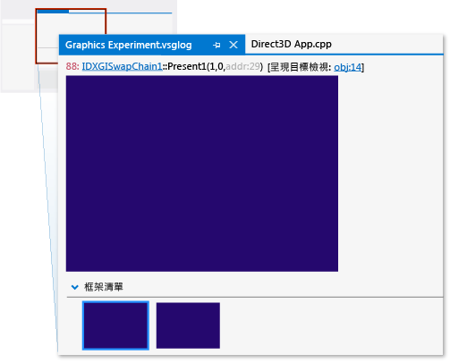
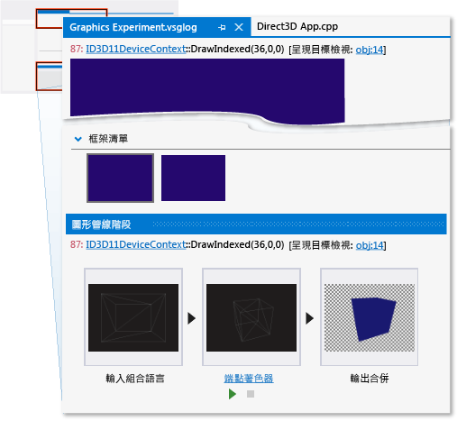
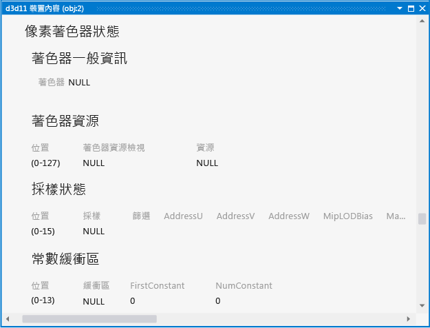
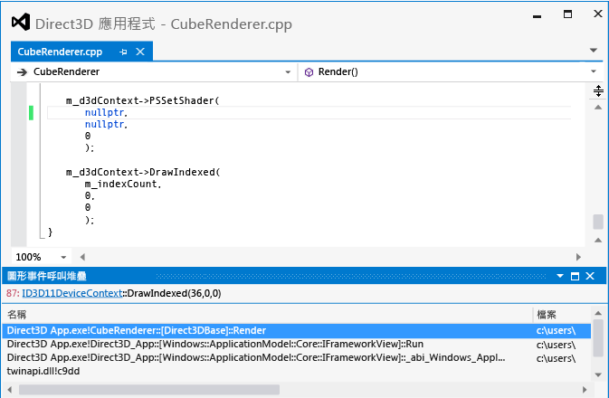

# 逐步解說：因管線設定錯誤而遺漏的物件
[!INCLUDE[vs2017banner](../code-quality/includes/vs2017banner.md)]

此逐步解說示範如何使用 [!INCLUDE[vsprvs](../code-quality/includes/vsprvs_md.md)] 圖形診斷工具來調查因為沒有設定像素著色器而遺失的物件。  
  
 本逐步解說將說明下列工作：  
  
-   使用 \[圖形事件清單\] 找出潛在的問題來源。  
  
-   使用 \[圖形管線階段\] 視窗來檢查 `DrawIndexed` Direct3D API 呼叫的效果。  
  
-   檢查裝置內容，以確認未設定著色器階段。  
  
-   使用 \[圖形管線階段\] 視窗搭配 \[圖形事件呼叫堆疊\]，以協助找出未設定像素著色器的來源。  
  
## 情節  
 有時是因為在轉譯物件前未設定其中一個著色器階段，而造成 3D 應用程式遺漏物件。 在具有簡單轉譯需求的應用程式中，此錯誤來源通常位於物件繪製呼叫的呼叫堆疊中某處。 但為了達到最佳化，某些應用程式會將具有相同著色器程式、材質或其他資料的物件批次處理，以將狀態變更的額外負荷最小化。 在這些應用程式中，錯誤的來源可能埋沒在批次處理系統中，而非位於呼叫堆疊的繪製呼叫中。 此逐步解說中的情節示範具有簡單轉譯需求的應用程式，因此可在呼叫堆疊中找到錯誤的來源。  
  
 在此情節中，當執行應用程式來加以測試時，背景如預期般轉譯，但其中一個物件未出現。 透過使用圖形診斷，您可擷取圖形記錄問題，以偵錯應用程式。 在應用程式中，問題看起來如下：  
  
   
  
## 調查  
 透過使用圖形診斷工具，您可以載入圖形記錄文件，以檢查測試期間所擷取的畫面格。  
  
#### 檢查圖形記錄中的畫面格  
  
1.  在 [!INCLUDE[vsprvs](../code-quality/includes/vsprvs_md.md)] 中載入圖形記錄文件，其中包含表現出遺漏物件的畫面格。[!INCLUDE[vsprvs](../code-quality/includes/vsprvs_md.md)] 中隨即顯示新的圖形記錄檔索引標籤。 此索引標籤的上半部是所選取畫面格的轉譯目標輸出。 下半部是 \[畫面格清單\]，其以縮圖顯示每個擷取的畫面格。  
  
2.  在 \[畫面格清單\] 中，選取示範未顯示物件的畫面格。 轉譯目標會更新以反映選取的畫面格。 在此情況下，圖形記錄索引標籤與下列類似：  
  
       
  
 選取示範問題的畫面格之後，即可使用 \[圖形事件清單\] 進行診斷。 \[圖形事件清單\] 包含每個用以轉譯使用中畫面格的 Direct3D API 呼叫，例如設定裝置狀態，建立和更新緩衝區，以及繪製出現在畫面格中的物件。 許多種類的呼叫很有趣，例如 Draw、Dispatch、Copy 或 Clear 呼叫，原因是通常 \(但並非一定\) 在應用程式正常運作時，轉譯目標中會有相對應的變更。 Draw 呼叫特別有趣，原因是每一個呼叫皆代表應用程式所轉譯的幾何。  
  
 因為您知道轉譯目標不包含遺漏物件，也沒有其他錯誤，因此您可以使用 \[圖形事件清單\] 搭配 \[圖形管線階段\] 工具來判斷哪個繪製呼叫對應至遺漏物件的幾何。 \[圖形管線階段\] 視窗顯示已傳送至每個繪製呼叫的幾何，不論其對轉譯目標的影響為何。 隨著您瀏覽繪製呼叫，管線階段會在其流經每個啟用的階段時更新，以顯示與每個呼叫相關聯的幾何，且轉譯目標輸出也會在呼叫完成之後更新，以顯示轉譯目標的狀態。  
  
#### 尋找遺漏幾何的繪製呼叫  
  
1.  開啟 \[圖形事件清單\] 視窗。 在 \[圖形診斷\] 工具列上，選擇 \[事件清單\]。  
  
2.  開啟 \[圖形管線階段\] 視窗。 在 \[圖形診斷\] 工具列上，選擇 \[管線階段\]。  
  
3.  當您瀏覽 \[圖形事件清單\] 視窗中的每個繪製呼叫時，請在 \[圖形管線階段\] 視窗中注意遺漏的物件。 若要進行簡化，請在 \[圖形事件清單\] 視窗右上角的 \[搜尋\] 方塊中輸入「Draw」。 這樣會篩選清單，使其只包含標題中具有 "Draw" 的事件。  
  
     在 \[圖形管線階段\] 視窗中，**輸入組合語言**階段會在物件轉換前顯示其幾何，**端點著色器**階段則會顯示轉換後的相同物件。 在此情節中，請注意 \[圖形管線階段\] 視窗會顯示**輸入組合語言**和**端點著色器**階段，而非其中一個繪製呼叫的**像素著色器**階段。  
  
    > [!NOTE]
    >  若有其他管線階段 \(例如輪廓著色器、網域著色器或幾何著色器階段\) 在處理物件，則其都可能是問題的原因。 一般而言，問題與初期階段相關，在該階段中不會顯示結果，或者會以非預期的方式顯示結果。  
  
4.  在到達對應至遺漏物件的繪製呼叫時停止。 在此情節中，\[圖形管線階段\] 視窗表示幾何已發給 GPU \(由**輸入組合語言**階段的存在表現\) 且已轉換 \(由**頂點著色器**階段表示\)，但似乎沒有作用中的像素著色器，因此不會出現在轉譯目標中 \(因為不存在**像素著色器**階段\)。 在此情節中，您甚至可在**輸出合併**階段中看到遺漏物件的黑色輪廓：  
  
       
  
 確認應用程式為遺漏物件的幾何發出繪製呼叫，且發現像素著色器階段不在作用中時，您可以檢查裝置狀態以確認您所發現的事項。 您可以使用**圖形物件表**來檢查裝置內容和其他的 Direct3D 物件資料。  
  
#### 檢查裝置內容  
  
1.  開啟 \[d3d11 裝置內容\]。 在 \[圖形管線階段\] 視窗中，選擇 **ID3D11DeviceContext** 連結，此連結為視窗頂端所顯示 `DrawIndexed` 呼叫的一部分。  
  
2.  檢查顯示在 \[d3d11 裝置內容\] 索引標籤中的裝置狀態，以確認在繪製呼叫期間，沒有使用中的像素著色器。 在此情節中，在**像素著色器狀態**下顯示的**著色器一般資訊**表示著色器為 **NULL**：  
  
       
  
 確認應用程式已將像素著色器設定為 null 之後，下一步是找出在您的應用程式原始程式碼中設定著色器的位置。 您可使用**圖形事件清單**搭配**圖形事件呼叫堆疊**尋找此位置。  
  
#### 尋找應用程式原始程式碼中設定像素著色器的位置  
  
1.  尋找對應至遺漏物件的 `PSSetShader` 呼叫。 於 \[圖形事件清單\] 視窗中，在此 \[圖形事件清單\] 視窗右上角的 \[搜尋\] 方塊輸入「Draw;PSSetShade」。 這樣會篩選清單，使其只包含「PSSetShader」事件及標題中具有「Draw」的事件。 選擇出現在遺漏物件之繪製呼叫前的第一個 `PSSetShader` 呼叫。  
  
    > [!NOTE]
    >  若未在此畫面格期間設定，則 `PSSetShader` 不會出現在 \[圖形事件清單\] 視窗中。 通常只有在單一像素著色器為所有的物件使用，或在此畫面格期間無意地略過 `PSSetShader` 呼叫時，才會發生此狀況。 在任何一種情況下，建議您搜尋 `PSSetShader` 呼叫的應用程式原始程式碼，並使用傳統偵錯技術來檢查這些呼叫的行為。  
  
2.  開啟 \[圖形事件呼叫堆疊\] 視窗。 在 \[圖形診斷\] 工具列上，選擇 \[圖形事件清單堆疊\]。  
  
3.  使用呼叫堆疊來尋找您應用程式原始程式碼中的 `PSSetShader` 呼叫。 在 \[圖形事件呼叫堆疊\] 視窗中，選擇最上方的呼叫，並檢查像素著色器所設定至的值。 像素著色器可能會直接設定為 null，或因為引數傳遞至函式或其他狀態而產生 null 值。 若非直接設定，您可能會在呼叫堆疊上的某處找到 null 值的來源。 在此情節中，您會發現像素著色器會直接設定為最上層函式中的 `nullptr`，其名稱為 `CubeRenderer::Render`：  
  
       
  
    > [!NOTE]
    >  若您無法只透過檢查呼叫堆疊來找到 null 值的來源，建議您在 `PSSetShader` 呼叫上設定條件中斷點，如此當像素著色器將設定為 null 時，會中斷程式執行。 然後在偵錯模式中重新啟動應用程式，並使用傳統的偵錯技術來尋找 null 值的來源。  
  
 若要修正此問題，請使用 `ID3D11DeviceContext::PSSetShader` API 呼叫的第一個參數，以指派正確的像素著色器 。  
  
   
  
 修正程式碼之後，您可以加以重新建置並再次執行應用程式，以確認轉譯問題已解決：  
  
   
  
## 後續步驟