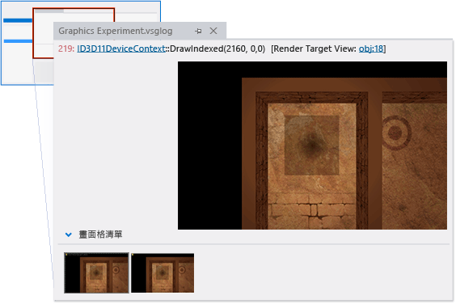

# 逐步解說：因端點著色而遺漏的物件
[!INCLUDE[vs2017banner](../code-quality/includes/vs2017banner.md)]

本逐步解說示範如何使用 [!INCLUDE[vsprvs](../code-quality/includes/vsprvs_md.md)] 圖形診斷工具來調查因為端點著色器階段發生的錯誤而遺漏的物件。  
  
 本逐步解說將說明下列工作：  
  
-   使用 \[圖形事件清單\] 找出潛在的問題來源。  
  
-   使用 \[圖形管線階段\] 視窗來檢查 `DrawIndexed` Direct3D API 呼叫的效果。  
  
-   使用 \[HLSL 偵錯工具\] 來檢查端點著色器。  
  
-   使用 \[圖形事件呼叫堆疊\] 協助找出無效 HLSL 常數的來源。  
  
## 情節  
 3D 應用程式遺漏物件最常見的其中一個原因，發生於端點著色器以不正確或非預期方式轉換物件的頂點時；例如，物件可能縮到非常小，或是經轉換後出現在觀景窗後面而非前面。  
  
 在此情節中，當執行應用程式來加以測試時，背景如預期般轉譯，但其中一個物件未出現。 透過使用圖形診斷，您可擷取圖形記錄問題，以偵錯應用程式。 在應用程式中，問題看起來如下：  
  
   
  
## 調查  
 透過使用圖形診斷工具，您可以載入圖形記錄，以檢查測試期間所擷取的畫面格。  
  
#### 檢查圖形記錄中的畫面格  
  
1.  在 [!INCLUDE[vsprvs](../code-quality/includes/vsprvs_md.md)] 中載入圖形記錄，其中包含表現出遺漏物件的畫面格。[!INCLUDE[vsprvs](../code-quality/includes/vsprvs_md.md)] 中隨即顯示新的圖形記錄索引標籤。 此索引標籤的上半部是所選取畫面格的轉譯目標輸出。 下半部是 \[畫面格清單\]，其以縮圖顯示每個擷取的畫面格。  
  
2.  在 \[畫面格清單\] 中，選取示範未顯示物件的畫面格。 轉譯目標會更新以反映選取的畫面格。 在此情況下，圖形記錄索引標籤與下列類似：  
  
       
  
 選取示範問題的畫面格之後，即可使用 \[圖形事件清單\] 開始進行診斷。 \[圖形事件清單\] 包含每個用以轉譯使用中畫面格的 Direct3D API 呼叫，例如用以設定裝置狀態、建立和更新緩衝區，以及繪製出現在畫面格中之物件的 API 呼叫。 呼叫具有許多有趣的種類，因為每當應用程式正常運作時，轉譯目標中通常 \(但並非一定\) 都會出現相對應的變更，例如 Draw、Dispatch、Copy 或 Clear 呼叫等。 Draw 呼叫特別有趣，因為各個呼叫皆代表應用程式所轉譯的幾何 \(Dispatch 呼叫也可以轉譯幾何\)。  
  
 由於您知道遺漏的物件並未繪製到轉譯目標 \(在此例中\)，但其餘場景卻如預期地獲得繪製，因此您可以使用 \[圖形事件清單\] 搭配 \[圖形管線階段\] 工具來判斷哪個繪製呼叫對應至遺漏物件的幾何。 \[圖形管線階段\] 視窗顯示已傳送至每個繪製呼叫的幾何，不論其對轉譯目標的影響為何。 隨著您瀏覽繪製呼叫，管線階段會更新以顯示與該呼叫相關聯的幾何，且轉譯目標輸出也會在呼叫完成之後更新，以顯示轉譯目標的狀態。  
  
#### 尋找遺漏幾何的繪製呼叫  
  
1.  開啟 \[圖形事件清單\] 視窗。 在 \[圖形診斷\] 工具列上，選擇 \[事件清單\]。  
  
2.  開啟 \[圖形管線階段\] 視窗。 在 \[圖形診斷\] 工具列上，選擇 \[管線階段\]。  
  
3.  當您瀏覽 \[圖形事件清單\] 視窗中的每個繪製呼叫時，請在 \[圖形管線階段\] 視窗中注意遺漏的物件。 若要進行簡化，請在 \[圖形事件清單\] 視窗右上角的 \[搜尋\] 方塊中輸入「Draw」。 這樣會篩選清單，使其只包含標題中具有 "Draw" 的事件。  
  
     在 \[圖形管線階段\] 視窗中，**輸入組合語言**階段會在物件轉換前顯示其幾何，**端點著色器**階段則會顯示轉換後的相同物件。 在此情節中，當遺漏物件顯示在**輸入組合語言**階段中，而沒有任何項目顯示在**端點著色器**階段時，您就會知道找到了遺漏物件。  
  
    > [!NOTE]
    >  若有其他幾何階段 \(例如輪廓著色器、網域著色器或幾何著色器階段\) 在處理物件，則其都可能是問題的原因。 一般而言，問題與初期階段相關，在該階段中不會顯示結果，或者會以非預期的方式顯示結果。  
  
4.  在到達對應至遺漏物件的繪製呼叫時停止。 在此情節中，\[圖形管線階段\] 視窗表示幾何已發給 GPU \(由輸入組合語言縮圖表示\)，但未在轉譯目標中出現，因為在端點著色器階段 \(由端點著色器縮圖表示\) 發生錯誤：  
  
       
  
 在您確認應用程式對遺漏物件的幾何發出繪製呼叫，而發現問題是在端點著色器階段發生之後，您可以使用 HLSL 偵錯工具來檢查端點著色器，並查明物件的幾何發生什麼狀況。 您可以使用 HLSL 偵錯工具在執行時檢查 HLSL 變數狀態、逐步執行 HLSL 程式碼，以及設定能協助您診斷問題的中斷點。  
  
#### 檢查端點著色器  
  
1.  開始偵錯端點著色器階段。 在 \[圖形管線階段\] 視窗的**端點著色器**階段下，選擇 \[開始偵錯\] 按鈕。  
  
2.  由於**輸入組合語言**階段似乎會提供良好資料給端點著色器，而**端點著色器**階段顯然不會產生輸出，因此您會想要檢查端點著色器輸出結構 `output`。 當您逐步執行 HLSL 程式碼時，修改 `output` 可讓您看得更仔細。  
  
3.  第一次修改 `output` 時，會寫入 `worldPos` 成員。  
  
       
  
     由於其值似乎很合理，因此您會繼續逐步執行程式碼，直到下一個修改 `output` 的程式碼行為止。  
  
4.  下次修改 `output` 時，會寫入 `pos` 成員。  
  
       
  
     這次，`pos` 成員的值 \(全部為零\) 看起來十分可疑。 接下來，您要判斷 `output.pos` 的值為何全都為零。  
  
5.  您注意到 `output.pos` 從名為 `temp` 的變數取得其值。 在上一行，您看到 `temp` 的值是將先前值乘以名為 `projection` 之常數的結果。 您懷疑 `temp` 的可疑值是此相乘的結果。 當您將指標放在 `projection` 時，您注意到其值也全部為零。  
  
       
  
     在此情節中，檢查顯示 `temp` 的可疑值最有可能是與 `projection` 相乘的結果，而且由於 `projection` 是要包含投影矩陣的常數，因此您知道其不應包含全部為零。  
  
 在您判斷 HLSL 常數 `projection` \(已由應用程式傳入著色器\) 可能是問題來源之後，下一個步驟就是在應用程式的原始程式碼中尋找填入常數緩衝區的位置。 您可以使用 \[圖形事件呼叫堆疊\] 尋找此位置。  
  
#### 在應用程式原始程式碼中尋找設定常數的位置  
  
1.  開啟 \[圖形事件呼叫堆疊\] 視窗。 在 \[圖形診斷\] 工具列上，選擇 \[圖形事件清單堆疊\]。  
  
2.  在呼叫堆疊向上巡覽至應用程式的原始程式碼中。 在 \[圖形事件呼叫堆疊\] 視窗中，選擇最上方的呼叫，查看常數緩衝區是否填入此處。 如果沒有，請繼續向上查看呼叫堆疊，直到您找到其填入的位置。 在此情節中，您會發現常數緩衝區正在進一步向上填滿 \(使用 `UpdateSubresource` Direct3D API\) 名為 `MarbleMaze::Render` 之函式中的呼叫堆疊，而且其值來自名為 `m_marbleConstantBufferData` 的常數緩衝區物件：  
  
       
  
    > [!TIP]
    >  如果您同時偵錯應用程式，您可以在這個位置上設定中斷點，當轉譯下一個畫面格時就會叫用該中斷點。 您可以接著檢查 `m_marbleConstantBufferData` 的成員，確認 `projection` 成員的值在填滿常數緩衝區時會設定為全部為零。  
  
 在您找到填入常數緩衝區的位置，並發現其值來自於變數 `m_marbleConstantBufferData` 之後，下一個步驟就是查明 `m_marbleConstantBufferData.projection` 成員設定為全部為零的位置。 您可以使用 \[尋找所有參考\] 快速掃描變更 `m_marbleConstantBufferData.projection` 值的程式碼。  
  
#### 在應用程式原始程式碼中尋找設定 projection 成員的位置  
  
1.  尋找 `m_marbleConstantBufferData.projection` 的參考。 開啟變數 `m_marbleConstantBufferData` 的捷徑功能表，然後選擇 \[尋找所有參考\]。  
  
2.  若要巡覽至應用程式原始程式碼中修改 `projection` 成員的行位置，請在 \[尋找符號結果\] 視窗中選擇該行。 由於修改 projection 成員的第一個結果可能不是問題的原因，因此您可能必須檢查應用程式原始程式碼的幾個部分。  
  
 找到設定 `m_marbleConstantBufferData.projection` 的位置之後，即可檢查周圍的原始程式碼以判斷無效值的來源。 在此情節中，您會發現 `m_marbleConstantBufferData.projection` 的值在初始化為下一行的程式碼 `m_camera->GetProjection(&projection);` 所提供的值之前，已設定為名為 `projection` 的區域變數。  
  
   
  
 若要修正問題，請將設定 `m_marbleConstantBufferData.projection` 值的程式碼行，移至初始化區域變數 `projection` 值的程式碼行後面。  
  
   
  
 修正程式碼之後，您可以加以重新建置並再次執行應用程式，以確認轉譯問題已解決：  
  
 